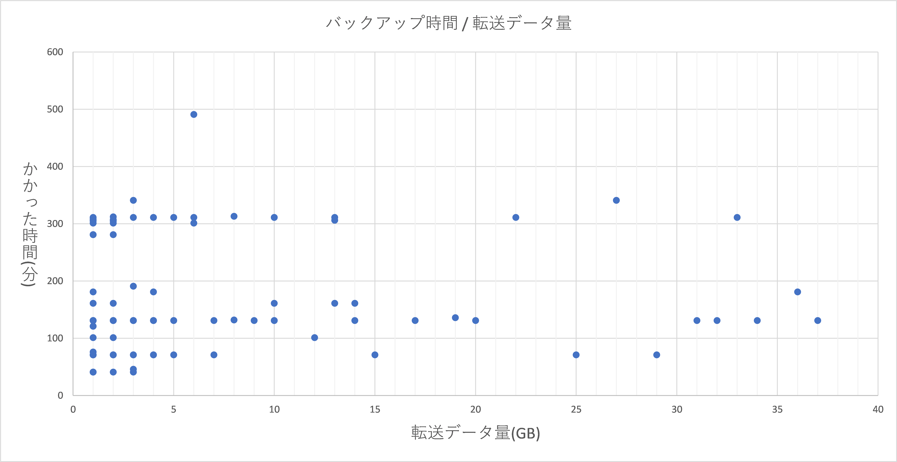
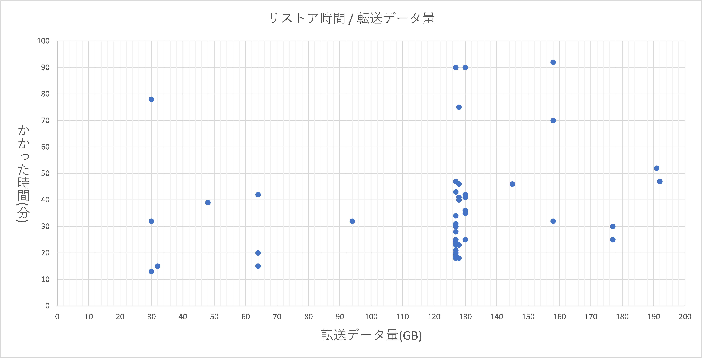
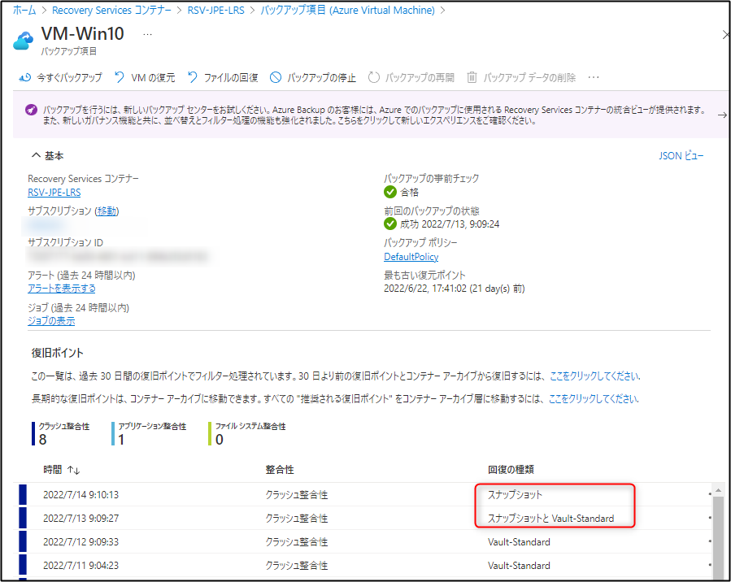

<!-- more -->
皆様こんにちは。Azure Backup サポートの山本です。
今回はお問い合わせをいただくことが多い、Azure Backup におけるバックアップやリストアにかかる時間についてご説明いたします。 Azure VM Backup に限らず、 各 Azure Backup サービスにおける各所要時間を見積もることはかないません。

## 目次
-----------------------------------------------------------
[1. 転送データ量とバックアップやリストアにかかる時間](#1)
   [  1.2 バックアップ タイムの実績値グラフ](#1-2)
   [  1.3 リストア タイムの実績値グラフ](#1-3) 
[2. データディスクの数とバックアップやリストアにかかる時間](#2)
   [  2.1 リストア検証](#2-1) 
[3. よくいただくお問合せ](#3)
-----------------------------------------------------------

##  1. 転送データ量とバックアップやリストアにかかる時間
よくお客様より、**時間の目安を見積もりたい、100GB だとどれくらいの時間がかかるか？**といったようなお問い合わせをいただくことがございます。

こちら結論から申し上げますと、**Azure VM Backup におけるバックアップやリストアの時間を見積もることは出来ません。**
Azure サービスはマルチテナント サービスであるため、 Azure Backup サービスにおける所要時間はバックアップ / リストア対象のバックアップ アイテム (VM) の転送データサイズのみではなく、他のリソース、他のユーザー様の稼働状況、帯域の状況などにも処理時間は左右されるためです。

よって、同じリソースの条件においても、そのときどきによってリストアやバックアップにかかる時間は変化する場合がございます。
そのため、リストアやバックアップにかかる時間については弊社として指標を出しておりません。

###  1.1 Azure VM Backup のバックアップ時間について
特に、Azure VM Backup のバックアップ時間に関しましては、増分データが 200GB 以下である場合、24時間 以内に完了する仕様となっており、24 時間以内の完了であれば仕様の範疇でございます。

・バックアップ パフォーマンス
https://docs.microsoft.com/ja-jp/azure/backup/backup-azure-vms-introduction#backup-performance

・バックアップ プロセス
https://docs.microsoft.com/ja-jp/azure/backup/backup-azure-vms-introduction#backup-process
>抜粋："スナップショット データはコンテナーにすぐにコピーされない場合があります。 ピーク時には、数時間かかる場合があります。 毎日のバックアップ ポリシーでは、**VM のバックアップの合計時間は 24 時間未満になります。**"

また、Azure VM Backupでは Take Snapshot と Transfer data to vault の2 つのフェーズがありますが、Take Snapshot にかかった時間を確認する方法については下記をご覧ください。

・Azure VM Backup における Take Snapshot フェーズの確認方法
https://jpabrs-scem.github.io/blog/AzureVMBackup/How_to_check_VM_backup_Subtask/

次に実際の Azure VM Backup の実際のデータより作成したグラフをご参考までにお伝えさせていただきます。
###  1.2 Azure VM Backup におけるバックアップ タイムの実績値グラフ
Azure VM Backup のバックアップにかかった時間と転送データ量の実績値をグラフにしたものになります。

 Azure VM のバックアップにおいて **転送データ量とかかった時間に相関がない**ことがわかるかと存じます。

また、転送データ量が数TBなど (200GB より多い) 場合、24 時間以上かかる事例がございますが、上述の通り、データ量から時間を概算することはかないません。

###  1.3 Azure VM Backup におけるリストア タイムの実績値グラフ
こちら、**インスタント リストア**ではなく Recovery Services コンテナー (標準コンテナー / Vault-Standard) からのリストアでございます。
Azure VM Backup のリストアにかかった時間と転送データ量の実績値をグラフにしたものになります。

リストアにおいても**転送データ量とかかった時間に相関がない**ことがわかるかと存じます。

#### インスタント リストアついて
インスタント リストアは Recovery Services コンテナーからの転送フェーズがございませんので、上記のグラフ結果よりも早い復元が期待できる機能でございます。

下記のように回復の種類に "スナップショット" が含まれる場合は自動的にインスタント リストアとなります。

・Azure Backup のインスタント リストア機能を使用してバックアップと復元のパフォーマンスを改善する
　https://docs.microsoft.com/ja-jp/azure/backup/backup-instant-restore-capability

##  2. データディスクの数とバックアップやリストアにかかる時間
また類似の質問として、Azure VM Backup において**同じデータ量であればディスクの数が多い方が早いか？または遅いか？**といった質問もいただくことがございますが、[1.](#1)と同様の理由から一概に**どちらの方が早くなるなどといったことはお伝えできません。**
なお、下記公開ドキュメントに、3 種類のパターンを提示したチャーンの影響説明をしておりますのでご参考ください。

・バックアップ パフォーマンスに対するチャーンの影響
　https://learn.microsoft.com/ja-jp/azure/backup/manage-recovery-points#impact-of-churn-on-backup-performance

##  3. よくいただくお問合せ

バックアップ / リストア 所要時間についてよくいただくお問い合わせと回答を記載させていただきます。

>Q. 複数台の VM のスケジュールバックアップを同時刻に設定した場合、バックアップは同時に開始されますか？
>>A. 1 つのバックアップ ポリシーでスケジュール設定した VM のバックアップは、その保護台数に関わらず、スケジュールされた開始時刻から 2 時間以内に開始いたします。  
>>Azure Backup はマルチテナントにて動作する為、基盤側の負荷状況によっては、必ずしも全台が完全に同時刻にバックアップ開始されるものではない点につきまして、予めご承知おきいただけますようお願いいたします。  
>>
>>・よく寄せられる質問 - Azure VM のバックアップ  
https://learn.microsoft.com/ja-jp/azure/backup/backup-azure-vm-backup-faq#----vm-----------------------------------------------------------------

>Q. VM にスナップショット拡張機能を入れると OS や OS 上のソフトウェアの動作は遅くなりますか？
>>A. スナップショット拡張機能は、VM や VM 上のリソースに対し影響を与えません。  
>>スナップショット拡張機能の主な役割は、バックアップのタイミングに OS 内部の VSS ライターを呼び出すだけですので、VM や VM 上のリソースに対し影響を与える処理を行いません。  
>>しかし、VSS ライター自体は、VM の負荷の影響を受けるため、VM の負荷状況によりスナップショット処理に失敗する場合はございます。（※ Windows OS の場合）
>>
>>以下のドキュメントでは、VSS 関連のスナップショット処理の失敗について説明されております。  
>>  
>>・ExtensionFailedVssWriterInBadState - VSS ライターが正しくない状態にあるため、スナップショット操作に失敗しました  
https://learn.microsoft.com/ja-jp/azure/backup/backup-azure-vms-troubleshoot#extensionfailedvsswriterinbadstate---snapshot-operation-failed-because-vss-writers-were-in-a-bad-state
>>
>>VM の負荷状況を考慮すると、先のドキュメントにも記載がございますが、以下の点を考慮いただくことでその変動の影響を受けにくい運用が実現されるかと存じます。    
>>　・VM を構成するディスク全体への負荷分散  
>>　・バックアップの取得を VM の負荷が最も低い時間帯にスケジュール設定する  
>>　・VM を構成するディスクのアップグレード  
>>ただし、Azure VM Backup の観点では、大変恐縮ながら VM の構成に関する数値上の要件を申し上げることが叶いません。お客様が運用する環境ごとに適切な構成を用意いただく必要があるかと存じますので、搭載のアプリケーションや OS、ディスク性能を含め、まずは各種要件を満たしますようご配慮いただけますと幸いでございます。

お客様のお役に立てれば幸いです。
本記事は以上です。