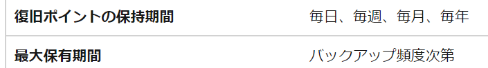
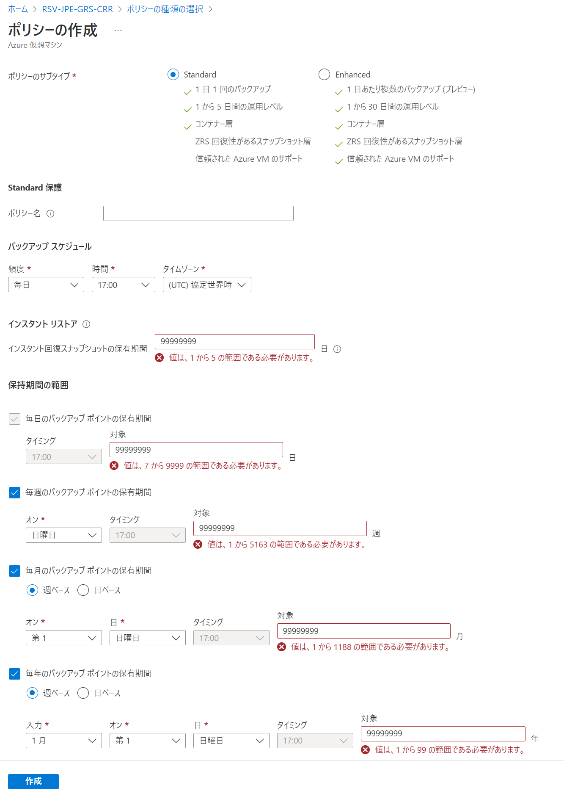
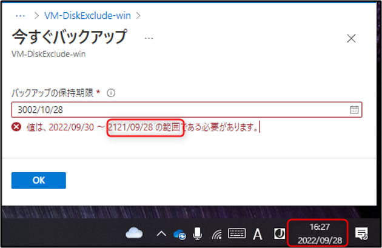
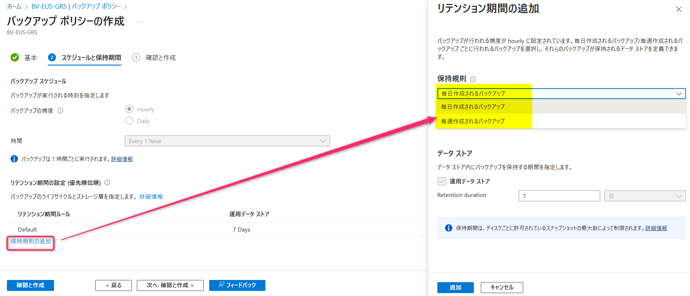
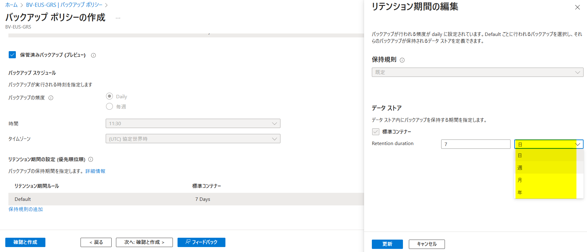
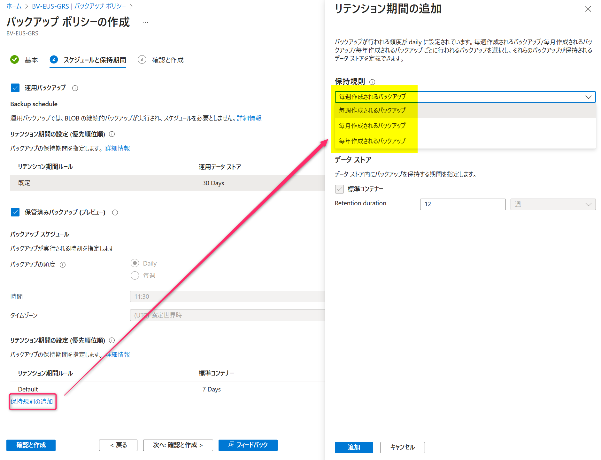

<!-- more -->
皆様こんにちは。Azure Backup サポートです。
今回は、よくお問い合わせをうける「保持期限」について、取りまとめてお伝えします。
公開ドキュメント上では、下記のように「最大保有期間：バックアップ頻度次第」と記載が書かれており、実際に「毎日」「毎週」のバックアップを構成した場合の最大保有期間は、ポリシー作成画面で確認するのみとなっております。

・保有の制限
　https://learn.microsoft.com/ja-jp/azure/backup/backup-support-matrix#retention-limits

（図例：Azure VM Backup の場合）

## 目次
-----------------------------------------------------------
[1. Azure VM Backup の場合](#1)
[2. Azure ファイル共有に対する Azure Backup の場合](#2)
[3. SQL Server DB に対する Azure Backup の場合](#3)
[4. SAP HANA DB に対する Azure Backup の場合](#4)
[5. Microsoft Azure Recovery Services (MARS) の場合](#5)
[6. Azure ディスク バックアップの場合](#6)
[7. Azure BLOB バックアップ の場合](#7)
[8. Microsoft Azure Backup Server (MABS) または System Center Data Protection Manager (DPM) の場合](#8)

-----------------------------------------------------------
##  1. Azure VM Backup の場合
### ポリシーのサブタイプ：Standard の場合
#### インスタント回復スナップショットの保持期間
|  バックアップの頻度  |  最小保持期間  |  最大保持期間  |
| ---- | ---- | ---- |
|  毎日  |  1 日  |  5 日  |
|  毎週  |  5 日  |  5 日  |

#### Recovery Services コンテナー層上の保持期間
|  バックアップの頻度  |  最小保持期間  |  最大保持期間  |
| ---- | ---- | ---- |
|  毎日  |  7 日  |  9999 日  |
|  毎週  |  1 週  |  5163 週  |
|  毎月  |  1 ヶ月  |  1188 ヶ月  |
|  毎年  |  1 年  |  99 年  |

### ポリシーのサブタイプ：Enhanced の場合
#### インスタント回復スナップショットの保持期間
|  バックアップの頻度  |  最小保持期間  |  最大保持期間  |
| ---- | ---- | ---- |
|  4 時間ごと  |  1 日  |  11 日  |
|  6 時間ごと  |  1 日  |  17 日  |
|  8 時間ごと  |  1 日  |  22 日  |
|  12 時間ごと  |  1 日  |  30 日  |
|  毎日  |  1 日  |  30 日  |
|  毎週  |  5 日  |  30 日  |

#### Recovery Services コンテナー層上の保持期間
|  バックアップの頻度  |  最小保持期間  |  最大保持期間  |
| ---- | ---- | ---- |
|  毎日  |  7 日  |  9999 日  |
|  毎週  |  1 週  |  5163 週  |
|  毎月  |  1 ヶ月  |  1188 ヶ月  |
|  毎年  |  1 年  |  99 年  |

（補足）Enhanced バックアップ ポリシーの場合、「〇時間ごと」というような頻度を選択可能です。
　1 日に複数回のバックアップ取得を設定した場合、バックアップ ポリシー上の周期から計算して「その日の最後のバックアップ」のみが Recovery Services コンテナー層に保管されます。

・拡張ポリシーを使用して Azure VM をバックアップする - Azure Backup | Microsoft Learn
　https://learn.microsoft.com/ja-jp/azure/backup/backup-azure-vms-enhanced-policy?tabs=azure-portal#create-an-enhanced-policy-and-configure-vm-backup
　"毎時間のバックアップの場合、その日の最後のバックアップがコンテナーに転送されます。 バックアップが失敗すると、次の日の最初のバックアップがコンテナーに転送されます。"

(Enhanced バックアップ ポリシー の設定例)
開始時刻：JST 16時
スケジュール：4時間ごと
バックアップ期間：24時間

スナップショット① = JST 6/27 16:00 ごろ取得 → Recovery Services コンテナーには転送されず、スナップショット層にのみ保管される
スナップショット② = JST 6/27 20:00 ごろ取得 → Recovery Services コンテナーには転送されず、スナップショット層にのみ保管される
スナップショット③ = JST 6/28 0:00 ごろ取得   → Recovery Services コンテナーには転送されず、スナップショット層にのみ保管される
スナップショット④ = JST 6/28 4:00 ごろ取得   → Recovery Services コンテナーには転送されず、スナップショット層にのみ保管される
スナップショット⑤ = JST 6/28 8:00 ごろ取得   → Recovery Services コンテナーには転送されず、スナップショット層にのみ保管される
スナップショット⑥ = JST 6/28 12:00 ごろ取得  → Recovery Services コンテナーへ転送される

（補足）オンデマンド バックアップの場合、最大 99 年まで保持期間を指定可能です。

##  2. Azure ファイル共有に対する Azure Backup の場合
|  Azure ファイル共有 に対するバックアップの頻度  |  最小保持期間  |  最大保持期間  |
| ---- | ---- | ---- |
|  毎日  |  1 日  |  200 日  |
|  毎週  |  1 週  |  200 週  |
|  毎月  |  1 ヶ月  |  120 ヶ月  |
|  毎年  |  1 年  |  10 年  |

##  3. SQL Server DB に対する Azure Backup の場合
|  完全バックアップの頻度  |  最小保持期間  |  最大保持期間  |
| ---- | ---- | ---- |
|  毎日  |  7 日  |  9999 日  |
|  毎週  |  1 週  |  5163 週  |
|  毎月  |  1 ヶ月  |  1188 ヶ月  |
|  毎年  |  1 年  |  99 年  |

|  差分バックアップの頻度  |  最小保持期間  |  最大保持期間  |
| ---- | ---- | ---- |
|  毎週  |  7 日  |  180 日  |

|  ログバックアップの頻度  |  最小保持期間  |  最大保持期間  |
| ---- | ---- | ---- |
|  毎分/毎時  |  7 日  |  35 日  |

##  4. SAP HANA DB に対する Azure Backup の場合
|  完全バックアップの頻度  |  最小保持期間  |  最大保持期間  |
| ---- | ---- | ---- |
|  毎日  |  7 日  |  9999 日  |
|  毎週  |  1 週  |  5163 週  |
|  毎月  |  1 ヶ月  |  1188 ヶ月  |
|  毎年  |  1 年  |  99 年  |

|  差分バックアップの頻度  |  最小保持期間  |  最大保持期間  |
| ---- | ---- | ---- |
|  毎週  |  7 日  |  180 日  |

|  増分バックアップの頻度  |  最小保持期間  |  最大保持期間  |
| ---- | ---- | ---- |
|  毎週  |  7 日  |  180 日  |

|  ログバックアップの頻度  |  最小保持期間  |  最大保持期間  |
| ---- | ---- | ---- |
|  毎分/毎時  |  7 日  |  35 日  |

##  5. Microsoft Azure Recovery Services (MARS) の場合
|  MARS バックアップの頻度  |  最小保持期間  |  最大保持期間  |
| ---- | ---- | ---- |
|  毎日  |  7 日  |  9999 日  |
|  毎週  |  4 週  |  5163 週  |
|  毎月  |  3 ヶ月  |  1316 ヶ月  |
|  毎年  |  1 年  |  100 年  |

##  6. Azure ディスク バックアップの場合
|  Azure ディスク バックアップの頻度  |  最小保持期間  |  最大保持期間  |
| ---- | ---- | ---- |
|  1 時間ごと  |  1 日  |  18 日  |
|  2 時間ごと  |  1 日  |  37 日  |
|  4 時間ごと  |  1 日  |  75 日  |
|  6 時間ごと  |  1 日  |  112 日  |
|  8 時間ごと  |  1 日  |  150 日  |
|  12 時間ごと  |  1 日  |  225 日  |
|  毎日  |  1 日  |  365 日  |

(補足 1 )
Azure ディスク バックアップでは、ディスクあたりのスナップショット合計数が、スケジュール バックアップ 450 個 + オンデマンド バックアップ 50 個の合計 500 個までとなるよう、バックアップ ポリシー上で制限されています。
・ディスク バックアップのスケジュールと保持期間はどのように機能しますか?
　https://learn.microsoft.com/ja-jp/azure/backup/disk-backup-overview#how-does-the-disk-backup-scheduling-and-retention-period-work
　"スナップショットの保持期間は、ディスクのスナップショット制限によって制御されます。"

(補足 2 )
バックアップ ポリシー作成時、「保持規則の追加」をクリックすることで、
「毎日」もしくは「毎週」作成される、特定のバックアップについては、追加で保持期間を設定することができます。

・バックアップ ポリシーを作成する
　https://learn.microsoft.com/ja-jp/azure/backup/backup-managed-disks#create-backup-policy
　"最初に正常に作成された日単位または週単位のバックアップを選択して、特定のバックアップが削除される前に保持されるリテンション期間を指定できます。 
　 このオプションは、日または週の特定のバックアップを長期間保持するのに便利です。
　 その他のバックアップについては、保持期間を短くすることができます。"

##  7. Azure BLOB バックアップ の場合
### 運用バックアップの場合
バックアップ対象ストレージ アカウント上にのみバックアップ データを保管します。
「1 日に 1 回のバックアップ」などではなく、継続的なバックアップ取得となるため、「バックアップ頻度」というものはございません。
最小保持期間は 1 日、最大保持期間は 360 日、またはそれに相当する数の週 (51) または月 (11) です。

### 保管済みバックアップの場合
バックアップ対象ストレージ アカウント上および バックアップ コンテナー上にバックアップ データを保管します。

| 保管済みバックアップの頻度  |  最小保持期間  |  最大保持期間  |
| ---- | ---- | ---- |
|  毎日  |  7 日 |  3650 日  |
|  毎週  |  4 週 |  521 週  |

(補足)
保持期間は日、週、月、年 単位で設定することも可能です。

「保持規則の追加」をクリックすることで、「毎週」、「毎月」もしくは「毎年」作成される、特定のバックアップについては、追加で保持期間を設定することができます。

##  8. Microsoft Azure Backup Server (MABS) または System Center Data Protection Manager (DPM) の場合
### (DPM / MABS) ローカルディスクへのバックアップ
| バックアップの頻度  |  最小保持期間  |  最大保持期間  |
| ---- | ---- | ---- |
|  (*1)  |  1 日 (*2) |  448 日  |

(*1) 保護対象のワークロードにより、指定可能な間隔が異なります。たとえば SQL Server の場合、最短 15 分間隔が指定できます。
また、保護対象がファイル データの場合、回復ポイントの最大数は 64 個、保護対象がアプリケーション データの場合は最大 448 個の制限がございます。

(*2) DPM / MABS における保持期間の考え方は、カレンダー上の経過日数ではなく、正常に回復ポイントが取得された日数をカウントします。
たとえば、保持期間を 1 日に設定し、月曜日に回復ポイントを取得した場合、1 日分としてカウントされ、バックアップ データは火曜日以降も保持されます。
保持日数のカウント数を超えた場合 (たとえば次の月曜日に回復ポイントを作成)、メンテナンス ジョブ (毎日深夜 0 時に自動実行) によって、古いものから削除されます。

### (DPM)  Tape への長期保護バックアップ (保護対象をディスクにバックアップしてからテープにバックアップ)
| バックアップの頻度  |  最小保持期間  |  最大保持期間  |
| ---- | ---- | ---- |
|  毎日  |  7 日  |  28 日  |
|  毎週  |  1 週  |  4 週  |
|  毎月  |  1 ヶ月  |  11 ヶ月  |
|  毎年  |  1 年  |  99 年  |

### (DPM)  Tape への短期保護バックアップ (保護対象を直接テープにバックアップ)
| バックアップの頻度  |  最小保持期間  |  最大保持期間  |
| ---- | ---- | ---- |
|  毎日  |  7 日  |  84 日  |
|  毎週  |  1 週  |  12 週  |

### (DPM / MABS) オンライン バックアップ (保護対象をディスクにバックアップしてから Recovery Services コンテナーにバックアップ)
|  バックアップの頻度  |  最小保持期間  |  最大保持期間  |
| ---- | ---- | ---- |
|  毎日　(一日最大 2 回)  |  7 日  |  9999 日  |
|  毎週  |  4 週  |  9999 週  |
|  毎月  |  3 ヶ月  |  9999 ヶ月  |
|  毎年  |  1 年  |  9999 年  |

Azure Backup における保有期間について、以上となります。