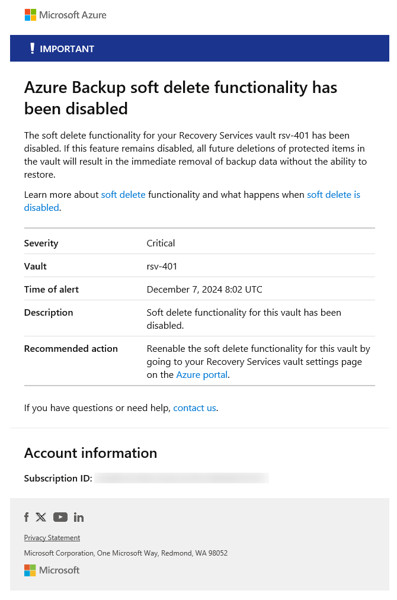
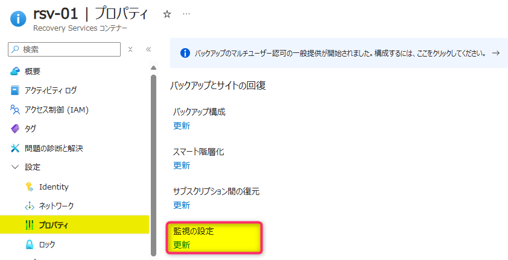
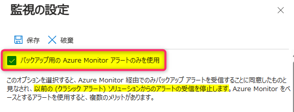

<!-- more -->
皆様こんにちは。Azure Backup サポートです。  
お客様より、Azure Backup のアラート設定を行っていないのに、アラート メールが通知されるとのお問い合わせをいただくことがございます。  
このようなシナリオの場合に通知されているのは、Azure Backup のクラシック アラート機能によるアラート メールであることが大半でございます。

そのため今回は、アラートの通知設定有無に関わらず、特定ユーザーに通知される Azure Backup のクラシック アラート メールの概要、ならびに停止方法についてご案内いたします。  

> [!WARNING]  
> 本記事は、Azure Backup のクラシック アラートの仕様に関する記事となります。  
> Azure Backup の組み込みの Azure Monitor アラート**のみ**を利用している環境には、本記事でご説明するアラート メールは通知されません。  

## 目次  
-----------------------------------------------------------  
[1. Azure Backup からのアラート メールについて](#1)  
[2. アラート メールの通知を止める方法について](#2)  
-----------------------------------------------------------  

##  1. Azure Backup からのアラート メールについて  
Azure Backup のクラシック アラートでは、**アラートの通知設定に関わらず**、下記ユーザーに破壊的な操作 (論理的な削除設定の無効化や、データを削除して保護を停止など) に関するアラート メールが自動的に通知される仕様となっております。  
- Recovery Services コンテナーが配置されているサブスクリプションの所有者 (Azure RBAC)  
- Recovery Services コンテナーが配置されているサブスクリプションの管理者 (従来の管理者)  
- Recovery Services コンテナーが配置されているサブスクリプションの共同管理者  (従来の管理者)  

通知されるアラート メールは、例えば下記の様なメールとなります。  
  

詳細につきましては、下記ドキュメントでもご説明しております。  
・ Azure Backup を使用してクラシック アラートをバックアップする - Azure Backup | Microsoft Learn  
   https://learn.microsoft.com/ja-jp/azure/backup/move-to-azure-monitor-alerts#notification-for-backup-alerts  
   抜粋 :  
> 破壊的な操作 (データを削除して保護を停止など) が実行されると、アラートが生成され、**Recovery Services コンテナー用に通知が構成されていない場合でも、サブスクリプションの所有者、管理者、共同管理者にメールが送信されます**。  

##  2. アラート メールの通知を止める方法について  
クラシック アラートの破壊的な操作に関するアラート メールの通知を止めるには、Azure Backup の組み込みの Azure Monitor アラート機能のみを有効化し、クラシック アラートの機能を無効化してください。  
設定手順を以下にご案内いたします。  

##  2.1 組み込みの Azure Monitor アラート機能を有効化する手順  
1. ご利用環境にて、Azure Backup のクラシック アラートを無効化しても問題の無いことを確認します  
2. ご利用の Recovery Services コンテナーの、"プロパティ > 監視の設定 : 更新" を選択します  
       
3. 監視の設定画面にて、"バックアップ用の Azure Monitor アラートのみを使用" オプションのチェックを入れ、設定を保存します  
       

> [!NOTE]  
> Azure Backup のクラシック アラートは、2026 年 3 月 31 日をもって廃止される予定となっております。  
> もし現時点で Azure Backup のクラシック アラートをご利用である場合には、下記ブログ記事にて組み込みの Azure Monitor アラートへの移行方法をご案内しておりますので、適宜ご確認ください。  
> ・ QL4L-5D8 XNV5-HTZ クラシック アラートから Azure Monitor を使用した組み込みのアラートへの移行について | Japan CSS ABRS Support Blog !!  
>   https://jpabrs-scem.github.io/blog/AzureBackupGeneral/HowToMoveClassicAlert/  