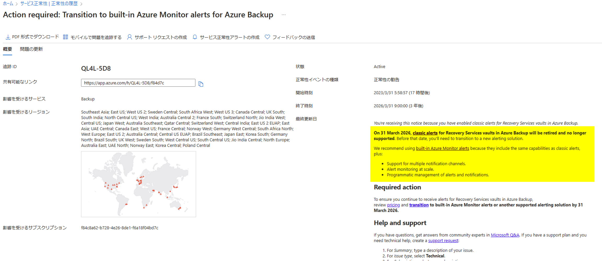
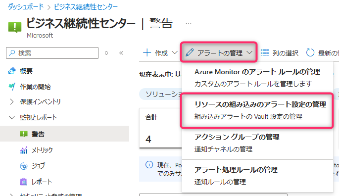
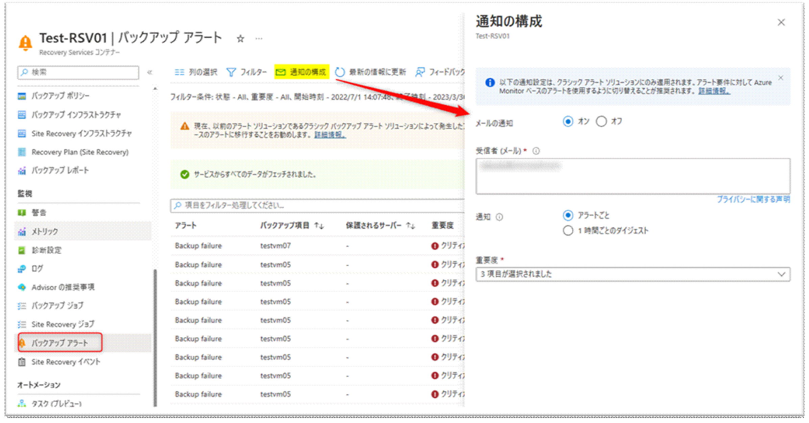
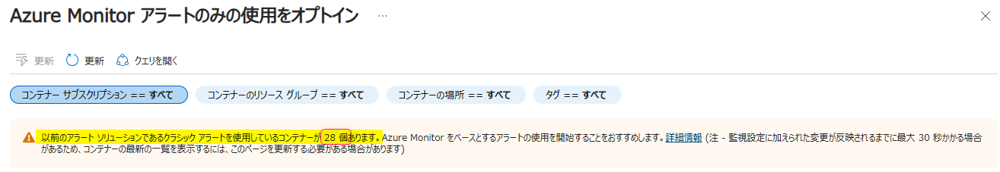
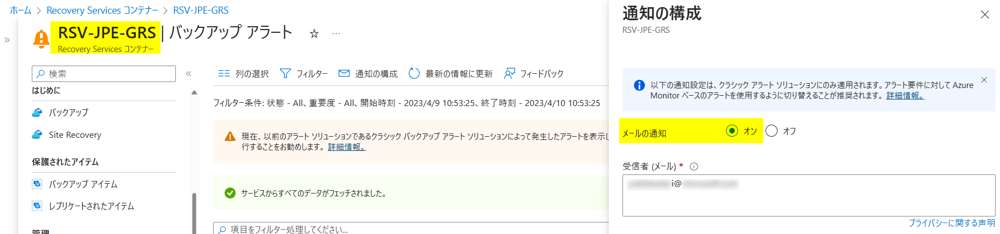
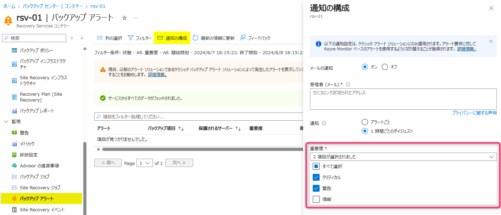
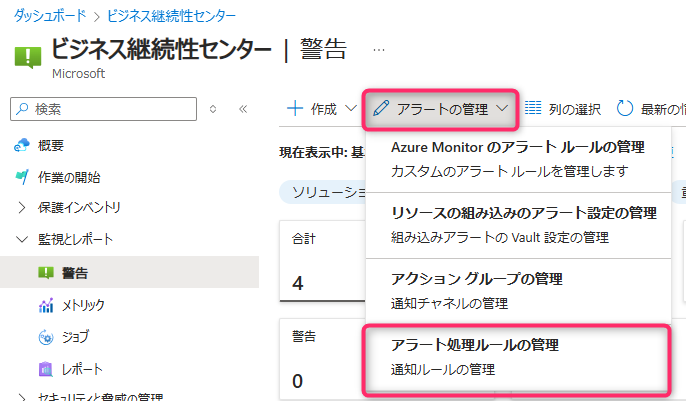
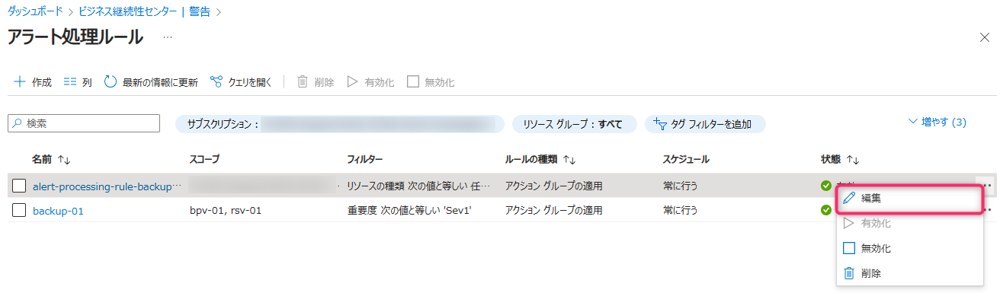
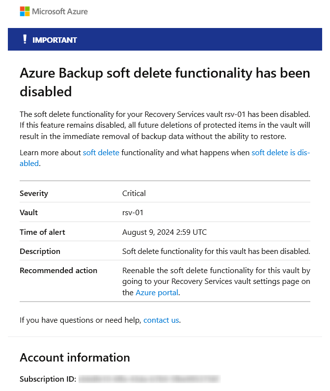
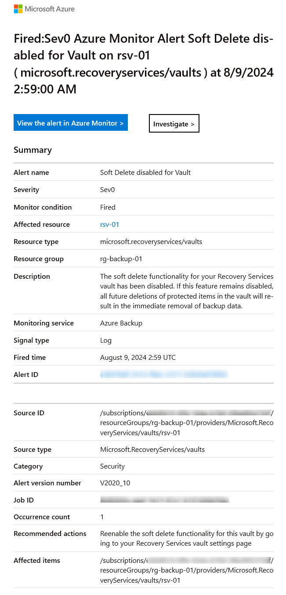

<!-- more -->
こんにちは、Azure Backup サポートです。
今回は、2023 年 3 月末より弊社から発行されているアラート追跡 ID 「QL4L-5D8」、「XNV5-HTZ」について説明いたします。

## 目次
-----------------------------------------------------------
[Q1. 「QL4L-5D8」「XNV5-HTZ」このアラートは何ですか？](#Q1)
[Q2. どの Recovery Services コンテナーが「クラシック アラート設定」になっていますか？](#Q2)
[Q3. クラシック アラートから Azure Monitor を使用した組み込みのアラートへと移行した場合のコストはどうなりますか？](#Q3)
[Q4. クラシック アラートの「通知の構成」をしているかどうかは 1 つ 1 つの Recovery Services コンテナーを確認する必要がありますか？](#Q4)
[Q5. Azure Monitor を使用した組み込みのアラートで、クラシック アラートと同じ重要度のアラート メールを通知するには？](#Q5)
-----------------------------------------------------------

## <a id="Q1"></a>Q1. 「QL4L-5D8」「XNV5-HTZ」このアラートは何ですか？
**A1** クラシック アラートから Azure Monitor を使用した組み込みのアラートへと移行するよう、お知らせするためのものです。
Recovery Services コンテナーでは、クラシック アラートが<span style="color: red; ">既定</span>で存在しており、利用可能な状態となっております。
後述 「Q2. どの Recovery Services コンテナーが「クラシック アラート設定」になっていますか？」 をご参照いただき、クラシック アラートを利用した通知の設定有無をまずはご確認くださいますようお願いいたします。

#### ・ クラシック アラート機能用いて、現在メールへのアラート通知を構成している場合
クラシック アラートは、2026 年 3 月 31 日をもって廃止する予定です。
監視設定を継続してご利用になられる場合は、お手数ではございますが、「Azure Monitor を使用した組み込みのアラート」への切り替えを事前にご検討くださいますようお願いいたします。

#### ・ クラシック アラート機能用いて、現在メールへのアラート通知を構成していないが、今後はバックアップ ジョブ失敗時にメール通知などのアラートをご希望の場合
クラシック アラートから「Azure Monitor を使用した組み込みのアラート」へと切り替え設定することをご検討ください。

#### ・ クラシック アラート機能用いて、現在メールへのアラート通知を構成していない、かつ今後もバックアップ ジョブ失敗時にメール通知などのアラートをご希望でない場合
<span style="color: red; ">特段お客様での追加作業は不要です。</span>

QL4L-5D8」「XNV5-HTZ」アラートの例)



## <a id="Q2"></a>Q2.どの Recovery Services コンテナーが「クラシック アラート設定」になっていますか？ 
**A2**
・ 既定ですべての Recovery Services コンテナーにおいて、「Azure Monitor を使用した組み込みのアラート」へと移行していない Recovery Services コンテナーは「クラシック アラート」が有効になっており、今回の正常性アラート対象となっております
・ 実際に「クラシック アラート」を用いてメールへの通知構成をしているかどうかは、お客様環境の設定次第です

#### 【どの Recovery Services コンテナーでクラシック アラートが有効になっているのかを確認する方法】  
- 1. Azure ポータルにてビジネス継続センターを開き、[監視とレポート] > [警告] > [アラートの管理] > [リソースの組み込みのアラート設定の管理] を選択します  
     
- 2. [Azure Monitor アラートのみの使用をオプトイン] 画面にて、リストされている Recovery Services コンテナーを確認します
     

> [!WARNING]
> 項目 ``クラシック アラートのバックアップ`` が「はい」となっている Recovery Services コンテナーが対象となります。  

#### 【どの Recovery Services コンテナーがクラシック アラートの「通知の構成」を行っているのかを確認する方法】
リストされた Recovery Services コンテナーが実際に通知の構成をしているかどうかは、上記でリストされた Recovery Services コンテナー > [バックアップ アラート] > [通知の構成] > 「メールの通知：オン」 となっているかどうかで確認可能です。


#### 【クラシック アラートが有効になっている Recovery Services コンテナーにて、クラシック アラートを無効化する方法】
クラシック アラートの通知の構成をしている Recovery Services コンテナーがある場合、[Azure Monitor アラートのみの使用をオプトイン] 画面にて、アラートの設定の更新を行います。

> [!NOTE]
> [通知の構成] >「メールの通知：オン」をしている Recovery Services コンテナーが無い場合、かつ今後バックアップジョブの監視設定をする必要が無い場合は、下記対応は不要です。

- 1. まず、対象 Recovery Services コンテナーを選択して、"アラートの設定" 列の "更新" を押下してください。
     

- 2. 表示された [監視の設定] 画面にて 「Backup 用の Azure Monitor アラートのみを使用」 にチェックを入れてください。
     また 「Backup のジョブ エラーに関する組み込みの Azure Monitor アラート」 も有効化してください。
     

- 3. 最後に画面下部の "更新" ボタンを押下していただければ、クラシック アラートの廃止は完了いたします。

> [!WARNING]
> Recovery Services コンテナーの [監視の設定] の下記どちらかの設定が無効化されていると、[Azure Monitor アラートのみの使用をオプトイン] 画面ではクラシック アラートを使用しているコンテナーとしてカウントされたままとなりますのでご注意ください。  
> ・ 「Backup 用の Azure Monitor アラートのみを使用」  
> ・ 「Site Recovery 用の Azure Monitor アラートのみを使用」 
> 例) 
>   


なお、 [監視の設定] 画面に記載されているように、メールなどの通知が必要な場合は、別途設定していただく必要があります。
詳細は下記のドキュメントを参照いただければと存じます。

・ 通知を構成する / チュートリアル - Azure ビジネス継続性センターの警告とメトリックスを監視する | Microsoft Learn
　 https://learn.microsoft.com/ja-jp/azure/business-continuity-center/tutorial-monitor-alerts-metrics#configure-notifications


## <a id="Q3"></a>Q3.クラシック アラートから Azure Monitor を使用した組み込みのアラートへと移行した場合のコストはどうなりますか？ 
**A3** 「Azure Monitor を使用した組み込みのアラートが生成されること」自体に料金は発生しません。
一方、メールなどへアラートを通知させる場合は少額の料金が発生いたします。
詳細は下記ドキュメントをご参照ください。
 
・ クラシック アラートから組み込みの Azure Monitor アラートに移行する / Azure Backup 用に Azure Monitor ベースのアラートを管理する - Azure Backup | Microsoft Learn  
　 https://learn.microsoft.com/ja-jp/azure/backup/backup-azure-monitoring-alerts?tabs=recovery-services-vaults#migrate-from-classic-alerts-to-built-in-azure-monitor-alerts  
  

Free レベル (1 か月あたり 1,000 メール) を超える通知に対しては、下記の料金が発生します。

・ 価格 - Azure Monitor | Microsoft Azure
　 https://azure.microsoft.com/ja-jp/pricing/details/monitor/
　 抜粋 : ``メール            1 か月あたりメール 1,000 通         メール 100,000 通につき $2``


## <a id="Q4"></a>Q4.クラシック アラートの「通知の構成」をしているかどうかは 1 つ 1 つの Recovery Services コンテナーを確認する必要がありますか？ 
**A4** 恐縮ながら、現状はクラシック アラートの「通知の構成」部分を照会するような Azure PowerShell / Azure CLI コマンドのご用意が無いため、お客様には Azure ポータル画面の Recovery Services コンテナーを 1 つ 1 つ確認いただく必要がございます。
※ 前提としてクラシック アラートの「通知の構成」をされているのであれば、お客様が設定されたメールアドレスの宛先へと、バックアップ ジョブ失敗時などに通知がなされています。

その他確認手段の 1 つとして、以下のような REST API を発行することで確認が可能ですので、参考として紹介いたします。

> [!WARNING]
> 以下 REST API は、本ブログ発行時点で確認可能な手段であり、事前予告なく返却値が変わる可能性がありますこと、ご了承ください。
> さらに、以下 REST API は、あくまで参考としてご連携するサンプル コマンドでございます。
> コマンド実装をされる場合は貴社にて検証のうえ、実施いただきますようご留意ください。
> また、Azure サポートでは主に Post Production の Break & Fix を担当しており、スクリプトのコードレビューのサポートは承っておりませんので、予めご理解をいただけますと幸いでございます。

```
### クラシック アラートのメール通知が有効化されているかを確認する 
### ※ (前提) Connect-AzAccount コマンドにて、 Azure に接続可能な状態で実行すること
# Recovery Services コンテナーのリストを作成
$RSVList = Get-AzRecoveryServicesVault | Select-Object Name, ResourceGroupName, SubscriptionId

# リクエスト ヘッダーを作成
$headers = @{
    'Content-type'  = 'application/json'
    'Authorization' = 'Bearer ' + (Get-AzAccessToken).Token
}

# 結果出力先のオブジェクトを作成
$results = @()

# Recovery Services コンテナーごとに API へリクエストを送り、結果を取得する
foreach ( $rsv in $RSVList ) {
    $uri = "https://management.azure.com/subscriptions/$($rsv.SubscriptionId)/resourceGroups/$($rsv.ResourceGroupName)/providers/Microsoft.RecoveryServices/vaults/$($rsv.Name)/monitoringConfigurations/notificationConfiguration?api-version=2017-07-01-preview"
    $response = (Invoke-RestMethod -Uri $uri -Method Get -Headers $headers).properties
    $results += @([pscustomobject]@{subscriptionID = $rsv.SubscriptionId; resourceGroupName = $rsv.ResourceGroupName; recoveryServicesContainerName = $rsv.Name; isClassicAlertNotificationEnabled = $response.areNotificationsEnabled; mailRecipients = $response.additionalRecipients -join '; ' })
}

# 全ての結果をコンソール出力
$results | Sort-Object isClassicAlertNotificationEnabled -Descending | ForEach-Object { Write-Output $_ | Format-Table }
```
上記 REST API を発行した場合、「isClassicAlertNotificationEnabled：True」となっている Recovery Services コンテナーが「通知の構成：オン」となっているものとなります。

Recovery Services コンテナーの設定例)
- Recovery Services コンテナー : RSV-JPE-GRS は「通知の構成：オン」となっています
  
- Recovery Services コンテナー : RSV-EUS-GRS は「通知の構成：オフ」となっています
  

API 実行例)
- Recovery Services コンテナーの一覧  
  
- Recovery Services コンテナー : RSV-JPE-GRS は「isClassicAlertNotificationEnabled：True」、  
  Recovery Services コンテナー : RSV-EUS-GRS は「isClassicAlertNotificationEnabled：False」となっています
  

## <a id="Q5"></a>Q5. Azure Monitor を使用した組み込みのアラートで、クラシック アラートと同じ重要度のアラート メールを通知するには？
**A5**  
まず、クラシック アラートと Azure Monitor アラートの重要度につきまして、以下にご案内いたします。

> [!NOTE]
> お急ぎの方は、下記各アラートの重要度に関する説明は省略いただいて問題ございません。設定方法をご案内している [【Azure Monitor を使用した組み込みのアラートで、クラシック アラートと同じ重要度のアラート メールを通知する設定方法】](#Q5.1) をご確認ください。

#### クラシック アラートの重要度について
クラシック アラートでは、「重大」、「警告」の 2 種のアラートが以下のタイミングで発報されます。  
- 「重大」 : バックアップやリストアの失敗、バックアップ データの削除などの破壊的操作が行われたとき  
- 「警告」 : MARS エージェントでのバックアップ操作で警告が発生したとき  

・ アラートの種類 / Azure Backup を使用してクラシック アラートをバックアップする - Azure Backup | Microsoft Learn
　 https://learn.microsoft.com/ja-jp/azure/backup/move-to-azure-monitor-alerts#alert-types
　 抜粋 :
> **重大**: 原則として、(スケジュールされたかユーザーがトリガーしたかを問わず) バックアップまたは回復が失敗すると、アラートが生成されて "重大" アラートとして表示されます。 アラートは、バックアップの削除などの破壊的な操作でも生成されます。
> **警告**: バックアップ操作が成功したもののいくつかの警告を伴う場合、これらは "警告" アラートとして表示されます。 警告アラートは現在、Azure Backup エージェントのバックアップにのみ使用できます。 
> **情報**: 現時点では、Azure Backup サービスで情報アラートは生成されません。

#### Azure Monitor の組み込みアラートの重要度について
Azure Monitor の組み込みアラートでは、主に「セキュリティ アラート」、「ジョブの失敗のアラート」の 2 種のアラートが以下のタイミングで発報されます。  
- 「セキュリティ アラート」(重要度 : 0 - 重大) : バックアップ データの削除や、コンテナーの論理的な削除機能が無効化されたとき  
- 「ジョブの失敗のアラート」(重要度 : 1 - エラー) : バックアップやリストアが失敗したとき  

また、MARS エージェントでのバックアップ操作で警告が発生したときや、SQL Server バックアップでサポートされていないバックアップ タイプが設定されていたときには、警告 (重要度 : 2 - 警告) アラートが発報されます。  

・ Azure Backup の Azure Monitor アラート / Azure Backup の監視とレポートのソリューション - Azure Backup | Microsoft Learn
　 https://learn.microsoft.com/ja-jp/azure/backup/monitoring-and-alerts-overview#azure-monitor-alerts-for-azure-backup
　 抜粋 :  
> **セキュリティ アラート**: バックアップ データの削除や、コンテナーの論理的な削除機能の無効化などのシナリオの場合、セキュリティ アラート (重大度 0) が発生し、Azure portal に表示されるか、他のクライアント (PowerShell、CLI、REST API) で使用されます。   
> **ジョブの失敗のアラート**: バックアップ エラーや復元エラーなどのシナリオの場合、Azure Backup は、Azure Monitor 経由で組み込みアラート (重大度 1) を提供します。  

・ SQL Server のデータベース バックアップに関するトラブルシューティング - Azure Backup | Microsoft Learn  
　 https://learn.microsoft.com/ja-jp/azure/backup/backup-sql-server-azure-troubleshoot#backup-type-unsupported  

#### クラシック アラートと Azure Monitor を利用した組み込みのアラートの重要度の関係性について
クラシック アラートと Azure Monitor を利用した組み込みのアラートの重要度は、おおよそ以下の関係性がございます。
- クラシック アラートの 「重大」 ≒  Azure Monitor を利用した組み込みのアラートの 「重大」 + 「エラー」  
- クラシック アラートの 「警告」 ≒  Azure Monitor を利用した組み込みのアラートの 「警告」  

### <a id="Q5.1"></a>【Azure Monitor を使用した組み込みのアラートで、クラシック アラートと同じ重要度のアラート メールを通知する設定方法】
Azure Monitor を使用した組み込みのアラートで、クラシック アラートと同じ重要度のアラート メールを通知する設定方法を、以下にご案内いたします。

> [!WARNING]
> 下記ドキュメントに従って、クラシック アラートから組み込みの Azure Monnitor アラートへ移行する設定が完了していることが前提となります。  
> もし未設定である場合には、事前に下記ドキュメント 1 の手順 1 ~ 5 、ならびにドキュメント 2 の手順 1 ~ 9 を実行してください。
> ・ ドキュメント 1
> 　 クラシック アラートから組み込みの Azure Monitor アラートに移行する / Azure Backup 用に Azure Monitor ベースのアラートを管理する - Azure Backup | Microsoft Learn
> 　 https://learn.microsoft.com/ja-jp/azure/backup/backup-azure-monitoring-alerts?tabs=recovery-services-vaults#migrate-from-classic-alerts-to-built-in-azure-monitor-alerts
> ・ ドキュメント 2
> 　 通知を構成する / チュートリアル - Azure ビジネス継続性センターの警告とメトリックスを監視する | Microsoft Learn
> 　 https://learn.microsoft.com/ja-jp/azure/business-continuity-center/tutorial-monitor-alerts-metrics#configure-notifications


#### クラシック アラートのメール通知設定を確認する
- Recovery Services コンテナーの [監視] > [バックアップ アラート] > [通知の構成] を表示し、項目「重要度」の設定内容を確認します  
  

#### Azure Backup 用のアラート処理ルールの設定を変更する
- ビジネス継続センターの [監視とレポート] > [警告] > [アラートの管理] > [アラート処理ルールの管理] を表示し、Azure Monitor アラートへ切り替えるときに作成したアラート処理ルールを編集します  

  
  

- 項目 フィルター に、「重要度」フィルターを追加し、値として "0 - 重大", "1 - エラー", "2 - 警告" のいずれかを選択し、設定を保存します  
  (下記例においては、クラシック アラートの重要度設定が "クリティカル, 警告" となっていたため、"0 - 重大", "1 - エラー", "2 - 警告" の 3 点を選択しております)  
  

以上で設定は完了です。  

### <a id="Q5.2"></a>クラシック アラートと Azure Monitor を使用した組み込みのアラートの通知メールのサンプル
クラシック アラートと Azure Monitor を使用した組み込みのアラートの通知メールのサンプルを、以下のとおりご案内いたします。

> [!WARNING]
> こちらのサンプル メールは 2024/8 頃に受信したものとなりますので、あくまで参考程度に留めてくださいますようお願い申し上げます。
> より正確な内容をご確認いただくためにも、お客様ご自身で、アラート メールの受信検証を行っていただき、内容をご確認ください。

- バックアップ ジョブ失敗に関するアラート メール  
  - クラシック アラート  
      
  - Azure Monitor を使用した組み込みのアラート  
      

- セキュリティ アラート メール  
  - クラシック アラート  
      
  - Azure Monitor を使用した組み込みのアラート  
      
