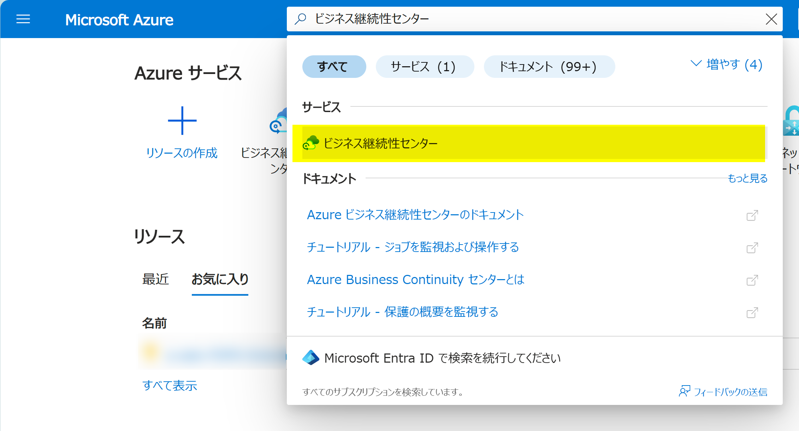
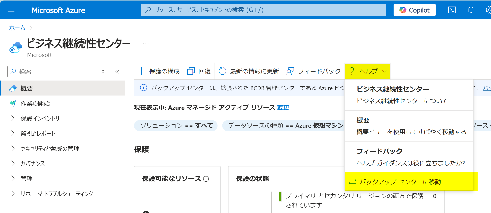
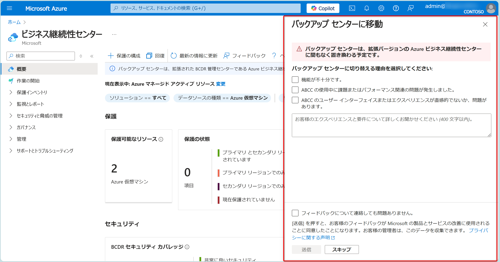

<!-- more -->
皆様こんにちは、Azure Backup サポートです。

ビジネス継続性センター は、2023 年 11 月からパブリックプレビュー中であり、**バックアップ センターの強化版として設計されており、最終的にはそれに取って代わる予定です。**  
そのため現在ではバックアップ センターは、すべての地域で Azure ポータルの検索結果に表示されなくなりました。  

バックアップ センターは Azure ポータルの検索から削除されましたが、ビジネス継続性センターがバックアップ センターに取って代わる前にお客様が適応できるように、ビジネス継続性センターからバックアップ センターに移動するオプションはまだ利用可能です。  
今回はビジネス継続性センターからバックアップ センターに移動する手順を説明します。  

参考)  
Azure Business Continuity センターとは | Microsoft Learn  
https://learn.microsoft.com/ja-jp/azure/business-continuity-center/business-continuity-center-overview

## ビジネス継続性センターからバックアップ センターを開く方法
Backup Center を起動したい場合は、まず Azure ポータルの検索から 「ビジネス継続性センター」 に移動してください。

その後、ビジネス継続性センターの 「ヘルプ」 メニューから 「バックアップ センターに移動」 を選択してください。

バックアップ センターに移動する場合は、その理由をフィードバックすることができます。
お客様のフィードバックは、ビジネス継続性センターの体験を向上させるために非常に貴重です。
欠けている機能、パフォーマンスの問題、またはその他の懸念事項を含めてお知らせ頂けますと幸いです。

説明は以上となります。