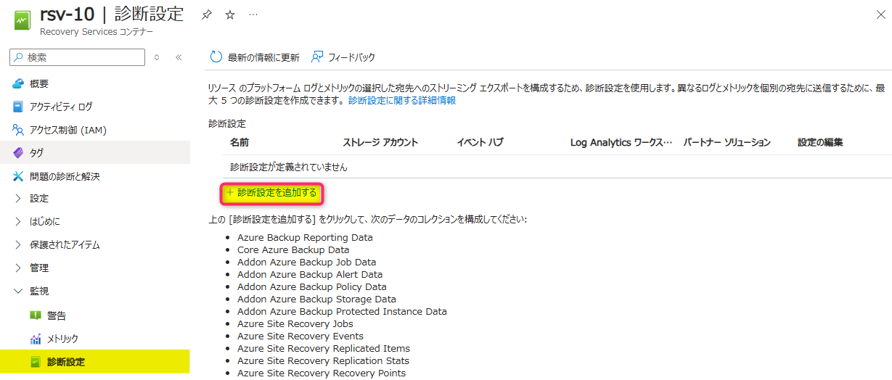
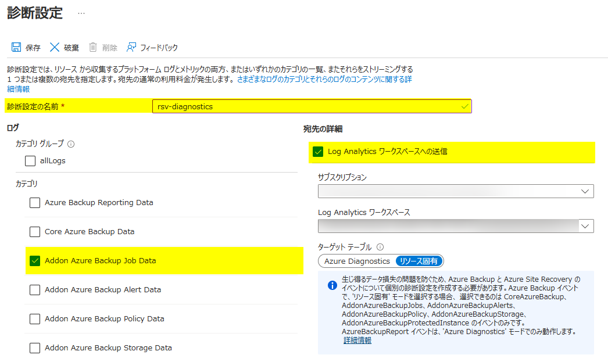
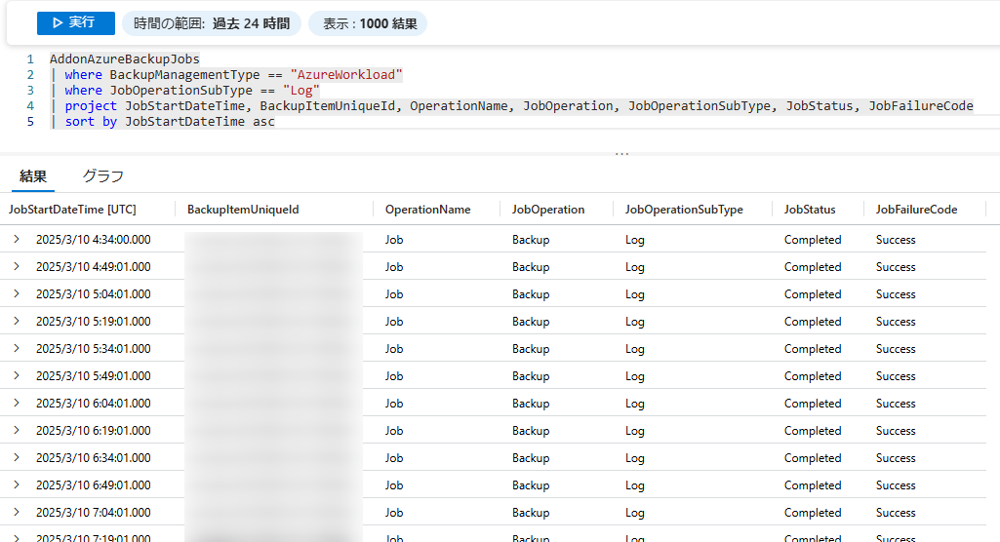

<!-- more -->
皆様こんにちは。Azure Backup サポートです。 
 今回はお問合せをいただくことが多い、Azure Backup による SQL Server DB や SAP HANA DB のログ バックアップのジョブを確認する方法をご案内いたします。  

## 目次
-----------------------------------------------------------
[1. 概要](#1)  
[2. 設定方法](#2)  
[3. ログ バックアップのジョブの確認方法](#3)  
-----------------------------------------------------------

## <a id="1"></a> 1. 概要  

Azure Backup による SQL Server DB や SAP HANA DB のログ バックアップのジョブは、実行回数が比較的多くなる傾向にあるため、**Azure Portal の Recovery Services コンテナーや回復性 (Resiliency, ビジネス継続センター) のバックアップ ジョブ一覧には表示されません**。  

ログ バックアップのジョブをご確認いただくには、Recovery Services コンテナーの診断設定を構成し、Recovery Services コンテナーの診断イベントを Log Analytics ワークスペースへ送信していただく必要がございます。  


## <a id="2"></a> 2. 設定方法  
ご利用の Recovery Services コンテナーの診断設定を構成する方法をご案内いたします。  

- 1. Azure Portal にてご利用の Recovery Services コンテナーを表示します  
- 2. Recovery Services コンテナーの [監視] > [診断設定] > [診断設定を追加する]  を選択します  
  
- 3. 診断設定画面にて、まず [診断設定の名前] に任意の値を入力します  
- 4. 次に、[ログ] にて取得したいログのカテゴリを選択します  
  - ログ バックアップ ジョブのデータが含まれるカテゴリ ``Addon Azure Backup Job Data`` は必ずチェックを入れてください  
- 5. 最後に [宛先の詳細] に診断イベントの送信先となる Log Analytics ワークスペースを設定します  
  - 項目 [ターゲット テーブル] には、``リソース固有`` を選択します
  


診断設定の詳細につきましては、下記公式ドキュメントにも説明がございますので適宜ご確認ください。  
・ Azure Backup ユーザー向けの診断イベント - Azure Backup | Microsoft Learn  
　 https://learn.microsoft.com/ja-jp/azure/backup/backup-azure-diagnostic-events?tabs=recovery-services-vaults  
・ AddonAzureBackupJobs / リソース固有の診断イベントのデータ モデル - Azure Backup | Microsoft Learn  
　 https://learn.microsoft.com/ja-jp/azure/backup/backup-azure-reports-data-model?tabs=recovery-services-vaults#addonazurebackupjobs  


## <a id="3"></a> 3. ログ バックアップのジョブの確認方法  
Recovery Services コンテナーの診断イベント (特にカテゴリ ``Addon Azure Backup Job Data`` を含む) を Log Analytics ワークスペースへ送信する診断設定を行われている場合には、Log Analytics ワークスペースに保持されているテーブル ``AddonAzureBackupJobs`` から SQL Server DB や SAP HANA DB のログ バックアップ ジョブをご確認いただくことが可能でございます。  
以下に、ログ バックアップ ジョブを確認するサンプル クエリ、および実行結果をご紹介いたします。  


> [!IMPORTANT]
> SQL Server DB や SAP HANA DB の完了したログ バックアップ ジョブの情報は、6 時間毎のバッチ処理にて、Log Analytics ワークスペースへ送信されます。  
> そのため、Log Analytics ワークスペースにてログ バックアップ ジョブの情報が確認できるようになるまで、最大 6 時間の遅延が発生する可能性がございますので、あらかじめご留意ください。  
> ・ 監視とレポートに関する FAQ - Azure Backup | Microsoft Learn  
> 　 https://learn.microsoft.com/ja-jp/azure/backup/backup-azure-monitor-alert-faq#log-analytics-------------------------------  
> 　 抜粋 : ``SQL バックアップでは、15 分ごとにログ バックアップを行うことができるため、完了したすべてのスケジュール済みバックアップ ジョブの情報は、ログも含めて 6 時間ごとにバッチ処理されてプッシュされます。``


- サンプル クエリ
```KQL
AddonAzureBackupJobs
| where BackupManagementType == "AzureWorkload"
| where JobOperationSubType == "Log"
| project JobStartDateTime, BackupItemUniqueId, OperationName, JobOperation, JobOperationSubType, JobStatus, JobFailureCode
| sort by JobStartDateTime asc
```
- 実行結果例



> [!WARNING]
> 本記事でご案内しているクエリについては、お客様の責任のもと、ご利用いただきますようお願い申し上げます。  
> クエリ実行時のエラーや、想定外の問題について、当社は責任を負いかねますのでご了承ください。  


そのほか、サンプル クエリを下記公式ドキュメントにてご案内しておりますので必要に応じてご活用ください。  
・ Recovery Services コンテナーのワークロードに固有のクエリ / Azure Backup の Azure Monitor ログ - Azure Backup | Microsoft Learn  
　 https://learn.microsoft.com/ja-jp/azure/backup/backup-azure-monitoring-use-azuremonitor#queries-specific-to-recovery-services-vault-workloads  