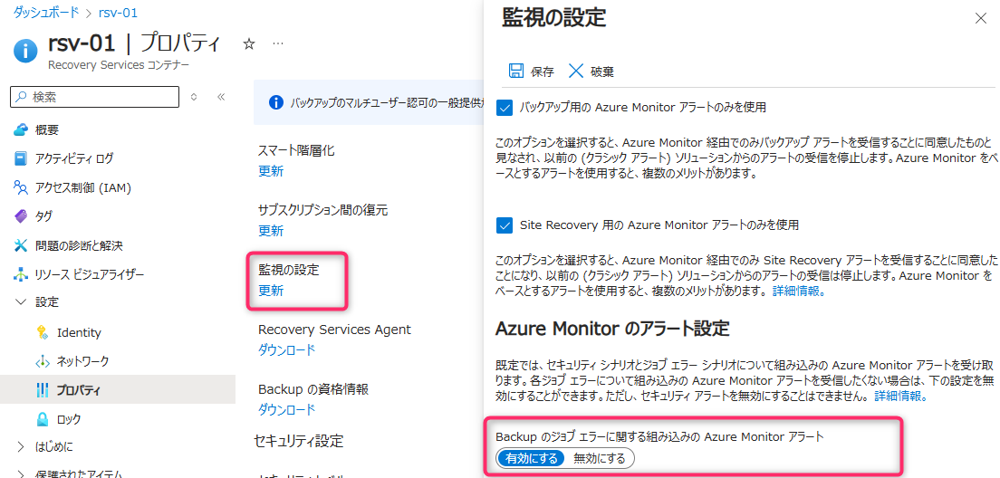
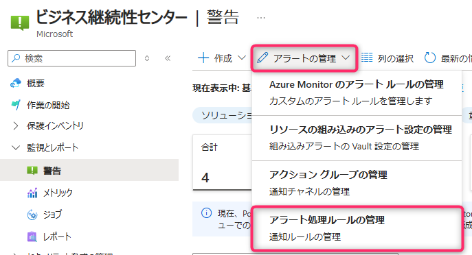
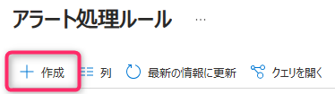

<!-- more -->
皆様こんにちは、Azure Backup サポートです。
今回は、**「Azure Monitor を使用した組み込みのアラート」を利用して、Recovery Services コンテナーにてバックアップ構成済のバックアップ ジョブが失敗した際にメール通知を出すよう、アラート処理ルールを作成する例** をご紹介します。

## 概要
- Azure Backup にてこれまで存在していた「クラシック アラート」は、今後廃止される見込みです
- お客様にて「バックアップ ジョブ失敗のアラートを発生させたい」「発生したアラートをメール通知したい」といった場合
　今後は「クラシック アラート」ではなく
　「Azure Monitor を使用した組み込みのアラート」を利用してアラートを構成いただく必要があります
- 作成概要は公開ドキュメントでも説明しております
　・ジョブの失敗のシナリオに対して Azure Monitor のアラートを有効にする
　　https://learn.microsoft.com/ja-jp/azure/backup/backup-azure-monitoring-built-in-monitor?tabs=recovery-services-vaults#turning-on-azure-monitor-alerts-for-job-failure-scenarios

- アラート処理ルールの作成例として、今回はバックアップを構成している対象のRecovery Services コンテナーをスコープとして指定し、バックアップ ジョブが失敗した際に、指定のメールアドレスへ通知メールを送信させます

## アラート処理ルール 作成手順
Azure Backup にて、バックアップ ジョブが失敗した際にアラート通知を出す手段は、下記ドキュメントの通り複数種類ございます。
今回は「Azure Backup ジョブの失敗を検知したい」という要件である前提で、 **「Azure Monitor を使用した組み込みのアラート」** を利用します。
・Azure Backup の監視とレポートのソリューション
https://docs.microsoft.com/ja-jp/azure/backup/monitoring-and-alerts-overview#monitoring-and-reporting-scenarios

作成手順の公開ドキュメントは下記ですので、基本的に下記ドキュメントの説明に従って設定いただければアラート構成・通知構成が可能です。
・ジョブの失敗のシナリオに対して Azure Monitor のアラートを有効にする
　https://docs.microsoft.com/ja-jp/azure/backup/backup-azure-monitoring-built-in-monitor#turning-on-azure-monitor-alerts-for-job-failure-scenarios

### Azure Monitor を使用した組み込みのアラート構成　作業例

Recovery Services コンテナー上でアラートを有効化します。

有効化することで、バックアップ ジョブが失敗した場合などに、アラートが生成されます。

・Azure portal 内で始動したアラートを確認
　https://learn.microsoft.com/ja-jp/azure/backup/backup-azure-monitoring-built-in-monitor?tabs=recovery-services-vaults#viewing-fired-alerts-in-the-azure-portal

バックアップ センター ＞ アラート処理ルール にて、新しいアラート処理ルールを作成することができます。

・アラートの通知を構成する
　https://learn.microsoft.com/ja-jp/azure/backup/backup-azure-monitoring-built-in-monitor?tabs=recovery-services-vaults#configuring-notifications-for-alerts

今回は、Recovery Services コンテナー「RSV-JPE-LRS」にてバックアップ構成しているため、スコープを「Recovery Services コンテナー：RSV-JPE-LRS」としています。

また、バックアップ ジョブのエラーを検知した際にアラート通知を発報したいため、「フィルター：重要度」とし、「階層：１ - エラー」を選択します。
・Azure Backup で保護されたワークロードの監視
　https://docs.microsoft.com/ja-jp/azure/backup/backup-azure-monitoring-built-in-monitor#azure-monitor-alerts-for-azure-backup-preview

「アクション グループ」には、送信したいメールアドレスを設定しているアクション グループを追加する、もしくは新規作成します。
今回はあらかじめ作成済のアクション グループを選択しています。

 （補足）アクショングループには、下図のように電子メールへの通知を設定済となっています。

アクション グループも有効化されていることを確認しておきます。

上図のように設定することで、Recovery Services コンテナー「RSV-JPE-LRS」にてバックアップ構成済のバックアップ ジョブが失敗した際に、指定した電子メール宛先へ、通知メールが送信されるようになります。

 （補足）Azure Backup を意図的に失敗させる手順は下記をご参照ください。

・Azure VM Backup を意図的に失敗させる方法 | Japan CSS ABRS Support Blog !! (jpabrs-scem.github.io)
　https://jpabrs-scem.github.io/blog/AzureVMBackup/How_to_fail_VM_backup/

・Azure VM Backup のデータ転送フェーズを意図的に失敗させる方法 | Japan CSS ABRS Support Blog !! (jpabrs-scem.github.io)
　https://jpabrs-scem.github.io/blog/AzureVMBackup/How_to_fail_ttv/

・MARS バックアップ を意図的に失敗させる方法 | Japan CSS ABRS Support Blog !! (jpabrs-scem.github.io)
　https://jpabrs-scem.github.io/blog/MARSBackup/How_to_fail_MARS_backup/

・Azure Files Backup を意図的に失敗させる方法 | Japan CSS ABRS Support Blog !! (jpabrs-scem.github.io)
　https://jpabrs-scem.github.io/blog/AzureFilesBackup/How_to_fail_AFS_backup/

・Azure Disk Backup を意図的に失敗させる方法 | Japan CSS ABRS Support Blog !! (jpabrs-scem.github.io)
　https://jpabrs-scem.github.io/blog/AzureDiskBackup/How_to_fail_Asure_Disk_backup/