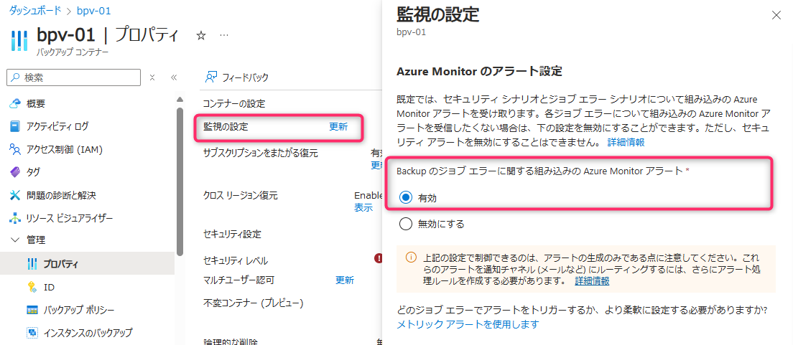
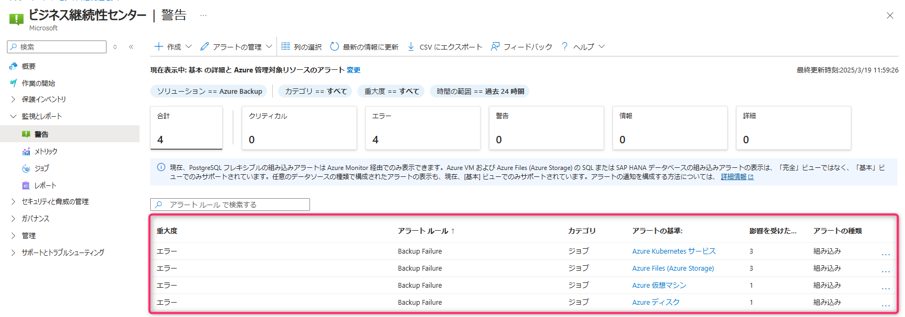
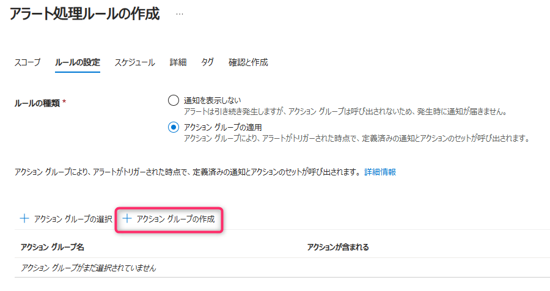
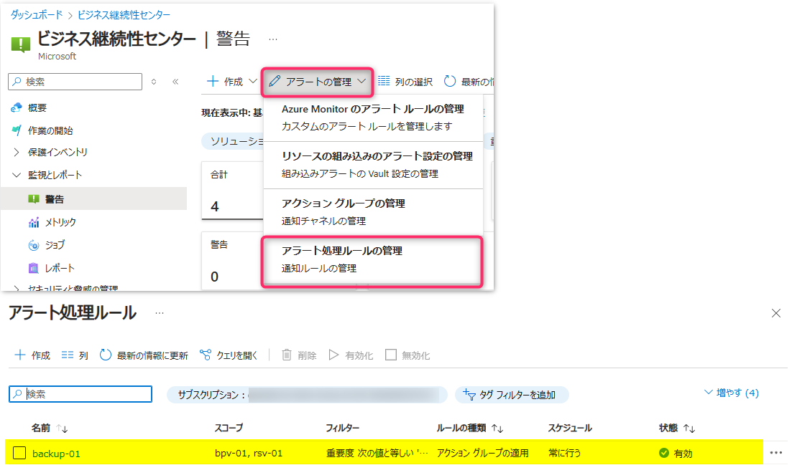

<!-- more -->
皆様こんにちは、Azure Backup サポートです。  
今回は、**「Azure Monitor を使用した組み込みのアラート」を利用して、Recovery Services コンテナー / バックアップ コンテナーにてバックアップ ジョブが失敗した際にメール通知を出すよう、アラート処理ルールを作成する例** をご紹介します。

## 目次
-----------------------------------------------------------
[1. 概要](#1)
[2. アラート処理ルール 作成手順](#2)
[2-1. Azure Monitor を使用した組み込みのアラート構成　作業例](#2-1)
-----------------------------------------------------------

## 1. 概要
- Azure Backup にてこれまで存在していた「クラシック アラート」は、今後廃止される見込みです
- お客様にて「バックアップ ジョブ失敗のアラートを発生させたい」「発生したアラートをメール通知したい」といった場合
　今後は「クラシック アラート」ではなく
　「Azure Monitor を使用した組み込みのアラート」を利用してアラートを構成いただく必要があります
- アラート処理ルールの作成例として、今回はバックアップを構成している対象の Recovery Services コンテナー / バックアップ コンテナーをスコープとして指定し、バックアップ ジョブが失敗した際に、指定のメールアドレスへ通知メールを送信させます

## 2. アラート処理ルール 作成手順
Azure Backup にて、バックアップ ジョブが失敗した際にアラート通知を出す手段は、下記ドキュメントのとおり複数種類ございます。
今回は「Azure Backup ジョブの失敗を検知したい」という要件である前提で、 **「Azure Monitor を使用した組み込みのアラート」** を利用します。  

・ Azure Backup の監視とレポートのソリューション  
　 https://docs.microsoft.com/ja-jp/azure/backup/monitoring-and-alerts-overview#monitoring-and-reporting-scenarios  
　 抜粋 :  
   > \- Azure Monitor を使用した組み込みアラート
   > \- カスタム アラート
   > \- Azure Monitor を使用した Azure Backup メトリック アラート (プレビュー)
   > \- クラシック アラート

「Azure Monitor を使用した組み込みのアラート」の有効化手順やアラート処理ルールの作成手順は、下記 2 点の公開ドキュメントにてご案内しております。  
基本的にはドキュメントの説明に従って設定いただければアラート構成・通知構成が可能です。   

・ 1. ジョブ失敗のシナリオに対して Azure Monitor のアラートを有効にする / Azure Backup 用に Azure Monitor ベースのアラートを管理する - Azure Backup | Microsoft Learn
　 https://learn.microsoft.com/ja-jp/azure/backup/backup-azure-monitoring-alerts?tabs=recovery-services-vaults#turn-on-azure-monitor-alerts-for-job-failure-scenarios
・ 2. 通知を構成する / チュートリアル - Azure ビジネス継続性センターの警告とメトリックスを監視する | Microsoft Learn
　 https://learn.microsoft.com/ja-jp/azure/business-continuity-center/tutorial-monitor-alerts-metrics#configure-notifications

### 2-1. Azure Monitor を使用した組み込みのアラート構成　作業例

- 1. Recovery Services コンテナーもしくバックアップ コンテナー上で 「Backup のジョブ エラーに関する組み込みの Azure Monitor アラート」設定を有効化します  
     - Recovery Services コンテナーの場合  
         
     - バックアップ コンテナーの場合  
         

     「Backup のジョブ エラーに関する組み込みの Azure Monitor アラート」設定を有効化することで、バックアップ ジョブが失敗した場合などに、アラートが生成されます。  
     ・ 監視アラート / チュートリアル - Azure ビジネス継続性センターの警告とメトリックスを監視する | Microsoft Learn  
     　 https://learn.microsoft.com/ja-jp/azure/business-continuity-center/tutorial-monitor-alerts-metrics#monitor-alerts  
     例)  
          

- 2. ビジネス継続センターの [監視とレポート] > [警告] > [アラートの管理] > [アラート処理ルールの管理] にて、新しいアラート処理ルールを作成します  
       
       
     ・ 通知を構成する / チュートリアル - Azure ビジネス継続性センターの警告とメトリックスを監視する | Microsoft Learn  
     　 https://learn.microsoft.com/ja-jp/azure/business-continuity-center/tutorial-monitor-alerts-metrics#configure-notifications  

- 3. アラート処理ルールの設定を行います  
     - 今回は、Recovery Services コンテナー「rsv-01」およびバックアップ コンテナー「bpv-01」にてバックアップ構成しているため、スコープを「Recovery Services コンテナー : rsv-01」と「バックアップ コンテナー : bpv-01」とします  
         

     - さらに、バックアップ ジョブのエラーを検知した際にアラート通知を発報したいため、「フィルター：重要度」に「階層：１ - エラー」を選択します  
       
       ・ Azure Backup の Azure Monitor アラート / Azure Backup の監視とレポートのソリューション - Azure Backup | Microsoft Learn  
       　 https://learn.microsoft.com/ja-jp/azure/backup/monitoring-and-alerts-overview#azure-monitor-alerts-for-azure-backup  
       　 抜粋 : ``ジョブの失敗のアラート: バックアップ エラーや復元エラーなどのシナリオの場合、Azure Backup は、Azure Monitor 経由で組み込みアラート (重大度 1) を提供します。``

     - 次にアラートの通知先を設定するため、アクション グループを設定します  
       - アクション グループを新規作成する場合には、[アクション グループの作成] を選択し、アクション グループを作成します  
           
         ・ Azure portal でアクション グループを作成する / Azure Monitor のアクション グループ - Azure Monitor | Microsoft Learn  
         　 https://learn.microsoft.com/ja-jp/azure/azure-monitor/alerts/action-groups#create-an-action-group-in-the-azure-portal  
       - 既存のアクション グループを利用する場合には、[アクション グループの選択] を選択し、アクション グループを選択します  
           

         補足) アクション グループには、下図のように電子メールへの通知を設定済となっています。  
           

    - そのほか、スケジュールや詳細などのタブの設定を適宜実施し、アラート処理ルールを作成します  
        

- 4. アラート処理ルール / アクション グループが作成および有効化されていることを確認します  
     アラート処理ルールの例)
       
     アクション グループの例)
       

上記の手順のように設定することで、「Recovery Services コンテナー : rsv-01」と「バックアップ コンテナー : bpv-01」にてバックアップ ジョブが失敗した際に、指定した電子メール宛先へ通知メールが送信されるようになります。

---
 （補足）Azure Backup を意図的に失敗させる手順は下記をご参照ください。

・Azure VM Backup を意図的に失敗させる方法 | Japan CSS ABRS Support Blog !! (jpabrs-scem.github.io)
　https://jpabrs-scem.github.io/blog/AzureVMBackup/How_to_fail_VM_backup/

・Azure VM Backup のデータ転送フェーズを意図的に失敗させる方法 | Japan CSS ABRS Support Blog !! (jpabrs-scem.github.io)
　https://jpabrs-scem.github.io/blog/AzureVMBackup/How_to_fail_ttv/

・MARS バックアップ を意図的に失敗させる方法 | Japan CSS ABRS Support Blog !! (jpabrs-scem.github.io)
　https://jpabrs-scem.github.io/blog/MARSBackup/How_to_fail_MARS_backup/

・Azure Files Backup を意図的に失敗させる方法 | Japan CSS ABRS Support Blog !! (jpabrs-scem.github.io)
　https://jpabrs-scem.github.io/blog/AzureFilesBackup/How_to_fail_AFS_backup/

・Azure Disk Backup を意図的に失敗させる方法 | Japan CSS ABRS Support Blog !! (jpabrs-scem.github.io)
　https://jpabrs-scem.github.io/blog/AzureDiskBackup/How_to_fail_Asure_Disk_backup/