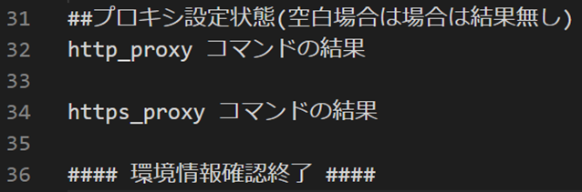
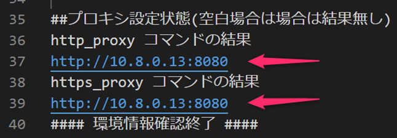

<!-- more -->
皆様こんにちは、Azure Backup サポートです。
今回は、下記ブログにてご案内している「2. Linux VM における Azure Backup 疎通確認」スクリプトの実行結果について、実行結果の見方・Azure Backup において確認にすべきポイントなどをご紹介いたします。

・2. Linux VM における Azure Backup 疎通確認
　https://jpabrs-scem.github.io/blog/AzureBackupGeneral/RequestForInvestigatingNW/#2

> [!NOTE]
> 上記ブログ リンクでご案内している疎通確認スクリプトは、あくまで Azure Backup に関わる通信要件を満たしているかを調査するために、弊社よりご案内・実行いただいているものです。
> 疎通確認スクリプトを実行いただいた後は、専任エンジニアが詳細なトラブルシューティングを行いますので、お問い合わせチケット上へ添付ください。
> マシンの環境によっては本スクリプトでは確認しきれないネットワーク構成もあるため、お問い合わせチケットにて、お客様とどのようなネットワーク通信経路となっているかをすり合わせることがございます。
> 「nc」コマンドや「curl」コマンドの戻り値については、全てを網羅した情報ではなく、Azure Backup 観点にてチェックすべきものをまとめております。

## 目次
-----------------------------------------------------------
[1. 疎通確認スクリプトの構成](#1)  
[2. プロキシ設定の確認](#2)  
[3. 疎通確認スクリプト結果を確認する際のポイント](#3)  
[4. nslookup コマンド結果について](#4)  
[5. nc コマンド結果について](#5)
[6. curl コマンド結果について](#6)
-----------------------------------------------------------

##  1. 疎通確認スクリプトの構成
はじめに、下記ブログ記事でご案内している疎通確認スクリプト (Check_Backup_NW_Linux_verX.X.sh) の、全体的な構成を説明します。

・2. Linux VM における Azure Backup 疎通確認
　https://jpabrs-scem.github.io/blog/AzureBackupGeneral/RequestForInvestigatingNW/#2

(1) 疎通確認スクリプトを実行したマシン情報の出力
(2) プロキシ設定の確認
(3) 「ファイルの回復」時に必要な宛先への「nslookup」「nc」コマンド結果
(4) Azure Backup への「nslookup」「nc」「curl」コマンド結果
(5) Azure Storage への「nslookup」「nc」「curl」コマンド結果
(6) Microsoft Entra ID への「nslookup」「nc」「curl」コマンド結果

それでは疎通確認スクリプト結果ログ (CheckNWResult_(ホスト名)_(YYYYMMDDHHMM).log) 上で確認すべきポイントを説明します。

##  2. プロキシ設定の確認
Linux OS のマシン上で、プロキシ サーバーを経由するよう設定しているかどうかを確認しています。
下図のように、空白行の場合は「http_proxy」「https_proxy」のプロキシ設定は無いと判断します。

いっぽう 下図のように出力されている場合は、プロキシ設定を行っていると判断します。

##  3. 疎通確認スクリプト結果を確認する際のポイント
プロキシ設定情報を出力した後は
Azure Backup 処理時に、シナリオによっては必要となる 下記 3 つの Azure サービスとの通信を、おもに「nslookup」「nc」「curl」コマンドで確認していきます。
　・Azure Backup サービス
　・Azure Storage サービス
　・Microsoft Entra ID サービス

#### (ポイント) リージョンによって確認すべき FQDN が変わる可能性があります
疎通確認スクリプト上の FQDN (例：pod01-rec2.jpw.backup.windowsazure.com) はあくまで、Azure Backup サービスで使用される FQDN のうちの 1 つです。
「jpw」と記載されている通り、疎通確認スクリプトでは、例として西日本リージョンや東日本リージョンで使用されている Azure Backup サービスとの通信を確認しています。
お客様が利用するリージョンによって、通信確立が必要な FQDN は変更されます。
これは Azure Storage サービスにおいても同様です。

(参考) MARSエージェントを使ったバックアップで必要な通信要件
https://learn.microsoft.com/ja-jp/azure/backup/backup-support-matrix-mars-agent#url-and-ip-access

また、疎通確認スクリプト上で確認している FQDN は、不定期で変更する場合がございます。

#### (ポイント) 確認している FQDN はパブリックな Azure サービスです
プライベート エンドポイント経由で Azure Backup を利用する場合、
確認すべき Azure Backup ・ Azure Storage サービスの FQDN は、疎通確認スクリプト上で確認しているパブリックな FQDN ではなく、お客様毎にそれぞれ異なる FQDN の通信を確認する必要があります。
この場合は下記ブログ記事に従って、ご確認ください。

(確認方法) 3. プライベート エンドポイント環境における Azure Backup 疎通確認
https://jpabrs-scem.github.io/blog/AzureBackupGeneral/RequestForInvestigatingNW/#3

##  4. nslookup コマンド結果について
コマンド実行によって得られた代表的な出力結果における、疎通の成否の判断方法をご説明します。 

**<疎通が成功しているコマンド結果 例>**
__
　##TRY!! nslookup  pod01-rec2.jpe.backup.windowsazure.com ##
　Server:		168.63.129.16
　Address:	168.63.129.16#53

　Non-authoritative answer:
　pod01-rec2.jpe.backup.windowsazure.com	canonical name = jpe-pod01-rec2-s2j8q.ext.trafficmanager.net.
　jpe-pod01-rec2-s2j8q.ext.trafficmanager.net	canonical name = jpe-pod01-rec-01.japaneast.cloudapp.azure.com.
　Name:	jpe-pod01-rec-01.japaneast.cloudapp.azure.com
　Address: 20.191.166.150
__

上記のように 末尾「Address」欄に IP アドレスが表示されていれば「pod01-rec2.jpe.backup.windowsazure.com」という Azure Backup で使用される FQDN の 1 つとは、 nslookup コマンドによる「名前解決はできている」と判断できます。

**<疎通が失敗しているコマンド結果 例>**
__
　##TRY!! nslookup  pod01-rec2.jpe.backup.windowsazure.com ##
　;; connection timed out; no servers could be reached
__
上記に「connection timed out」のような出力の場合、名前解決できていないことが懸念されるため、お客様にてマシン上の名前解決手段を確認いただくことがございます。

##  5. nc コマンド結果について
**<疎通が成功しているコマンド結果 例>**
__
　##TRY!! nc -vz pod01-manag1.jpe.backup.windowsazure.com 443 ##
　Ncat: Version 7.50 ( https://nmap.org/ncat )
　Ncat: Connected to 20.191.166.134:443.
　Ncat: 0 bytes sent, 0 bytes received in 0.06 seconds.
__

上記のように 「Connected to <宛先の IP アドレス>」が表示されていれば対象のアドレスと nc コマンドによる通信は確立できていると判断できます。

**<疎通が失敗しているコマンド結果 例>**
__
　##TRY!! nc -vz pod01-rec2.jpe.backup.windowsazure.com 3260 ##
　Ncat: Version 7.50 ( https://nmap.org/ncat )
　Ncat: Connection timed out.

　##TRY!! nc -vz pod01-prot1.jpe.backup.windowsazure.com 443 ##
　nc: connect to pod01-prot1.jpe.backup.windowsazure.com port 443 (tcp) failed: Connection timed out
__

上記のように「failed」「Connection timed out.」と出力されている場合、 nc コマンドによる通信は確立できていないと判断できます。

#### (ポイント) プロキシ サーバーを経由するマシンの場合 nc コマンドだけでは判断できません
弊チームの疎通確認スクリプト上の nc コマンドでは、プロキシを経由した通信確認を行えないため
プロキシを経由しているマシン上で実行している場合、たとえ「Connected to <宛先の IP アドレス>」と出力されていても「プロキシを経由して通信確立できている」とはいえません。
別途「curl」コマンドにて確認する必要があります。

##  6. curl コマンド結果について
**<疎通が成功しているコマンド結果 例>**
__
　##TRY!! curl -I https://login.microsoft.com ##
　(中略)
　HTTP/1.1 200 OK
__
　##TRY!! curl -I https://ceuswatcab01.blob.core.windows.net ##
　(中略)
　HTTP/1.1 400 Value for one of the query parameters specified in the request URI is invalid.
__
　##TRY!! curl -I https://md-dlbrhcw4gn5r.z33.blob.storage.azure.net ##
　(中略)
　HTTP/1.1 403 Server failed to authenticate the request. Make sure the value of Authorization header is formed correctly including the signature.
__
　##TRY!! curl -I https://pod01-manag1.jpe.backup.windowsazure.com ##
　(中略)
　HTTP/1.1 404 Not Found
__

上記のように
・200 OK
・400
・403
・404
が返却された場合、対象の疎通先より応答 (エラーを含む) が返却されているため、Azure Backup 観点では「疎通ができている」と判断できます。 

**<疎通が失敗しているコマンド結果 例>**
__
　##TRY!! curl -I https://pod01-manag1.jpe.backup.windowsazure.com ##
　(中略)
　curl: (7) Failed to connect to pod01-manag1.jpe.backup.windowsazure.com port 443: Connection timed out
__
　##TRY!! curl -I https://loginex.microsoftonline.com ##
　（中略）
　curl: (28) Connection timed out after 300001 milliseconds
__

上記のように「Failed to connect」や「Connection timed out」と出力されている場合、 curl コマンドによる通信は確立できていないと判断できます。

説明は以上となります。