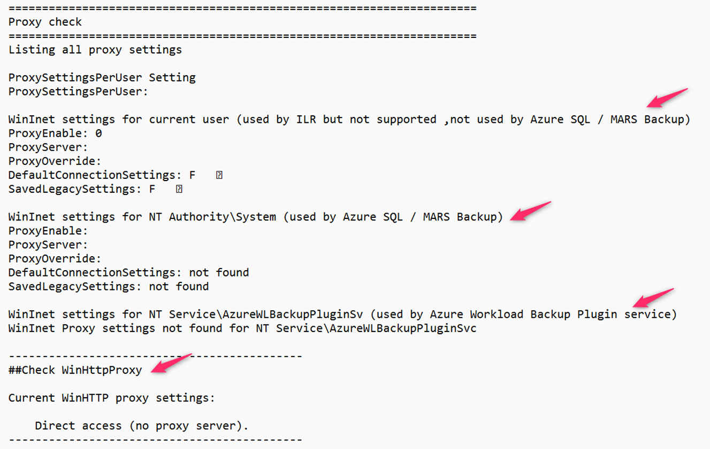
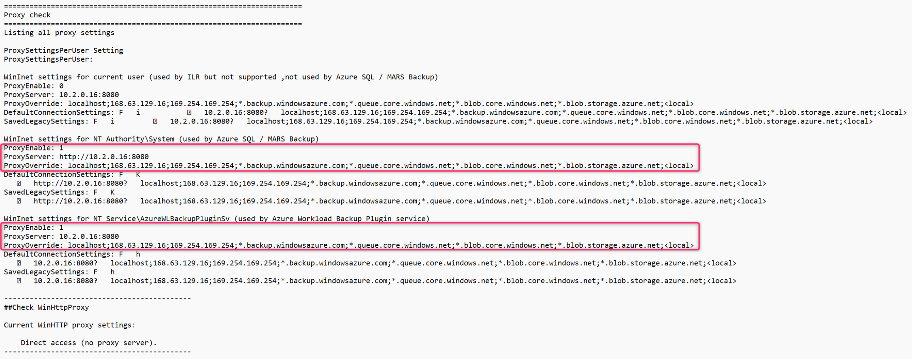
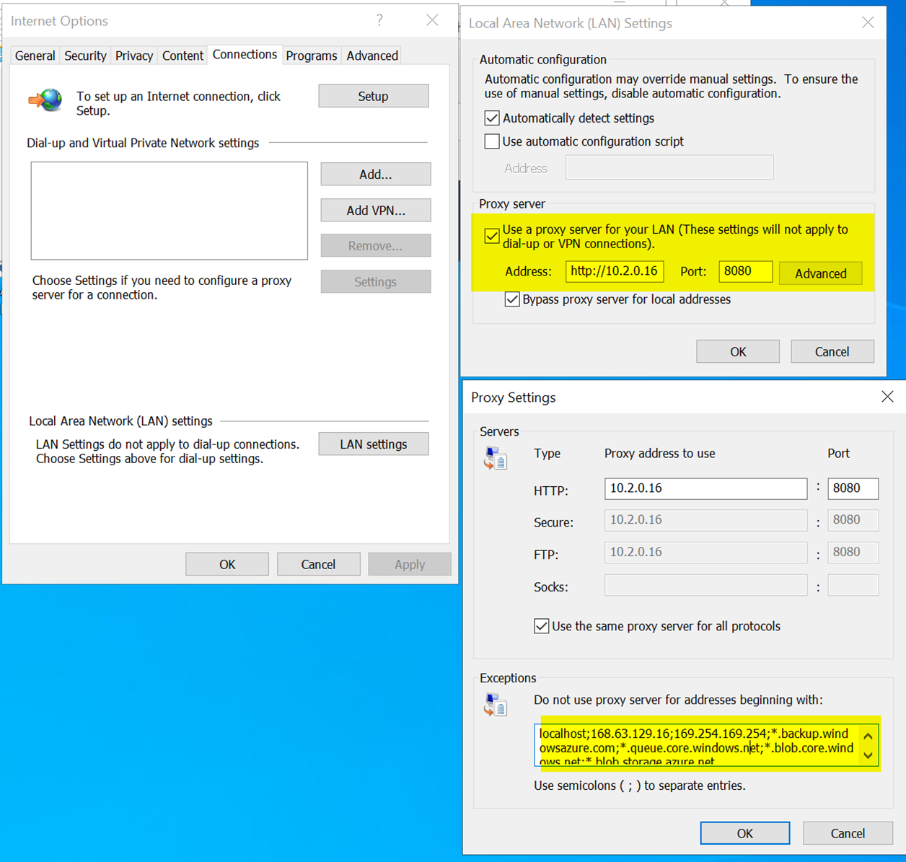
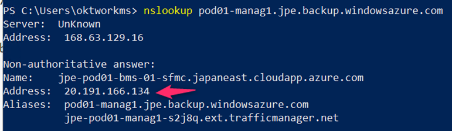
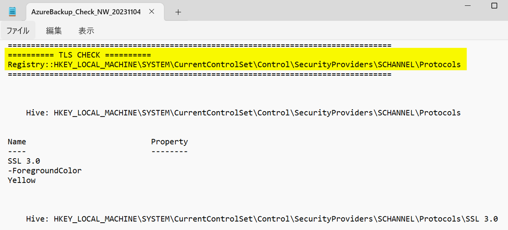

<!-- more -->
皆様こんにちは、Azure Backup サポートです。
今回は、下記ブログにてご案内している「1. Windows VM における Azure Backup 疎通確認」スクリプトの実行結果について、実行結果の見方・Azure Backup において確認すべきポイントなどをご紹介いたします。

・1. Windows VM における Azure Backup 疎通確認
　https://jpabrs-scem.github.io/blog/AzureBackupGeneral/RequestForInvestigatingNW/#1

> [!NOTE]
> 上記ブログ リンクでご案内している疎通確認スクリプトは、あくまで Azure Backup に関わる通信要件を満たしているかを調査するために、弊社よりご案内・実行いただいているものです。
> 疎通確認スクリプトを実行いただいた後は、専任エンジニアが詳細なトラブルシューティングを行いますので、お問い合わせチケット上へ添付ください。
> マシンの環境によっては本スクリプトでは確認しきれないネットワーク構成もあるため、お問い合わせチケットにて、お客様とどのようなネットワーク通信経路となっているかをすり合わせることがございます。
> 「tnc」コマンドや「Invoke-webRequest」コマンドの戻り値については、全てを網羅した情報ではなく、Azure Backup 観点にてチェックすべきものをまとめております。

## 目次
-----------------------------------------------------------
[1. 疎通確認スクリプトの構成](#1)  
[2. プロキシ設定の確認](#2)  
[3. 疎通確認スクリプト結果を確認する際のポイント](#3)  
[4. tnc コマンド結果について](#4)  
[5. Invoke-webRequest コマンド結果について](#5)
[6. SSL, TLS 設定を確認する](#6)
-----------------------------------------------------------

##  1. 疎通確認スクリプトの構成
はじめに、下記ブログ記事でご案内している疎通確認スクリプト (Check_Backup_NW_verX.X.ps1) の、全体的な構成を説明します。

・1. Windows VM における Azure Backup 疎通確認
　https://jpabrs-scem.github.io/blog/AzureBackupGeneral/RequestForInvestigatingNW/#1

(1) 疎通確認スクリプトを実行したマシン情報の出力
(2) プロキシ設定の確認
(3) Azure Backup への「tnc」「Invoke-webRequest」コマンド結果
(4) Azure Storage への「tnc」「Invoke-webRequest」コマンド結果
(5) Microsoft Entra ID への「tnc」「Invoke-webRequest」コマンド結果
(6) 「ファイルの回復」時に必要な宛先への「tnc」「Invoke-webRequest」コマンド結果
(7) SSL, TLS 設定 情報の出力

それでは疎通確認スクリプト結果ログ (AzureBackup_Check_NW_yyyymmdd_hhmmss.log) 上で確認すべきポイントを説明します。

##  2. プロキシ設定の確認
Windows OS のマシン上で、プロキシ サーバーを経由するよう設定しているかどうかを確認しています。

- WinInet settings for current user (used by ILR but not supported ,not used by Azure SQL / MARS Backup)
 →マシン上のカレント ユーザーに対するプロキシ設定が行われているかどうかを確認します

- WinInet settings for NT Authority\System (used by Azure SQL / MARS Backup)
 →マシン上のシステム ユーザーに対するプロキシ設定が行われているかどうかを確認します

- WinInet settings for NT Service\AzureWLBackupPluginSv (used by Azure Workload Backup Plugin service)
 →「SQL Server DB に対する Azure Workload Backup」や「SAP HANA DB に対する Azure Workload Backup」にて作成・使用される「AzureWLBackupPluginSv」ユーザーに対するプロキシ設定が行われているかどうかを確認します

- ##Check WinHttpProxy
 →WinHttp プロキシ設定が行われているかどうかを確認します

下図のように「ProxyEnable」「ProxyServer」「ProxyOverride」箇所が「0」やブランク表示となっていれば「プロキシ設定は行われいない」と判断します。

下図のように「ProxyEnable: 1」となっていれば、プロキシ設定がされていると判断できます。
「ProxyServer」箇所が経由しているプロキシ サーバーです。
「ProxyOverride」箇所には、プロキシ バイパス設定内容が確認できます。
)

(マシン上の設定例)
)

##  3. 疎通確認スクリプト結果を確認する際のポイント
プロキシ設定情報を出力した後は
Azure Backup 処理時に、シナリオによっては必要となる 下記 3 つの Azure サービスとの通信を「tnc」「Invoke-webRequest」コマンドで確認していきます。
　・Azure Backup サービス
　・Azure Storage サービス
　・Microsoft Entra ID サービス

#### (ポイント) リージョンによって確認すべき FQDN が変わる可能性があります
疎通確認スクリプト上の FQDN (例：pod01-manag1.jpe.backup.windowsazure.com) はあくまで、Azure Backup サービスで使用される FQDN のうちの 1 つです。
「jpe」と記載されている通り、疎通確認スクリプトでは、例として東日本リージョンで使用されている Azure Backup サービスとの通信を確認しています。
お客様が利用するリージョンによって、通信確立が必要な FQDN は変更されます。
これは Azure Storage サービスにおいても同様です。

(参考) MARSエージェントを使ったバックアップで必要な通信要件
https://learn.microsoft.com/ja-jp/azure/backup/backup-support-matrix-mars-agent#url-and-ip-access

また、疎通確認スクリプト上で確認している FQDN は、不定期で変更する場合がございます。

#### (ポイント) 確認している FQDN はパブリックな Azure サービスです
プライベート エンドポイント経由で Azure Backup を利用する場合、
確認すべき Azure Backup ・ Azure Storage サービスの FQDN は、疎通確認スクリプト上で確認しているパブリックな FQDN ではなく、お客様毎にそれぞれ異なる FQDN の通信を確認する必要があります。
この場合は下記ブログ記事に従って、ご確認ください。

(確認方法) 3. プライベート エンドポイント環境における Azure Backup 疎通確認
https://jpabrs-scem.github.io/blog/AzureBackupGeneral/RequestForInvestigatingNW/#3

##  4. tnc コマンド結果について
コマンド実行によって得られた代表的な出力結果における、疎通の成否の判断方法をご説明します。 

**<疎通が成功しているコマンド結果 例>**
__
　Result of tnc - 443 / from 10.8.0.6 /To URL  pod01-manag1.jpe.backup.windowsazure.com IPaddress 20.191.166.134 / TcpTestSucceeded: True
__

上記のように「TcpTestSucceeded: True」と出力されていれば「pod01-manag1.jpe.backup.windowsazure.com」という Azure Backup で使用される FQDN の 1 つとは、 tnc コマンド (Test-NetConnection コマンド) による通信は確立できていると判断できます。
また、「IPaddress」の後に IP アドレスが出力されていれば、「名前解決はできている」と判断できます。

**<疎通が失敗しているコマンド結果 例>**
__
　Result of tnc - 443 / from 10.2.0.23 /To URL  pod01-manag1.jpe.backup.windowsazure.com IPaddress 20.191.166.134 / TcpTestSucceeded: False
__

上記のように「TcpTestSucceeded: False」と出力されていれば「pod01-manag1.jpe.backup.windowsazure.com」とは、 tnc コマンドによる通信は確立できていないと判断できます。
いっぽう「IPaddress」の後に IP アドレスが出力されているため「名前解決はできている」と判断できます。

``nslookup pod01-manag1.jpe.backup.windowsazure.com``
と実行いただければ、「pod01-manag1.jpe.backup.windowsazure.com」の IP アドレスを確認可能です。
)

#### (ポイント) プロキシ サーバーを経由するマシンの場合 tnc コマンドだけでは判断できません
弊チームの疎通確認スクリプト上の tnc コマンドでは、プロキシを経由した通信確認を行えないため
プロキシを経由しているマシン上で実行している場合、たとえ「TcpTestSucceeded: True」と出力されていても「プロキシを経由して通信確立できている」とはいえません。
別途「Invoke-webRequest」コマンドにて確認する必要があります。

##  5. Invoke-webRequest コマンド結果について
コマンド実行によって得られた代表的な出力結果における、疎通の成否の判断方法をご説明します。 

**<疎通が成功しているコマンド結果 例>**
__
　#TRY!! Invoke-webRequest login.microsoft.com
　Result of Invoke-webRequest  / StatusCode: 200/ StatusDescription: OK
__
　#TRY!! Invoke-webRequest pod01-manag1.jpe.backup.windowsazure.com
　PS>TerminatingError(Invoke-WebRequest): "リモート サーバーがエラーを返しました: (404) 見つかりません"
__
　#TRY!! Invoke-webRequest ceuswatcab01.blob.core.windows.net
　PS>TerminatingError(Invoke-WebRequest): "InvalidQueryParameterValueValue for one of the query parameters specified in the request URI is invalid. RequestId:3549fc2a-201e-0069-07eb-0edf28000000 Time:2023-11-04T06:52:24.8125809Zcomp"
__
　#TRY!! Invoke-webRequest md-dlbrhcw4gn5r.z33.blob.storage.azure.net
　PS>TerminatingError(Invoke-WebRequest): "AuthenticationFailedServer failed to authenticate the request. Make sure the value of Authorization header is formed correctly including the signature. RequestId:2a4e4e9a-001c-00bc-34eb-0e8bd7000000 Time:2023-11-04T06:52:28.3332912Z"
__

上記のように
　・StatusCode: 200
　・404 エラー・403 エラー
　・InvalidQueryParameterValueValue
　・AuthenticationFailedServer
が返却された場合、対象の疎通先より応答 (エラーを含む) が返却されているため、Azure Backup 観点では「疎通ができている」と判断できます。 

**<疎通が失敗しているコマンド結果 例>**
__
　#TRY!! Invoke-webRequest pod01-manag1.jpe.backup.windowsazure.com
　PS>TerminatingError(Invoke-WebRequest): "Unable to connect to the remote server"
__
　#TRY!! Invoke-webRequest weus2watcab01.blob.core.windows.net
　PS>TerminatingError(Invoke-WebRequest): "リモート サーバーに接続できません。"
__

上記のように
・Unable to connect to the remote server
・リモート サーバーに接続できません。
が返却された場合、「Invoke-webRequest」コマンドによる該当 FQDN への通信は失敗しており「通信が確立できていない」といえます。

##  6. SSL, TLS 設定を確認する
ログ上の後方「TLS CHECK」部分は、SSL/TLS のレジストリキー設定を出力しています。
Azure Backup においては、TLS 1.2 が無効化されているマシンの場合、バックアップ構成・バックアップ処理が失敗する可能性があるため確認しております。

・(参考) TLS 1.2 を有効にしないと、どのような影響がありますか?
　https://learn.microsoft.com/ja-jp/azure/backup/transport-layer-security#what-is-the-impact-of-not-enabling-tls-12

スクリプトでは、マシン上のレジストリキー 
(HKEY_LOCAL_MACHINE\SYSTEM\CurrentControlSet\Control\SecurityProviders\SCHANNEL\Protocols 配下)
の値を出力しています。

(画面例)
)

なお、「TLS 1.2」のレジストリキーが明示的に設定されていなくでも、「Windows Server 2012 R2」以降では TLS 1.2 は規定で有効化されています。

・Azure Backup でのトランスポート層セキュリティ
　https://learn.microsoft.com/ja-jp/azure/backup/transport-layer-security#verify-windows-registry
　引用："ここに示す値は、Windows Server 2012 R2 以降のバージョンでは既定で設定されています。 これらのバージョンの Windows では、レジストリ キーが存在しない場合、作成する必要はありません。"

Azure Backup の失敗において、TLS 1.2 プロトコルに関わる懸念がある場合は、対象マシン上のその他の設定箇所も確認しながら、トラブルシューティングを進めていくこととなります。

・.NET Framework で TLS 1.1 および TLS 1.2 を有効化する方法 - まとめ - | Japan Developer Support Internet Team Blog (jpdsi.github.io)
　https://jpdsi.github.io/blog/internet-explorer-microsoft-edge/dotnet-framework-tls12/

説明は以上となります。