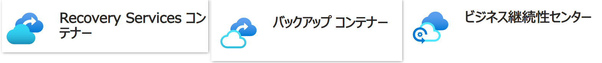

<!-- more -->
こんにちは、Azure Backup サポートです。
今回は、 Azure バックアップ ソリューションで利用する Recovery Services コンテナーとバックアップ コンテナーのバックアップ対象の違いについてご説明します。
Recovery Services コンテナーとバックアップ コンテナーはバックアップ対象 (バックアップ ソリューション) の違いにより使い分ける必要がございます。
また、**ビジネス継続性センターは サブスクリプション内の Recovery Services コンテナーやバックアップ コンテナー (およびそれぞれのコンテナーでバックアップしているバックアップ アイテム) を統合管理するための管理画面です。**

## 目次
-----------------------------------------------------------
[1. バックアップ ソリューションとコンテナー、およびデータ保存先の比較表](#1)
[2. コンテナーにバックアップ データが保存されないもの](#2)
[2-1. Azure ファイル共有バックアップ (スナップショット レベル)](#2-1)
[2-2. Azure Blob バックアップ (運用バックアップ)](#2-2)
[2-3. Azure ディスク バックアップ](#2-3)
-----------------------------------------------------------

### 1. バックアップ ソリューションとコンテナー、およびデータ保存先の比較表
 各 Azure バックアップのソリューションがどのコンテナーを利用するか、またデータの保存先については下記の通りです。
 また、各ソリューションには各公開ドキュメントへのリンクを付けています。

| # | バックアップ ソリューション | 利用するコンテナー | コンテナーにバックアップ データを保存するか|
| :--- | :--- | :--- |:---|
| 1 | [Azure VM バックアップ](https://learn.microsoft.com/ja-jp/azure/backup/backup-azure-vms-introduction) |  Recovery Services コンテナー |する|
| 2 | [MARS バックアップ](https://learn.microsoft.com/ja-jp/azure/backup/backup-azure-about-mars) |  Recovery Services コンテナー |する|
| 3 | [MABS バックアップ](https://learn.microsoft.com/ja-jp/azure/backup/backup-azure-microsoft-azure-backup) |   Recovery Services コンテナー|する|
| 4 | [SQL in Azure VM バックアップ](https://learn.microsoft.com/ja-jp/azure/backup/backup-azure-sql-database) |   Recovery Services コンテナー|する|
| 5 | [SAP HANA DB in Azure VM バックアップ](https://learn.microsoft.com/ja-jp/azure/backup/sap-hana-database-about) |   Recovery Services コンテナー|する|
| 6 | [Azure ファイル共有バックアップ](https://learn.microsoft.com/ja-jp/azure/backup/azure-file-share-backup-overview) |   Recovery Services コンテナー|「スナップショット レベル」のバックアップ：しない 「Vault-Standard レベル」のバックアップ：する (注 1)|
| 7 | [Azure Blob バックアップ](https://learn.microsoft.com/ja-jp/azure/backup/blob-backup-overview)  |   バックアップ コンテナー|運用バックアップ：しない 保管済みバックアップ：する|
| 8 | [Azure ディスク バックアップ](https://learn.microsoft.com/ja-jp/azure/backup/disk-backup-overview)  |   バックアップ コンテナー|**しない**|
| 9 | [Azure PosgreSQL バックアップ](https://learn.microsoft.com/ja-jp/azure/backup/backup-azure-database-postgresql-overview)  |   バックアップ コンテナー|する|
| 10 | [Azure Kubernetes Service バックアップ](https://learn.microsoft.com/ja-jp/azure/backup/azure-kubernetes-service-backup-overview)  |   バックアップ コンテナー|運用層のバックアップ : しない コンテナー層のバックアップ : する (注 2)  |

(注 1) 2025 年 3 月現在、Azure Premium ファイル共有のコンテナー層へのバックアップ機能は Public Preview となっております  
一方、Azure Standard ファイル共有のコンテナー層へのバックアップ機能は Generally Available となっております  
- Generally Available: Vaulted Backup Support for Azure Files Standard Shares | Azure updates | Microsoft Azure
  https://azure.microsoft.com/en-US/updates?id=482659

(注 2) AKS のバックアップにおいて、運用層のバックアップは必須で取得いただく必要がございますが、コンテナー層のバックアップは任意での取得が可能となっております  

### 2.コンテナーにバックアップ データが保存されないもの
上述のとおり、現在 一般公開されている (プレビュー機能ではない) Azure ファイル共有バックアップ (スナップショット レベル) 、Azure Blob バックアップ (運用バックアップ)、Azure ディスク バックアップは各コンテナーにはバックアップ データは転送されません。
それぞれについて簡単にご説明させていただきます。
共通している点はそれぞれのソリューションはコアとなる別のソリューションをバックアップ サービス側からトリガーし実現している点でございます。

#### 2-1. Azure ファイル共有バックアップ (スナップショット レベル)
Azure ファイル共有 バックアップ (スナップショット レベル) は Azure Files の共有スナップショットの機能をバックアップ サービスと連携することによりスナップショット取得・削除の自動化を実現したバックアップ ソリューションです。

そのため、バックアップ データ (スナップショット データ) の保存先は Azure Files の共有スナップショットと同じく、そのストレージ アカウント自身 (のスナップショット領域)となります。
そのため、 Recovery Services コンテナーには転送されません。
下記のように**Azure ファイル共有のスナップショット リソースとして、Azure ファイル共有バックアップにて取得されたスナップショットも確認可能です**。("発信側" が "AzureBackup" となっているものです)

- バックアップ プロセスのしくみ - Azure ファイル共有のバックアップについて
  https://learn.microsoft.com/ja-jp/azure/backup/azure-file-share-backup-overview
  >抜粋：スナップショット レベル | ファイル共有 API を使ってファイル共有のスナップショットが作成されます。 スナップショットの URL は、メタデータ ストアだけに格納されます。

- Azure Files の共有スナップショット
  https://learn.microsoft.com/ja-jp/azure/storage/files/storage-snapshots-files

#### 2-2. Azure Blob バックアップ (運用バックアップ)
Azure Blob バックアップ (運用バックアップ) は Azure Blob のポイントインタイム リストアの機能をバックアップ サービスと連携することにより実現したバックアップ ソリューションです。

バックアップ データ (リストアに必要なデータ) の保存先は Azure Blob のポイントインタイム リストアと同じく、そのストレージ アカウント自身となります。
バックアップ コンテナーには転送されません。

- 運用バックアップのしくみ - Azure Blob の運用バックアップの概要
  https://learn.microsoft.com/ja-jp/azure/backup/blob-backup-overview
  >抜粋：継続的バックアップ: 運用バックアップ (マネージド ローカル データ保護ソリューション) を構成して、ブロック BLOB の偶発的な削除や破損から保護できます。 データはソース ストレージ アカウント内にローカルに格納され、バックアップ コンテナーには転送されません。

- ブロック BLOB のポイントインタイム リストア
  https://learn.microsoft.com/ja-jp/azure/storage/blobs/point-in-time-restore-overview

#### 2-3. Azure ディスク バックアップ

Azure ディスク バックアップ は マネージド ディスクの増分スナップショットの機能とバックアップ サービスを連携することによりスナップショット取得・削除の自動化を実現したバックアップ ソリューションです。

そのため、バックアップ データ (スナップショット データ) の保存先は マネージド ディスクのスナップショットと同じく、マネージド ディスクのスナップショットの専用領域 (運用層) となります。
Recovery Services コンテナーには転送されません。
また、下記のように**スナップショット リソースとして Azure ディスクのバックアップによって取得されたスナップショットも確認可能です**。(タグが "CreatedBy：AzureBackup" となっているものです)

- バックアップと復元のプロセスのしくみ - Azure ディスク バックアップの概要
  https://learn.microsoft.com/ja-jp/azure/backup/disk-backup-overview#how-the-backup-and-restore-process-works
  >抜粋： Azure ディスク バックアップでは、運用層のバックアップのみがサポートされています。 コンテナー ストレージ層へのバックアップのコピーはサポートされていません。 そのため、バックアップ コンテナーのストレージ冗長設定 (LRS/GRS) は、運用層に格納されているバックアップには適用されません。

- マネージド ディスクの増分スナップショットの作成
  https://learn.microsoft.com/ja-jp/azure/virtual-machines/disks-incremental-snapshots?tabs=azure-cli

本ブログ記事の説明は以上です。