<!-- more -->
みなさんこんにちは、Azure Backup サポートです。
今回は Azure Backup のバックアップ失敗、リストア失敗の時の調査をするにあたり、提供いただきたい情報をお伝えいたします。
なお、 Azure Backup の NW 観点の障害調査に必要なログに関しては、下記をご覧ください。
・ Azure Backup の障害調査に必要な情報 (疎通確認)
　 https://jpabrs-scem.github.io/blog/AzureBackupGeneral/RequestForInvestigatingNW/

## 目次
-----------------------------------------------------------
[1. Azure VM バックアップの障害調査に必要なログ](#1)
&emsp;[1-1. Azure VM バックアップ の VSS 障害調査に追加で必要なログ](#1-1)
[2. Azure VM バックアップ の ファイル レベル リストア (ILR) 失敗調査に必要なログ](#2)
[3. Azure Backup for SAP HANA in Azure VM の障害調査に必要なログ](#3)
&emsp;[3-1. SAP HANA の backup.log 及び backint.log](#3-1)
&emsp;[3-2. opt 配下の log](#3-2)
[4. MARS (Microsoft Azure Recovery Services) エージェントを利用したバックアップ の障害調査に必要なログ](#4)
&emsp;[4-1. MARS (Microsoft Azure Recovery Services) エージェントのログ](#4-1)
&emsp;[4-2. システム情報](#4-2)
&emsp;[4-3. イベント ログ](#4-3)
&emsp;[4-4. 各種証明書の確認証跡およびインポート](#4-4)
&emsp;&emsp;[4-4-1. 個人 > 証明書](#4-4-1)
&emsp;&emsp;[4-4-2. 信頼されたルート証明書 > 証明書](#4-4-2)
&emsp;&emsp;[4-4-3. 中間証明機関 > 証明書](#4-4-3)
&emsp;&emsp;[4-4-4. 証明書インポート手順](#4-4-4)
-----------------------------------------------------------


## 1. Azure VM バックアップの障害調査に必要なログ<a id="1"></a>
下記の **環境情報** と **ログ情報** の収集をお願いいたします。

> [!NOTE]
> Azure Backup for SQL Server in Azure VM や Azure Backup for SAP HANA in Azure VM など Azure VM 上の DB のバックアップの障害調査においても、本ログが同様に必要でございます。

### 環境情報
・ Subscription ID
・ Recovery Services コンテナー名、およびそのリソースグループ名
・ バックアップ対象 VM 名、およびそのリソースグループ名
・ OS およびバージョン情報

### ログ情報
下記を参考に zip などにまとめてご提供いただけますと幸いです。

#### ・Windows の場合
> C:\Windows\System32\winevt\Logs\
> C:\WindowsAzure\

#### ・Linuxの場合
> /var/log/

全量いただけることが望ましいですが、全量が困難な場合は下記をご提供ください。
> /var/log/azure/*
> /var/log/syslog*
> /var/log/waagent.*

> [!WARNING]
> NVA 等をご利用である場合には、Azure VM バックアップがサポートされていない可能性がございます。
> 詳細は下記をご覧ください。
> ・ NVA のバックアップについて
> 　 https://jpabrs-scem.github.io/blog/AzureVMBackup/NVA_backup/


### 1-1. Azure VM バックアップ の VSS 障害調査に追加で必要なログ<a id="1-1"></a>
Azure VM バックアップの下記のようなエラーが出ることがございます。

> Error Code  : Snapshot operation failed due to VSS Writers in bad state.
> Error Message  : ExtensionFailedVssWriterInBadState

その場合には VSS 観点での調査が必要であるため、上記 [1. Azure VM バックアップの障害調査に必要なログ](#1) に加えて下記 URL 先のログの採取をお願いいたします。
 **可能な限り "[A]"が望ましいですが、”[B]” の方法で採取いただいても、ある程度は調査が可能な場合がございます。**
・ VSS エラーが発生している事象の調査 
　 https://jpwinsup.github.io/mslog/storage/vss/vss-error/

---

## 2. Azure VM バックアップ の ファイルレベル リストア (ILRリストア) 失敗調査に必要なログ<a id="2"></a>
下記の **環境情報** と **ログ情報** の収集をお願いいたします。

### 環境情報
・ Subscription ID
・ Recovery Services コンテナー名、およびそのリソースグループ名
・ バックアップ対象 VM 名、およびそのリソースグループ名、OS 名
・ リストア先の VM 名、およびそのリソースグループ名、OS 名

### ログ情報
zip などにまとめてご提供いただけますと幸いです。

- **(Windows の場合) "ディスクの管理" の画面の画面ショット**
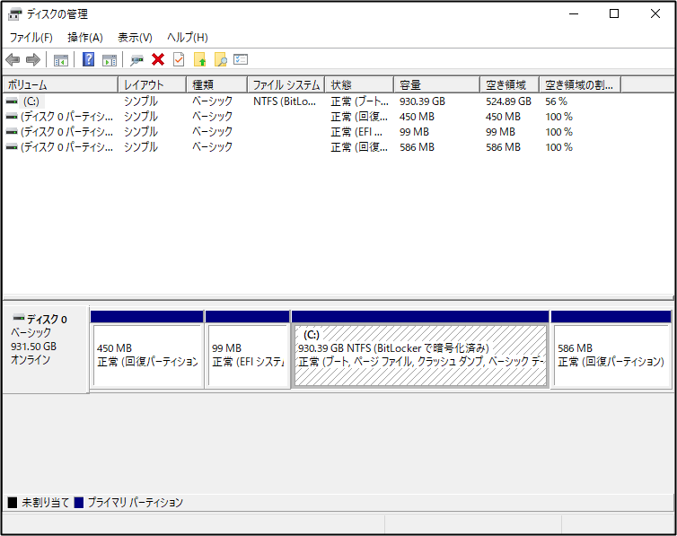

- **実行したスクリプト、および実行後に作成されたフォルダ一式**
  - **Windowsの場合**
    ・ スクリプトファイル : IaaSVMILRExeForWindows.exe
    ・ スクリプト実行後に作成されるフォルダー : ``仮想マシン名(小文字)+スクリプトファイル実行日時``
    
    下記例では "okt-temp-win-20220212145642" が作成されています。
    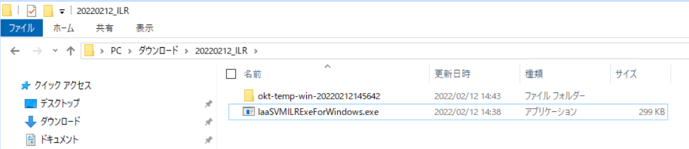
    
    "okt-temp-win-20220212145642"の中身
    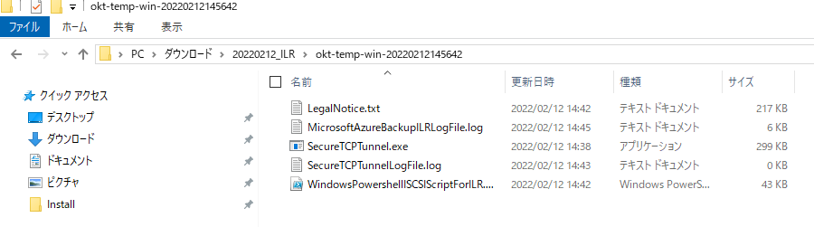

  - **Linux の場合**
    ・ スクリプトファイル : 
       > 例) **vm02kensho_1_jpe_6591639015130036692_802427195716_899298aac7c04bf094ad68bfc5b9584ed206b94b62d965.py**  
       > ※ 上記「vm02kensho」の箇所に、小文字の仮想マシン名が含まれます
    
    ・ スクリプト実行後に作成されるフォルダー : ``仮想マシン名(小文字)+スクリプトファイル実行日時/Script``
    
    スクリプトを実行後、「**vm02kensho-20220212151619**」ディレクトリが自動生成されていることがわかる。
    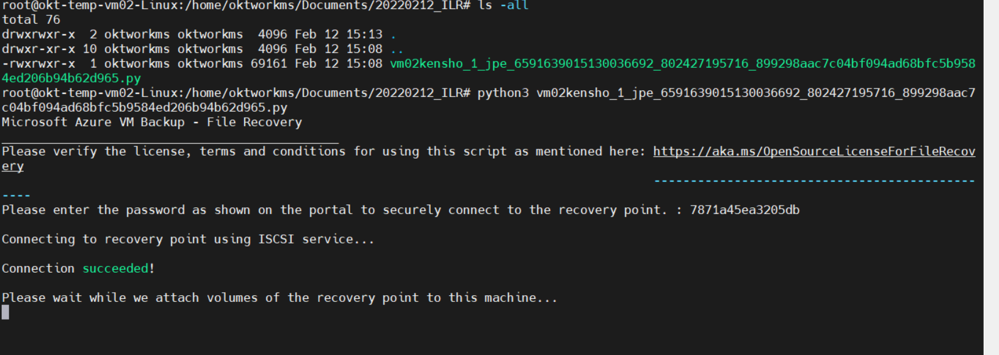
    
    > ls -all
    
    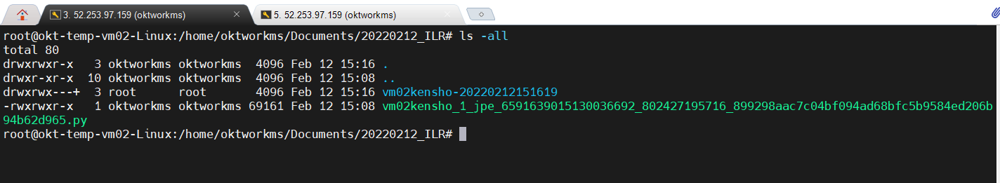
    
    「vm02kensho-20220212151619」ディレクトリの中身、および作成されたディレクトリの **Scripts ディレクトリ**の中身は下記の通り
     > ls -allR
    
    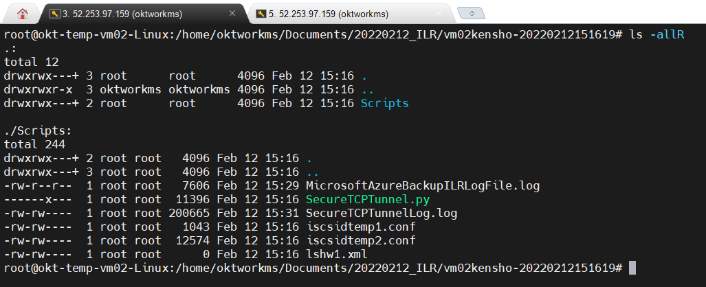

---

## 3. Azure Backup for SAP HANA in Azure VM の障害調査に必要なログ<a id="3"></a>

### 3.0 環境情報とログ
<span style="color: red; "> **[1. Azure VM バックアップの障害調査に必要なログ](#1) の 環境情報 ならびに ログ情報 - Linuxの場合** </span> の取得をお願いいたします。

### 3.1 SAP HANA の backup.log 及び backint.log <a id="3-1"></a>
> - xx にはインスタンスナンバーが入ります。
>   - /hana/shared/HXE/HDBxx/(hostname)/trace/backup.log
>   - /hana/shared/HXE/HDBxx/(hostname)/trace/DB_<DB名>/backup.log
>   - /hana/shared/HXE/HDBxx/(hostname)/trace/backint.log
>   - /hana/shared/HXE/HDBxx/(hostname)/trace/DB_<DB名>/backint.log

※ お手数ですが、全ての DB の backup.log 及び backint.log の採取をお願いいたします。
※ 上記パスに該当のログが無い場合は以下を試し、コマンド実行結果に表示されるディレクトリの場所のログをアップロードしてください。
``` shell
sudo -i # rootユーザーに切り替えます
cd /    # ディレクトリの最上層に移動します
find ./ -name "backup.log"  # findコマンドにより該当のログの場所を特定します
find ./ -name "backint.log" # findコマンドにより該当のログの場所を特定します
```

### 3.2 opt 配下の log <a id="3-2"></a>
/opt/msawb/var/log ディレクトリ配下のファイルを zip 等におまとめのうえで、アップロードしてください。

---

## 4. MARS (Microsoft Azure Recovery Services) エージェントを利用したバックアップ の障害調査に必要なログ<a id="4"></a>

### 4.0 環境情報と Windows ログ
<span style="color: red; "> **[1. Azure VM バックアップの障害調査に必要なログ](#1) の 環境情報 ならびに ログ情報 - Windows の場合** </span> の取得をお願いいたします。
※ MARS バックアップ のバックアップ対象の環境が Azure VM でない場合は Azure VM 名 / VM リソース グループ名は不要です。

上記に加えて下記もご対応お願いいたします。
### 4.1 MARS (Microsoft Azure Recovery Services) エージェントのログ <a id="4-1"></a>
まず、下記 リンク先から調査用スクリプトをダウンロードしてください。
[WABDiag.zip](https://github.com/jpabrs-scem/blog/files/10148102/WABDiag.zip)

ダウンロードいただきました WABDiag.tx を .ps1 に変更して使用し、問題が発生しているマシンより Azure Backup ログの収集をお願いいたします。
※ ファイルの解凍パスワードは "AzureBackup" となります。
 
1. WABDiag.ps1 を管理者権限の PowerShell で実行します。
 
  > 実行コマンド : <スクリプトのパス>\WABDiag.ps1 <パス\保存するフォルダ名>
  > 実行例 : C:\WABDiag\WABDiag.ps1 C:\Logs
 
   実行結果にファイル パスが無い旨のメッセージが表示される可能性がございますが、対象のファイル自体が無い事を示すメッセージとなりますので、無視していただいて問題ございません。


 
#### PowerShell の実行ポリシーの制限によりスクリプトが実行できない場合
PowerShellを管理者権限で起動し、下記コマンドを実行し実行ポリシーを変更後、再度実行していただけますでしょうか。
> コマンド : Set-ExecutionPolicy Unrestricted

また現在の実行ポリシーを後ほど元に戻す場合は、変更前に下記コマンドを実行し、設定されているポリシーを確認、メモし、スクリプト実行後に同様の手順で変更していただきますようお願いいたします。
> コマンド : Get-ExecutionPolicy 
 
 - 参考
   実行ポリシーについて - PowerShell  
   https://docs.microsoft.com/ja-jp/powershell/module/microsoft.powershell.core/about/about_execution_policies?view=powershell-7.2

###  4.2 システム情報 <a id="4-2"></a>
1. 対象のマシンに管理者権限を保持するユーザーでログオンします。
2. 管理者権限でコマンド プロンプトを起動し、以下のコマンドで取得します。
   > msinfo32 /nfo <出力ファイル名> 
   > 実行例) msinfo32 /nfo SVR_msinfo32.nfo
3. 生成されたファイルをご提供ください。
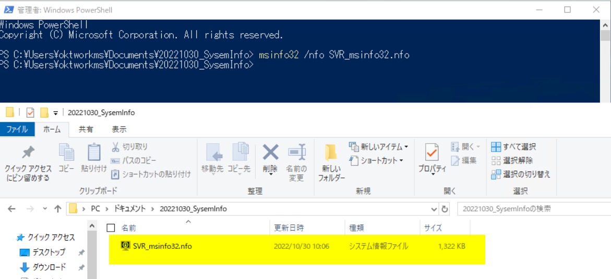

### 4.3 イベント ログ<a id="4-3"></a>
1. 対象のマシンに管理者権限を保持するユーザーでログオンします。
2. [スタート] - [管理ツール] - [イベント ビューアー] を開きます。
3. 左側ペインの以下のイベントに対して、右クリックをし、[すべてのイベントを名前をつけて保存] を選択し、ファイルの種類が "イベント ファイル (*.evtx)" であることを確認し、任意の名前を付けて、[保存] をクリックします。
   (ファイルの種類が "イベント ファイル (*.csv)" も併せて取得をお願いいたします) 
a) [イベント ビューアー (ローカル)] - [Windows ログ] - [システム]
b) [イベント ビューアー (ローカル)] - [Windows ログ] - [Application]
4. 保存したイベント ログ ファイルをご提供ください。

### 4.4 各種証明書の確認証跡およびインポート<a id="4-4"></a>
下記詳細手順のもと、証明書をご確認いただき、その画面キャプチャを zip などにおまとめの上ご提供お願いいたします。

対象マシン上の [スタート] ボタンを右クリック > [ファイル名を指定して実行] > "certlm.msc" と入力して [OK] を選択し、以下すべての証明書が存在するかご確認ください。
※ Windows Server 2012 以前の OS の場合は、MMC スナップインより証明書スナップインを起動してください。
※ 該当の証明書がない場合は、以下の各項目に記載の URL からダウンロードしインポートしてください。
　 これによりMARS エージェントが立ち上がらないなどの場合の場合改善することがございます。

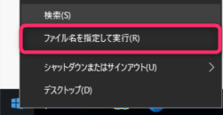

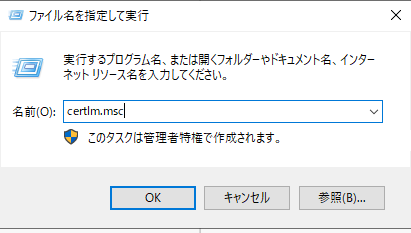


### 4.4.1 個人 > 証明書<a id="4-4-1"></a>
下記 2 つの証明書が存在することを確認してください。

> ・ CB_<MARS のバックアップを実施する予定の Recovery Services コンテナー名>-xx-xx-xxxx-vaultcredentials
> ・ CB_<ホスト名>._xxxxxxxxxxxxxxxxxx

※ 上記 2 点が存在していることを確認の上、その画面スクリーンショットをご提供ください
（存在していない場合もございますので、その場合は、その点ご返信いただけますと幸いです。）
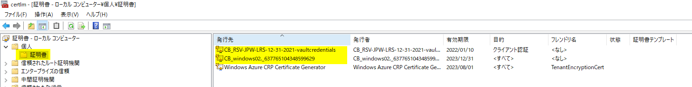

"**・CB_<ホスト名>._xxxxxxxxxxxxxxxxxx**" の期限がきれている場合には、MARS エージェントが正常に起動しないことがあります。
その際には、下記を参考に MARS エージェントの再インストールを実施してください。それにより証明書も再インストールされます。
・ MARS エージェントの再インストール手順
　 https://jpabrs-scem.github.io/blog/MARSBackup/How_to_re-install/


### 4.4.2 信頼されたルート証明書 > 証明書 <a id="4-4-2"></a>
下記ドキュメントに記載されているルート証明書が存在することを確認してください。

・ ルート証明機関 / Azure 証明機関の詳細 | Microsoft Learn
　 https://learn.microsoft.com/ja-jp/azure/security/fundamentals/azure-CA-details?tabs=root-and-subordinate-cas-list#root-certificate-authorities

また、ドキュメントに記載されているルート証明書の "Thumbprint" の値と、対象のマシンにて証明書をダブル クリックし、[詳細] > [拇印] で表示されている値が一致していることも確認していただき、その画面キャプチャをご提供ください。
※ ドキュメントに記載されている証明書が一部存在していない場合もございますので、その場合は、その点ご連絡いただけますと幸いです。

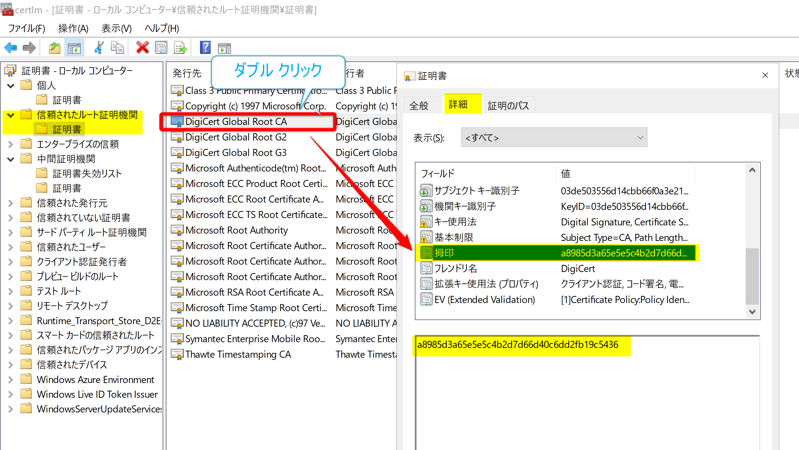


### 4.4.3 中間証明機関 > 証明書 <a id="4-4-3"></a>
中間証明書の画面キャプチャをご提供ください。
※ 特にご確認は不要でございます。


### 4.4.4 証明書インポート手順 <a id="4-4-4"></a>

1. 証明書をエクスポートしたいマシンに、管理者権限でログインします。
2. [スタート] - [ファイル名を指定して実行] から、certlm.msc と入力して、[Enter]キーを押します。**（※ Windows Server 2012 以前の OS の場合は、MMC スナップインより証明書スナップインを起動してください）**
3. ユーザーアカウント制御 が起動する場合は管理者権限での実行を許可します。
4. 左側の [証明書 (ローカル コンピューター)]を展開して、 [信頼されたルート証明機関] - [証明書] を開きます。
5. [証明書] を右クリックし [すべてのタスク] – [インポート] と選択します。
6. 証明書のインポートウィザードが起動しますので以下の様に進めます。
・ 「証明書のインポート ウィザードの開始」画面で [次へ] をクリック。
・ インポートする証明書のファイル  ->  (上記公開情報よりダウンロードした各証明書を保存したパス)
・ 証明書ストア -> ("信頼されたルート証明機関" となっていることを確認)
7. 「信頼されたルート証明機関」証明書ストアに証明書がインポートされた事を確認します。
* 中間証明書のインポート手順は、上記の「信頼されたルート証明機関」の箇所を「中間証明機関」にお読み替えいただけますようお願いいたします。
