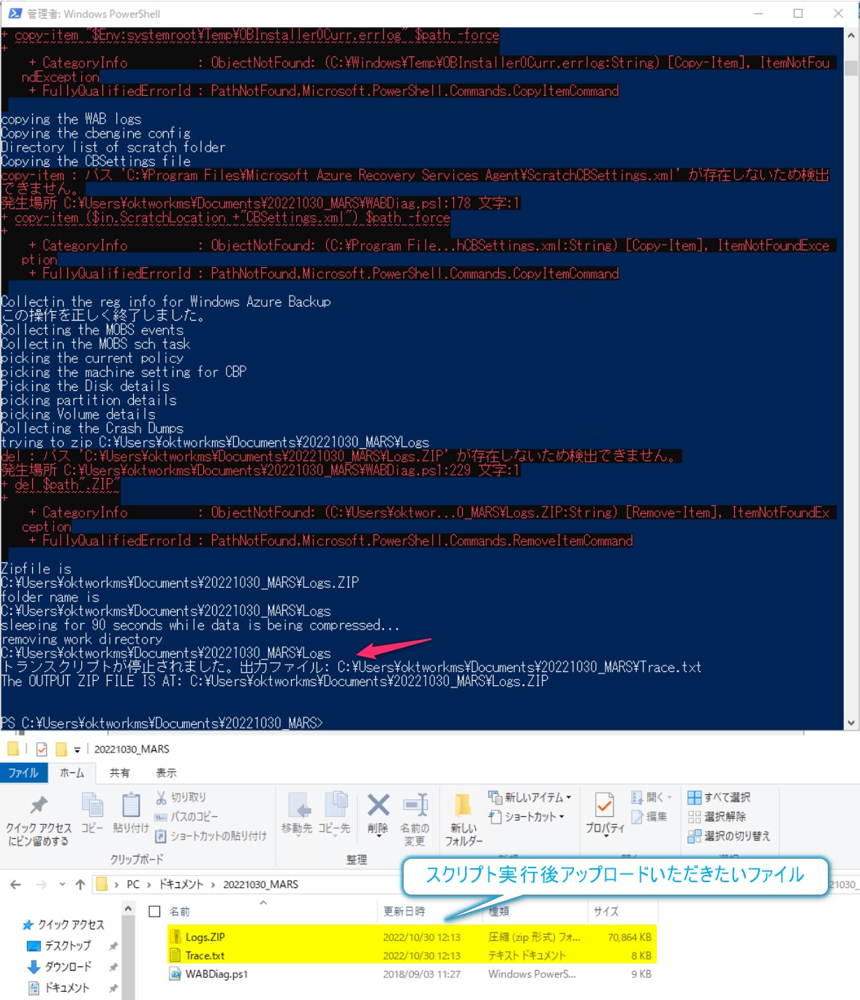

<!-- more -->
皆様こんにちは。Azure Backup サポートの山本です。
今回は Azure Backup のバックアップ失敗、リストア失敗の時の調査をするにあたり、提供いただきたい情報をお伝えいたします。
なお、 Azure Backup の障害調査にあたり NW 観点で取得いただきたいログに関しては下記をご覧ください
・Azure Backup の障害調査に必要な情報 (疎通確認)
https://jpabrs-scem.github.io/blog/AzureBackupGeneral/RequestForInvestigatingNW/

## 目次
-----------------------------------------------------------
[1. Azure VM バックアップの障害調査に必要なログ](#1)
  [  1-1. Azure VM Backup の VSS 障害調査に追加で必要なログ](#1-1)
[2.   Azure VM バックアップ の ファイルレベル リストア (ILRリストア) 失敗調査に必要なログ](#2)
[3. Azure Backup for SAP HANA in Azure VM の障害調査に必要なログ](#3)
[4. MARS Backup エージェントを利用したバックアップ の障害調査に必要なログ](#4)
  [4-1. Microsoft Azure Backup Agent のログ](#4-1)
  [4-2. システム情報](#4-2)
  [4-3. イベント ログ](#4-3)
  [4-4. 各種証明書の確認証跡およびインポート](#4-4)
   [4-4-1. 個人 ＞ 証明書](#4-4-1)
   [4-4-2. 信頼されたルート証明書 ＞ 証明書](#4-4-2)
   [4-4-3. 中間証明機関 ＞ 証明書](#4-4-3)
   [4-4-4. 証明書インポート手順](#4-4-4)
-----------------------------------------------------------


## 1. Azure VM バックアップの障害調査に必要なログ<a id="1"></a>
　*Azure VM Backup ではないですが  Azure Backup for SQL Server in Azure VM や Azure Backup for SAP HANA in Azure VM など Azure VM 上の DB のバックアップに関するものでも同様に必要です。
下記の **環境情報**と**ログ情報**の収集をお願いいたします。

*NVA などの場合、OS が対応していない可能性もございます。
(参考) 詳細は下記をご覧ください
・NVA のバックアップについて
https://jpabrs-scem.github.io/blog/AzureVMBackup/NVA_backup/


### 環境情報
・Subscription ID
・Recovery Services コンテナー名、およびそのリソースグループ名
・バックアップ対象 VM 名、およびそのリソースグループ名
・OS およびバージョン情報

#### ログ情報
下記を参考に zip などにまとめてご提供いただけますと幸いです。
#### ・Windows の場合
>C:\Windows\System32\winevt\Logs\
>C:\WindowsAzure\

#### ・Linuxの場合
>/var/log/

全量いただけることが望ましいですが、全量が困難な場合は下記をご提供ください。
>/var/log/azure/*
>/var/log/syslog*
>/var/log/waagent.*

### 1-1 . Azure VM Backup の VSS 障害調査に追加で必要なログ<a id="1-1"></a>
Azure VM Backupの下記のようなエラーが出ることがございます。

>Error Code ：Snapshot operation failed due to VSS Writers in bad state.
Error Message ：ExtensionFailedVssWriterInBadState

その場合には VSS 観点での調査が必要であるため、上記 [1. Azure VM バックアップの障害調査に必要なログ](#1) に加えて下記 URL 先のログの採取をお願いします。
 **可能な限り "[A]"が望ましいですが、”[B]” の方法で採取いただいても、ある程度は調査が可能な場合がございます。**
・VSS エラーが発生している事象の調査 
https://jpwinsup.github.io/mslog/storage/vss/vss-error/

また合わせて下記も関連するブログでございます。
・Azure VM Backupにおける整合性について
https://jpabrs-scem.github.io/blog/AzureVMBackup/Consistencies/#1-1-VSS-%E8%A6%B3%E7%82%B9%E3%81%A7%E3%81%AE%E8%AA%BF%E6%9F%BB%E3%81%AB%E3%81%A4%E3%81%84%E3%81%A6

## 2.   Azure VM バックアップ の ファイルレベル リストア (ILRリストア) 失敗調査に必要なログ<a id="2"></a>
下記の **環境情報**と**ログ情報**の収集をお願いいたします。
### 環境情報
・Subscription ID
・Recovery Services コンテナー名、およびそのリソースグループ名
・バックアップ対象 VM 名、およびそのリソースグループ名、OS 名
・リストア先の VM 名、およびそのリソースグループ名、OS 名

### ログ情報
zip などにまとめてご提供いただけますと幸いです。
#### ・(Windows の場合) "ディスクの管理" の画面の画面ショット


#### ・実行したスクリプト、および実行後に作成されたフォルダ一式
 - **Windowsの場合**
・スクリプトファイル：IaaSVMILRExeForWindows.exe
・スクリプト実行後に作成されるフォルダー："仮想マシン名(小文字)"+"スクリプトファイル実行日時"

　下記例では "okt-temp-win-20220212145642" が作成されています。


"okt-temp-win-20220212145642"の中身


- **Linux の場合**
・ILRのスクリプトファイル：例)　**vm02kensho(小文字VM名)_1_jpe_6591639015130036692_802427195716_899298aac7c04bf094ad68bfc5b9584ed206b94b62d965.py**
・作成されたディレクトリの **Scripts ディレクトリ一式**：例） **vm02kensho-20220212151619/Script**
スクリプトを実行後、「**vm02kensho-20220212151619**」ディレクトリが自動生成されていることがわかる。


 >ls -all


「vm02kensho-20220212151619」ディレクトリの中身、および作成されたディレクトリの **Scripts ディレクトリ**の中身は下記の通り
 >ls -allR


## 3. Azure Backup for SAP HANA in Azure VM の障害調査に必要なログ<a id="3"></a>
<span style="color: red; "> [1. Azure VM バックアップの障害調査に必要なログ](#1) の **環境情報** ならびに **ログ情報 - Linuxの場合** に加えて</span>下記もご対応お願いします。

*お手数ですが、全ての DB の backup.log 及び backint.log の採取をお願いします。

### SAP HANAのbackup.log 及び backint.log 
>* xxにはインスタンスナンバーが入ります。
	・/hana/shared/HXE/HDBxx/(hostname)/trace/backup.log
	・/hana/shared/HXE/HDBxx/(hostname)/trace/DB_<DB名>/backup.log
	・/hana/shared/HXE/HDBxx/(hostname)/trace/backint.log
	・/hana/shared/HXE/HDBxx/(hostname)/trace/DB_<DB名>/backint.log
 
*上記パスに該当のログが無い場合は以下を試し、コマンド実行結果に表示されるディレクトリの場所の log をアップロードしてください。
``` shell
sudo -i (rootユーザーに切り替えます)
cd / (ディレクトリの最上層に移動します)
find ./ -name "backup.log" (findコマンドにより該当のログの場所を特定します)
find ./ -name "backint.log" (findコマンドにより該当のログの場所を特定します)
```

### opt 配下の log 
・/opt/msawb/var/log ディレクトリ配下のファイルを zip 等におまとめのうえで、アップロードしてください。

## 4. MARS Backup エージェントを利用したバックアップ の障害調査に必要なログ<a id="4"></a>

## 4.0 環境情報とWindowsログ
[1. Azure VM バックアップの障害調査に必要なログ](#1) の **環境情報** ならびに **ログ情報 - Windows の場合** の取得をお願いします。
*MARS バックアップ のバックアップ対象の環境が Azure VM でない場合は Azure VM 名 / VM リソース グループ名は不要です。

上記に加えて下記もご対応お願いします。
### 4.1 Microsoft Azure Backup Agent のログ　<a id="4-1"></a>
 まず、下記 リンク先から調査用スクリプトのダウンロードをお願いします。
[WABDiag.zip](https://github.com/jpabrs-scem/blog/files/10148102/WABDiag.zip)

ダウンロードいただきました WABDiag.tx を .ps1 に変更して使用し、問題が発生しているマシンより Azure Backup ログの収集をお願いいたします。
※ ファイルの解凍パスワードは "AzureBackup" となります。
 
1. WABDiag.ps1 を管理者権限の PowerShell で実行します。
 
  > 実行コマンド: <スクリプトのパス>\WABDiag.ps1 <パス\保存するフォルダ名>
   実行例: C:\WABDiag\WABDiag.ps1 C:\Logs
 
   実行結果にファイル パスが無い旨のメッセージが表示される可能性がございますが、対象のファイル自体が無い事を示すメッセージとなりますので、無視していただいて問題ございません。


 
#### PowerShell の実行ポリシーの制限によりスクリプトが実行できない場合
PowerShellを管理者権限で起動し、下記コマンドを実行し実行ポリシーを変更後、再度実行していただけますでしょうか。
>コマンド：Set-ExecutionPolicy Unrestricted

また現在の実行ポリシーを後ほど元に戻す場合は、変更前に下記コマンドを実行し、設定されているポリシーを確認、メモし、スクリプト実行後に同様の手順で変更していただきますようお願いいたします。
>コマンド：Get-ExecutionPolicy 
 
 - 参考
 ・実行ポリシーについて - PowerShell 
 https://docs.microsoft.com/ja-jp/powershell/module/microsoft.powershell.core/about/about_execution_policies?view=powershell-7.2

###  4.2 システム情報 <a id="4-2"></a>
1. 対象のマシンに管理者権限を保持するユーザーでログオンします。
2. 管理者権限でコマンド プロンプトを起動し、以下のコマンドで取得します。
  > msinfo32 /nfo <出力ファイル名> 
  実行例)  > msinfo32 /nfo SVR_msinfo32.nfo
3. 生成されたファイルをご提供ください。


### 4.3 イベント ログ<a id="4-3"></a>
1. 対象のマシンに管理者権限を保持するユーザーでログオンします。
2. [スタート] - [管理ツール] - [イベント ビューアー] を開きます。
3. 左側ペインの以下のイベントに対して、右クリックをし、[すべてのイベントを名前をつけて保存] を選択し、ファイルの種類が "イベント ファイル (*.evtx)" であることを確認し、任意の名前を付けて、[保存] をクリックします。
   (ファイルの種類が "イベント ファイル (*.csv)" も併せて取得をお願いいたします) 
a) [イベント ビューアー (ローカル)] - [Windows ログ] - [システム]
b) [イベント ビューアー (ローカル)] - [Windows ログ] - [Application]
4. 保存したイベント ログ ファイルをご提供ください。

### 4.4 各種証明書の確認証跡およびインポート<a id="4-4"></a>
下記詳細手順のもと、証明書 および 権限の確認を確認のうえ、画面ショットを zip などにおまとめの上ご提供お願いいたします。

*該当の証明書がない場合は下記 URL よりダウンロードしインポートをお願いします。
これによりMARS エージェントが立ち上がらないなどの場合の場合改善することがございます。

対象マシン上の「スタート」ボタンを右クリック＞「ファイル名を指定して実行」＞「certlm.msc」と入力して「OK」し、以下すべての証明書が存在するかご確認ください。
**（※ Windows Server 2012 以前の OS の場合は、MMC スナップインより証明書スナップインを起動してください）**


### 4.4.1 個人 ＞ 証明書<a id="4-4-1"></a>
>・CB_<MARSのバックアップを実施する予定のRecovery Services コンテナー名 → -x-x-xxxx-vaultcredentials
>・CB_<ホスト名>._xxxxxxxxxxxxxxxxxx
※　上記 2 が存在していることを確認の上、その画面スクリーンショットをご提供ください
（存在していない場合もございますので、その場合は、その点ご返信いただけますと幸いです。）


"**・CB_<ホスト名>._xxxxxxxxxxxxxxxxxx** の期限がきれている場合は正常に MARS エージェントが正常に起動しないことがあります。
下記を参考に再インストール をご実施ください。それにより証明書がインストールされます。
・MARS エージェントの再インストール手順
https://jpabrs-scem.github.io/blog/MARSBackup/How_to_re-install/


### 4.4.2 信頼されたルート証明書 ＞ 証明書 <a id="4-4-2"></a>
[参考]
・Azure TLS 証明書の変更
https://learn.microsoft.com/ja-jp/azure/security/fundamentals/tls-certificate-changes#what-changed

[証明書zipダウンロード先]
[root certificate.zip](https://github.com/jpabrs-scem/blog/files/9615338/root.certificate.zip)

>ルート証明書名	証明書の拇印
>[DigiCert Global Root G2	: df3c24f9bfd666761b268073fe06d1cc8d4f82a4](https://cacerts.digicert.com/DigiCertGlobalRootG2.crt)
>[DigiCert Global Root CA	: a8985d3a65e5e5c4b2d7d66d40c6dd2fb19c5436](https://cacerts.digicert.com/DigiCertGlobalRootCA.crt)
>[Baltimore CyberTrust Root	: d4de20d05e66fc53fe1a50882c78db2852cae474](https://cacerts.digicert.com/BaltimoreCyberTrustRoot.crt)
>[D-TRUST Root Class 3 CA 2 2009	: 58e8abb0361533fb80f79b1b6d29d3ff8d5f00f0](https://www.d-trust.net/cgi-bin/D-TRUST_Root_Class_3_CA_2_2009.crt)
>[Microsoft RSA Root Certificate Authority2017	: 73a5e64a3bff8316ff0edccc618a906e4eae4d74](https://www.microsoft.com/pkiops/certs/Microsoft%20RSA%20Root%20Certificate%20Authority%202017.crt)
>[Microsoft ECC Root Certificate Authority 2017	: 999a64c37ff47d9fab95f14769891460eec4c3c5](https://www.microsoft.com/pkiops/certs/Microsoft%20ECC%20Root%20Certificate%20Authority%202017.crt)


※　上記 6 つすべての証明書が存在していること (存在していない場合もございます) 
・証明書をダブルクリックし、「詳細」タブ ＞ スクロールして下の方に「拇印」がありますので、値が上記と同一であることが確認し、その画面ショットをご提供ください。
（存在していない場合もございますので、その場合は、その点ご返信いただけますと幸いです。）


### 4.4.3 中間証明機関 ＞ 証明書 <a id="4-4-3"></a>
[参考]
・Azure Storage TLS: Changes are coming! (…and why you care)
https://techcommunity.microsoft.com/t5/azure-storage-blog/azure-storage-tls-changes-are-coming-and-why-you-care/ba-p/1705518

[証明書zipダウンロード先]
[intermediate certificate.zip](https://github.com/jpabrs-scem/blog/files/9615291/intermediate.certificate.zip)

>中間証明書名	証明書の拇印
>[Microsoft RSA TLS CA 01	: 703d7a8f0ebf55aaa59f98eaf4a206004eb2516a](http://www.microsoft.com/pki/mscorp/Microsoft%20RSA%20TLS%20CA%2001.crt)
>[Microsoft RSA TLS CA 02	: b0c2d2d13cdd56cdaa6ab6e2c04440be4a429c75](http://www.microsoft.com/pki/mscorp/Microsoft%20RSA%20TLS%20CA%2002.crt)

※　上記 2 つすべての証明書が存在していること
・証明書をダブルクリックし、「詳細」タブ ＞ スクロールして下の方に「拇印」がありますので、値が上記と同一であることが確認できる画面スクリーンショットをご提供ください。


### 4.4.4 証明書インポート手順 <a id="4-4-4"></a>

1. 証明書をエクスポートしたいマシンに、管理者権限でログインします。
2. [スタート] - [ファイル名を指定して実行] から、certlm.msc と入力して、[Enter]キーを押します。**（※ Windows Server 2012 以前の OS の場合は、MMC スナップインより証明書スナップインを起動してください）**
3. ユーザーアカウント制御 が起動する場合は管理者権限での実行を許可します。
4. 左側の [証明書 (ローカル コンピューター)]を展開して、 [信頼されたルート証明機関] - [証明書] を開きます。
5. [証明書] を右クリックし [すべてのタスク] – [インポート] と選択します。
6. 証明書のインポートウィザードが起動しますので以下の様に進めます。
・ 「証明書のインポート ウィザードの開始」画面で [次へ] をクリック。
・ インポートする証明書のファイル  ->  (上記公開情報よりダウンロードした各証明書を保存したパス)
・ 証明書ストア -> ("信頼されたルート証明機関" となっていることを確認)
7. 「信頼されたルート証明機関」証明書ストアに証明書がインポートされた事を確認します。
* 中間証明書のインポート手順は、上記の「信頼されたルート証明機関」の箇所を「中間証明機関」にお読み替えいただけますようお願いいたします。
