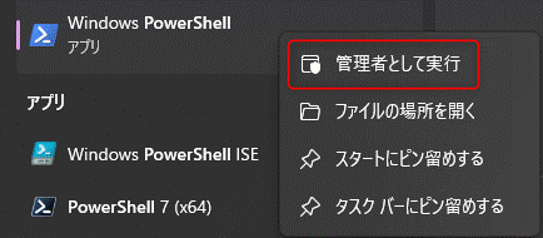
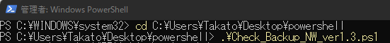
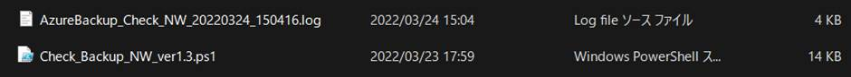
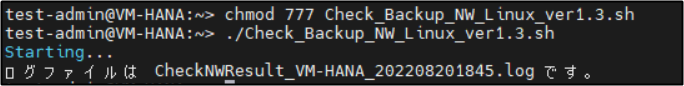

<!-- more -->
皆様こんにちは。Azure Backup サポートです。
今回は Azure Backup のバックアップ失敗、リストア失敗の時の調査をするにあたり、NW 観点で提供いただきたい情報をお伝えいたします。
NW 観点以外の情報採集提供依頼については下記をご覧ください
・ Azure Backup の障害調査に必要な情報
　 https://jpabrs-scem.github.io/blog/AzureBackupGeneral/RequestForInvestigating/

## 目次
-----------------------------------------------------------
[1. Windows VM における Azure Backup 疎通確認](#1)
[2. Linux VM における Azure Backup 疎通確認](#2)
-----------------------------------------------------------

## 1. Windows VM における Azure Backup 疎通確認
まず、下記リンク先から疎通確認スクリプトのダウンロードをお願いします。
[Check_Backup_NW_ver1.7.zip](https://github.com/jpabrs-scem/blog/files/11648460/Check_Backup_NW_ver1.7.zip)
 

(スクリプト実行手順)
1. 疎通確認スクリプトをダウンロードし、展開してください。
   ※ ファイルの解凍パスワードは **"AzureBackup"** となります。

2. PowerShell を右クリックし、管理者として実行をクリックしてください。
   

3. PowerShell にて手順 1 で展開したスクリプトの場所に移動してください。
   例) "Takato" というユーザーのデスクトップ上の PowerShell というフォルダ内にスクリプトをダウンロードしたときの移動コマンド
   > cd C:\Users\Takato\Desktop\powershell
 
4. 以下コマンドを実行し、スクリプトを実行してください。
   (現在画像とバージョンが異なりますが、同様の手順でございます。)
   > .\Check_Backup_NW_ver1.3.ps1

   
   ※ 実行ポリシーの制限により上記スクリプトが実行できない場合には、PowerShell を管理者権限で起動し、下記コマンドより実行ポリシーの設定を変更後、再度スクリプトを実行していただけますと幸いです。
   > Set-ExecutionPolicy Unrestricted
 
5. 以下のような "ScriptStart Completed" 出力がされるまで、お待ちください。
   ※ コマンドの実行には、環境によって 20 分ほど要する場合がございます。20 分経っても完了しない場合は、control + c を押下して強制終了してください。

   
 
6. コマンド実行が完了すると、スクリプトと同じフォルダ内に以下のようなログ ファイルが出力されますので、弊社までご提供お願いいたします。
   ログファイル名: AzureBackup_Check_NW_yyyymmdd_hhmmss.log

   
   ※ control + c にて強制終了した場合においても該当のログ ファイルが出力されますので、弊社までご提供お願いいたします。

## 2. Linux VM における Azure Backup 疎通確認

まず、下記 リンク先から疎通確認スクリプトのダウンロードをお願いします。
[Check_Backup_NW_Linux_ver1.5.zip](https://github.com/jpabrs-scem/blog/files/13433813/Check_Backup_NW_Linux_ver1.5.zip)

(スクリプト実行手順)
1. 疎通確認スクリプトをダウンロードし、展開してください。
   ※ ファイルの解凍パスワードは **"AzureBackup"** となります。

2. 対象の Linux マシンにスクリプトを移動し実行します。
   必要に応じて chmod コマンドなどを用いてパーミッションを変更してください。
   > chmod 777 Check_Backup_NW_Linux_ver1.4.sh 

   下記のように実行します。
   > ./Check_Backup_NW_Linux_ver1.4.sh

3. 実行完了
   実行が完了すれば下記のファイルが作成されますので、弊社までご提供お願いいたします。
   ログファイル名: CheckNWResult_(ホスト名)_(YYYYMMDDHHMM).log

   
