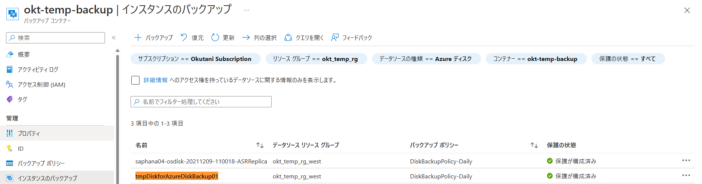
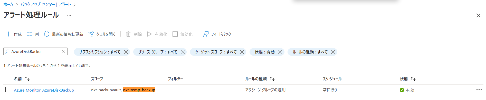
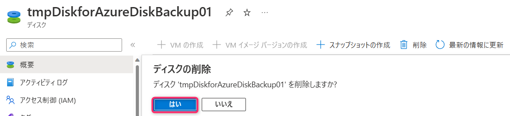
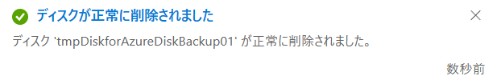
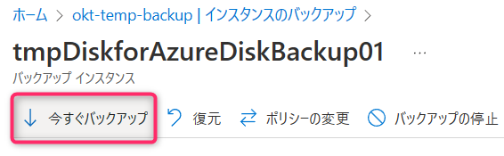
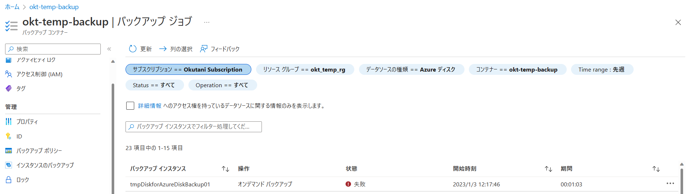
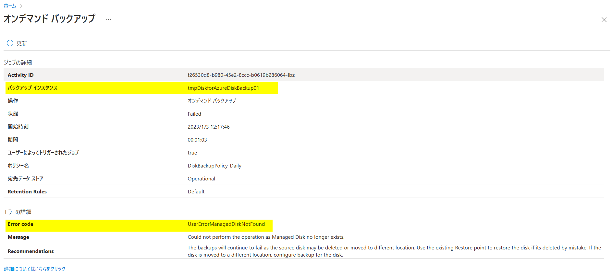
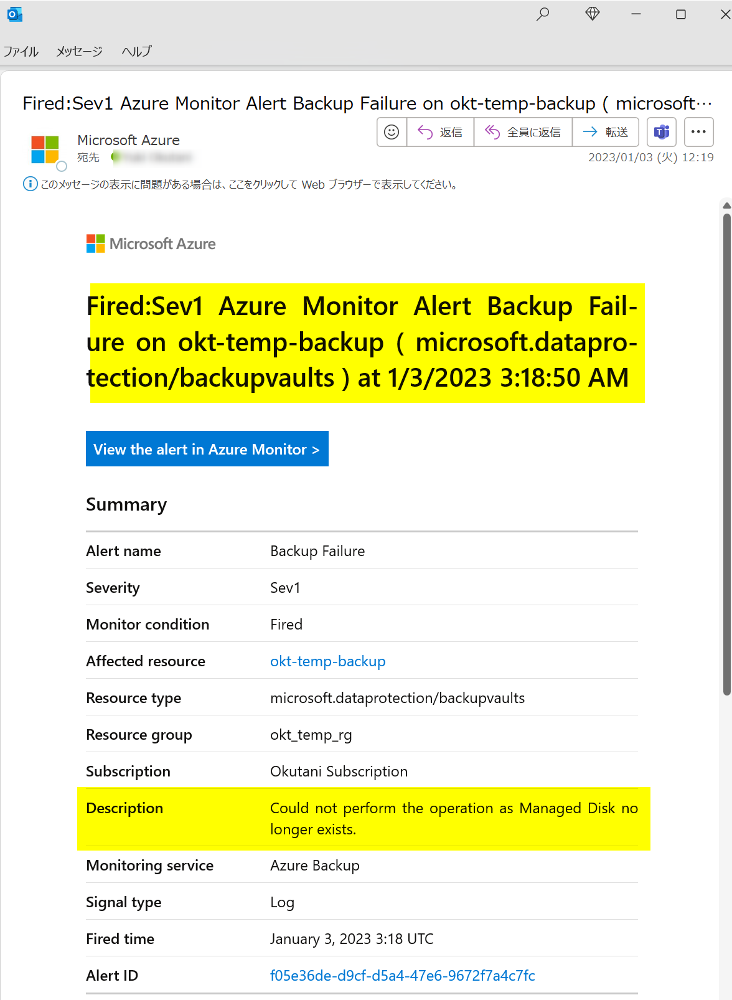

<!-- more -->
皆様こんにちは、Azure Backup サポートです。
アラートのテスト等のため “Azure Disk Backup を失敗させたい” というお問い合わせをよくいただきます。
今回は、Azure Disk Backup を意図的に失敗させる方法として、Azure Disk Backup 構成したディスクを削除して、バックアップ ジョブを失敗させる方法をご紹介いたします。

・Azure ディスク バックアップの概要
　https://learn.microsoft.com/ja-jp/azure/backup/disk-backup-overview

## 目次
-----------------------------------------------------------
[1. Azure Disk Backup を意図的に失敗させる方法](#1)
[2. その他ブログで公開している Azure Backup の失敗方法](#2)
-----------------------------------------------------------

###  1. Azure Disk Backup を意図的に失敗させる方法
(1) とある Azure Managed Disk に対して、Azure Disk Backup を構成し、バックアップ取得しておきます。

・Azure Managed Disks のバックアップ
　https://learn.microsoft.com/ja-jp/azure/backup/backup-managed-disks

下図は例として、Azure Managed Disk「tmpDiskforAzureDiskBackup01」を Azure Disk Backup にてバックアップ構成している状態です。

アラートが生成されることを確認するため、今回は「Azure Monitor を使用した組み込みのアラート」を、「スコープ：Azure Disk Backup を構成しているバックアップ コンテナー」にて構成しています。

・Azure Backup の Azure Monitor アラート
　https://learn.microsoft.com/ja-jp/azure/backup/backup-azure-monitoring-built-in-monitor?tabs=recovery-services-vaults#azure-monitor-alerts-for-azure-backup

・「Azure Monitor を使用した組み込みのアラート」を利用したバックアップ ジョブ失敗のアラート通知作成例
　https://jpabrs-scem.github.io/blog/AzureBackupGeneral/How_to_set_Backup_Alert/

(2) バックアップ構成した Azure Managed Disk リソースを削除します。

(3) Azure Disk Backup の「今すぐバックアップ」を実行します。
 

(4) 約 1 - 2 分後に、バックアップ ジョブが「UserErrorManagedDiskNotFound」エラーにて失敗します。

(5) 「Azure Monitor を使用した組み込みのアラート」などのアラートにて、アラートを構成/メール通知構成をしていれば、下図のようなメールにてアラートが通知されます。

###  2. その他ブログで公開している Azure Backup の失敗方法
・Azure VM Backup を意図的に失敗させる方法
　https://jpabrs-scem.github.io/blog/AzureVMBackup/How_to_fail_VM_backup/

・Azure VM Backup のデータ転送フェーズを意図的に失敗させる方法
　https://jpabrs-scem.github.io/blog/AzureVMBackup/How_to_fail_ttv/

・MARS バックアップ を意図的に失敗させる方法
　https://jpabrs-scem.github.io/blog/MARSBackup/How_to_fail_MARS_backup/

・Azure Files Backup を意図的に失敗させる方法
　https://jpabrs-scem.github.io/blog/AzureFilesBackup/How_to_fail_AFS_backup/