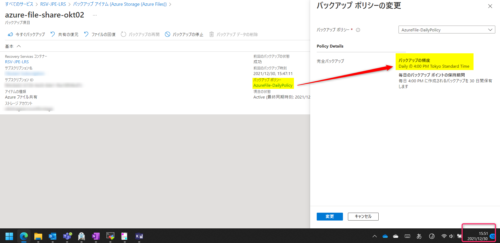
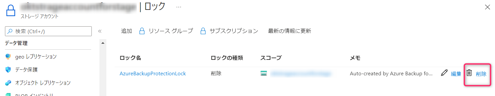
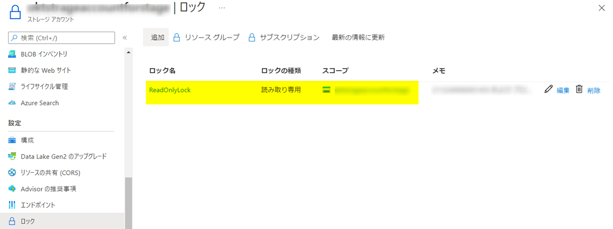
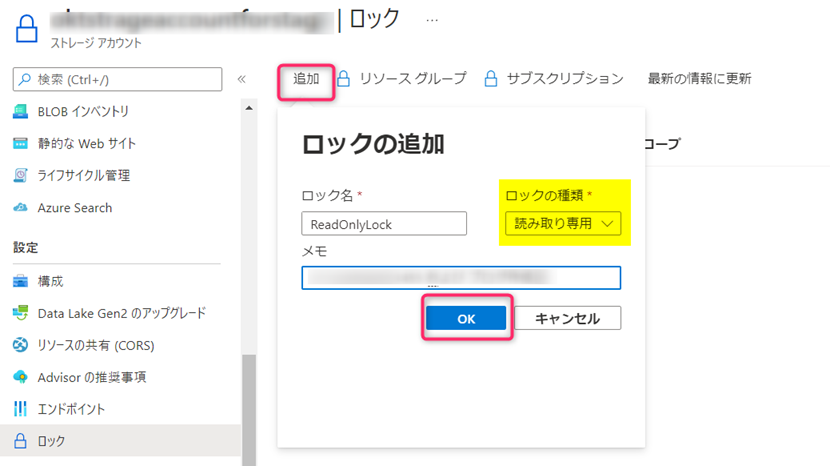
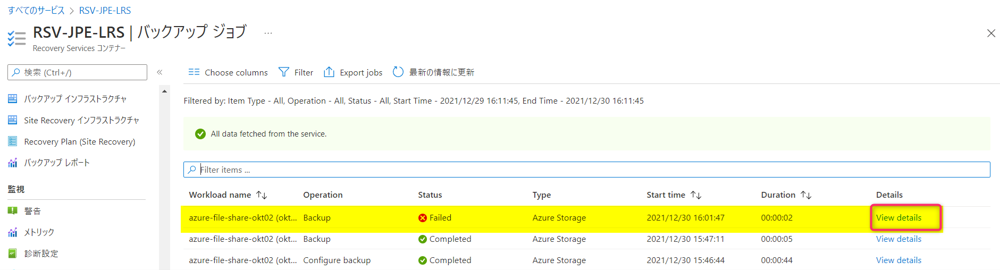
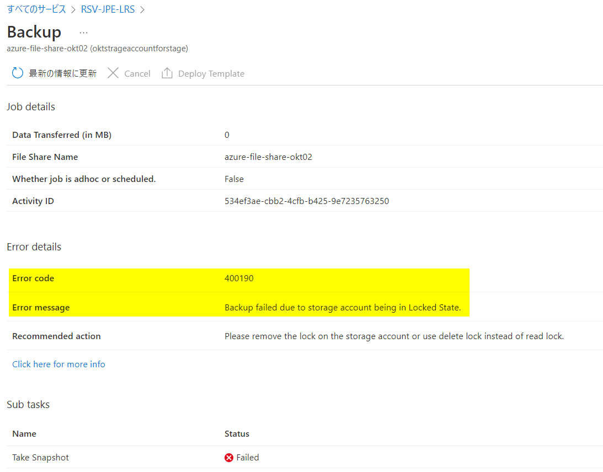
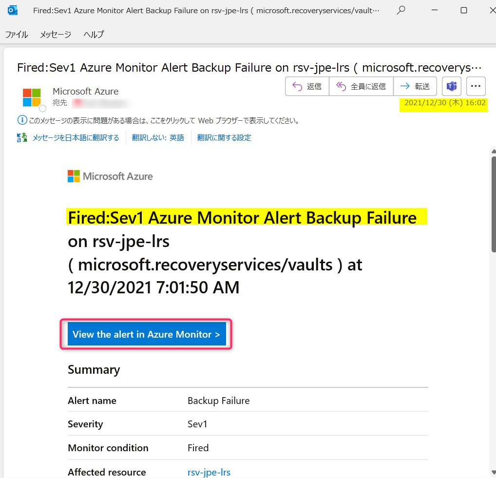
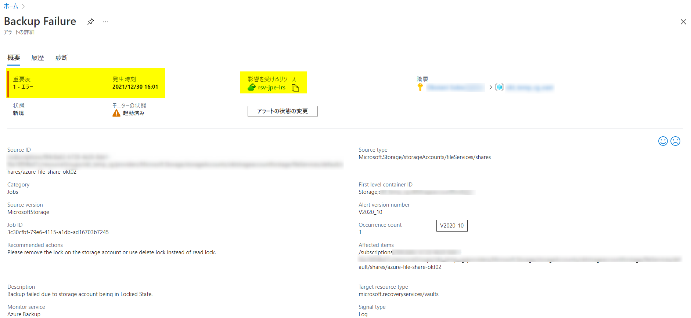
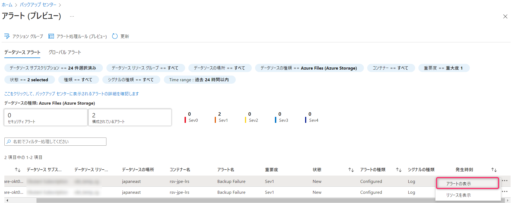
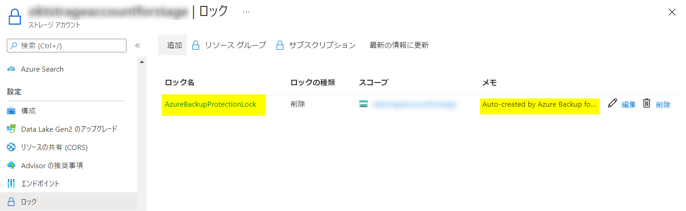

<!-- more -->
皆様こんにちは、Azure Backup サポートです。
今回は、アラート通知のテスト等のために、**Azure Files （Azure ファイル共有）のバックアップを意図的に失敗させる方法**についてご案内します。
方法としては、バックアップ構成しているAzure Files のストレージ アカウントに対して「読み取り専用」ロックを追加しておき、スケジュール バックアップを実施する方法がございます。

## Azure Files のAzure Backup ジョブを意図的に失敗させる方法
1) テスト希望時間に、スケジュールされたバックアップを実行させたい場合は、（ストレージ アカウントへ「読み取り専用」ロックを追加する前に）Recovery Services コンテナー ＞ バックアップ ポリシー にて、スケジュール バックアップを実行したい時間を変更しておきます。

2) バックアップ構成をしている Azure Files のストレージ アカウントに対して「読み取り専用」ロックを追加しておき、スケジュール バックアップが実行開始されるまで待ちます。(または今すぐバックアップを実行します。)
（※ 「AzureBackupProtectionLock」という「削除」ロックが自動的に追加されている場合、「読み取り専用」ロックを追加してもバックアップが成功します。
一度「AzureBackupProtectionLock」ロックを削除したうえで「読み取り専用」ロックを追加しておきます。）

3) バックアップの実行後に、Recovery Services コンテナー ＞ バックアップ ジョブ にて、ジョブが失敗していることを確認します。

「View details」をクリックすると、「Error Code：400190」にてAzure Files のバックアップが失敗していることが確認できます。

4) 指定したメールアドレスへアラート通知を送信するよう設定している場合、指定のメールアドレスへアラート通知が送信されていることが確認できます。

アラート設定に関しましては下記をご覧ください。
・「Azure Monitor を使用した組み込みのアラート」を利用したバックアップ ジョブ失敗のアラート通知作成例
https://jpabrs-scem.github.io/blog/AzureBackupGeneral/How_to_set_Backup_Alert/

5) バックアップ センター でもアラートを確認可能です。
バックアップ センター ＞ 概要 ＞ データソースの種類：Azure Files（Azure Storage）を選択します。
「ジョブ(過去 24 時間)」欄に「スケジュールされたバックアップ 失敗」にカウントされていること、「アクティブなアラート(過去 24 時間)」欄に「Sev1」としてカウントされていることが確認できます。

アラート通知の検証後は、ストレージ アカウントに対して自動的に追加されていた「削除」ロックを再追加・「読み取り専用」ロックを削除し、元のロック状態に戻します。

