<!-- more -->
こんにちは! ABRS チームの 朴 です。
今回は VMware VM を Azure に移行する (エージェントレス型方式) 際、既にパブリック エンドポイントを利用する Azure Migrate プロジェクトに登録されている
Azure Migrate アプライアンスをプライベート エンドポイント接続を利用する他の Azure Migrate プロジェクトに再登録する方法についてご説明させていただきます。

## 目次
-----------------------------------------------------------
[1. 接続方法ごとの Azure Migrate アプライアンスのデプロイ方法について](#1)
   [  1.1 パブリック エンドポイントを使用する Azure Migrate を使用する時 (V2A エージェントレス型方式) の Azure Migrate アプライアンスのデプロイ方法](#1-1)
   [  1.2 プライベート エンドポイントを使用する Azure Migrate を使用する時 (V2A エージェントレス型方式) の Azure Migrate アプライアンスのデプロイ方法](#1-2) 
[2. OVA ファイルから Azure Migrate アプライアンスをデプロイした後、プライベート エンドポイント接続を利用する他の Azure Migrate プロジェクトに再登録する手順](#2)
-----------------------------------------------------------

##  1. 接続方法ごとの Azure Migrate アプライアンスのデプロイ方法について

###  1-1 パブリック エンドポイントを使用する Azure Migrate を使用する時 (V2A エージェントレス型方式) の Azure Migrate アプライアンスのデプロイ方法
 パブリック エンドポイントを使用する Azure Migrate を使用する時 (V2A エージェントレス型方式) : 
 この場合は、Azure Portal から OVA ファイル および ZIP ファイルがダウンロードできます。
    
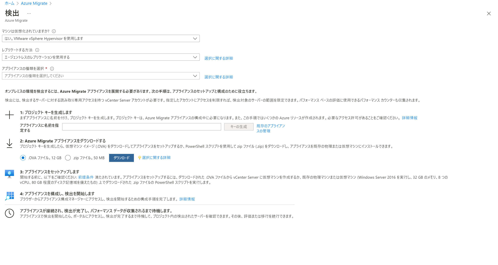

### 1-2 プライベート エンドポイントを使用する Azure Migrate を使用する時 (V2A エージェントレス型方式) の Azure Migrate アプライアンスのデプロイ方法
 
 プライベート エンドポイントを使用する Azure Migrate を使用する時 (V2A エージェントレス型方式) : この際は、Azure Portal から Zip ファイルのみがダウンロードできます。

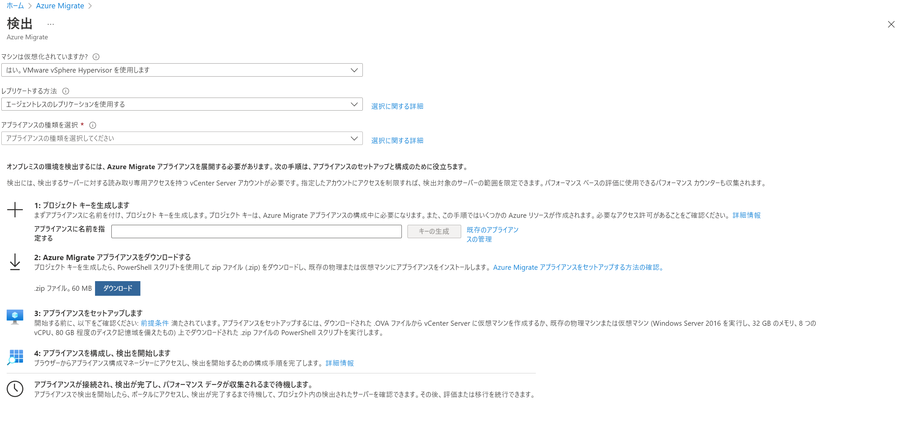

Azure Migrate アプライアンスのデプロイ方法については、公開情報をご参照いただければ幸いです。
https://docs.microsoft.com/ja-jp/azure/migrate/migrate-appliance

上記の画面によりますと、ダウンロードするファイル (OVA ファイルと ZIP ファイル) が異なるため、パブリック エンドポイントを使用する Azure Migrate プロジェクトに登録した Azure Migrate アプライアンスは、
プライベート エンドポイントを使用する Azure Migrate プロジェクトに再登録できないのではないかと読み取れますが、実際そうではありません。
[2. の手順](#2) にて Azure Migrate アプライアンスを切り替えて登録する方法を紹介します。
　
##  2. OVA ファイルから Azure Migrate アプライアンスをデプロイした後、プライベート エンドポイント接続を利用する他の Azure Migrate プロジェクトに再登録する手順
> (注: **既に Azure Migrate アプライアンスが存在するサーバーで実施する場合、既存の構成がクリーンアップされますのでご注意ください。**)

###  2-1. Azure Migrate Project を 2 つ作成します。
  a. Azure Migrate Project 1 : (プロジェクト名 : PublicEndpoint, V2A エージェントレス、パブリックエンドポイント接続)								
  b. Azure Migrate Project 2 : (プロジェクト名 : PrivateEP, V2A エージェントレス、プライベートエンドポイント接続)								
								
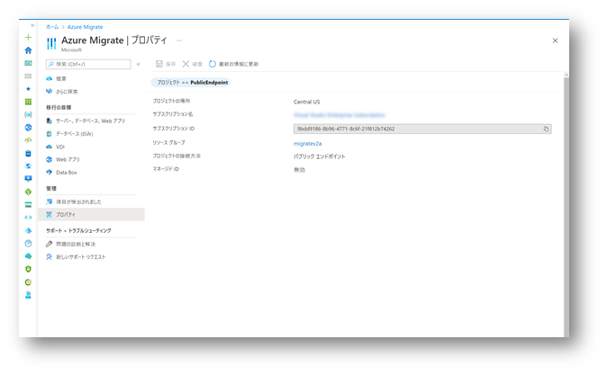

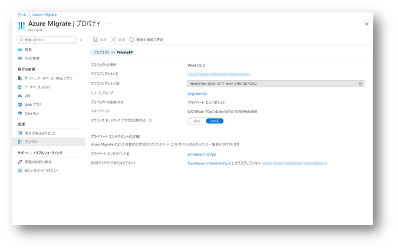

###  2-2. Azure Migrate Project 1 (PublicEndpoint) から OVA ファイルをダウンロードし、Azure Migrate アプライアンスをデプロイします。								
a. ova ファイルは、Azure Portal もしくは 公開情報からダウンロードいただいても問題ございません。								
・アプライアンス - Vmware  - Azure Migrate アプライアンス
https://docs.microsoft.com/ja-jp/azure/migrate/migrate-appliance#appliance---vmware						

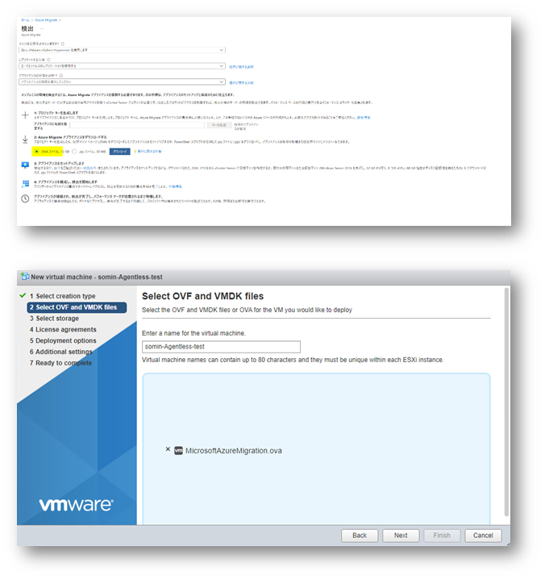
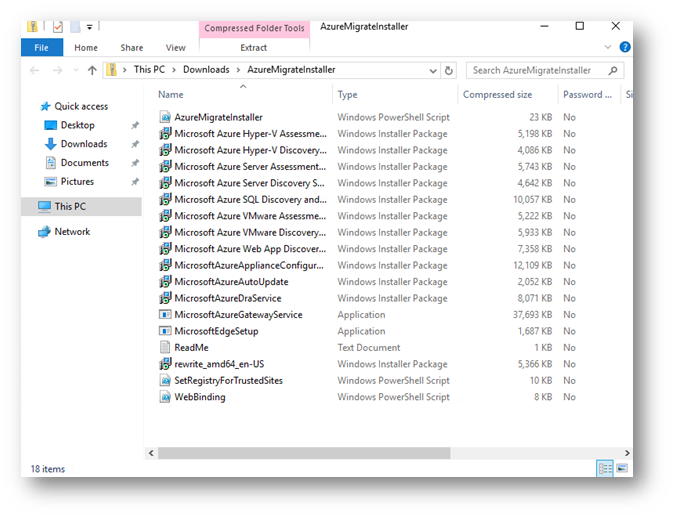

###  2-3. 検証環境は、ova ファイルからデプロイした Azure Migrate アプライアンスを Azure Migrate Project 1 (PublicEndpoint) に登録している状態を前提としています。			
ova ファイルからデプロイした Azure Migrate アプライアンスを Azure Migrate Project 1 (PublicEndpoint) に登録する手順は、割愛させていただきます。				

###  2-4. アプライアンスをホストするサーバー上のフォルダーに インストーラー スクリプトを含んだ ZIP ファイル (AzureMigrateInstaller.zip) を抽出します。
a. インストーラー スクリプトを含んだ ZIP ファイル (AzureMigrateInstaller.zip) 、Azure Portal もしくは公開情報からダウンロードいただいても問題ございません。						
・スクリプトを使用してアプライアンスを設定する
https://docs.microsoft.com/ja-jp/azure/migrate/deploy-appliance-script?msclkid=1eb571a2a5ca11eca56137c5033e85e4

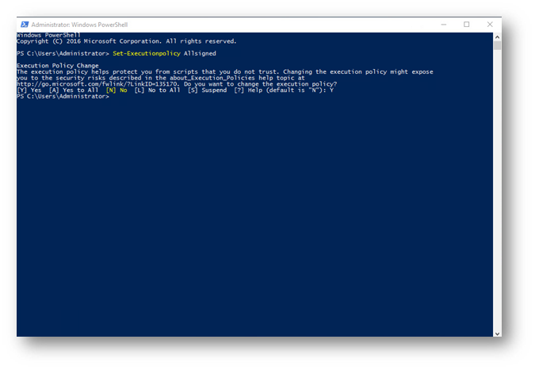

###  2-5. PowerShell スクリプトファイルを実行するため、下記のコマンドを実行します。					
     # Set-Executionpolicy Allsigned

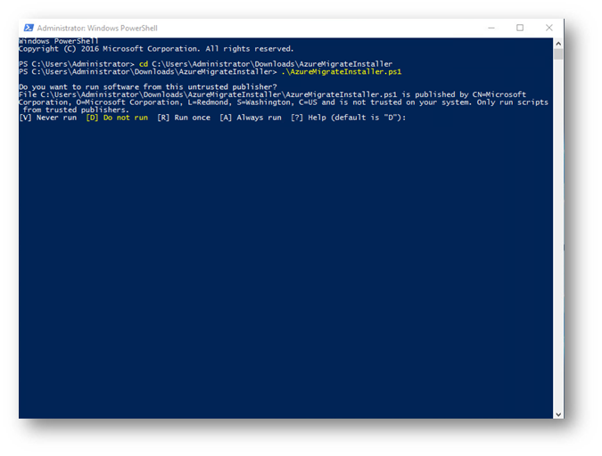

###  2-6. PowerShell ディレクトリを、ダウンロードした ZIP ファイルの内容が抽出されたフォルダーに変更し、下記のコマンドを実行します。		
    # PS C:\Users\administrator\Desktop\AzureMigrateInstaller> .\AzureMigrateInstaller.ps1	

 a. 下記の公開情報の技術の通り、Azure Migrate アプライアンスがすでに設定されているサーバーでスクリプト実行する場合、既存の構成がクリーンアップし、必要な構成の新しいアプライアンスが設定される仕組みとなっています。

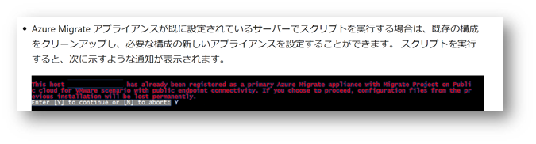

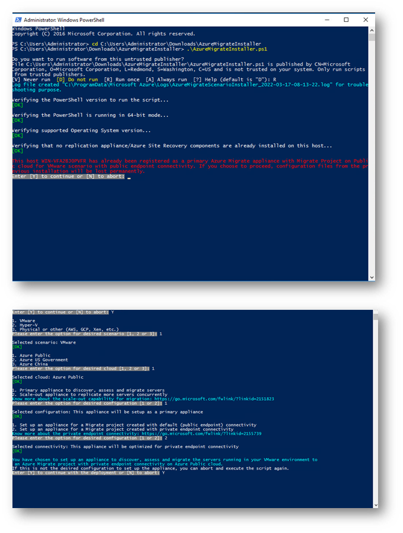

###  2-7. ova ファイルをデプロイした時と同様に、ApplianceConfigurationManager が自動に起動されます。

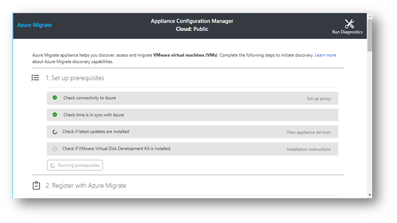

###  2-8. ApplianceConfigurationManager が起動されたら、お客様の環境に合わせて Azure Migrate アプライアンスを Azure Migrate Project 2 (PrivateEndpoint) に登録して頂ければと思います。

a. Azure Migrate アプライアンスは、インターネットに接続する必要がありますので Azure Migrate アプライアンスのサーバーに Proxy が設定されている場合は、
下記の設定を改めてご確認頂ければと思います。

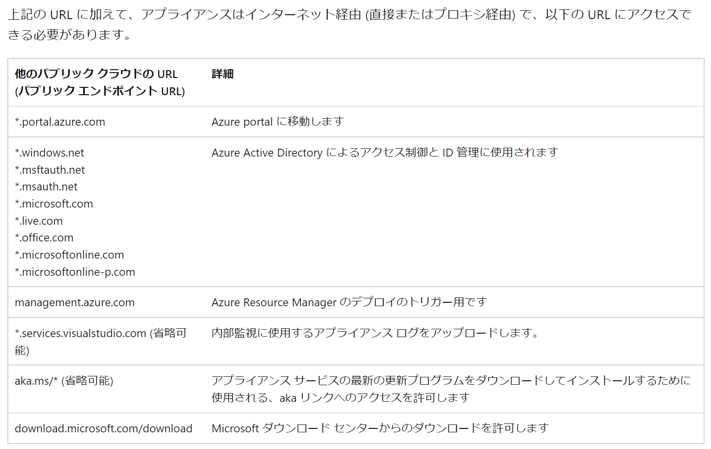

b. ソース環境からプライベート エンドポイントのプライベート IP アドレスを解決するために、追加の DNS 設定が必要になる場合があります。
プライベート IP アドレスが使用できるよう、Azure Migrate プロジェクトの評価ツールのプロパティーから DNS 設定をダウンロードして頂き、
ダウンロードした DNS 設定をオンプレミスの DNS サーバーもしくはアプライアンスの Hosts ファイルへ設定し、プライベート エンドポイントの FQDN の名前解決できるように設定する必要があります。

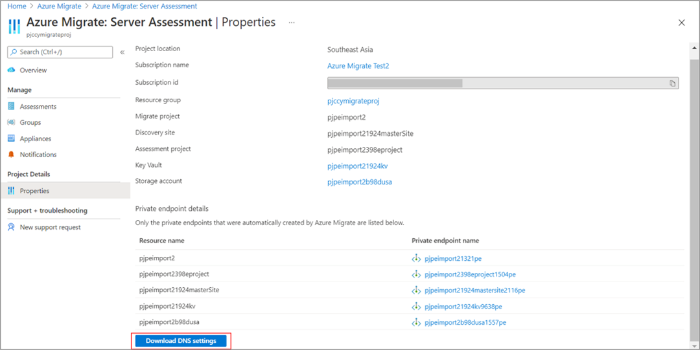
	

c. VM Ware から Azure へ移行する際、エージェント レスやエージェント ベースの方式に関係なく、vCenter Server のアクセス許可が必要となります。

d. プライベート エンドポイントを使用した Azure Migrate の設定手順は下記の公開情報をご参照ください。	
・サポート要件と考慮事項 - プライベート エンドポイントで Azure Migrate を使用する 
https://docs.microsoft.com/ja-jp/azure/migrate/how-to-use-azure-migrate-with-private-endpoints
・パブリック エンドポイント接続を使用して Azure Migrate プロジェクトのデータを ExpressRoute 経由でレプリケートする
https://docs.microsoft.com/ja-jp/azure/migrate/replicate-using-expressroute
・ネットワーク接続に関する問題のトラブルシューティング - Azure Migrate
https://docs.microsoft.com/ja-jp/azure/migrate/troubleshoot-network-connectivity#possible-causes-1

###  2-9. 下記の画面になると、登録完了を意味します。

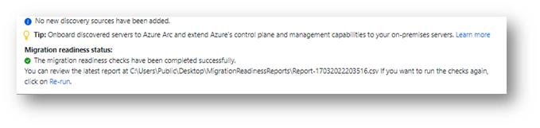

本記事の内容は以上となります。
