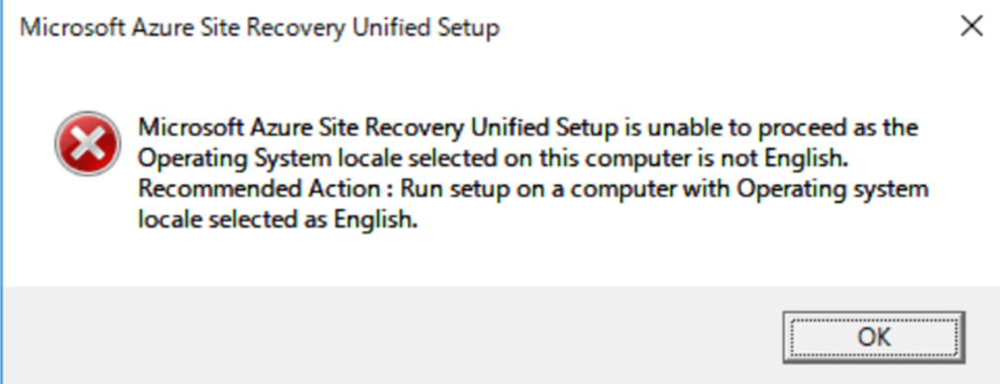

<!-- more -->
皆様こんにちは、Azure Migrate サポートです。
今回は Azure Migrate のエージェントベース シナリオにおける、レプリケーション アプライアンスをデプロイする際の注意事項について説明いたします。

**該当シナリオ**
(シナリオ 1 ) Azure Migrate オンプレミス 物理マシン → Azure への移行 エージェントベース
- マシンを物理サーバーとして Azure に移行する | Microsoft Learn
  https://learn.microsoft.com/ja-jp/azure/migrate/tutorial-migrate-physical-virtual-machines

(シナリオ 2 ) Azure Migrate オンプレミス VMWare VM → Azure への移行 エージェントベース
- VMware vSphere VM を Azure (エージェントベース) に移行する | Microsoft Learn
  https://learn.microsoft.com/ja-jp/azure/migrate/vmware/tutorial-migrate-vmware-agent?context=%2Fazure%2Fmigrate%2Fcontext%2Fmigrate-context


## 目次
-----------------------------------------------------------
[1. レプリケーション アプライアンスの OS について](#1)
[2. 「日本語」で構成されたレプリケーション アプライアンスについて](#2)
[3. その他 - よくある質問](#3)
-----------------------------------------------------------

## <a id="1"></a> 1. レプリケーション アプライアンスの OS について
前提として、エージェントベースによる Azure Migrate 移行の場合、「レプリケーション アプライアンス」の役割を果たすマシンをユーザー側で用意・構成いただく必要があります。
「レプリケーション アプライアンス」用のマシンを用意する際の、要件・サポート マトリックスは下記にまとめられております。

- レプリケーション アプライアンス | Microsoft Learn
  https://learn.microsoft.com/ja-jp/azure/migrate/migrate-replication-appliance

上記公開情報では、オペレーティング システムを [Windows Server 2016 または Windows Server 2012 R2] と記載しておりますが
「Windows Server 2012 R2」は、オンプレミス上のマシンに対する OS サポートは終了しており
万一、OS 観点で何らかの問題が発生して、Azure Migrate 機能が動作しないといった場合に、OS 観点での調査がサポートできない可能性があります。
このため、レプリケーション アプライアンスを新しく用意される際には「Windows Server 2016」にてご用意いただけますと幸いです。

- Windows Server 2012 および 2012 R2 のサポート終了 | Microsoft Learn
  https://learn.microsoft.com/ja-jp/lifecycle/announcements/windows-server-2012-r2-end-of-support

なお、公開情報のレプリケーション アプライアンスの要件は最小要件となっております。
そのため、用意いただいたレプリケーション アプライアンスのサーバーが、公開情報に記載しているすべての要件を満たしていない場合、Azure Migrate としてサポートできかねますことをご了承ください。

## <a id="2"></a> 2. 「日本語」で構成されたレプリケーション アプライアンスについて
レプリケーション アプライアンス用のマシンを用意する際に
- Windows OS をインストールする時点 (OS のイメージ) で、「日本語」のイメージからセットアップした
- OS をインストールする時点で、システム ロケールを「日本語」で設定していた
- マシンの NIC に日本語を使用していた

ようなケースの場合、レプリケーション アプライアンスの後続の設定に失敗する可能性が高くなります。

レプリケーション アプライアンスの要件として、オペレーティング システムのロケールは **英語 (en-us)** となります。
このため、上記のようなケースにおいては、必ず「英語」にて OS イメージの取得・システムロケールの設定・ NIC 情報の設定を行っていただきますようお願いいたします。

> [!NOTE]
> Windows OS をインストールする際に、システム ロケールを「日本語」選択してインストールを完了後に、ロケールやリージョンをあとから英語 (en-us) に変更しているケースがあります。
> このようなケースも、後続のレプリケーション アプライアンスの設定 (MicrosoftAzureSiteRecoveryUnifiedSetup.exe 実行時) にて下記のようなエラー メッセージが発生し、レプリケーション アプライアンスの設定が進まない状況となってしまいます。
> お手数をおかけしますが、OS をインストールする段階から「英語」を選択する必要がありますので、再インストールをお願いいたします。

(エラー メッセージの例)
```
Microsoft Azure Site Recovery Unified Setup is unable to proceed as the Operating System locale selected on this computer is not English.
Recommended Action : Run setup on a computer with Operating system locale selected as English.
```


また、NIC の情報に日本語が含まれている場合も、「MicrosoftAzureSiteRecoveryUnifiedSetup.exe」に実行には成功したものの
後続のレプリケーション アプライアンスのセットアップ作業中に、問題が発生するケースがあります。
例えば、レプリケーション アプライアンスは Azure Migrate の「プロセス サーバー」としての役割も果たしますが、プロキシ サーバーの登録処理が失敗するといった事例があります。

NIC 情報についても「英語」にて設定いただきますようお願いいたします。
ご利用のレプリケーション アプライアンス上で NIC 情報を確認する際には以下のコマンドをご利用ください。

(管理者権限にて PowerShell を立ち上げ、コマンド実行)
`Get-NetAdapter | Format-List -Property *`

- Get-NetAdapter | Microsoft Learn
  https://learn.microsoft.com/ja-jp/powershell/module/netadapter/get-netadapter?view=windowsserver2022-ps


弊社開発部門では、レプリケーション アプライアンスの開発 ~ 一連の動作確認時には、OS インストール時点からシステム ロケール / NIC を「英語」 としている環境上でのみ動作確認を実施しております。
このため、レプリケーション アプライアンスの役割を果たすマシンにおいて **「英語」以外の言語でセットアップされたマシンのシステム ロケールやリージョンを後から「英語」に変更する操作は、弊社開発部門の検証時には想定がされていない操作** となります。


## <a id="3"></a> 3. その他 - よくある質問
### <a id="3-1"></a> Q1. Azure 上にレプリケーション アプライアンスを構築してもよいか？
A1. 技術的には、Azure 上にレプリケーション アプライアンスを構成して、利用することは可能です。
しかし、これまでの事例ですと、「Azure 上にレプリケーション アプライアンスを配置して、オンプレミス上のマシンを Azure Migrate で移行したい」というケースにて
- レプリケーションが非常に遅い
- Azure Migrate の一連の処理がタイムアウトする、非常に時間がかかる

といったお問い合わせを多数いただいております。
このようなトラブルシューティングの際には、弊社からは最終的に 改めてオンプレミス上にレプリケーション アプライアンスを再構築いただくようご依頼することが多くありますので、ご留意ください。

また、何らかの理由で レプリケーション アプライアンスを Azure 上に構成することをご検討の場合、必ず PoC など動作検証をお客様にて実施し、充分に検討いただくますようお願いいたします。