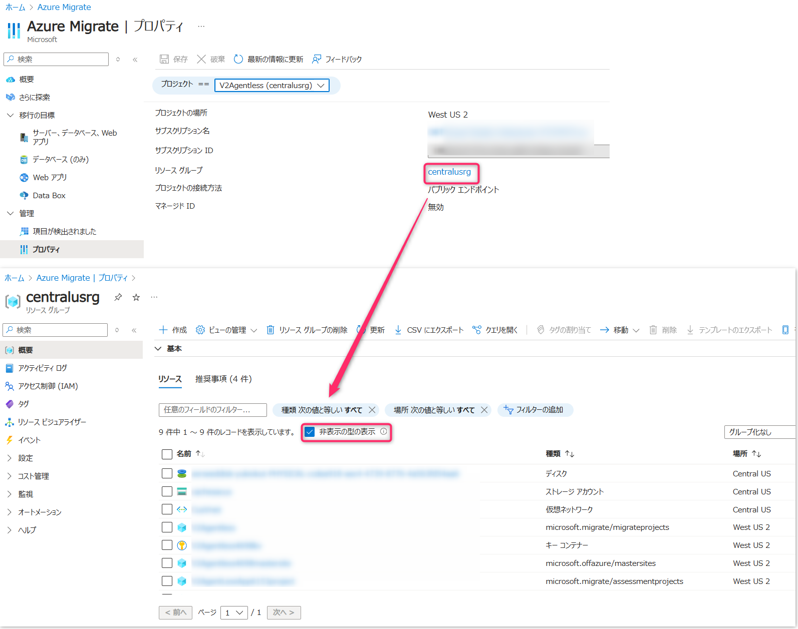
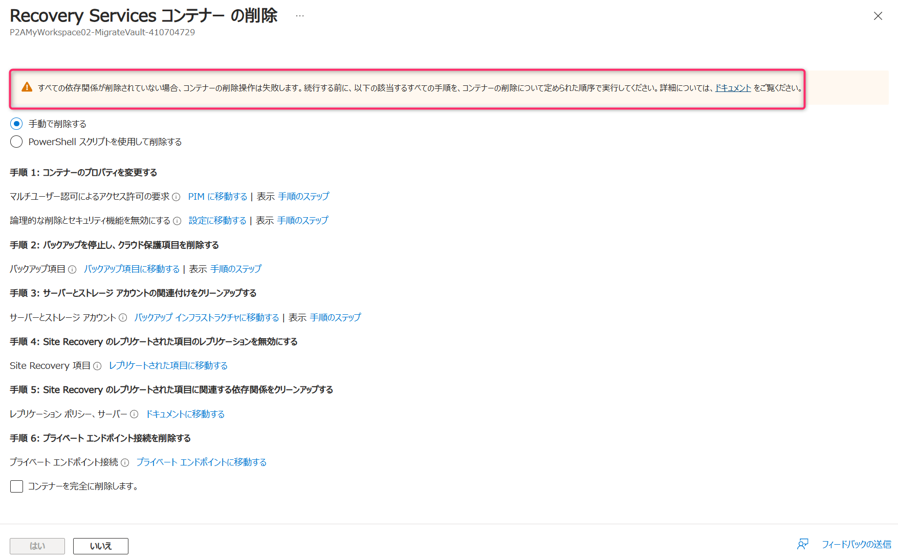
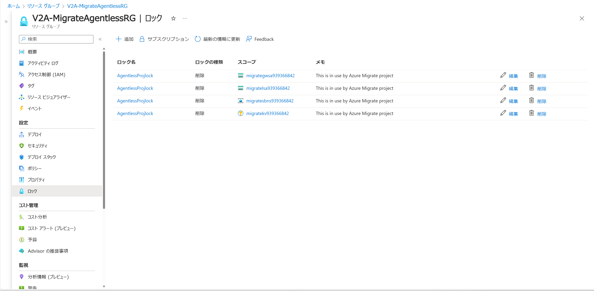

<!-- more -->
みなさんこんにちは、Azure Migrate サポートです。
今回は Azure Migrate 機能を使って Azure へとマシンを移行後、不要となった Recovery Services コンテナーや、関連する Azure リソースを削除するときのポイントを説明します。

## 目次
-----------------------------------------------------------
[ポイント 1 : 削除可能な Azure リソースについて](#1)
[ポイント 2 : Recovery Services コンテナー上の削除作業について](#2)
-----------------------------------------------------------

##  ポイント 1 : 削除可能な Azure リソースについて
Azure Migrate 機能を使って Azure へとマシンを移行後、Azure Migrate 関連のリソースを削除したいという場合には
削除すべき Azure リソースは「Recovery Services コンテナー」リソース以外にも複数あります。
また、以下に挙げるシナリオ例によって、削除対象となる Azure リソースが異なってまいります。
- プライベート エンドポイント経由で Azure へと移行したのか
- 物理マシンを Azure へと移行したのか
- VMWare VM をエージェントレス方式で移行したのか

どのシナリオで、どの Azure リソースが削除対象になるのかは下記ドキュメントにまとめておりますので、シナリオ毎に確認ください。

- (参考) Azure Migrate プロジェクトの削除
  https://learn.microsoft.com/ja-jp/azure/migrate/how-to-delete-project

なお、Azure Migrate 関連の Azure リソースを確認する際には、Azure Migrate プロジェクトのリソース グループ > [非表示の型の表示] をクリックすることで、関連するすべてのリソースが表示されるようになります。

上記の通り、各種リソースの削除が必要となるため、Azure Migrate プロジェクト用にリソース グループを作成することもご検討下さい。
Azure Migrate プロジェクト用にリソース グループを作成することで、Azure Migrate プロジェクトが不要になった際に、各種リソースをリソース グループごと削除できるようになります。

##  ポイント 2 : Recovery Services コンテナー上の削除作業について
Azure Migrate プロジェクトに紐づいている Recovery Services コンテナーを削除する前には、Recovery Services コンテナー上に存在している複数項目の登録解除や削除作業が必要となります。
(先に削除しておかなければ、多くの場合 Recovery Services コンテナーの削除を指示してもエラーとなって Recovery Services コンテナーを削除できません。)

例えば下記作業などが事前に必要となります。
- Recovery Services コンテナーに登録されているレプリケーション ポリシーの削除
- Recovery Services コンテナーに登録されている Hyper-V サイトの削除
- Recovery Services コンテナーに紐づくプライベート エンドポイントの削除

ただし、[PowerShell スクリプトを使用して削除する] をご利用いただく場合は、スクリプトによって
「Recovery Services コンテナー上の関連付け項目の削除」から「Recovery Services コンテナーの削除」まで自動的に行われ、より簡単に削除できます。 

- (参考) Site Recovery Services コンテナーを削除する
  https://learn.microsoft.com/ja-jp/azure/site-recovery/delete-vault

- (参考) ポリシーを編集する | レプリケーション ポリシーの関連付け解除と削除
  https://learn.microsoft.com/ja-jp/azure/site-recovery/vmware-azure-set-up-replication#edit-a-policy

- (参考) VMM サーバーの登録解除
  https://learn.microsoft.com/ja-jp/azure/site-recovery/site-recovery-manage-registration-and-protection#unregister-a-vmm-server

- (参考) Hyper-V サイト上の Hyper-V ホストの登録解除
  https://learn.microsoft.com/ja-jp/azure/site-recovery/site-recovery-manage-registration-and-protection#unregister-a-hyper-v-host-in-a-hyper-v-site

また、Recovery Services コンテナーと関連するリソースに対し、削除のロックがかかっている場合、ロックを解除してから削除する必要があります。
ロックについては、ご利用の Azure Migrate プロジェクトのリソース グループ > ロックからロックされているリソースが確認できます。

Azure Migrate 観点では、移行が完了しており、かつ対象の Recovery Services コンテナーが現在その他のレプリケーション等で使用されていない場合、対象の Recovery Services コンテナーの削除を行っても **移行元VM ・移行先 Azure VM・ネットワークには影響致しません。**
対象の Recovery Services コンテナーが使用されているかどうかの確認 (現在バックアップもしくはレプリケーションが行われているかどうかの確認) は、お客様にてご確認の上、削除の判断をお願いいたします。

本記事の内容は以上となります。
