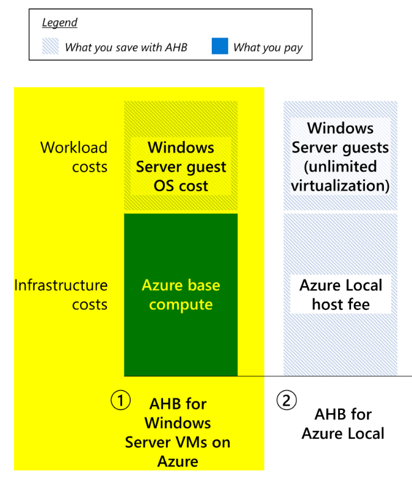

<!-- more -->
みなさんこんにちは、Azure Migrate サポートです。

今回はオンプレミス環境のサーバーを、Azure Migrate / Azure Site Recovery を利用して Azure へ移行した後の、Azure VM 上のライセンスについて説明いたします。

## 目次
-----------------------------------------------------------
[1. Azure VM のライセンスについて](#1)
[2. Azure Migrate による移行時の「ハイブリッド特典」について](#2)
[3. ESU は適用されるのか？](#3)
[4. Azure Migrate 製品宛てへの「ライセンス」に関わるお問い合わせについて](#4)
-----------------------------------------------------------

##  1. Azure VM のライセンスについて
はじめに Azure VM に対する OS ライセンスの価格オプションについて説明します。

**従量課金制 (PAYG-Pay As You Go) とは**
使用するリソースに対して時間単位または月単位で支払う価格オプションです。 
使用した分だけ料金を支払い、必要に応じてスケールアップまたはダウンできます。
これには OS ライセンス料金も含まれており、OS ライセンスを購入することとなります。

**サブスクリプション持ち込み (BYOS-Bring Your Own Subscription) とは**
Azure 仮想マシン上の特定のソフトウェア (RHEL と SLES) に対して、ユーザー側で所有している Red Hat Enterprise Linux (RHEL) サブスクリプション、または SUSE Linux Enterprise Server (SLES) サブスクリプションを Azure に直接持ち込みます。
費用は Azure 上の VM のインフラストラクチャ コストに対してのみ発生します。 

- (参考) Red Hat Enterprise Linux (RHEL) および SUSE Linux Enterprise Server (SLES) 仮想マシンの Azure ハイブリッド特典
  https://learn.microsoft.com/ja-jp/azure/virtual-machines/linux/azure-hybrid-benefit-linux?tabs=ahbRhelPayg%2CahbNewPortal%2CahbExistingPortal%2Clicenseazcli%2CrhelAzcliByosConv%2Crhelazclipaygconv%2Crhelpaygconversion%2Crhelcompliance

**Azure ハイブリッド特典 (Azure Hybrid Benefit) とは**
オンプレミスの OS ライセンスを使用して、Azure 上で Windows/RHEL/SLES 仮想マシン (VM) を割引価格で利用できるという特典です。
例えば、オンプレミスサーバー (OS : Windows) を Azure Migrate 機能を使って移行する場合、Azure ハイブリッド特典を適用することによって、移行された Azure VM の OS のライセンス料金は、 Azure 料金に含まれないようになります。
VM のベース コンピューティング レートのみの支払いで済みます。

- (参考) Windows VMs 向け Azure ハイブリッド特典の検索について
  https://learn.microsoft.com/ja-jp/azure/virtual-machines/windows/hybrid-use-benefit-licensing

- (参考) Windows Server 向け Azure ハイブリッド特典 | Microsoft Learn
  https://learn.microsoft.com/ja-jp/windows-server/get-started/azure-hybrid-benefit?tabs=azure

##  2. Azure Migrate による移行時の「ハイブリッド特典」について
### オンプレミス マシンの OS が Windows の場合
Azure Migrate にて「レプリケート」構成を行う際に「Windows Server のライセンスをお持ちの場合」項目を選択することによって変わってきます。

**「Windows Server のライセンスをお持ちの場合：チェック ON」の場合**
→　「テスト移行 VM」「本移行 VM」どちらにおいても Azure ハイブリッド特典が適用されます。
　　
**「Windows Server のライセンスをお持ちの場合：チェック OFF」の場合**
→　「テスト移行 VM」「本移行 VM」どちらにおいても Azure ハイブリッド特典は適用されません。
　　このため移行された Azure VM は PAYG として、Windows OS ラインセンス料金も課金対象となります。

- (参考) Azure Migrate マシンを物理サーバーとして Azure に移行する
  https://learn.microsoft.com/ja-jp/azure/migrate/tutorial-migrate-physical-virtual-machines#replicate-machines
  "[Azure ハイブリッド特典] で、
  Azure ハイブリッド特典を適用しない場合は、 [いいえ] を選択します。 [次へ] を選択します。
  アクティブなソフトウェア アシュアランスまたは Windows Server のサブスクリプションの対象となっている Windows Server マシンがあり、移行中のマシンにその特典を適用する場合は、 [はい] を選択します。 [次へ] を選択します。"

- (参考) Azure ハイブリッド特典には何が含まれていますか?
  https://learn.microsoft.com/ja-jp/windows-server/get-started/azure-hybrid-benefit?tabs=azure#whats-included-in-azure-hybrid-benefit

### オンプレミス マシンの OS が Linux の場合
Azure Migrate 機能、もしくは Azure Site Recovery 機能を使って、オンプレミスから Azure へと移行した Linux OS は、**全て既定で BYOS となります**。
お客様側で作業をしない限り、PAYG は適用されません。
BYOS から PAYG への変換方法は、下記ドキュメントをご参考下さい。

- (参考) BYOS から PAYG への変換
  https://learn.microsoft.com/ja-jp/azure/virtual-machines/linux/azure-hybrid-benefit-linux?tabs=ahbNewPortal%2CahbExistingPortal%2Clicenseazcli%2CrhelAzcliByosConv%2Crhelazclipaygconv%2Crhelpaygconversion%2Crhelcompliance#byos-to-payg-conversions

- (参考) よく寄せられる質問
  https://learn.microsoft.com/ja-jp/azure/virtual-machines/linux/azure-hybrid-benefit-linux?tabs=ahbRhelPayg%2CahbNewPortal%2CahbExistingPortal%2Clicenseazcli%2CrhelAzcliByosConv%2Crhelazclipaygconv%2Crhelpaygconversion%2Crhelcompliance#frequently-asked-questions
  "Q: オンプレミス (Azure Migrate、Azure Site Recovery、またはそれ以外の方法で) から Azure に独自の RHEL または SLES イメージをアップロードしました。 これらのイメージの課金を BYOS から従量課金制に変換することはできますか?
  A: はい。BYOS 仮想マシンの Azure ハイブリッド特典を使用することで変換が可能です。 この詳細については、こちらを参照してください。
  
  "Q: オンプレミス (Azure Migrate、Azure Site Recovery、またはそれ以外の方法で) から Azure に独自の RHEL または SLES イメージをアップロードしました。 Azure ハイブリッド特典の特典を得るために何かを行う必要がありますか。
  A:いいえ、必要ありません。 アップロードした RHEL または SLES イメージは既に BYOS と見なされており、Azure インフラストラクチャのコストに対してのみ課金されます。 オンプレミス環境の場合と同じように、RHEL サブスクリプションのコストについて責任を負います。"

(2025年 1 月時点 パブリック プレビュー機能)
Azure Migrate の機能を使って Linux OS (RHEL/SLES) のマシンを Azure へと移行したい場合に「Azure ハイブリッド特典を適用するかどうか」をレプリケート構成時に選択できるようになりました。
(該当シナリオ ： 「Azure Migrate VMWare VM → Azure への移行 (エージェントレス) 」と「Azure Migrate Hyper-V → Azure への移行 」のみ)

- (参考) VMware VM を Azure に移行する (エージェントレス) | 前提条件
  https://learn.microsoft.com/ja-jp/azure/migrate/vmware/tutorial-migrate-vmware#prerequisites
  "Linux 用 Azure ハイブリッド特典を使用するには、オペレーティング システムの種類に応じて次の手順を実行します。"

- (参考) Hyper-V VM を Azure に移行する | 前提条件
  https://learn.microsoft.com/ja-jp/azure/migrate/tutorial-migrate-hyper-v?tabs=UI#prerequisites

**「Enterprise Linux ライセンスを持っています：チェック ON」の場合**
→　「テスト移行 VM」「本移行 VM」どちらにおいても BYOS ライセンスとなります ＆ Azure ハイブリッド特典が適用されます。
　　Azure ハイブリッド特典拡張機能がインストールされた Azure VM が作成されます。
　　
**「Enterprise Linux ライセンスを持っています：チェック OFF」の場合**
→　「テスト移行 VM」「本移行 VM」どちらにおいても BYOS ライセンスとなります 

##  3. ESU は適用されるのか？
拡張セキュリティ更新プログラム (ESU) とは、サポート終了後に特定のレガシ Microsoft 製品を実行する必要があるお客様のための最終手段です。
ESU は、Azure Site Recovery もしくは Azure Migrate を使って、オンプレミス上の対象 OS マシンを Azure に移行いただくことで自動的に提供されます。
また、ESU に追加料金はかかりません。

Windows Server 2008/2008 R2 および Windows Server 2012/2012 R2 は、以下のようにライフサイクルが遷移しております。
メインストリーム サポート > 延長サポート > 拡張セキュリティ更新プログラム (ESU) (* 1)

- (参考) Windows Server 用の拡張セキュリティ更新プログラムの概要
  https://learn.microsoft.com/ja-jp/windows-server/get-started/extended-security-updates-overview

Windows Server 2008は、2024 年 1 月 9 日 をもって ESU の提供が終了しております。
このため、可能な限り早急にご使用のバージョンの Windows Server を新しいバージョンに更新することをお勧めします。

また、Windows Server 2012 は、延長サポートが終了し、ESU の提供フェーズとなっています。
ESU は、2026 年 10 月 13 日 に提供を終了します。

- (参考) Windows Server の拡張セキュリティ更新プログラム (ESU) の取得方法
  https://learn.microsoft.com/ja-jp/windows-server/get-started/extended-security-updates-deploy
- (参考) ライフサイクルに関する FAQ - 拡張セキュリティ更新プログラム
  https://learn.microsoft.com/ja-jp/lifecycle/faq/extended-security-updates
  "ESU には、製品の延長サポート終了日から 3 年以内の、緊急* または重要* なセキュリティ更新プログラムが含まれています。"
  "拡張セキュリティ更新プログラムは、利用可能な場合に配布されます。 
   ESU には、新機能、お客様から要求されたセキュリティ以外の更新プログラム、または設計変更要求は含まれておりません。"
  "基盤となる製品に対する一般的なテクニカル サポートおよびトラブルシューティング支援は含まれません。 問題の解決は保証されません。"

##  4. 「ライセンス」に関わるお問い合わせについて
「移行した Azure VM に対してどのようなライセンスが含まれているのか」
「OS ライセンスを変更したいが、手順を教えて欲しい」
といったお問い合わせについては、「Azure Migrate 製品」宛てへとサポート チケットを起票いただきましても、Azure Migrate 製品観点ではご支援が難しい場合が多くあります。
以下、ご参考までにお問い合わせチケット起票先を例として説明しますので、適切な窓口までお問い合わせチケットを起票いただきますようお願いいたします。

### Windows OS の場合
Azure VM 上のライセンス認証、Azure ハイブリッド特典に関わるお問い合わせであれば、Azure VM 製品宛てへとお問い合わせチケットを起票いただけますと幸いです。
なお、お問い合わせ内容によっては「Azure サポート」からのお問い合わせチケット起票では無く
別途、改めて「Windows オンプレミス サポート」からのお問い合わせチケット起票をご依頼する場合もありますので、ご了承ください。

### Azure VM のライセンスが BYOS であり、かつ OS が Linux の場合
OS に関わるお問い合わせについては Azure サポートでは対応できず、OS を提供するベンダーへとお問い合わせいただく必要があります。
例えば OS が RHEL であり、かつ BYOS の場合は、OS に関わるお問い合わせは Red Hat 社へお問い合わせいただく必要があります。
お手数をおかけしますが、対象の OS を提供するベンダー企業へと、お客様にてお問い合わせを行っていただきますようお願いいたします。

### Azure VM のライセンスが PAYG であり、かつ OS が Linux の場合
OS に関わるお問泡についても Azure VM としてサポートが可能です。
ご質問の際には Azure VM 製品宛てへとお問い合わせチケットを起票いただけますと幸いです。

本記事の内容は以上となります。
