<!-- more -->
皆様こんにちは、Azure Backup サポートです。
今回は、HSR に対する Azure Workload Backup を構成するにあたって、実際のバックアップ構成手順を作業例交えてお伝えします。

#### ポイント
- HANA システム レプリケーション (HSR) データベースの仕様上、HANA DB のユーザー名とパスワードは、Primary → Secondary へレプリケートされますが、hdbuserstore の情報（＝つまり、作成したキー情報）はレプリケートされません。
- Azure Backup では、Primary/Seconday すべての ノード 上に対してバックアップ操作をさせるために、ユーザー名/パスワード 入力での操作ではなく、hdbuserstore キーの入力での操作を行う仕組みになっています。
このため、Azure Backup の事前登録スクリプト (msawb-plugin-config-com-sap-hana.sh) を実行する前に、2 種類のキーを Azure Backup 対象となる全ての Azure 仮想マシン上 (ノード上) でも作成する必要があります。
- 下記の公開ドキュメントは必ずご一読の上で、作業ください。
・Azure VM 上の SAP HANA システム レプリケーション データベースをバックアップする
　https://learn.microsoft.com/ja-jp/azure/backup/sap-hana-database-with-hana-system-replication-backup

#### 環境構成
今回は、同一 リージョン・サブスクリプション・VNET 上に 2 つの Azure 仮想マシンを作成し、それぞれ Primary ノード・Secondary ノードとします。

| Azure 仮想マシン名 | 役割 |
|--|--|
| SAPHANA23 | HSR Primary |
| SAPHANA24 | HSR Secondary |

SAP HANA SID： hxe
SAP HANA インスタンス番号： 90
マルチデータベースコンテナー (MDC)

| ユーザー | 概要 | 作成するキー名 |
|--|--|--|
| SYSTEM | システムユーザー | SYSTEM |
| OKTBK | カスタム バックアップ ユーザー 新規で手動作成が必要 任意のユーザーを指定可能| OKTBKKEY |

## 目次 - 手順概略
-----------------------------------------------------------
[1. (Primary マシン上) SYSTEM ユーザーに対してキーを設定する](#1)
[2. (Primary マシン上) カスタム バックアップ ユーザーを作成・パスワード管理・ロールなどの設定を行う](#2)
[3. (Primary マシン上) カスタム バックアップ ユーザーに対してキーを設定する](#3)
[4. (Secondary マシン上) SYSTEM ユーザーに対してキーを設定する](#4)
[5. (Secondary マシン上) カスタム バックアップ ユーザーに対してキーを設定する](#5)
[6. (これまで Azure Backup 構成していた場合)「バックアップの停止」を行う](#6)
[7. (Primary マシン上) 事前登録スクリプトをダウンロード・実行する](#7)
[8. (Secondary マシン上) 事前登録スクリプトをダウンロード・実行する](#8)
[9. Recovery Services コンテナー上で「データベースを検出」「バックアップの有効化」「今すぐバックアップ」を行う](#9)
[10. FAQ](#10)
-----------------------------------------------------------

※　SAP HANA 自体の環境構築・HSR の設定は、Azure Backup とは関りが無いため、すでに HSR 設定が完了している前提で本記事では説明を開始します。
　　記事内の赤文字・青文字などは、ユーザーの環境に依って異なります。

##  1. (Primary マシン上) SYSTEM ユーザーに対してキーを設定する
(参考) 公開ドキュメント - 事前登録スクリプトで実行される処理
https://learn.microsoft.com/ja-jp/azure/backup/tutorial-backup-sap-hana-db#what-the-pre-registration-script-does
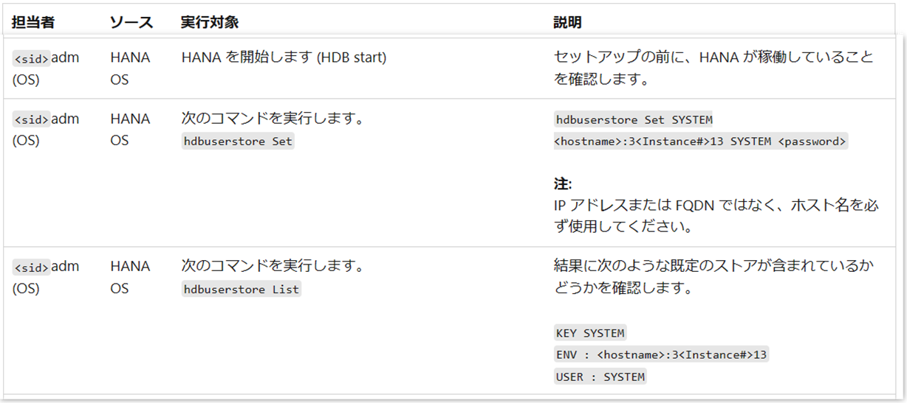

※ 仮想 IP を使用して クラスタ構成・HSR 構成を行っている場合、公開ドキュメントのとおりローカル ホストではなくロード バランサーのホスト/IP を使用してキーを作成してください。
　　今回は、仮想 IP は使用していない前提のコマンド例を記載しています。

HANA DB を立ち上げ、設定します。
(Primary マシン上で実行するコマンド 例)
su hxeadm -
HDB start
hdbuserstore list
この時点では何もキーはありません。
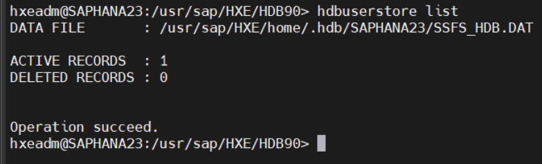

(Primary マシン上で実行するコマンド 例)
hdbuserstore Set SYSTEM saphana23:39013 <キー名> <パスワード>
hdbuserstore list

今回は、SYSTEM ユーザーに対して設定するキーの名前も「SYSTEM」としています。
下図の通り、「SYSTEM」という名前のキーが作成されていることを確認します。
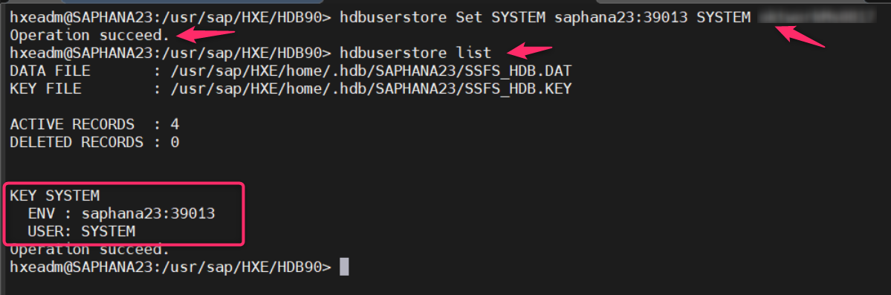

##  2. (Primary マシン上) カスタム バックアップ ユーザーを作成・パスワード管理・ロールなどの設定を行う
・(参考) 事前登録スクリプトを実行する
　https://learn.microsoft.com/ja-jp/azure/backup/sap-hana-database-with-hana-system-replication-backup#run-the-preregistration-script
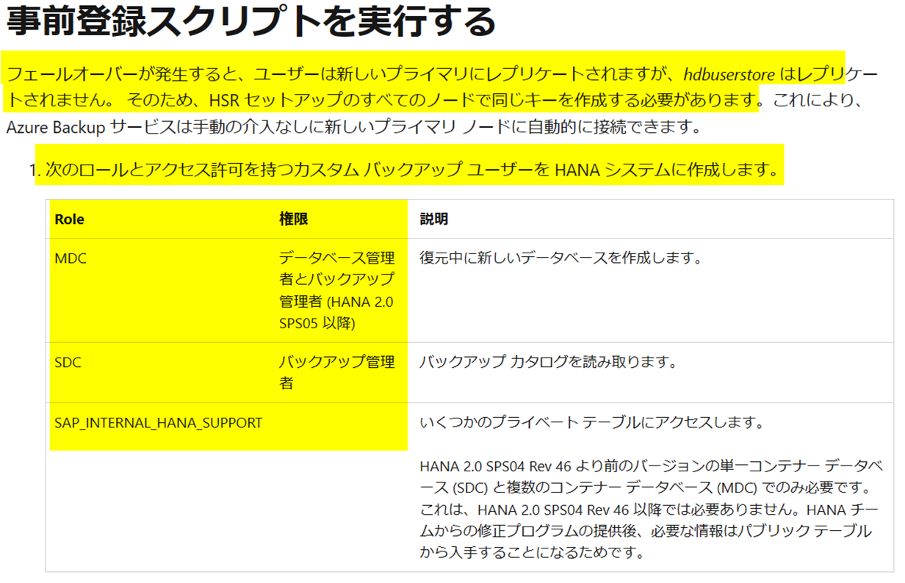

カスタム バックアップ ユーザー名は、特に名前の制約はありません。
今回は例として「OKTBK」という名前のカスタム バックアップ ユーザーを作成します。

(Primary マシン上で実行するコマンド 例)
hdbsql -t -U SYSTEM CREATE USER OKTBK PASSWORD <パスワード> NO FORCE_FIRST_PASSWORD_CHANGE

「-U」の引数として、前段で作成済のキー「SYSTEM」を渡すことで、新しいユーザーをキーを使って作成することができます。
「NO FORCE_FIRST_PASSWORD_CHANGE」句は必須ではありませんが、設定することで、ユーザー「OKTBK」が初めてログインした際に、パスワード変更を求められることが無くなります。
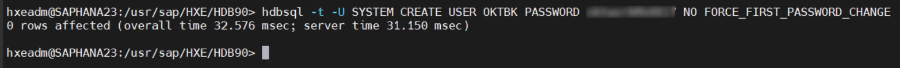

下図は念のため、「USERS」テーブル上にカスタム バックアップ ユーザー「OKTBK」が作成されたことを確認しています。
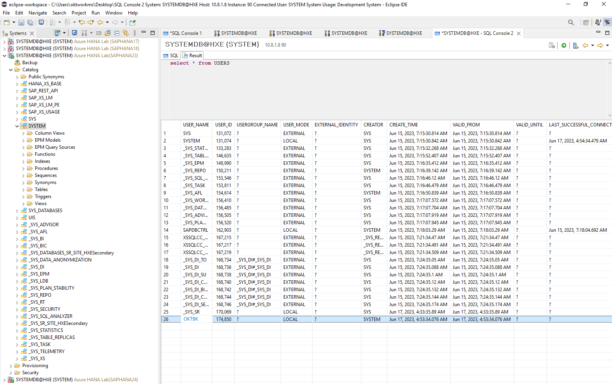

付与すべきロールは公開ドキュメントに記載があるので、今回は SQL を使用してロールを付与していきます。

〇　カスタム バックアップ ユーザー「OKTBK」のパスワードの期限を無効化する
hdbsql -t -U SYSTEM "ALTER USER OKTBK DISABLE PASSWORD LIFETIME"

・(参考) 事前登録スクリプトを実行する
　https://learn.microsoft.com/ja-jp/azure/backup/sap-hana-database-with-hana-system-replication-backup#run-the-preregistration-script
　"このカスタム バックアップ キーのパスワード有効期限が切れると、バックアップと復元操作は失敗します。"

〇　カスタム バックアップ ユーザー「OKTBK」を Activate する
hdbsql -t -U SYSTEM "ALTER USER OKTBK ACTIVATE USER NOW"

〇　カスタム バックアップ ユーザー「OKTBK」に対して「データベース管理者」ロールを付与する
hdbsql -t -U SYSTEM "GRANT DATABASE ADMIN TO OKTBK"

〇　カスタム バックアップ ユーザー「OKTBK」に対して「CATALOG READ（＝バックアップ カタログを読み取れる）」ロールを付与する
hdbsql -t -U SYSTEM "GRANT CATALOG READ TO OKTBK"
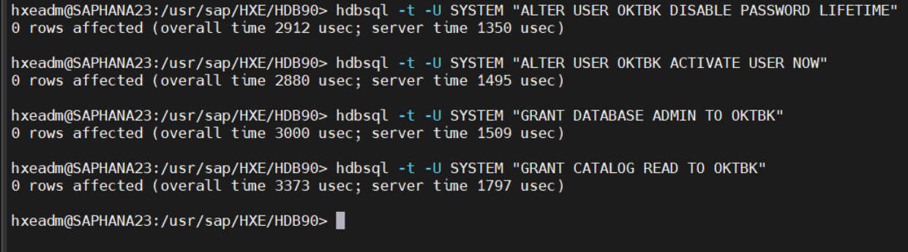

〇　カスタム バックアップ ユーザー「OKTBK」に対して「バックアップ管理者」ロールを付与する
HANA の SPS バージョンが「05」以上であれば「バックアップ管理者」ロールの付与も必要です。
今回の環境だと「SPS ：06」のため、「バックアップ管理者」ロールの付与も必要です。

HDB version
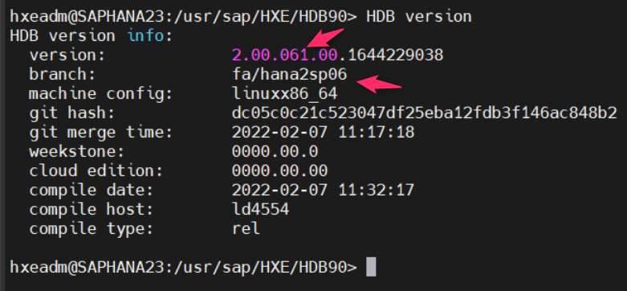

・(外部サイト 参考) GRANT Statement (Access Control) | SAP Help Portal
　https://help.sap.com/docs/SAP_HANA_PLATFORM/4fe29514fd584807ac9f2a04f6754767/20f674e1751910148a8b990d33efbdc5.html 

hdbsql -t -U SYSTEM "GRANT BACKUP ADMIN TO OKTBK"
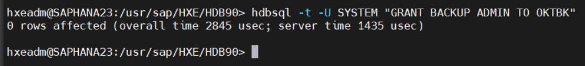

念のためカスタム バックアップ ユーザー「OKTBK」に、現時点で付与されているロールを「GRANTED_PRIVILEGES」テーブルから確認してみます。
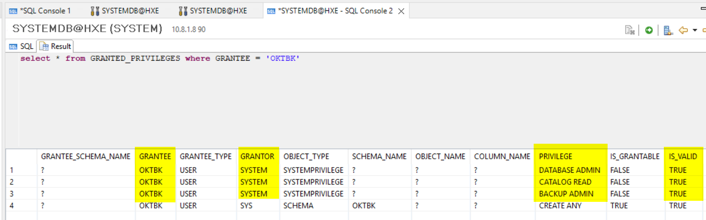

##  3. (Primary マシン上) カスタム バックアップ ユーザーに対してキーを設定する
・(参考) 事前登録スクリプトを実行する
　https://learn.microsoft.com/ja-jp/azure/backup/sap-hana-database-with-hana-system-replication-backup#run-the-preregistration-script
　"カスタム バックアップ ユーザーの hdbuserstore にキーを追加します。これにより、HANA バックアップ プラグインですべての操作 (データベース クエリ、復元操作、構成、バックアップの実行) を管理できるようになります。"

(実行するコマンド)
hdbuserstore Set <作成するキー名> <作成先HANA DB のホスト名>:3<インスタンス番号>13 <カスタム バックアップ ユーザー名> <カスタム バックアップ ユーザーのパスワード>

※ 仮想 IP を使用して クラスタ構成・HSR 構成を行っている場合、公開ドキュメントのとおりローカル ホストではなくロード バランサーのホスト/IP を使用してカスタム バックアップ キーを作成してください。
　　今回は、仮想 IP は使用していない前提のコマンド例を記載しています。

(Primary マシン上で実行するコマンド 例)
hdbuserstore Set OKTBKKEY saphana23:39013 OKTBK <パスワード>

キーが作成されているかどうかを確認します。
hdbuserstore list
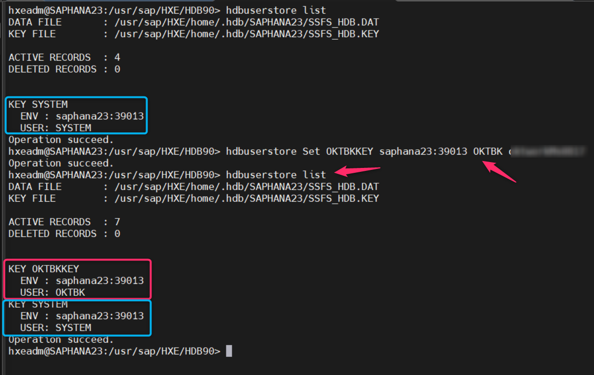

##  4. (Secondary マシン上) SYSTEM ユーザーに対してキーを設定する
Primary マシン上で、SYSTEM ユーザーに対して設定したものと同じキー名のキーを作成・設定します。

※ 仮想 IP を使用して クラスタ構成・HSR 構成を行っている場合、公開ドキュメントのとおりローカル ホストではなくロード バランサーのホスト/IP を使用してキーを作成してください。
　　今回は、仮想 IP は使用していない前提のコマンド例を記載しています。

(Secondary マシン上で実行するコマンド 例)
hdbuserstore Set SYSTEM saphana24:39013 SYSTEM <パスワード>
hdbuserstore list
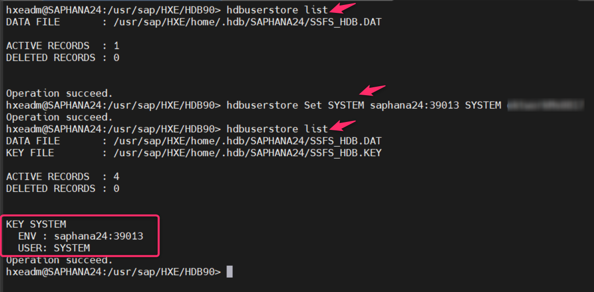

##  5. (Secondary マシン上) カスタム バックアップ ユーザーに対してキーを設定する
（補足）
Primary マシン上で作成したカスタム バックアップ ユーザーとそのパスワードは、HSR の機能によって、自動的に Secondary マシンへレプリケートされます。
このためすでに HSR 設定済であれば Secondary マシン上では再度「カスタム バックアップ ユーザーの作成」を行う必要はありませんが、この段階でもし HSR 設定が完了しておらず、レプリケートしていない場合は、ユーザーにて Secondary マシン上にも再度「カスタム バックアップ ユーザーの作成」から作業ください。
ここでは、すでに HSR 機能にてカスタム バックアップ ユーザーはレプリケートされている前提で、Secondary マシン上での「カスタム バックアップ ユーザーの作成」部分はスキップします。

※ 仮想 IP を使用して クラスタ構成・HSR 構成を行っている場合、公開ドキュメントのとおりローカル ホストではなくロード バランサーのホスト/IP を使用してカスタム バックアップ キーを作成してください。
　　今回は、仮想 IP は使用していない前提のコマンド例を記載しています。

(実行するコマンド)
hdbuserstore Set <作成するキー名> <作成先HANA DB のホスト名>:3<インスタンス番号>13 <カスタム バックアップ ユーザー名> <カスタム バックアップ ユーザーのパスワード>

(Secondary マシン上で実行するコマンド 例)
hdbuserstore Set OKTBKKEY saphana24:39013 OKTBK <パスワード>
hdbuserstore list
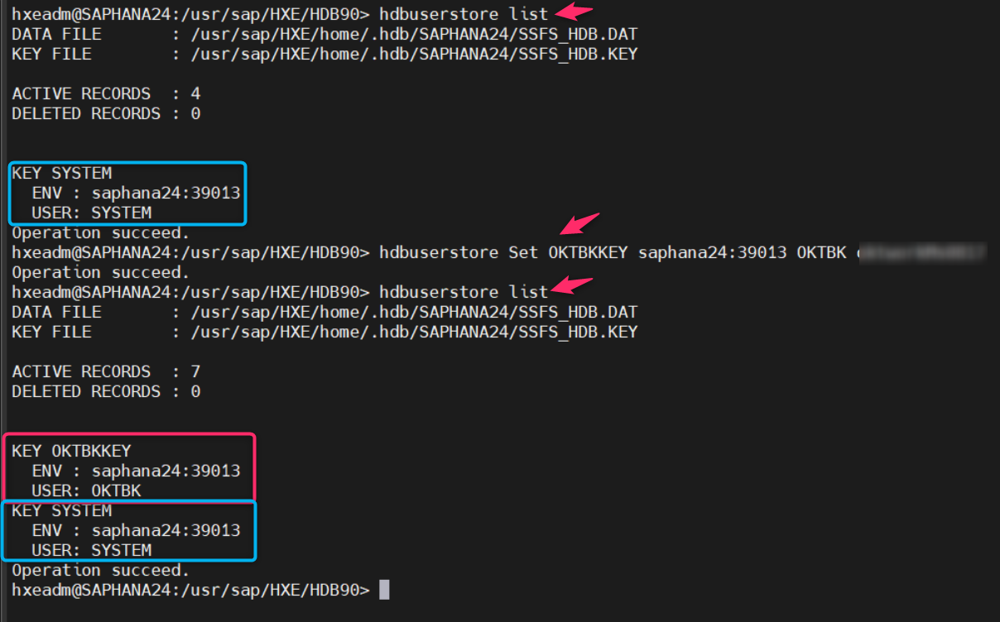

##  6. (これまで Azure Backup 構成していた場合)「バックアップの停止」を行う
『これまで スタンドアロンの SAP HANA DB として、Azure workload Backup を構成していた』
という場合、対象の SAP HANA DB は今後「HSR に対する Azure Workload Backup」としてバックアップ構成しなおすことになります。
このため、一度、これまでバックアップ取得していたスタンドアロンの SAP HANA DB に対しては
「バックアップ データの保持」・「バックアップの停止」を行ってください。

・(参考 「バックアップの停止」部分まで) 2 つのスタンドアロン VM/1 つのスタンドアロン VM が Azure VM 上の SAP HANA Database バックアップを使用して既に保護されている
　https://learn.microsoft.com/ja-jp/azure/backup/sap-hana-database-with-hana-system-replication-backup#two-standalone-vms-one-standalone-vm-already-protected-using-sap-hana-database-backup-on-azure-vm

『これまで一度も、対象 DB に対して Azure Workload Backup を構成したことが無い』
『今回初めて HSR 構成・HSR に対する Azure Workload Backup を行う』
という場合は、「6」手順はスキップし、「7. (Primary マシン上) 事前登録スクリプトをダウンロード・実行する」より作業を再開ください。

##  7. (Primary マシン上) 事前登録スクリプトをダウンロード・実行する
・(参考) 事前登録スクリプトを実行する
　https://learn.microsoft.com/ja-jp/azure/backup/sap-hana-database-with-hana-system-replication-backup#run-the-preregistration-script

(ルートユーザーで実行するコマンド)
./msawb-plugin-config-com-sap-hana.sh -sn -bk <カスタム バックアップ ユーザー向けに作成したキー名> -hn (HSR ID)

【引数の説明】
■　-sn ( --skip-network-checks )： ネットワーク要件を満たしているかどうかのチェック処理をスキップしたい場合、追加ください
■　-bk ( -backup-key )：カスタム バックアップ ユーザー向けに作成したキー名を引数として渡してください
■　-hn (--hsr-unique-value)：HSR ID。Recovery Services コンテナー上での論理名を引数として渡します。この値はユーザーにて自由に決定ください

・(コマンド引数の参考) 事前登録スクリプトを実行する
　https://learn.microsoft.com/ja-jp/azure/backup/sap-hana-database-with-hana-system-replication-backup#run-the-preregistration-script 
　"このカスタム バックアップ ユーザー キーを、パラメーターとしてスクリプトに渡します。
　 -bk CUSTOM_BACKUP_KEY_NAME または -backup-key CUSTOM_BACKUP_KEY_NAME"

そのほか引数の説明は、事前登録スクリプト内に詳しく記載されています。

今回は例として「Hana2324LC」を HSR ID として、バックアップ構成します。

(Primary マシン上で実行するコマンド 例)
sudo su -
chmod 755 msawb-plugin-config-com-sap-hana.sh
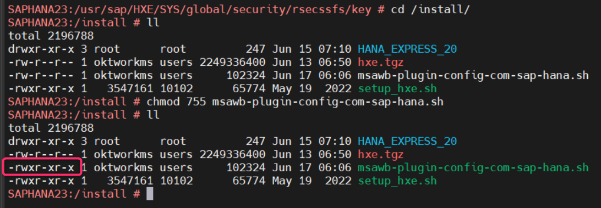

./msawb-plugin-config-com-sap-hana.sh -sn -bk OKTBKKEY -hn Hana2324LC
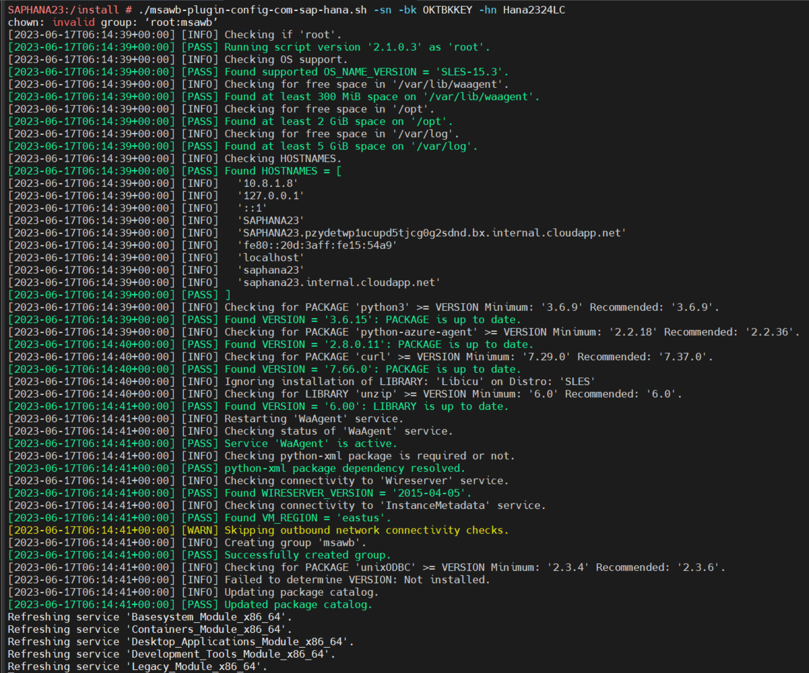

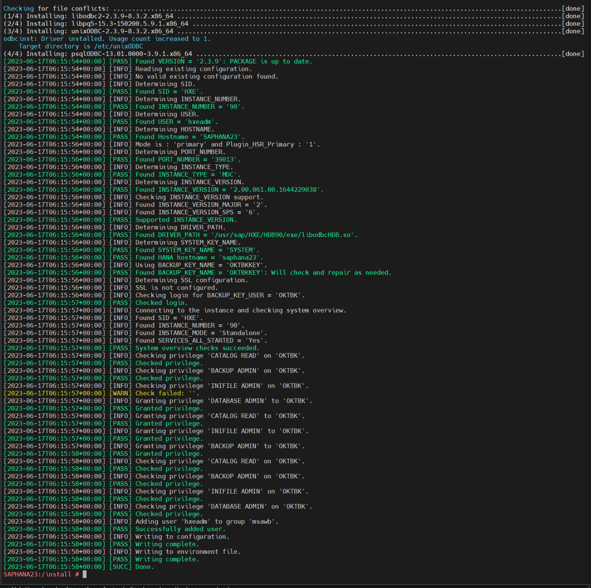

事前登録スクリプト実行完了後、下記 ファイル上で、Azure Backup 構成における HSR ID やカスタム バックアップ ユーザーの設定値を確認できます。

(Primary マシン上で実行するコマンド 例)
cat /opt/msawb/etc/config/SAPHana/config.json
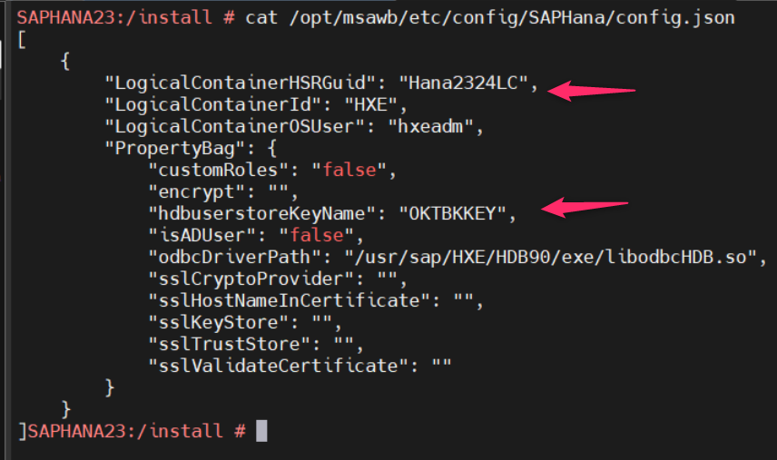

Primary 側で事前登録スクリプトを実行後、カスタム バックアップ ユーザーに対して、「INIFILE ADMIN」ロールなどが追加付与されていることが分かります。
(事前登録スクリプトにて追加付与されました)
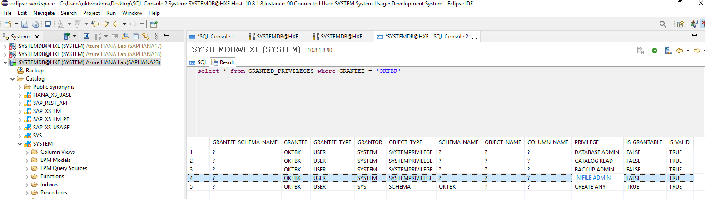

##  8. (Secondary マシン上) 事前登録スクリプトをダウンロード・実行する
「-hn」引数に渡す、一意の HSR ID は、必ず Primary 側にて設定したものとおなじ HSR ID にしてください。

(ルートユーザーで実行するコマンド)
./msawb-plugin-config-com-sap-hana.sh -sn -bk <カスタム バックアップ ユーザー向けに作成したキー名> -hn (HSR ID) -p <ポート番号>

・(参考) 事前登録スクリプトを実行する
　https://learn.microsoft.com/ja-jp/azure/backup/sap-hana-database-with-hana-system-replication-backup#run-the-preregistration-script 
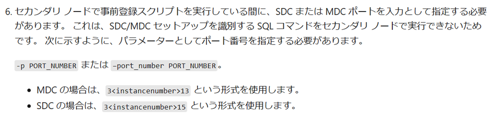

(Secondary マシン上で実行するコマンド 例)
sudo su -
./msawb-plugin-config-com-sap-hana.sh -sn -bk OKTBKKEY -hn Hana2324LC -p 39013 
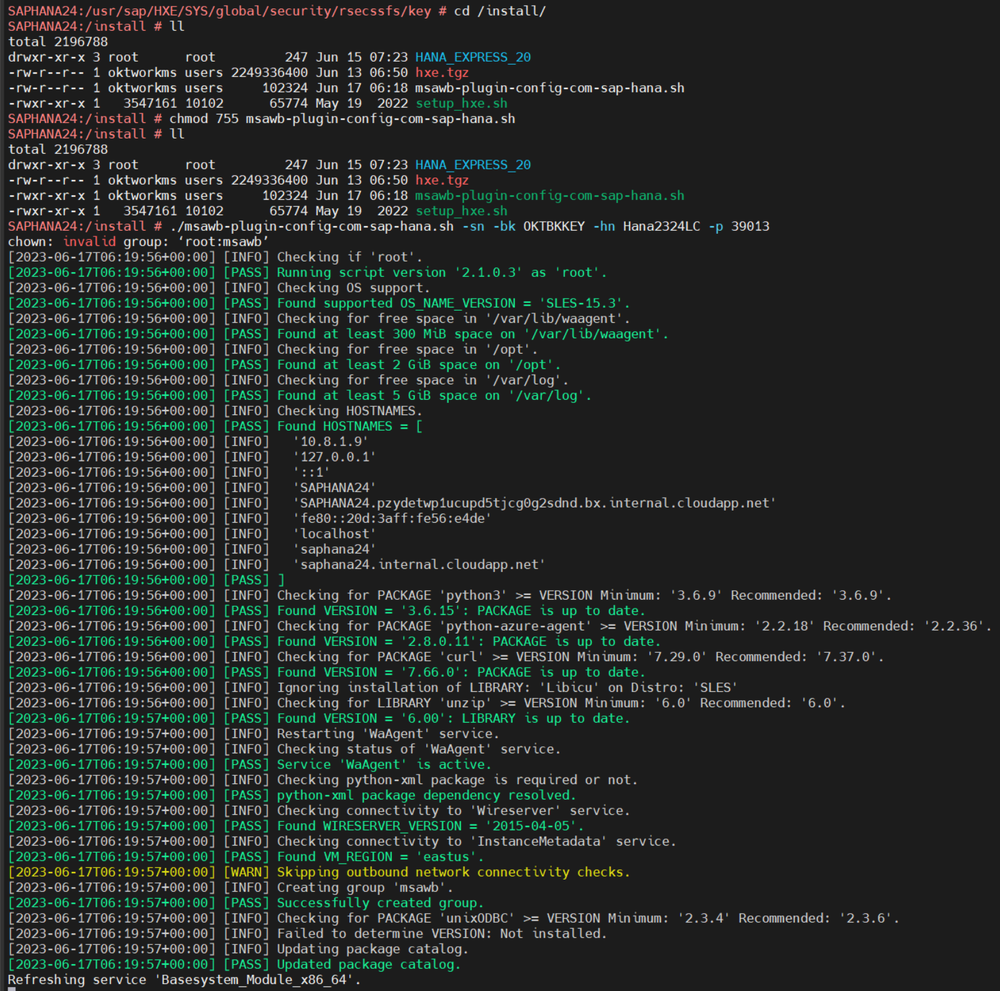

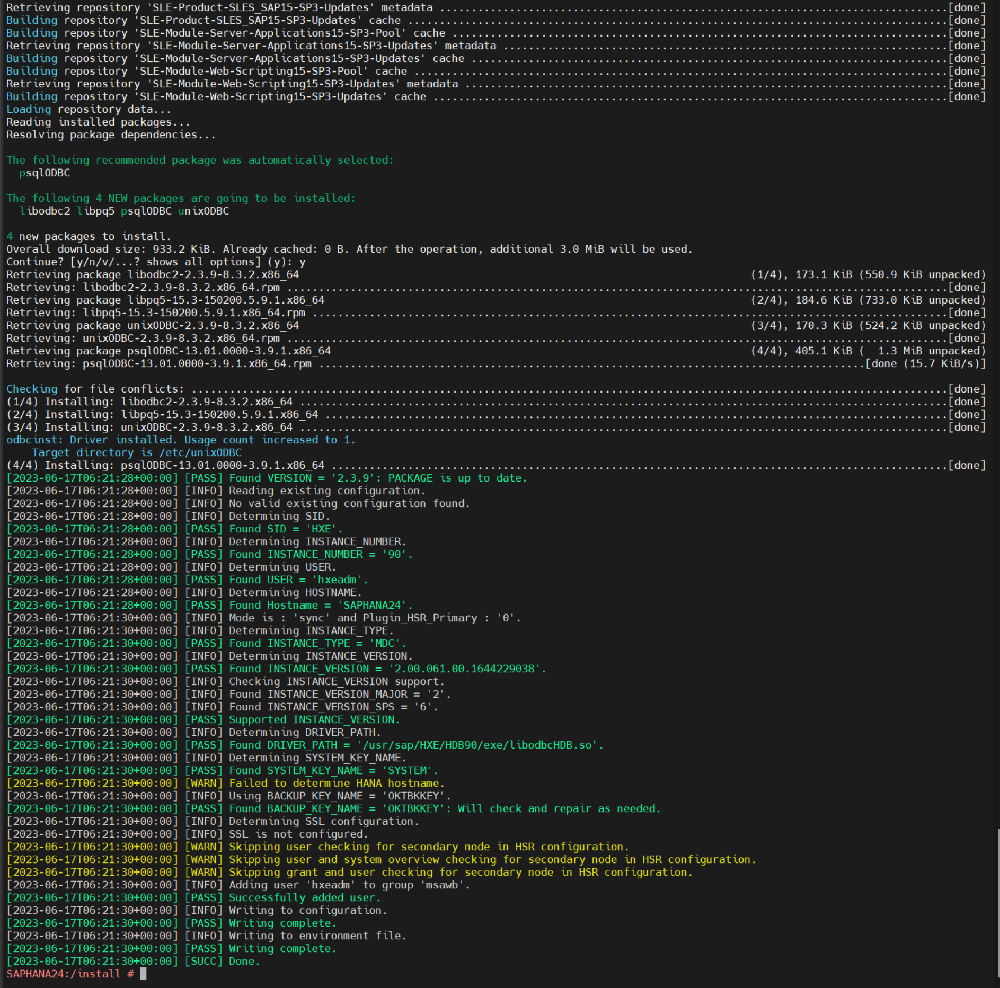

cat /opt/msawb/etc/config/SAPHana/config.json
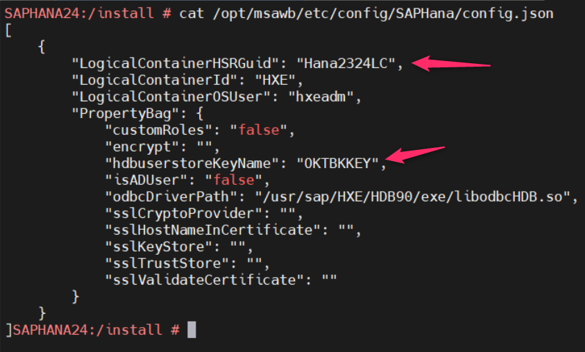

##  9. Recovery Services コンテナー上で「データベースを検出」「バックアップの有効化」「今すぐバックアップ」を行う
ここからは下記公開ドキュメントに沿って、Azure ポータル画面上で操作ください。

・データベースを検出する
　https://learn.microsoft.com/ja-jp/azure/backup/sap-hana-database-with-hana-system-replication-backup#discover-the-databases

(英語版となり恐縮ですが) Azure ポータル画面上の作業例です
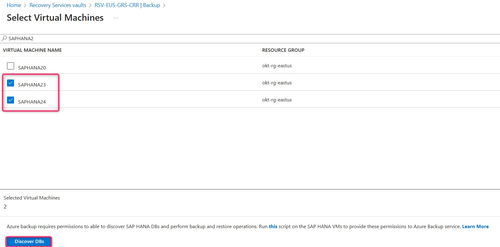

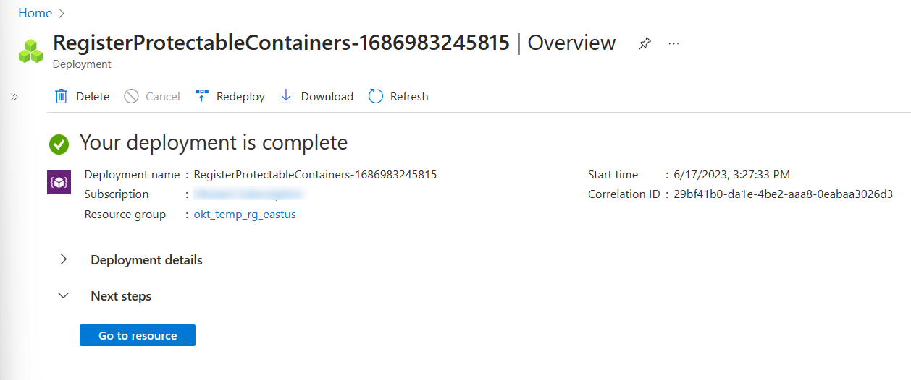

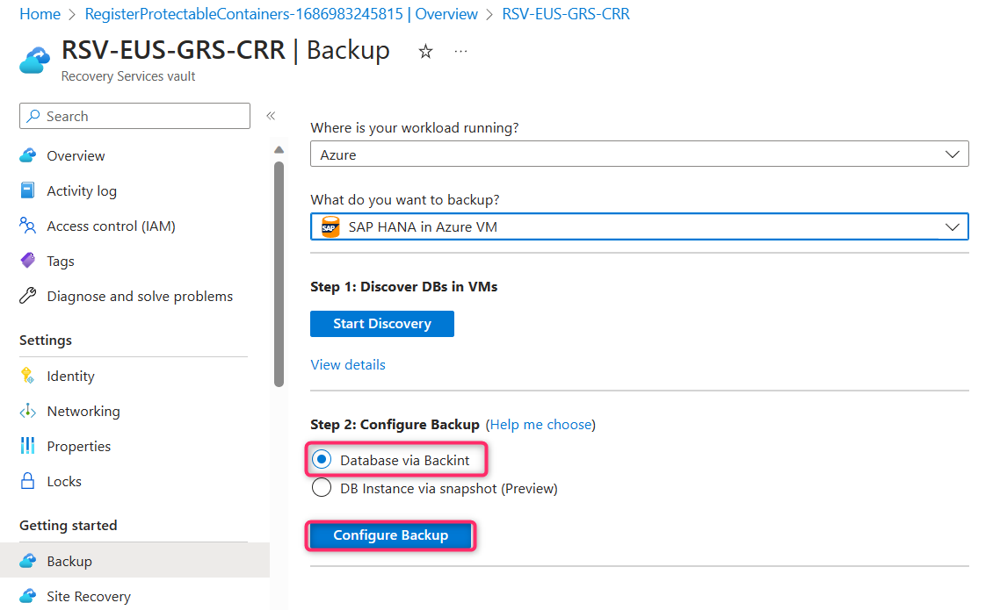

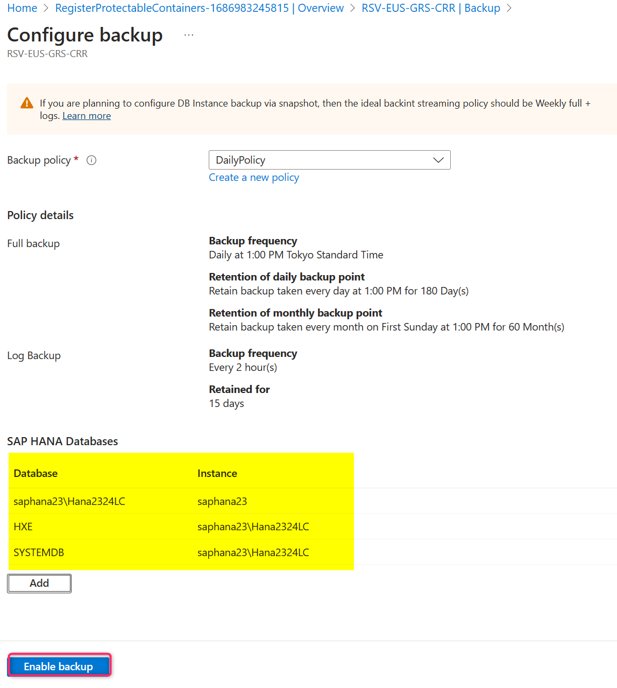

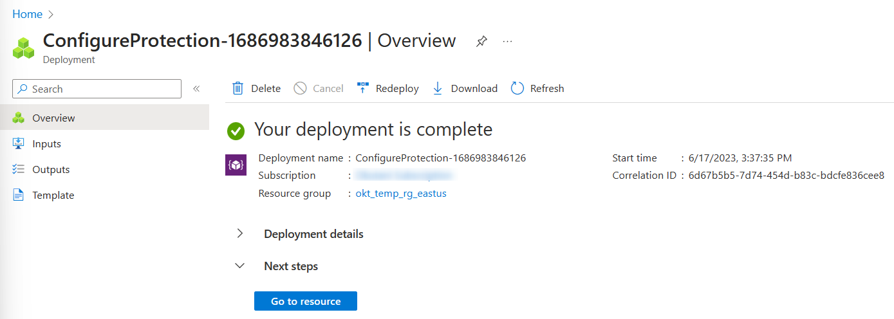

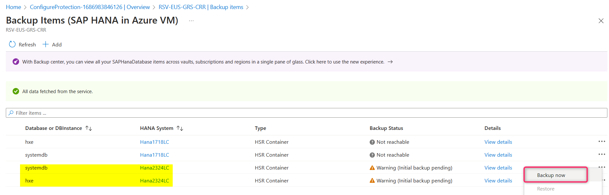

(バックアップ取得後)
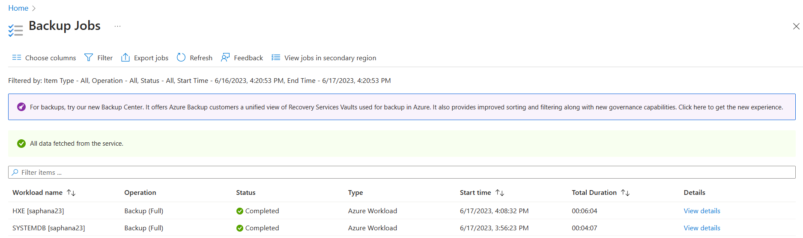

##  10. FAQ
### Q1. HSR 構成に伴い、クラスタ ソフトウェアは Pacemaker, Lifekeeper など制限はありますか？
A1. 「HSR に対する Azure Workload Backup」の観点においては、クラスタ ソフトウェアの制限はありません。
ユーザー側にて HSR を構成し、HSR が機能しているのであれば、 Azure Backup としてはバックアップ取得が可能です。

### Q2. 事前登録スクリプトを実行する前に、HANA 側で HSR 設定を完了しておく必要はありますか？
A2. いいえ、下記順序でも構いません。
　事前登録スクリプト実行
　　↓
　HSR 構成
　　↓
　「データベースを検出」「バックアップの有効化」バックアップ取得

・Azure Backup のデータベースで SAP HANA ネイティブ クライアント バックアップを実行する
　https://learn.microsoft.com/ja-jp/azure/backup/sap-hana-database-with-hana-system-replication-backup#run-sap-hana-native-clients-backup-on-a-database-with-azure-backup

### Q3. HANA Studio からバックアップ・復元操作はできますか？
A3. いいえ、HSR に対する Azure Workload Backup 構成をしている場合は、HANA Studio からの操作はサポートいたしておりません。

・(参考) SAP HANA ネイティブ クライアントを使用して操作を管理する
　https://learn.microsoft.com/ja-jp/azure/backup/sap-hana-database-manage#manage-operations-using-sap-hana-native-clients
　"HANA ネイティブ クライアントは、Backint ベースの操作用のみに統合されています。 
　　スナップショットと HANA システム レプリケーション モードに関連する操作は、現在サポートされていません。"

HSR に対する Azure Workload Backup の設定方法は以上となります。