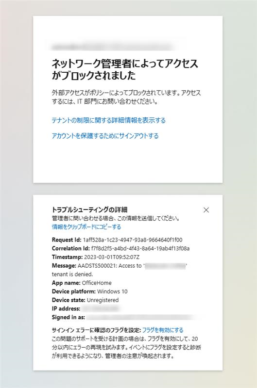

<!-- more -->
みなさんこんにちは、Azure Backup サポートです。
 
MARS バックアップや SQL Server バックアップなどのバックアップにおいて、お客様によってはバックアップや復元で使用する通信がプロキシを経由する構成とされていることがあります。 
ご利用のプロキシでテナント制限の構成をしている場合、Microsoft Entra ID (旧称 Azure Active Directory) への通信ができず、バックアップ対象のサーバーからバックアップサービス利用のための Azure 認証が失敗することで、バックアップの有効化をはじめとした各種操作ができないことがあります。 
 
このブログでは、バックアップ対象のサーバーのプロキシ環境でテナント制限をしている場合のバックアップの失敗について、テナント制限が原因でバックアップが失敗しているかの判断方法と対応方法について記載してます。

## 目次 
-----------------------------------------------------------
[1. テナント制限とは](#1)
[2. テナント制限されている場合の判断方法について (Azure Portal へのログインによる確認)](#2)
[3. テナント制限されている場合の判断方法について (Backup のログからの確認)](#3)
[4. 回避策について](#4)
-----------------------------------------------------------

##  1.  テナント制限とは
以下のブログ引用に記載がございますが、テナント制限をすることでプロキシを経由した通信について特定の Microsoft Entra ID テナント以外のアクセスが制限されます。　

・ブログ引用
>テナント制限の機能では、ユーザーがアクセス可能な Azure AD テナントを制限することが可能です。 
具体的には、クライアント端末から Azure AD に対する認証の通信をプロキシ経由させ、そのプロキシから送信されるデータに許可対象の Azure AD テナントの情報を付与します。その結果、それ以外の Azure AD テナントへのアクセスがブロックされる動作となります。

・テナント制限とは | テナント制限について 
https://jpazureid.github.io/blog/azure-active-directory/tenant-restriction/#%E3%83%86%E3%83%8A%E3%83%B3%E3%83%88%E5%88%B6%E9%99%90%E3%81%A8%E3%81%AF

##  2．テナント制限されている場合の判断方法について (Azure Portal へのログインによる確認) 
バックアップ対象のサーバーから Azure Potal を利用しテナント制限によって許可されていないテナントへアクセスを試行すると、 「ネットワーク管理者によってアクセスがブロックされました」という以下のようなエラーメッセージが表示されます。 (エラーコード: AADSTS500021) 
このメッセージを確認できた場合、テナント制限によりサーバーからのテナントアクセスが制限されていると判断できます。

・テナント制限とは | テナント制限について
https://jpazureid.github.io/blog/azure-active-directory/tenant-restriction/#%E3%83%86%E3%83%8A%E3%83%B3%E3%83%88%E5%88%B6%E9%99%90%E3%81%A8%E3%81%AF
 
以下のドキュメント引用からもテナント制限されている場合に出力されるエラーコードであることがわかります。

・ドキュメント引用
>AADSTS500021 
'{tenant}' テナントへのアクセスが拒否されました。 AADSTS500021 は、テナント制限機能が構成されており、ユーザーが、ヘッダー Restrict-Access-To-Tenant で指定されている許可されたテナントの一覧にないテナントにアクセスしようとしていることを示します。 

・Microsoft Entra 認証と承認のエラー コード
https://learn.microsoft.com/ja-jp/azure/active-directory/develop/reference-error-codes

##  3．テナント制限されている場合の判断方法について (Backup のログからの確認)
バックアップ対象のサーバーのログからもテナント制限されているか確認することができます。
各ログに「AADSTS500021」の文字列がある場合、テナント制限されていると判断できます。

以下にログファイル名とログが格納されるディレクトリをご案内します。
(ログが格納されるディレクトリは既定の設定の場合を示しています)

#### ＜Azure Backup for SQL in VM の場合＞ 
・ログファイル名 
　WorkloadExtensionHandlerXX.log 
・ディレクトリ 
　WindowsAzure\Logs\Plugins\Microsoft.Azure.RecoveryServices.WorkloadBackup.AzureBackupWindowsWorkload\バージョン\WorkloadExtnLogFolder 
・エラー出力例 
>Microsoft.IdentityModel.Clients.ActiveDirectory.AdalServiceException:
　AADSTS500021: Access to 'IDMAADTenantjpepod01' tenant is denied.

#### ＜Microsoft Azure Recovery Services (MARS) の場合＞
・ログファイル名 
　CBEngine XX.errlog 
・ディレクトリ 
　C:\Program Files\Microsoft Azure Recovery Services Agent\Temp 
・ディレクトリ(MABS) 
　C:\Program Files\Microsoft Azure Backup Server\DPM\MARS\Microsoft Azure Recovery Services Agent\Temp\ 
・エラー出力例 
>WARNING Exception in GetAADToken | Params: {Data = }{Message = AADSTS500021: Access to 'IDMAADTenantjpepod01' tenant is denied.

##  4．回避策について
バックアップが失敗している対象サーバーから「AADSTS500021」のメッセージが出力されている場合、テナント制限が原因でバックアップが失敗している可能性がございます。 
ご利用のプロキシ環境において、以下テナントへのアクセス許可設定についてご確認ください。 

Azure Backup では、O365 の以下のテナントに接続が必要です。
以下は、バックアップ利用の際に使用されるテナントになります。
 
IDMServiceAADTenant<リージョン>pod01.onmicrosoft.com
 
お客様の環境のリージョンに合わせて、以下テナントのアクセスを許可してください。
※現時点でテナント名やテナント ID の公開情報はないため、以下のリージョン以外のテナント名やテナント ID の確認がご希望の場合、Azure Backup の窓口へお問い合わせをお願いいたします。
 
#### ＜東日本リージョンの Azure Backup のテナント情報＞
テナント名 : IDMServiceAADTenantjpepod01.onmicrosoft.com
テナント ID : 6e92595a-0b9c-49e4-a1e9-884d0ab4f4f0
 
#### ＜西日本リージョンの Azure Backup のテナント情報＞
テナント名 : IDMAADTenantjpwpod01.onmicrosoft.com
テナント ID : 4617fbbe-e76e-4071-90cd-6f5e7f5d5244

>備考：
テナント制限の操作に関してご確認したい場合、Entra ID のお問合せをお願いいたします。
専門のエンジニアが対応することで円滑で正確な対応が可能となります。
