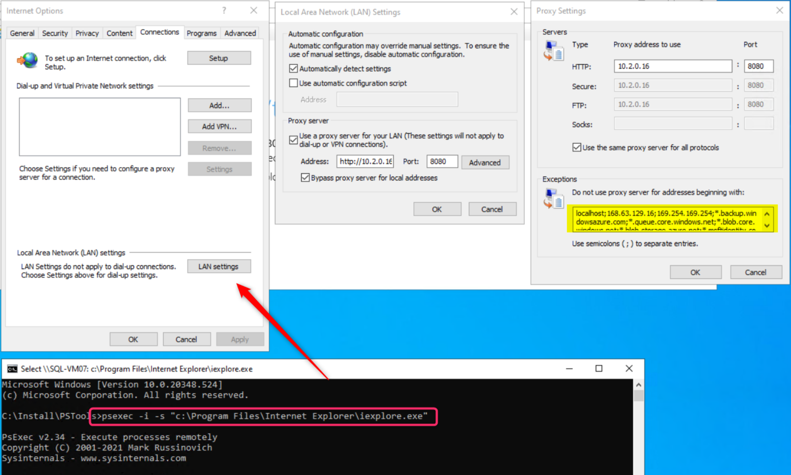
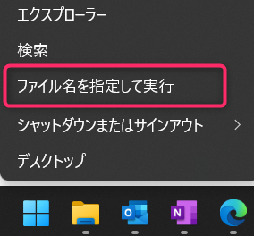
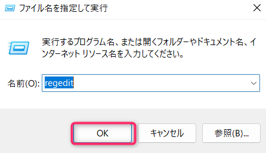
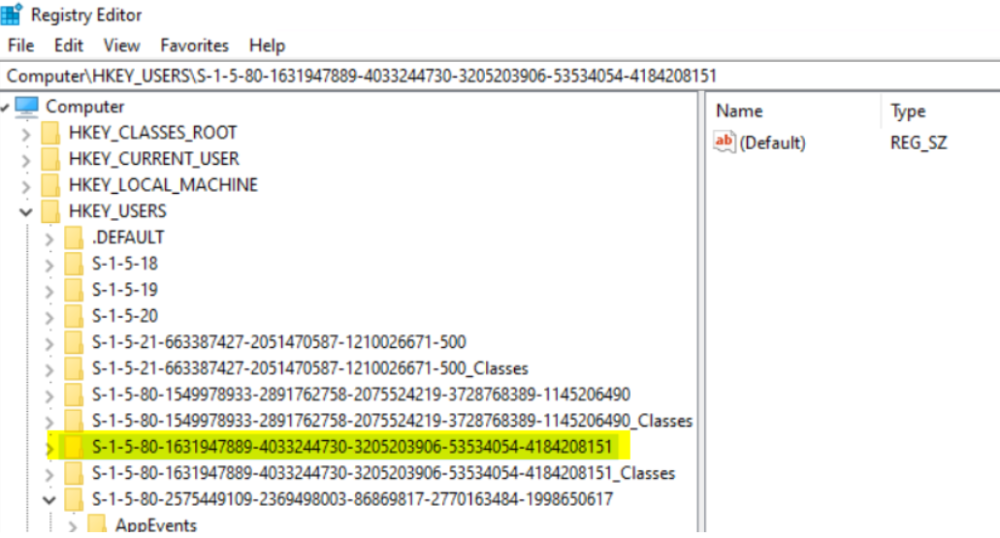
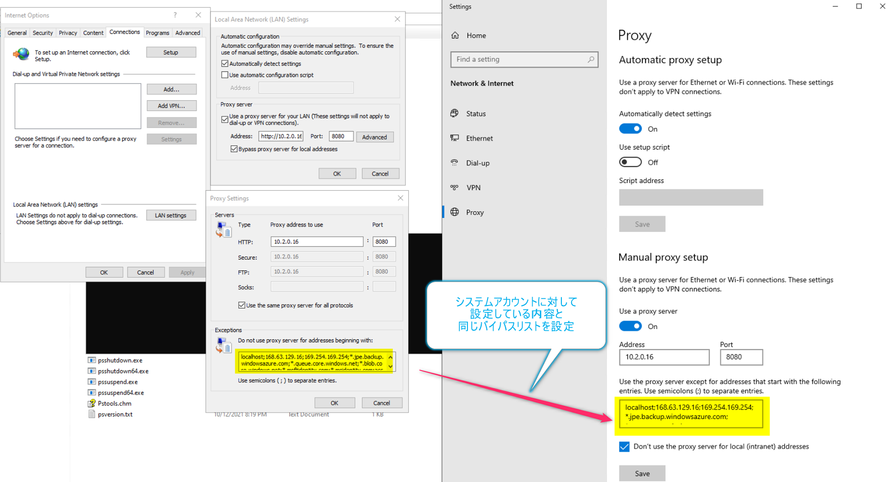
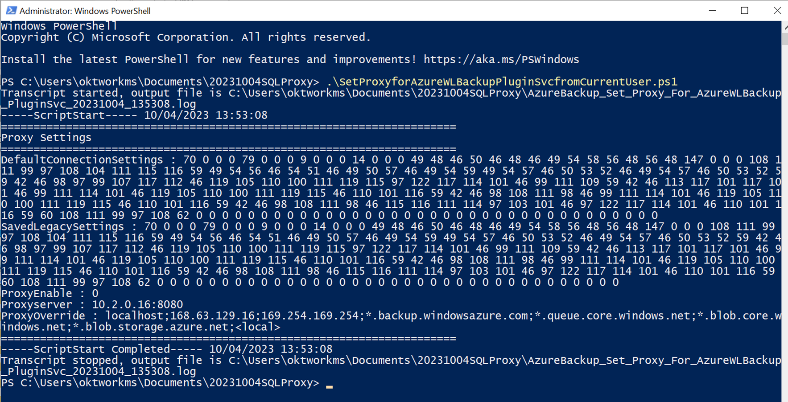
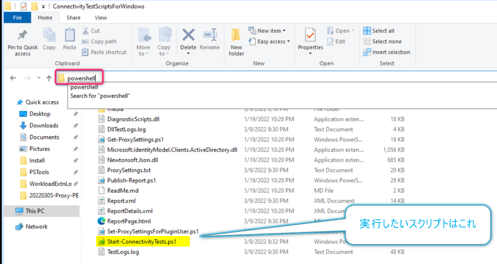
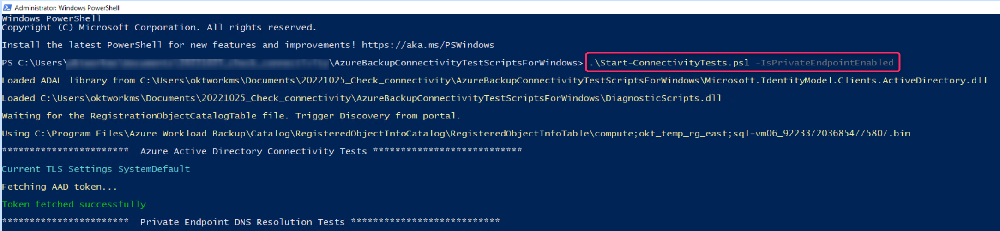
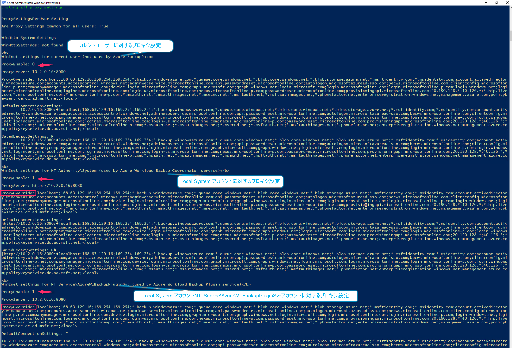

<!-- more -->
皆様こんにちは、Azure Backup サポートです。
今回は、SQL Server DB に対する Azure Backupを、Proxy Serverをパイパスして PE 経由でバックアップする場合の設定方法についてお伝えします。

#### ポイント
##### ( ポイントその 1 )
Poxyを経由させてSQL Server DB に対する Azure Backupを行いたい場合は、下記2種類のアカウントに対して、クライアントOS上でProxy設定を行う必要があります。
　１つ目：Local System アカウント
　２つ目：NT Service\AzureWLBackupPluginSvcアカウント

そのため、Proxyは経由せず（＝「Proxyをバイパスする」）、バックアップを取得したい場合は、上記 ２ つのアカウントに対してバイパス設定を行う必要があります。
※もともと２つのアカウントに対してProxy Server 設定を行っていないのであれば、SQL Server DB に対する Azure BackupにおいてProxyを経由してバックアップすることはありません。

上記２つのアカウントに対してProxyを設定している、かつ　Proxy を経由せずに、プライベート エンドポイント（PE）経由でSQL Backupをさせたい場合、下記をバイパスさせる必要があります。
（例外リスト/バイパスリスト）
	　LocalHost 、Wire Server （168.63.129.16）、169.254.169.254、以下ドキュメント記載のAzure Backup、Azure Storage、Microsoft Entra ID
	
・プライベート エンドポイントを使用して Recovery Services コンテナー用のプロキシ サーバーを設定する
　https://docs.microsoft.com/ja-jp/azure/backup/private-endpoints#set-up-proxy-server-for-recovery-services-vault-with-private-endpoint 

##### ( ポイントその 2 )
本ブログ記事作成時点 (2024/10) では、Microsoft Entra ID はプライベート エンドポイントに対応していませんので、Microsoft Entra ID は PE 以外の疎通ルートを確立させる必要があります。

## 目次 - 手順概略
-----------------------------------------------------------
[1. Recovery Services コンテナー上にプライベート エンドポイントを作成](#1)
[2．バックアップ対象の SQL Server DB が存在する Azure 仮想マシン上で、Local System アカウントに対して、SQL Server DB に対する Azure Backup サービスがバイパスされるよう、設定](#2)
[3. 「データベースの検出」「バックアップの有効化」](#3)
[4. バックアップ対象の SQL Server DB が存在する Azure 仮想マシン上で、サービスアカウント ( NT Service\AzureWLBackupPluginSvc ) に対して、 SQL Server DB に対する Azure Backup サービスがバイパスされるよう、設定](#4)
[5. SQL Server DB に対する Azure Backup「今すぐバックアップ」を実行](#5)
-----------------------------------------------------------

## <a id="1"></a> 1. Recovery Services コンテナー上にプライベート エンドポイントを作成
こちらは 弊社公開ドキュメントに詳細手順を公開しておりますので、下記をご参考に作成ください。
・Azure Backup のプライベート エンドポイントの作成と使用
　https://docs.microsoft.com/ja-jp/azure/backup/private-endpoints 

## <a id="2"></a> 2．バックアップ対象の SQL Server DB が存在する Azure 仮想マシン上で、Local System アカウントに対して、SQL Server DB に対する Azure Backup サービスがバイパスされるよう、設定
##### Local System アカウント に対する Proxy Server バイパス設定 手順詳細
以下より PsExec をダウンロードします。​
​　・PsExec v2.2
　　https://docs.microsoft.com/ja-jp/sysinternals/downloads/psexec 

管理者特権のプロンプトから ダウンロードしたファイルを解凍したフォルダに移動し 、次のコマンドを実行して Internet Explorer を開きます。​
（実行コマンド）
  >psexec -i -s "c:\Program Files\Internet Explorer\iexplore.exe"​

Internet Explorer で、[ツール] > [インターネット オプション] > [接続] > [LAN の設定] の順に移動します。​
システム アカウントの Proxy 設定を確認します。 
Proxy の IP アドレスとポートを設定します。​

・下図例では、Proxy Server の IP アドレスが「10.2.0.16」である前提の画面スクリーンショットとなっています。
・下図中央の「Local Area Network (LAN) Settings」ウィンドウ ＞ 「Byspass proxy server for local addresses」チェックボックスを ON とします。
　これは、下記公開ドキュメント「VM 内の localhost 通信のプロキシを無効にします。」と記載している設定に該当しています。
　・トラフィックをルーティングするために HTTP プロキシ サーバーを使用する
　　https://docs.microsoft.com/ja-jp/azure/backup/backup-sql-server-database-azure-vms#use-an-http-proxy-server-to-route-traffic

・下図一番右側の「Proxy Settings」ウィンドウ ＞ 「Exceptions」欄に記入すべきものが、SQL Server DB に対する Azure Backup 実行時 (= Local Sysytem アカウントが利用される際) に、Proxy Server を経由させずに通信したい場合のアドレスを入力する欄です。
　ここに、以下を記入することで、SQL Server DB に対する Azure Backup 実行時はプロキシをバイパスさせることができます。
　LocalHost 、Wire Server （168.63.129.16）、169.254.169.254、上記ドキュメント記載のAzure Backup、Azure Storage、Microsoft Entra ID

(実際の入力値)
```
localhost;168.63.129.16;169.254.169.254;*.backup.windowsazure.com;*.queue.core.windows.net;
*.blob.core.windows.net;*.blob.storage.azure.net;*.msftidentity.com;
*.msidentity.com;account.activedirectory.windowsazure.com;accounts.accesscontrol.windows.net;
adminwebservice.microsoftonline.com;api.passwordreset.microsoftonline.com;
autologon.microsoftazuread-sso.com;becws.microsoftonline.com;
clientconfig.microsoftonline-p.net;companymanager.microsoftonline.com;
device.login.microsoftonline.com;graph.microsoft.com;graph.windows.net;login.microsoft.com;
login.microsoftonline.com;login.microsoftonline-p.com;login.windows.net;
logincert.microsoftonline.com;loginex.microsoftonline.com;login-us.microsoftonline.com;
nexus.microsoftonline-p.com;passwordreset.microsoftonline.com;
provisioningapi.microsoftonline.com;20.190.128.*;40.126.*;*.hip.live.com;*.microsoftonline.com;
*.microsoftonline-p.com;*.msauth.net;*.msauthimages.net;*.msecnd.net;*.msftauth.net;
*.msftauthimages.net;*.phonefactor.net;nterpriseregistration.windows.net;management.azure.com;
policykeyservice.dc.ad.msft.net
```


	
## <a id="3"></a> 3．「データベースの検出」「バックアップの有効化」
Azure ポータル画面上から、対象の SQL Server DB に対して「データベースの検出」「バックアップの有効化」を行います。

・コンテナーから複数の SQL Server VM をバックアップする - Azure Backup | Microsoft Docs
　https://docs.microsoft.com/ja-jp/azure/backup/backup-sql-server-database-azure-vms#discover-sql-server-databases 

## <a id="4"></a> 4．バックアップ対象の SQL Server DB が存在する Azure 仮想マシン上で、サービスアカウント ( NT Service\AzureWLBackupPluginSvc ) に対して、 SQL Server DB に対する Azure Backup サービスがバイパスされるよう、設定
「バックアップの有効化」が成功後、Azure Backup サービスによって対象マシン上に生成済の「NT Service\AzureWLBackupPluginSvc」アカウントに対する、Proxy Server のバイパス設定を行います。
バイパスリストは  Local Sysytem アカウントに対して設定した内容と同一です。
下記に、「NT Service\AzureWLBackupPluginSvc」アカウントへの設定手順の一例を記載します。
一例としては、カレントユーザーに対して行ったProxy設定を、コマンド実行によって「NT Service\AzureWLBackupPluginSvc」アカウントに対して引き継ぐ手順です。
そのため、一時的にまずはカレントユーザーに対しても、Proxy Server のバイパス設定を行います。

##### (一例) 「NT Service\AzureWLBackupPluginSvc」アカウントに対する Proxy バイパス設定 手順詳細
まずは「NT Service\AzureWLBackupPluginSvc」アカウントが存在しているかを、念のため確認します。
対象マシン上で、スタートボタンを右クリック ＞ ファイル名を指定して実行 ＞ 「regedit」を入力し「OK」をクリックします。




レジストリ エディターが開きますので、以下パスへ遷移します。
（対象パス）
        HKEY_USERS\S-1-5-80-1631947889-4033244730-3205203906-53534054-4184208151

上記レジストリキー (フォルダー)「S-1-5-80-1631947889-4033244730-3205203906-53534054-4184208151」が、「NT Service\AzureWLBackupPluginSvc」アカウントを表しています。
この時点で存在していない場合、「データベースの検出」「バックアップの有効化」もしくは「再登録」が正常完了していない可能性がありますので、「データベースの検出」「バックアップの有効化」「再登録」が成功しているかどうかを再度確認・再実行願います。


レジストリ エディター上でレジストリキー (フォルダー)「S-1-5-80-1631947889-4033244730-3205203906-53534054-4184208151」が存在していることを確認出来たら、一時的に カレントユーザーに対して Proxy Server の設定を行います。

・設定内容は、Local System アカウント に対する Proxy Server バイパス設定と同一です
・下図例 では、Proxy Server の IP アドレスが「10.2.0.16」である前提の画面スクリーンショットとなっています。
・下図中央の「Don’t use the proxy server for local (intranet) addresses」チェックボックスを ON とします。
　これは、下記公開ドキュメント「VM 内の localhost 通信のプロキシを無効にします。」と記載している設定に該当しています。
　・トラフィックをルーティングするために HTTP プロキシ サーバーを使用する
　　https://docs.microsoft.com/ja-jp/azure/backup/backup-sql-server-database-azure-vms#use-an-http-proxy-server-to-route-traffic

・下図一番右側 黄色罫線箇所が、Proxy Server を経由させずに通信したい場合のアドレスを入力する欄です。
　ここに、以下を記入することで、SQL Server DB に対する Azure Backup 実行時はプロキシをバイパスさせることができます。
　LocalHost 、Wire Server （168.63.129.16）、169.254.169.254、上記ドキュメント記載のAzure Backup、Azure Storage、Microsoft Entra ID

(実際の入力値)
```
localhost;168.63.129.16;169.254.169.254;*.backup.windowsazure.com;*.queue.core.windows.net;
*.blob.core.windows.net;*.blob.storage.azure.net;*.msftidentity.com;
*.msidentity.com;account.activedirectory.windowsazure.com;accounts.accesscontrol.windows.net;
adminwebservice.microsoftonline.com;api.passwordreset.microsoftonline.com;
autologon.microsoftazuread-sso.com;becws.microsoftonline.com;
clientconfig.microsoftonline-p.net;companymanager.microsoftonline.com;
device.login.microsoftonline.com;graph.microsoft.com;graph.windows.net;login.microsoft.com;
login.microsoftonline.com;login.microsoftonline-p.com;login.windows.net;
logincert.microsoftonline.com;loginex.microsoftonline.com;login-us.microsoftonline.com;
nexus.microsoftonline-p.com;passwordreset.microsoftonline.com;
provisioningapi.microsoftonline.com;20.190.128.*;40.126.*;*.hip.live.com;*.microsoftonline.com;
*.microsoftonline-p.com;*.msauth.net;*.msauthimages.net;*.msecnd.net;*.msftauth.net;
*.msftauthimages.net;*.phonefactor.net;nterpriseregistration.windows.net;management.azure.com;
policykeyservice.dc.ad.msft.net
```



カレントユーザーに対して、Proxy Server のバイパス設定を保存した後に、下記リンク先から、サービス アカウント ( NT Service\AzureWLBackupPluginSvc ) に対するプロキシを設定するスクリプトをダウンロードします。  
    - [SetProxyforAzureWLBackupPluginSvcfromCurrentUser.zip](https://github.com/jpabrs-scem/blog/files/12788965/SetProxyforAzureWLBackupPluginSvcfromCurrentUser.zip)

バックアップ対象の SQL Server DB が存在する Azure 仮想マシン上に、ダウンロードしたスクリプトを配置し、展開します。  
    - ファイルの解凍パスワードは **``AzureBackup``** です

管理者特権の PowerShell から、ダウンロードしたファイルを解凍したフォルダに移動し、次のコマンドを実行します。
    - (実行コマンド)  
      ``.\SetProxyforAzureWLBackupPluginSvcfromCurrentUser.ps1``  
    - スクリプトを実行すると、以下ログファイルが作成されます。  
      ``<スクリプトを実行したフォルダ>/AzureBackup_Set_Proxy_For_AzureWLBackup_PluginSvc_yyyyMMdd_HHmmss.log``


> [!NOTE]
> サービス アカウントのプロキシ設定は、サービス アカウントのレジストリ キーを編集することで設定しますが、
> 設定する一部の値の型が "REG_BINARY" となり、バイナリ データを登録する必要がございます。  
> 設定の簡易化のため、本手順では、現在ログインしているユーザー (カレント ユーザー) のプロキシ設定を継承する 上記のPowerShell コマンド (スクリプト) を用いて、サービス アカウントのプロキシ設定を行います。

> [!WARNING]
> 本手順でご案内しているスクリプトについては、お客様の責任のもと、ご利用いただきますようお願い申し上げます。  
> スクリプト実行時のエラーや、想定外の問題について、当社は責任を負いかねますのでご了承ください。

上記コマンド実行後、カレントユーザーに対する Proxy Server 設定を、元の状態に戻します。
念のため、以下スクリプトを実行いただき、Local System アカウントとNT Service\AzureWLBackupPluginSvcアカウントに対して、Proxy Server バイパス設定が正しく設定されているかを確認します。

##### １．下記ドキュメント上の「Azure Backup 接続テスト スクリプト (AzureBackupConnectivityTestScriptsForWindows.zip) 」を対象 Azure 仮想マシン上にダウンロードし、 zip ファイルを展開します。
・ネットワーク接続を確立する
　https://learn.microsoft.com/ja-jp/azure/backup/backup-sql-server-database-azure-vms#establish-network-connectivity

##### ２．展開した zip ファイル内の「Start-ConnectivityTests.ps1」を、対象 Azure 仮想マシン上で実行します。
今回は、Azure Backup サービスと Azure Storage サービスに対しては、プライベート エンドポイント経由で通信するため、引数に「-IsPrivateEndpointEnabled」を追加して実行します。
（実行コマンド 例）
  >.\Start-ConnectivityTests.ps1 -IsPrivateEndpointEnabled





「Start-ConnectivityTests.ps1」スクリプトを実行後、ターミナル上に結果が返却されます。

##### 「Start-ConnectivityTests.ps1」実行結果の期待値
(1)
WinInet settings for NT Authority\System (used by Azure Workload Backup Coordinator service)
ProxyEnable: <span style="color: red; ">1</span>
となっていること。(=プロキシ設定 ON を表す)

(2)
WinInet settings for NT Authority\System (used by Azure Workload Backup Coordinator service)
「ProxyOverride:」以降が、設定した例外リスト/バイパスリストの内容となっていること

(3)
WinInet settings for NT Service\AzureWLBackupPluginSvc (used by Azure Workload Backup Plugin service)
ProxyEnable: <span style="color: red; ">1</span>
となっていること。(=プロキシ設定 ON を表す)

(4)
WinInet settings for NT Service\AzureWLBackupPluginSv (used by Azure Workload Backup Plugin service)
「ProxyOverride:」以降が、設定した例外リスト/バイパスリストの内容となっていること


## <a id="5"></a> 5．SQL Server DB に対する Azure Backup「今すぐバックアップ」を実行
Azure ポータル画面上で設定した、バックアップ ポリシーに従った次回の スケジュールバックアップが成功することを確認いただく、もしくは「今すぐバックアップ」を実行してオンデマンド バックアップが成功することをご確認ください。

・オンデマンド バックアップを実行する
　https://docs.microsoft.com/ja-jp/azure/backup/tutorial-sql-backup#run-an-on-demand-backup

SQL Server DB に対する Azure Backupを、Proxy Serverをパイパスして PE 経由でバックアップする場合の設定方法は以上となります。