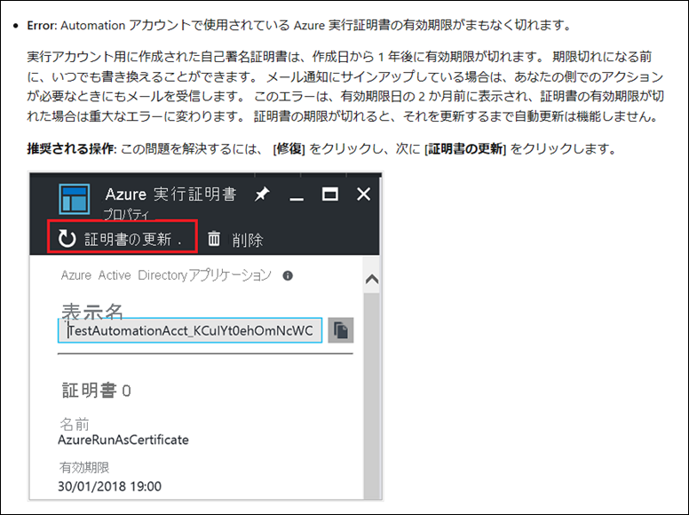

<!-- more -->
みなさんこんにちは、Azure Site Recovery サポートです。
今回は、Azure Site Recovery ( 以下、ASR ) にて使用される、マネージド ID の設定についてのご案内です。

ASR 自動更新には Azure Automation の実行アカウントが利用されますが、Azure Automation 実行アカウントは 2023 年 9 月 30 日に廃止されることが決まっており、マネージド ID へ移行する必要がございます。
具体的な移行手順については公開情報にご案内がある他、本ブログ内でも手動で移行する方法についてご案内がございます。

・既存の実行アカウントからマネージド ID に移行する
https://learn.microsoft.com/ja-jp/azure/site-recovery/how-to-migrate-run-as-accounts-managed-identity#migrate-from-an-existing-run-as-account-to-a-managed-identity

・ASR 自動更新に利用する Automation アカウントの Managed ID への移行方法について
https://jpabrs-scem.github.io/blog/AzureSiteRecovery/HowToChangeAzureAutomationManagedId/

移行手順については、上記公開情報にもご案内ある通り、基本的に [Site Recovery インフラストラクチャ] > [拡張機能の更新の設定] から [移行] ボタンをクリックいただくのみとなります。
ただし、[移行] ボタンの他に、[修復] といったボタンが表示される場合がございます。
それは、Site Recovery のインフラストラクチャ＞拡張機能の更新の設定 画面に表示される “自動更新の設定が異常です” のエラー メッセージが発生している、つまり、一般的にモビリティ サービス自動更新用 Automation アカウントの認証に使用する実行アカウントの証明書がまもなく期限切れとなる場合などに表示されます。

### 対処策
この問題を解決するには、[修復] ボタンを押下後に対象 Automation アカウントの実行アカウントの画面に遷移しますので、遷移後の画面で [証明書の更新] ボタンを押下することで証明書を更新できます。
なお、こちらマネージド ID へ移行済みである場合は、特段対応は不要になります。

・一般的な問題とトラブルシューティング
https://learn.microsoft.com/ja-jp/azure/site-recovery/azure-to-azure-autoupdate#common-issues-and-troubleshooting
