<!-- more -->
みなさんこんにちは、Azure Site Recovery サポートです。
今回は、Azure Site Recovery ( 以下、ASR ) にて使用される、マネージド ID の設定についてのご案内です。

ASR 自動更新には Azure Automation の実行アカウントが利用されますが、Azure Automation 実行アカウントは 2023 年 9 月 30 日に廃止されることが決まっており、マネージド ID へ移行する必要がございます。
2023/3/14 時点では ASR の自動更新に利用する Azure Automation を手動でマネージド ID へ移行する必要がございますので、その移行手順についてご案内いたします。

なお、今後は ASR 有効化時に自動でマネージド ID の Azure Automation が作成されるように開発部門と対応を継続しておりますので、進展がありましたら本ブログにて Update をお知らせいたします。

・マネージド ID への移行に関する公開情報
　https://learn.microsoft.com/ja-jp/azure/automation/migrate-run-as-accounts-managed-identity?tabs=sa-managed-identity

### 作業手順
1. Azure Portal から Recovery Services コンテナーに移動し、[概要] の JSON ビューをクリックし、ID の行に表示される /subscriptions/ から始まるリソース ID をメモします。
※ 手順 8 で利用します。

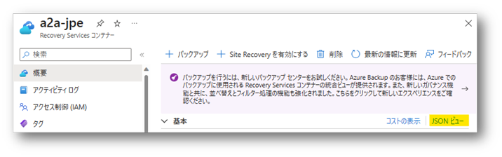

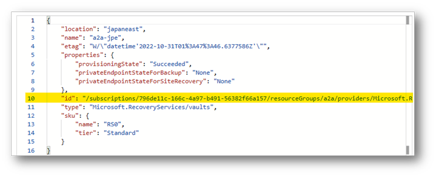

2. Recovery Services コンテナーの [Site Recovery インフラストラクチャ] - [拡張機能の更新の設定] 画面ご利用の Automation アカウント名をご確認ください。

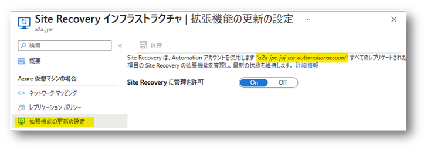

3. 手順 2 で確認した Automation アカウントに移動し、  JSON ビューをクリックし、ID の行に表示される /subscriptions/ から始まるリソース ID をメモします。
※ 手順 9 で利用します。

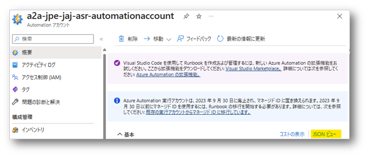

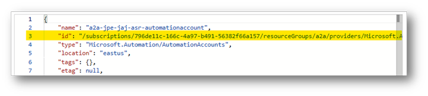

4. Automation アカウントの [ID] - [システム割り当て済み] 画面から状態が [オン] に選択されていない場合には、[オン] を選択し、[保存] をクリックします。

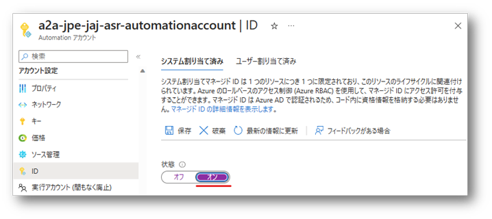

5. Recovery Services コンテナーに戻り、[アクセス制御 (IAM)] から、Automation アカウントのマネージド ID に対して共同作成者ロールを付与します。

・ロール : 共同作成者
・アクセスの割り当て先 : マネージド ID
・メンバー :Automation アカウント

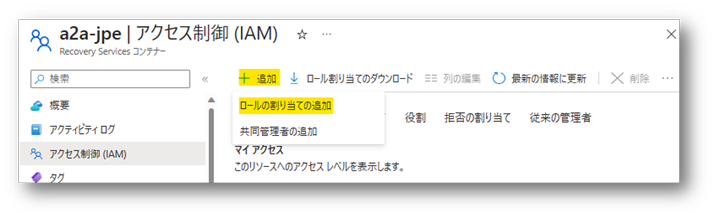

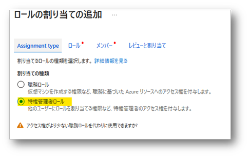

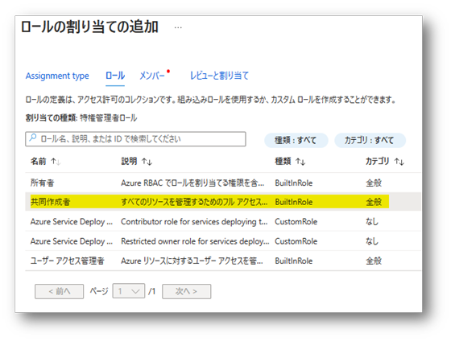

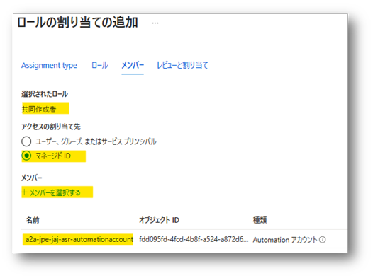

6. Automation アカウントに戻り、[Runbook] - [Runbook の作成] から新しい Runbook を作成します。

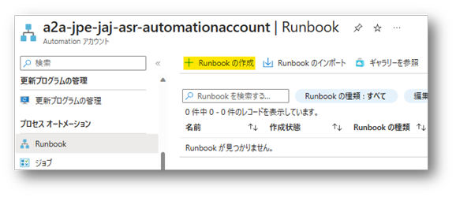

・Runbook 名 : <任意>
・Runbook の種類 : PowerShell
・ランタイムのバージョン : 5.1

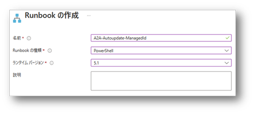

7. 作成された Runbook に、下記 Github に公開されている UpdateAutomationAccount.ps1 の PowerShell スクリプトをコピーして貼り付け [保存] します。

・PowerShell スクリプト 
　https://github.com/AsrOneSdk/published-scripts/blob/master/automationAccount/UpdateAutomationAccount.ps1

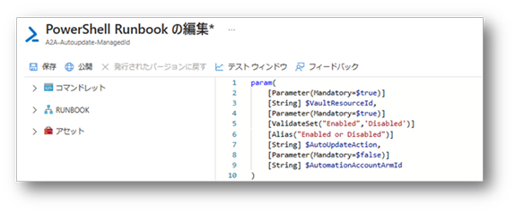

8. 上部 [テスト ウィンドウ] からテスト画面に移動し、パラメーターを入力し [開始] をクリックします。

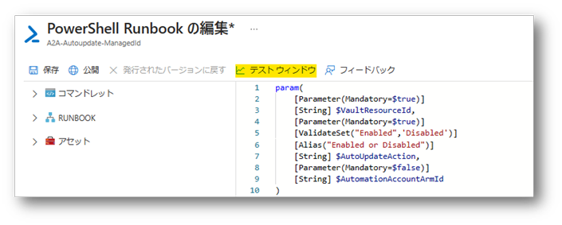

・VAULTRESOURCEID : 手順 1 で確認した Recovery Services コンテナーのリソース ID
・AUTOUPDATEACTION : Disabled
・AUTOMATIONACCOUNTARMID : 入力なし

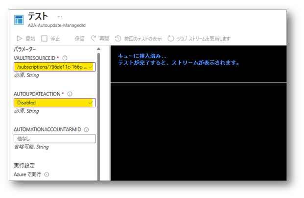

完了と表示されるとテスト成功です。

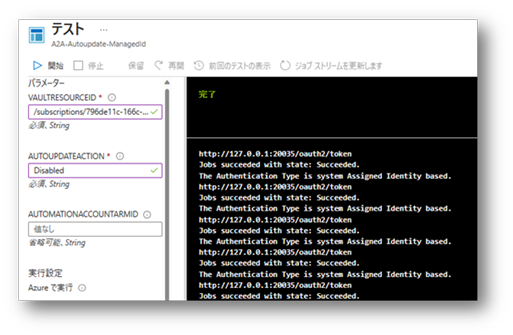

9. パラメータ AUTOUPDATEACTION を Enabled に変更し、AUTOMATIONACCOUNTARMID にリソース ID を入力し、再度 [開始] をクリックします。

・VAULTRESOURCEID : 手順 1 で確認した Recovery Services コンテナーのリソース ID
・AUTOUPDATEACTION : Enabled
・AUTOMATIONACCOUNTARMID : 手順 3 で確認した Automation アカウントのリソース ID

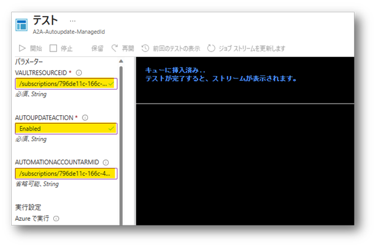

完了と表示されるとテスト成功です。

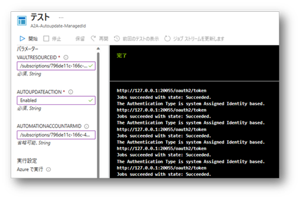

10. 画面右上の [X] から画面を一度閉じ、Runbook に戻り [公開] をクリックします。

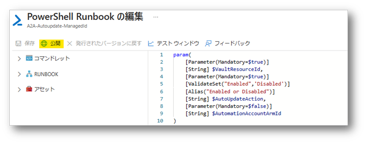

11. Runbook のステータスが "発行済み" になっていることを確認し、[スケジュールへのリンク] をクリックし、スケジュールを設定します。

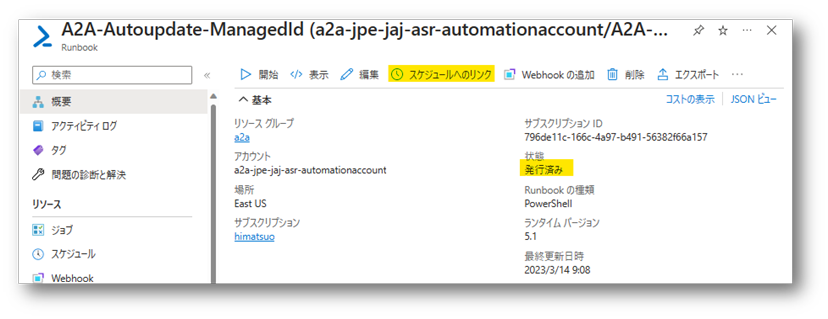

12. [スケジュール] をクリックし、既存のスケジュールを利用するか新規スケジュールを作成します。
※ 既定では 0:00 に毎日ジョブが実行され、最新バージョンでない保護されたアイテムがある場合に ASR モビリティ サービス エージェントを更新する処理がトリガーされます。

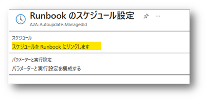

新規スケジュールを作成する場合には、任意のスケジュールを設定します。
例えば、日本時刻 0:00 に毎日ジョブを実行する場合、下記のように入力します。

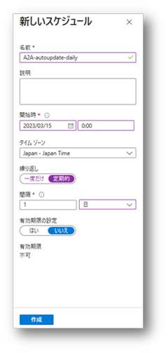

13. [パラメーターと実行設定] をクリックし、手順 9 で入力したパラメータを以下の通り再度入力し [OK] をクリックします。

・VAULTRESOURCEID : 手順 1 で確認した Recovery Services コンテナーのリソース ID
・AUTOUPDATEACTION : Enabled
・AUTOMATIONACCOUNTARMID : 手順 3 で確認した Automation アカウントのリソース ID

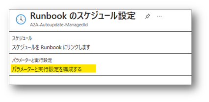

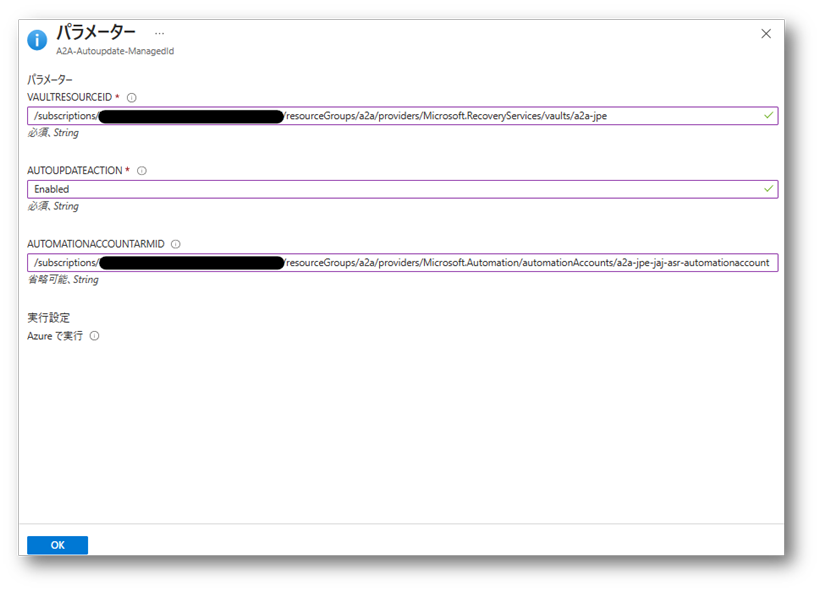

上記作業が完了したら、次のスケジュール日時からマネージド ID を使用した Runbook にて更新ジョブが実行されます。

ASR にて使用される、マネージド ID 設定の案内は、以上となります。