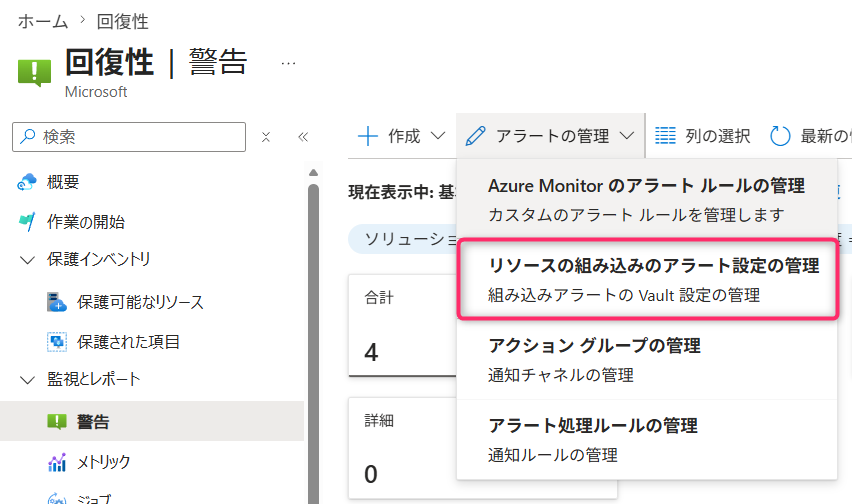
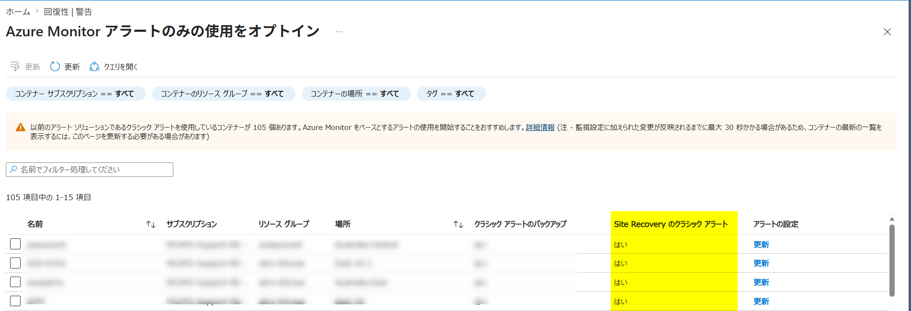
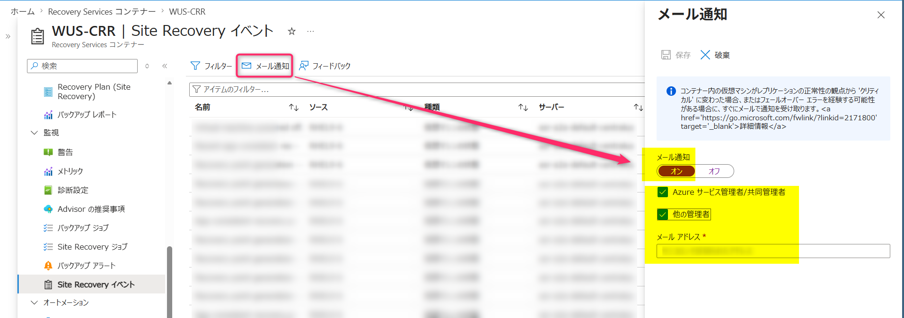
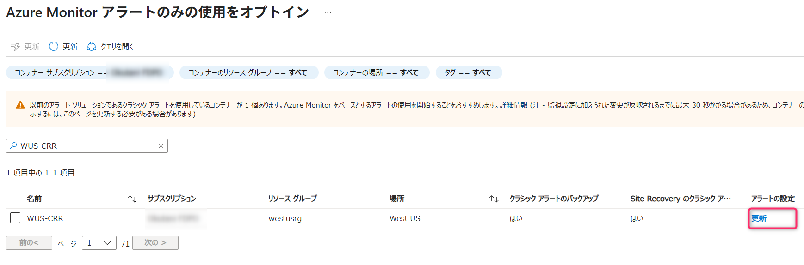
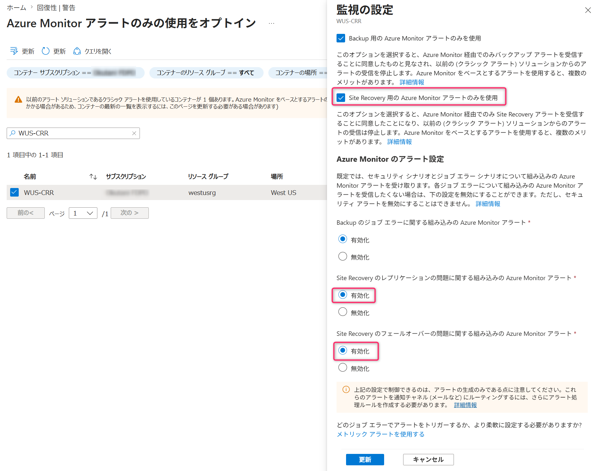
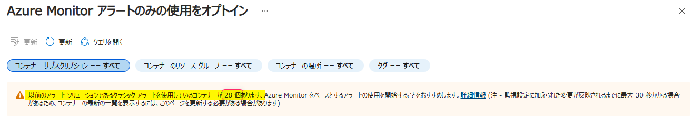
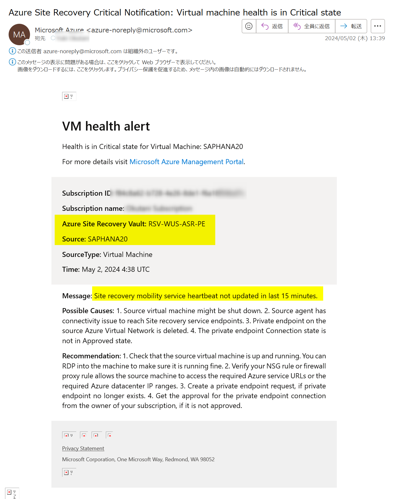

<!-- more -->
こんにちは、Azure Site Recovery サポートです。
この記事では Azure Site Recovery (以下、ASR ) の「クラシック アラート」を、「組み込みの Azure Monitor アラート」へと移行することについて説明いたします。

## 目次
-----------------------------------------------------------
[Q1. 「LVFL-NR0」「HVV0-PQG」このアラートは何ですか？](#Q1)
[Q2. どの Recovery Services コンテナーが「クラシック アラート設定」になっていますか？](#Q2)
[Q2-1. どの Recovery Services コンテナーでクラシック アラートが有効になっているのですか？](#Q2-1)
[Q2-2. どの Recovery Services コンテナーが ASR クラシック アラートの「メール通知」を行っていますか？](#Q2-2)
[Q3. ユーザーは何をすべきですか？](#Q3)
[Q4. ASR クラシック アラートを無効化する方法を教えてください](#Q4)
[Q5. ASR クラシック アラートから「組み込みの Azure Monitor アラート」へと移行した場合のコストはどうなりますか？](#Q5)
[Q6. ASR クラシック アラートと「組み込みの Azure Monitor アラート」の通知メールに違いはありますか？](#Q6)
-----------------------------------------------------------

## Q1. 「LVFL-NR0」「HVV0-PQG」このアラートは何ですか？
**A1** 
ASR のクラシック アラートから「組み込みの Azure Monitor アラート」へと移行するよう、お知らせするためのものです。
Recovery Services コンテナーでは、クラシック アラートが既定で有効化されております。

## Q2.どの Recovery Services コンテナーが「クラシック アラート設定」になっていますか？ 
**A2**
・ 既定ですべての「組み込みの Azure Monitor アラート」へと移行していない Recovery Services コンテナーは「クラシック アラート」が有効になっており、正常性アラート「LVFL-NR0」「HVV0-PQG」対象となっております
・ 実際に「クラシック アラート」を用いてメールへの通知構成をしているかどうかは、お客様環境の設定次第です

#### Q2-1. どの Recovery Services コンテナーでクラシック アラートが有効になっているのですか？
**A2-1**
(1) Azure ポータルにて回復性 (Resiliency) を開き、[監視とレポート] > [警告] > [アラートの管理] > [リソースの組み込みのアラート設定の管理] を選択します  

(2) [Azure Monitor アラートのみの使用をオプトイン] 画面にて、リストされている Recovery Services コンテナーを確認します

> [!WARNING]
> 項目 ``Site Recovery のクラシック アラート`` が「はい」となっている Recovery Services コンテナーが対象となります。  

#### Q2-2. どの Recovery Services コンテナーが ASR クラシック アラートの「メール通知」を行っていますか？
**A2-2**
リストされた Recovery Services コンテナーが実際に ASR クラシック アラートの「メールの通知」を構成しているかどうかは、上記でリストされた Recovery Services コンテナー > [Site Recovery イベント] > [メール通知] > 「メールの通知：オン」 となっているかどうかで確認可能です。

## Q3. ユーザーは何をすべきですか？
**A3**
**ASR クラシック アラートの「メール通知」を構成している場合**
ASR として今後、クラシック アラートではなく「組み込みの Azure Monitor アラート」へと切り替えていただくようお勧めしておりますので、切り替えをご検討ください。
詳細は本ブログの「Q4 ASR クラシック アラートを無効化する方法を教えてください」を確認ください。

**現在、ASR クラシック アラートの「メール通知」は構成していないが、今後は ASR でエラーが発生した際にはメール通知などのアラートをご希望の場合**
クラシック アラートから「Azure Monitor を使用した組み込みのアラート」へと切り替え・設定することをご検討ください。
詳細は本ブログの「Q4 ASR クラシック アラートを無効化する方法を教えてください」を確認ください。

**現在、ASR クラシック アラートを構成していない、かつ今後もアラートをご希望でない場合**
特段お客様での追加作業は不要です。

## Q4. ASR クラシック アラートを無効化する方法を教えてください
**A4**
ASR クラシック アラートの「メール通知」を構成している Recovery Services コンテナーがある場合、[Azure Monitor アラートのみの使用をオプトイン] 画面にて、更新ください。

> [!NOTE]
> ASR クラシック アラートの「メール通知」を構成しておらず、今後も ASR エラーの監視設定をする必要が無い場合は、下記対応は不要です。

- (参考) ビジネス継続性センターで Azure Site Recovery のアラートを管理する
  https://learn.microsoft.com/ja-jp/azure/site-recovery/site-recovery-monitor-and-troubleshoot#manage-azure-site-recovery-alerts-in-business-continuity-center

Azure ポータルにて回復性 (Resiliency) を開き、[監視とレポート] > [警告] > [アラートの管理] > [リソースの組み込みのアラート設定の管理] をクリック後、設定を変更します。

「更新」完了後、「Azure Monitor アラートのみの使用をオプトイン」画面上にて、該当の Recovery Services コンテナーがリストアップされてきていないことを確認します。

念のため、Recovery Services コンテナー >「監視の設定」-「更新」クリック後の画面上でも、下図の項目が有効化されていることを確認します。

- Site Recovery 用の Azure Monitor アラートのみを使用：チェック ON
- Site Recovery のレプリケーションの問題に関する組み込みの Azure Monitor アラート：有効にする
- Site Recovery のフェールオーバーの問題に関する組み込みの Azure Monitor アラート：有効にする

これにて、ASR クラシック アラートの廃止は完了いたします。

> [!WARNING]
> Recovery Services コンテナーの [監視の設定] の下記どちらかの設定が無効化されていると、[Azure Monitor アラートのみの使用をオプトイン] 画面ではクラシック アラートを使用しているコンテナーとしてカウントされたままとなりますのでご注意ください。  
> ・ バックアップ用の Azure Monitor アラートのみを使用
> ・ Site Recovery 用の Azure Monitor アラートのみを使用 
> 例) 
> 
  

なお、「組み込みの Azure Monitor アラート」を使って、メールなどの通知が必要な場合は、別途設定していただく必要があります。
詳細は下記のドキュメントと、ブログを参照いただければと存じます。

- (参考) Azure Site Recovery に関する組み込みの Azure Monitor アラート
  https://learn.microsoft.com/ja-jp/azure/site-recovery/site-recovery-monitor-and-troubleshoot#built-in-azure-monitor-alerts-for-azure-site-recovery

- (参考) 「組み込みの Azure Monitor アラート」を利用した ASR エラーのアラート構成例
  https://jpabrs-scem.github.io/blog/AzureSiteRecovery/HowToSetAsrMonitorAlert/

## Q5. ASR クラシック アラートから「組み込みの Azure Monitor アラート」へと移行した場合のコストはどうなりますか？ 
**A5** 
「Azure Monitor を使用した組み込みのアラートが生成されること」自体に料金は発生しません。
一方、メールなどへアラートを通知させる場合は少額の料金が発生いたします。
詳細は下記ドキュメントをご参照ください。
 
- (参考) 価格
  https://learn.microsoft.com/ja-jp/azure/site-recovery/site-recovery-monitor-and-troubleshoot#pricing
  "追加料金は発生しません。 ただし、これらのアラートを通知チャネル (電子メールなど) にルーティングする場合、Free レベル (1 か月あたり 1,000 メール) を超える通知に対してはわずかなコストが発生します。"

## Q6. ASR クラシック アラートと「組み込みの Azure Monitor アラート」の通知メールに違いはありますか？
**A6** 
件名などに違いがございます。
ASR クラシック アラートと、組み込みの Azure Monitor アラートの通知メールのサンプルを、以下のとおりご案内いたします。

> [!WARNING]
> こちらのサンプル メールは 2024 頃に受信したものとなりますので、あくまで参考程度に留めてくださいますようお願い申し上げます。
> より正確な内容をご確認いただくためにも、お客様ご自身で、アラート メールの受信検証を行っていただき、内容をご確認ください。

[例：ASR の「レプリケーション ヘルス」が「重大」に変わったことを通知するアラート メール]
- クラシック アラート  
  メール件名：Azure Site Recovery Critical Notification: Virtual machine health is in Critical state
  

- 組み込みの Azure Monitor アラート
  メール件名：Fired:Sev1 Azure Monitor Alert Replication health changed to Critical. on rsv-wus-asr-pe ( microsoft.recoveryservices/vaults ) at 5/2/2024 4:39:54 AM
  

