<!-- more -->
皆様こんにちは、Azure Site Recovery サポートです。  
今回は、「組み込みの Azure Monitor アラート」を利用して、 Azure Site Recovery (以下、 ASR ) でエラーが発生した際に、特定のメールアドレスへとメール通知させたい場合の、アラート通知構成例をご紹介します。

## 目次
-----------------------------------------------------------
[1. 概要](#1)
[2. アラート構成手順](#2)
[2-1. クラシック アラートをオプトアウトし、組み込みのアラートのみを使用する](#2-1)
[2-2. 「アラート 処理ルール」・「アクション グループ」を作成する](#2-2)
[2-3. 「組み込みの Azure Monitor アラート」を発生させてみる](#2-3)
-----------------------------------------------------------

## 1. 概要
Azure Site Recovery のエラーを検知したい場合、現在 2 種類のアラート手法がございます。
(1 種類目) クラシック アラート
(2 種類目) 組み込みの Azure Monitor アラート

「クラシック アラート」とは、Recovery Services コンテナー > Site Recovery イベント > 「メール通知」で構成しているアラートを指します。

Azure Site Recovery では、「クラシック アラート」から「組み込みの Azure Monitor アラート」へと切り替えていただくことをお勧めしております。

本記事では、例として、下記の要件を満たすアラートを構成していきます。
・　特定の Recovery Services コンテナーを対象としたい
・　Azure Site Recovery にて、「レプリケーション ヘルス」が「重大」となった際、「フェールオーバー」がエラーになった際に検知したい
・　「組み込みの Azure Monitor アラート」にてアラートが生成されたら、その内容を特定のメールアドレスへと通知させたい

- (参考) Azure Site Recovery に関する組み込みの Azure Monitor アラート
  https://learn.microsoft.com/ja-jp/azure/site-recovery/site-recovery-monitor-and-troubleshoot#built-in-azure-monitor-alerts-for-azure-site-recovery

## 2. アラート構成手順
### 2-1. クラシック アラートをオプトアウトし、組み込みのアラートのみを使用する

まずは対象の Recovery Services コンテナーに対して、「クラシック アラート」をオプトアウトして、「Azure Monitor を使用した組み込みのアラート」を有効化します。

- (参考) Recovery Services コンテナーで Azure Site Recovery のアラートを管理する
  https://learn.microsoft.com/ja-jp/azure/site-recovery/site-recovery-monitor-and-troubleshoot#manage-azure-site-recovery-alerts-in-recovery-services-vault

Azure ポータルにて回復性 (Resiliency) を開き、[監視とレポート] > [警告] > [アラートの管理] > [リソースの組み込みのアラート設定の管理] をクリックします。

「Azure Monitor アラートのみの使用をオプトイン」画面上にて、対象 Recovery Services コンテナー の [アラートの設定] > [更新] をクリックします。

[監視の設定]画面上にて、下記項目を設定します。
- Site Recovery 用の Azure Monitor アラートのみを使用：チェック ON
- Site Recovery のレプリケーションの問題に関する組み込みの Azure Monitor アラート：有効化
- Site Recovery のフェールオーバーの問題に関する組み込みの Azure Monitor アラート：有効化
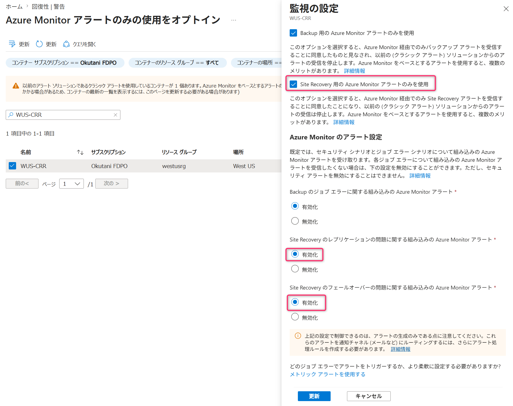

「更新」完了後、「Azure Monitor アラートのみの使用をオプトイン」画面上にて、該当の Recovery Services コンテナーがリストアップされてきていないことを確認します。
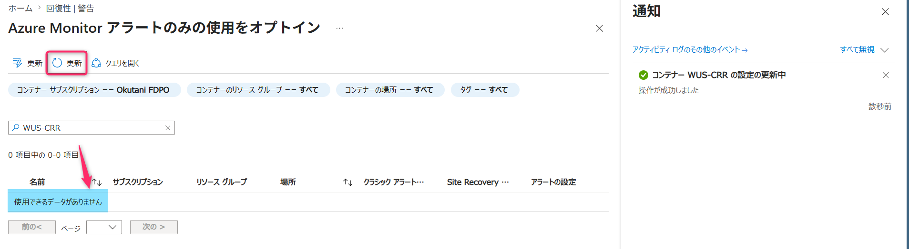

念のため、Recovery Services コンテナー >「監視の設定」-「更新」クリック後の画面上でも、下図の項目が有効化されていることを確認します。

- Site Recovery 用の Azure Monitor アラートのみを使用：チェック ON
- Site Recovery のレプリケーションの問題に関する組み込みの Azure Monitor アラート：有効にする
- Site Recovery のフェールオーバーの問題に関する組み込みの Azure Monitor アラート：有効にする

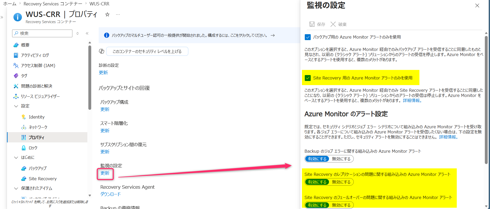

> [!WARNING]
> Recovery Services コンテナーの [監視の設定] の下記どちらかの設定が無効化されていると、[Azure Monitor アラートのみの使用をオプトイン] 画面ではクラシック アラートを使用しているコンテナーとしてカウントされたままとなりますのでご注意ください。  
> ・ バックアップ用の Azure Monitor アラートのみを使用
> ・ Site Recovery 用の Azure Monitor アラートのみを使用 

### 2-2. 「アラート 処理ルール」・「アクション グループ」を作成する

- (参考) アラートの電子メール通知を構成する
  https://learn.microsoft.com/ja-jp/azure/site-recovery/site-recovery-monitor-and-troubleshoot#configure-email-notifications-for-alerts

Azure ポータル画面 > [モニター] > [アラート 処理ルール]をクリックします。
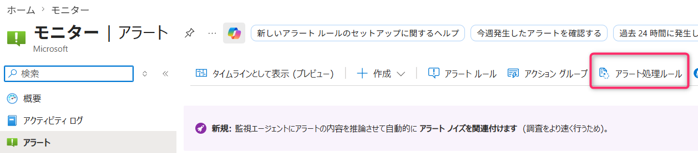

今回は、Recovery Services コンテナー「WUS-CRR」のみ、アラート通知させたいため、この Recovery Services コンテナーのみを範囲として選択します。

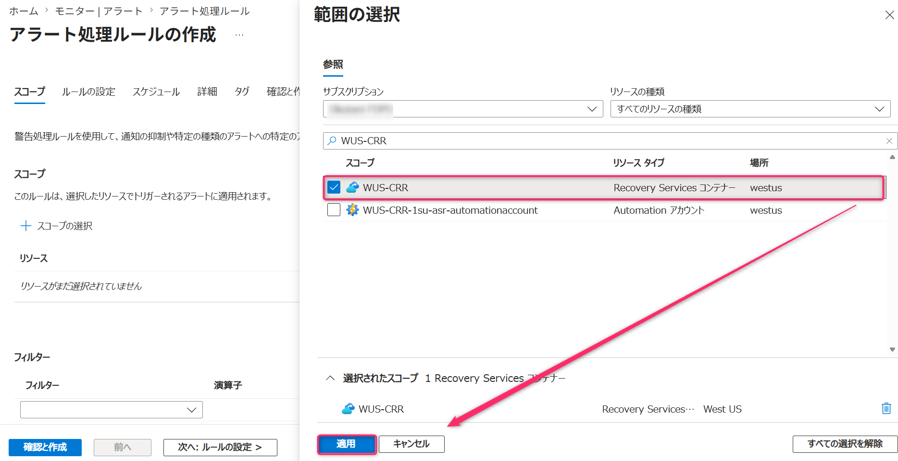
[フィルター] 欄では [重要度] - [1 - エラー] を選択します。
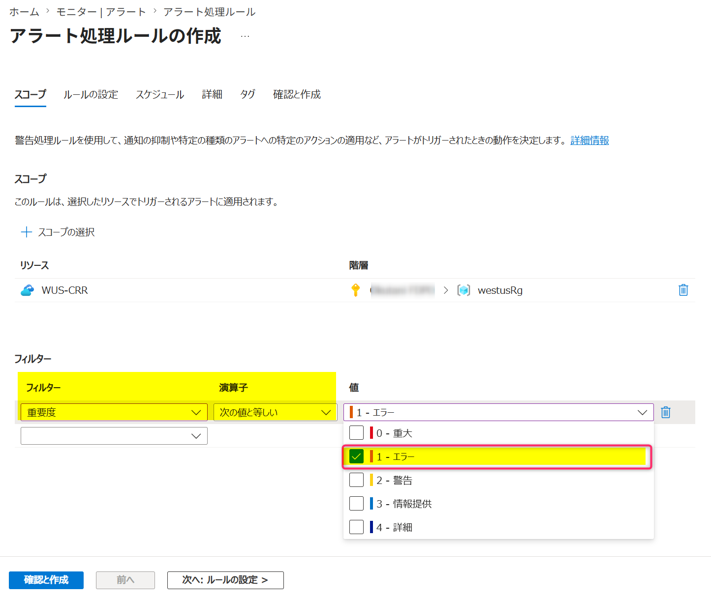

今回は「組み込みの Azure Monitor アラート」をメール通知させたいため、「アクション グループ」を設定します。
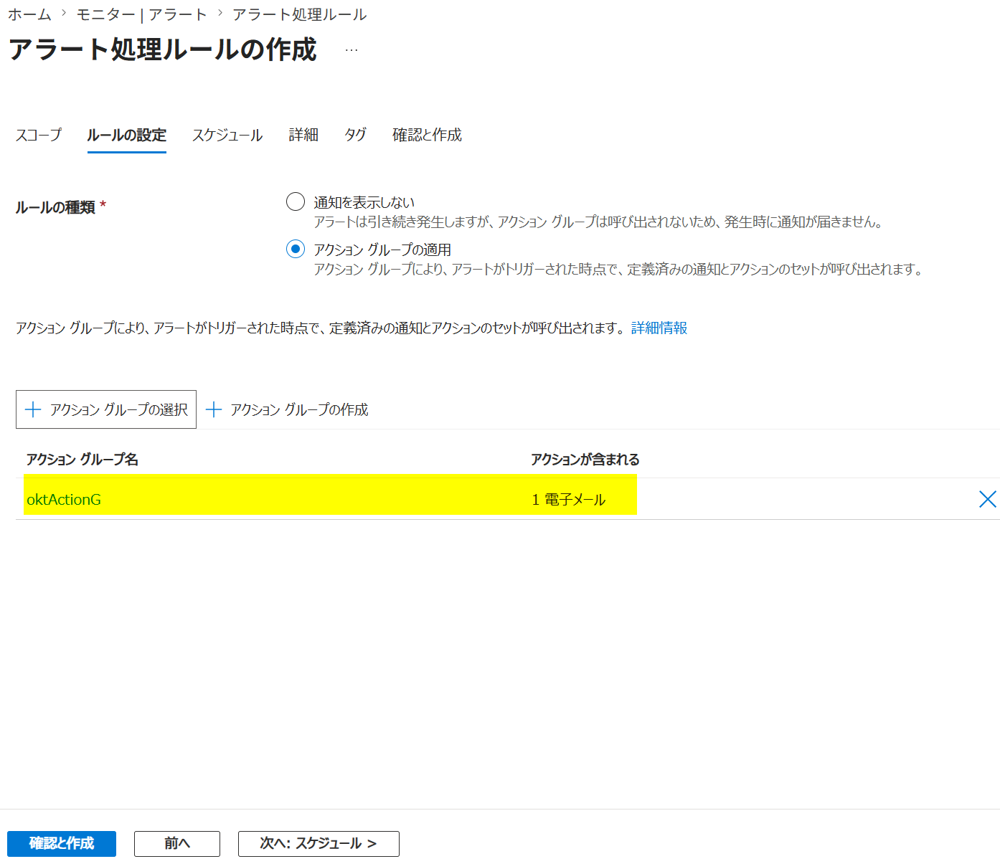

この例では特定の「メールアドレス」を設定している「アクション グループ」を選択しています。
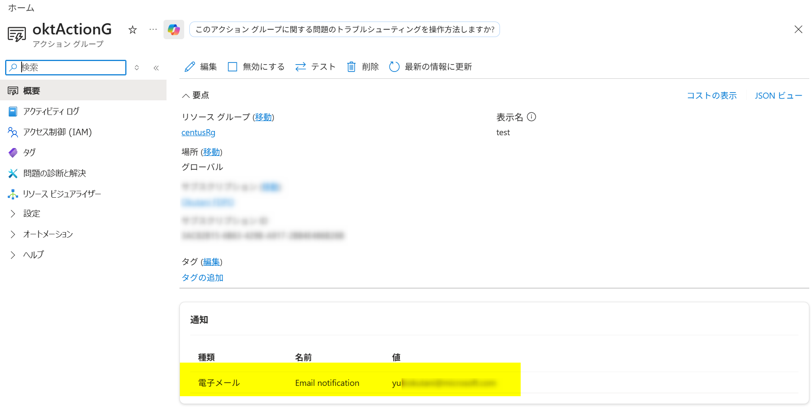

[スコープ]・[フィルター]・[アクション グループ] 設定内容を確認の上で [作成] をクリックします。
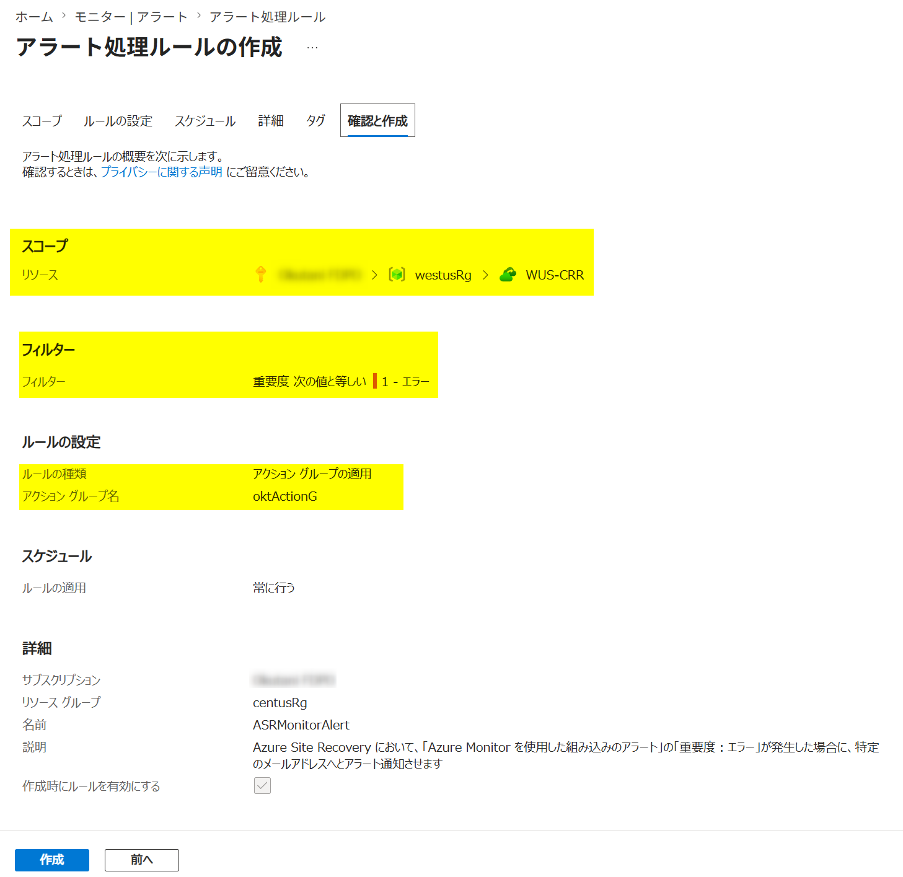

これで Azure Site Recovery に対する「Azure Monitor を使用した組み込みのアラート」を有効化でき、かつ「アラート 処理ルール」も設定できました。

### 2-3. 「組み込みの Azure Monitor アラート」を発生させてみる

次に、対象の Recovery Services コンテナーで ASR (Azure VM to Azure VM) のレプリケート構成を行っている Azure VM に対して、テスト的に Azure Site Recovery でエラーを発生させます。
今回は下記ブログに従って、「1. キャッシュ用ストレージ アカウントへの通信を切断しておく方法」で作業します。

- (参考) ASR を意図的に失敗させる方法
  https://jpabrs-scem.github.io/blog/AzureSiteRecovery/How_to_fail_ASR/

意図的に ASR でエラーを発生させる前に、「レプリケーション ヘルス」は元々「正常」となっていることを確認しておきます。
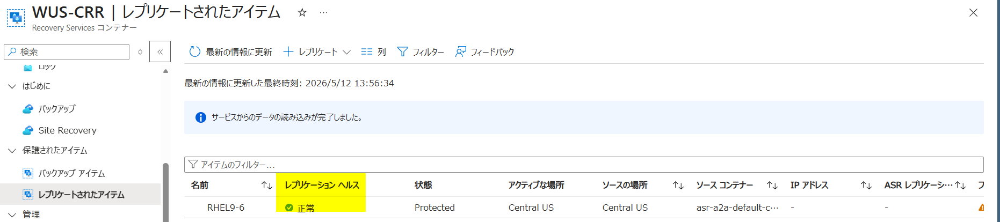

「回復ポイント」も取得できていることを確認しておきます。
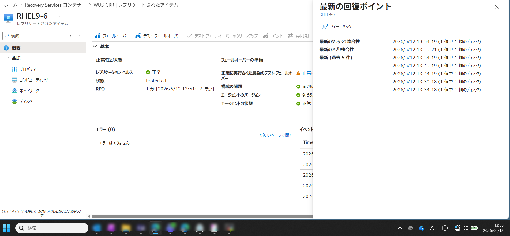

レプリケートされたアイテム > プロパティ 画面上にて、キャッシュ用ストレージ アカウントを確認しておきます。
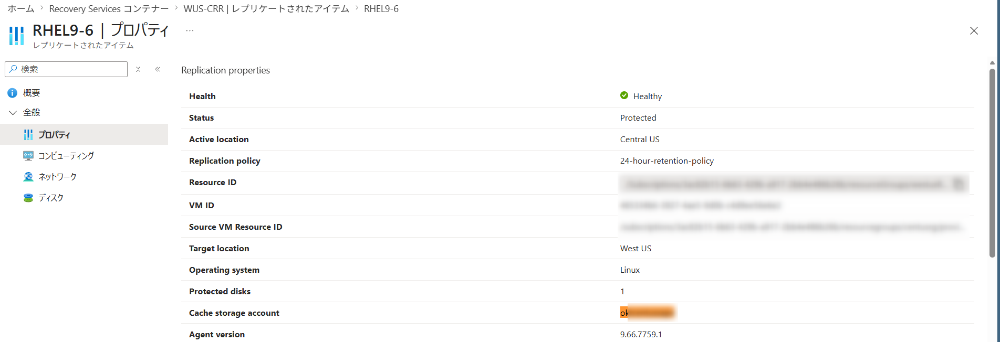

キャッシュ用ストレージ アカウント側の「ネットワーク」設定にて「パブリック ネットワーク アクセス：無効」へと設定変更します。
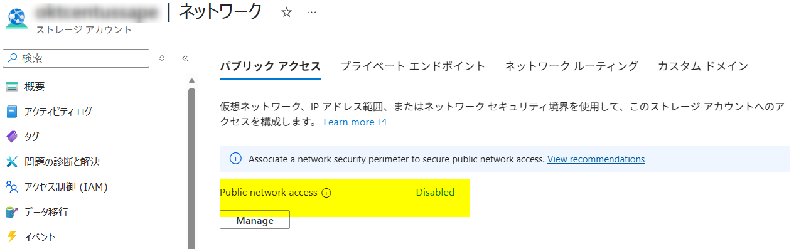

およそ 15 分ほど待ち、「レプリケーション ヘルス」が「重大」となっていることを Azure ポータル画面上で確認します。
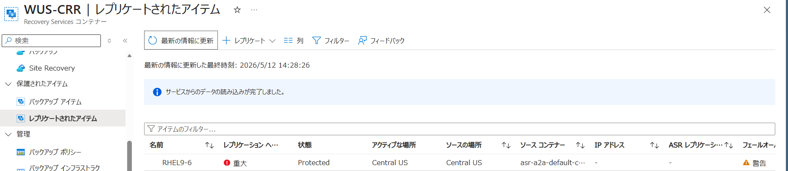

自動的に生成される「組み込みの Azure Monitor アラート」は、Recovery Services コンテナーの「警告」画面上でも確認可能です。
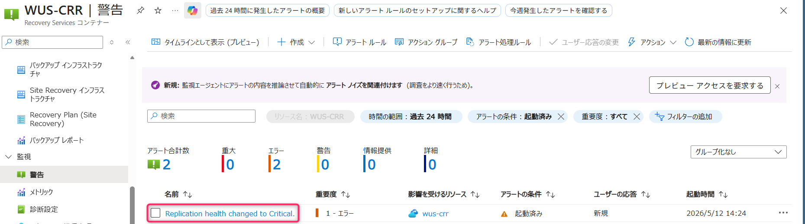

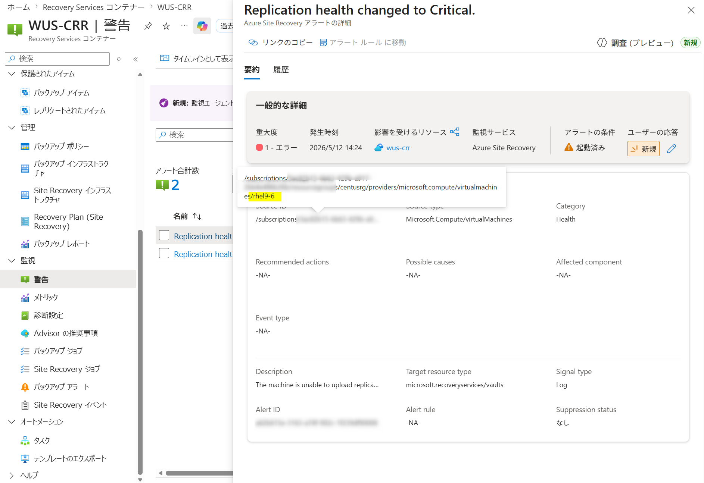

今回は「アラート 処理ルール」「アクション グループ」を構成済であるため、設定していたメール アドレス宛にも、対象の「組み込みの Azure Monitor アラート」が通知されていることが確認できます。

(メール件名 例) Fired:Sev1 Azure Monitor Alert Replication health changed to Critical. on wus-crr ( microsoft.recoveryservices/vaults ) at 5/12/2026 5:24:00 AM
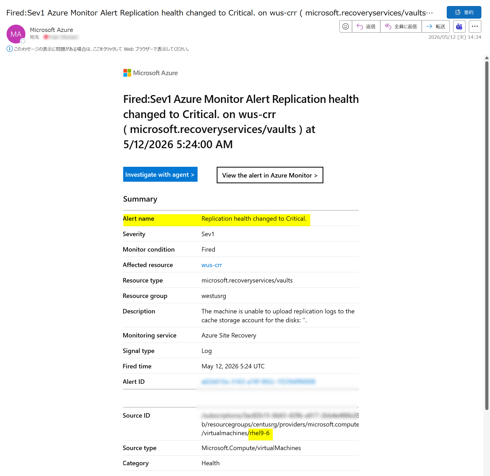

以上です。