<!-- more -->
みなさんこんにちは、Azure Site Recovery サポートです。
今回は、アラートをテスト目的で発報するために、意図的に Azure Site Recovery ( 以下、ASR ) を失敗させる方法をご紹介します。

ASR を意図的に失敗させたい場合、主に下記 2 種類の方法にて失敗させることができます。
1 種類目：キャッシュ用ストレージ アカウントへの通信を切断しておく
2 種類目：ASR レプリケーションに関わるサービスをソース マシン上で停止しておく

本ブログ記事では [Azure VM to Azure VM (ASR)] シナリオを例として、上記の具体的な作業手順を説明します。

## 目次
-----------------------------------------------------------
[1. キャッシュ用ストレージ アカウントへの通信を切断しておく方法](#1)  
[2. ASR レプリケーションに関わるサービスをソース マシン上で停止しておく方法](#2)   
[2-1. ASR レプリケーションに関わるサービスをソース マシン上で停止しておく方法 (Winodws OS 詳細)](#2-1)  
[2-2. ASR レプリケーションに関わるサービスをソース マシン上で停止しておく方法 (Linux OS 詳細)](#2-2)  
-----------------------------------------------------------

##  1. キャッシュ用ストレージ アカウントへの通信を切断しておく方法
もっとも簡単な方法として、キャッシュ用ストレージ アカウント側の「ネットワーク」設定にて
「パブリック ネットワーク アクセス：無効」へと設定しておくことで
ソース マシンからキャッシュ用ストレージ アカウントへの通信を行うことができず、後続の ASR レプリケーション処理が失敗します。

・(参考) アラートのシナリオ
　https://learn.microsoft.com/ja-jp/azure/site-recovery/site-recovery-monitor-and-troubleshoot#alerts-scenarios
　"Azure Site Recovery を使用してテスト VM のアラートの動作をテストするには、キャッシュ ストレージ アカウントのパブリック ネットワーク アクセスを無効にし、"レプリケーションの正常性に重大な問題があります" アラートが生成されるようにします。"

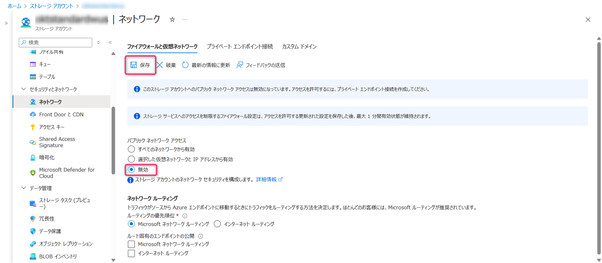

(画面例 : ストレージ アカウントの「パブリック ネットワーク アクセス」を変更しておよそ 15 分経過後)
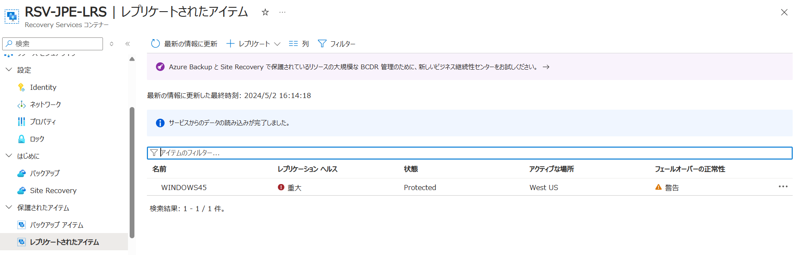

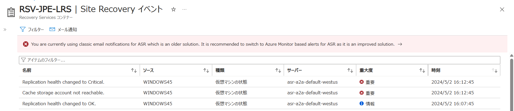

今回は事前に下記 2 種類のアラートをどちらも構成していたため、2 種類のメールアラートが発報されました。

・アラートの電子メール通知
　　https://learn.microsoft.com/ja-jp/azure/site-recovery/site-recovery-monitor-and-troubleshoot#subscribe-to-email-notifications

・Azure Site Recovery に関する組み込みの Azure Monitor アラート
　https://learn.microsoft.com/ja-jp/azure/site-recovery/site-recovery-monitor-and-troubleshoot#built-in-azure-monitor-alerts-for-azure-site-recovery-preview

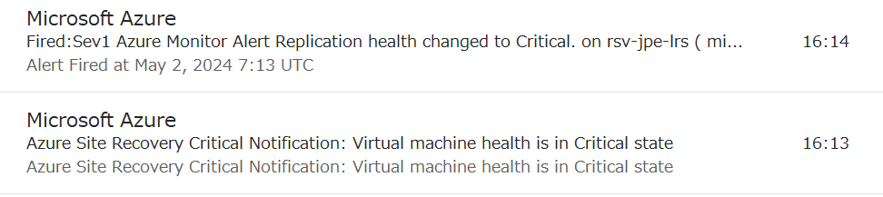

・(参考) Recovery Services コンテナーの Azure Site Recovery の現在の電子メール通知ソリューションは、引き続き動作しますか?
　https://learn.microsoft.com/ja-jp/azure/site-recovery/monitoring-common-questions#will-the-current-email-notification-solution-for-azure-site-recovery-in-recovery-services-vault-continue-to-work
　"現在のところ、既存の電子メール通知ソリューションは、新しい組み込みの Azure Monitor アラート ソリューションと共存しています。 
　　新しいエクスペリエンスに慣れ、その機能を活用するために、Azure Monitor ベースのアラートを試すことをお勧めします。"

(メール例 : アラートの電子メール通知)
件名：Azure Site Recovery Critical Notification: Virtual machine health is in Critical state
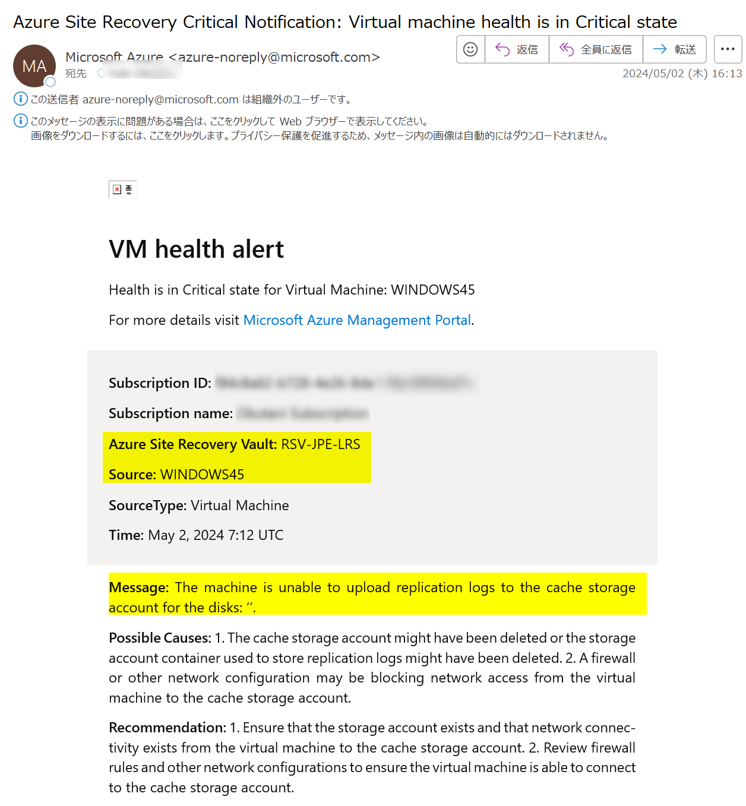

(メール例 : 組み込みの Azure Monitor アラート)
件名：Fired:Sev1 Azure Monitor Alert Replication health changed to Critical. on rsv-jpe-lrs ( microsoft.recoveryservices/vaults ) at 5/2/2024 7:13:49 AM
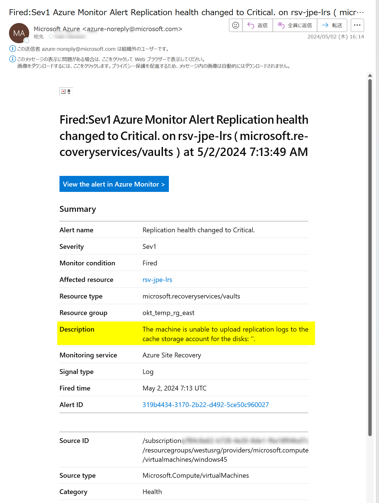

##  2. ASR レプリケーションに関わるサービスをソース マシン上で停止しておく方法
【Windows OS の場合】
ソース マシン上の「サービス」画面にて、下記 2 つのサービスを停止することでレプリケーションができなくなり、アラートを発報可能です。
(1) InMage Scout Application Service
(2) InMage Scout VX Agent - Sentinel/Outpost

【Linux OS の場合】
ソース マシン上で「vxagent」サービスを停止することでレプリケーションができなくなり、アラートを発報可能です。

##  2-1. ASR レプリケーションに関わるサービスをソース マシン上で停止しておく方法 (Winodws OS 詳細)

「サービス」画面を開きます。
Services.msc
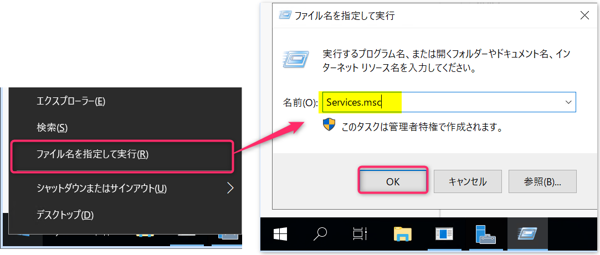

下記 2 つのサービスを手動で停止します。
(1) InMage Scout Application Service
(2) InMage Scout VX Agent - Sentinel/Outpost
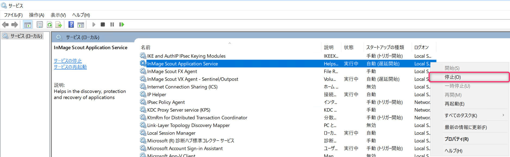

自動起動しないようスタートアップの種類を [無効] に変更しておきます。
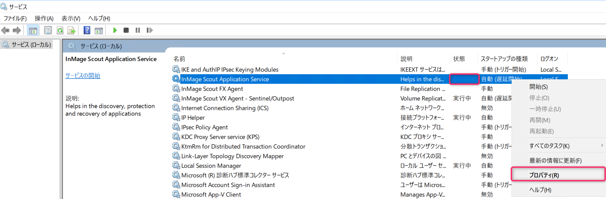

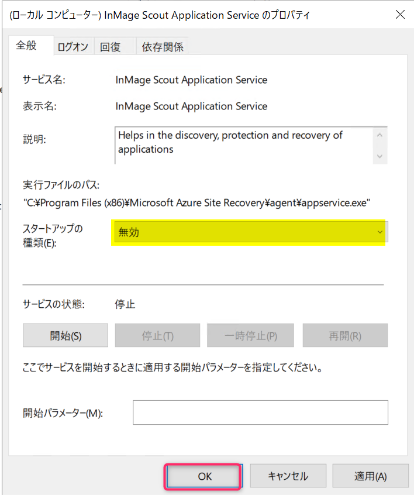

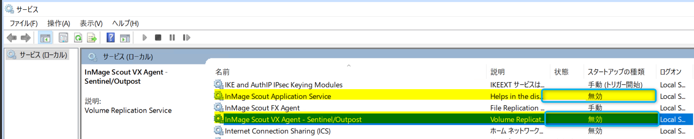

(画面例 : サービスを停止しておよそ 15 分経過後)
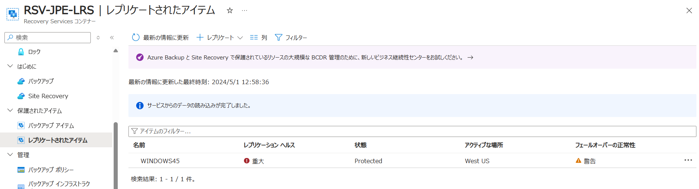

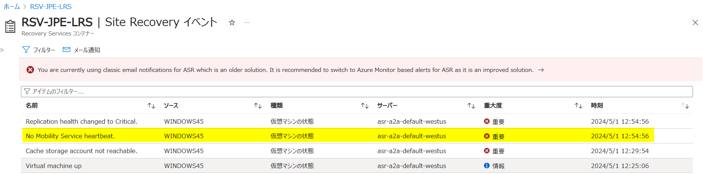

(メール例 : 組み込みの Azure Monitor アラート)
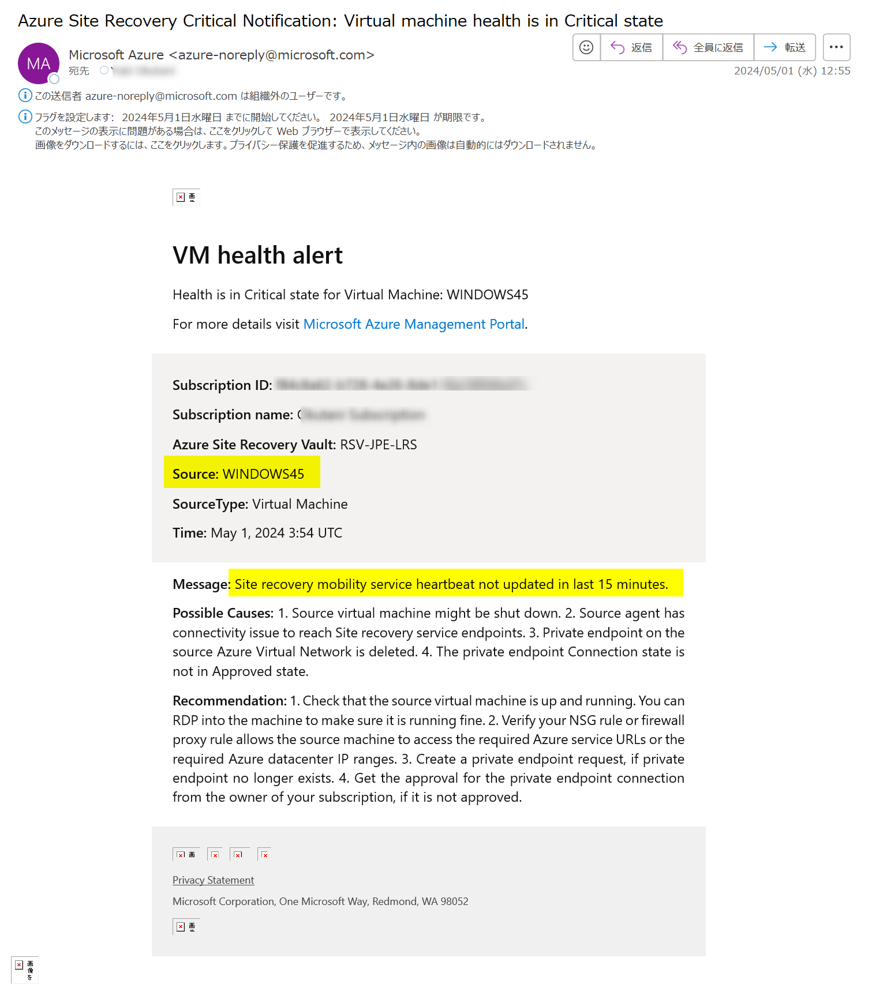

テスト終了後は、2 つのサービスの状態を元に戻しておきます。
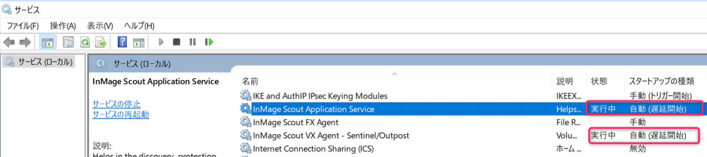

##  2-2. ASR レプリケーションに関わるサービスをソース マシン上で停止しておく方法 (Linux OS 詳細)

ソース マシン上で「vxagent」サービスを停止することでレプリケーションができなくなり、アラートを発報可能です。

今回は例として SLES OS の マシン上で「vxagent」サービスを停止してみます。
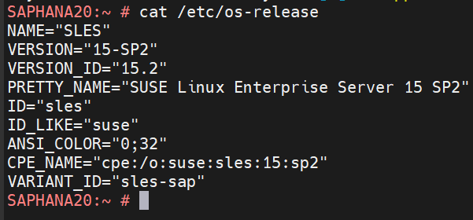

「vxagent」サービスの状態を確認します。
正常にレプリケーションできているマシンの場合、下図のように「active」と表示される見込みです。
`systemctl status vxagent`
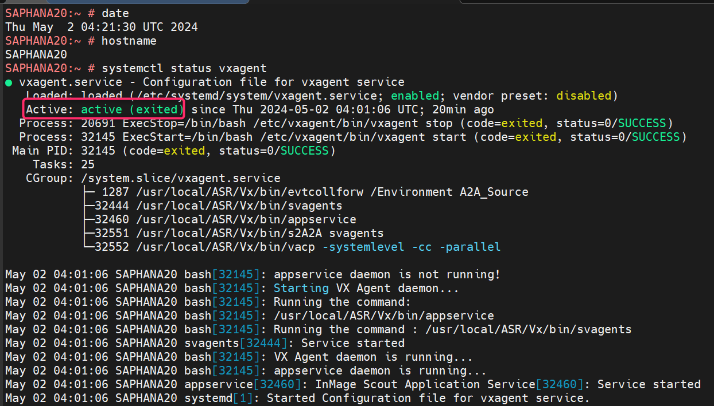

「vxagent」サービスの状態を停止します。
`systemctl stop vxagent`
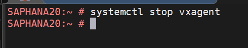

「vxagent」サービスが「inactive」になったことを確認します。
`systemctl status vxagent`
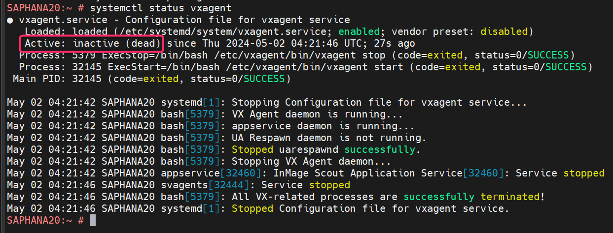

(画面例 : サービスを停止しておよそ 15 分経過後)
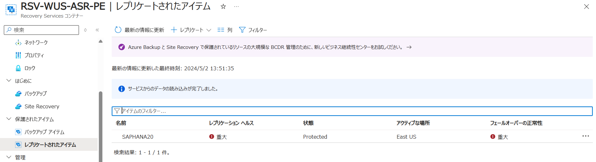

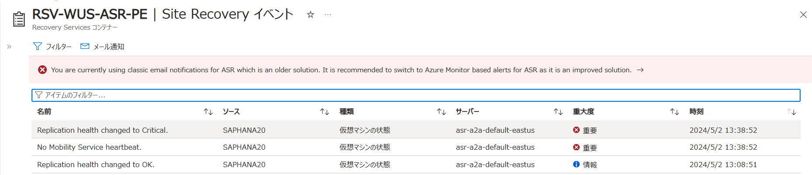

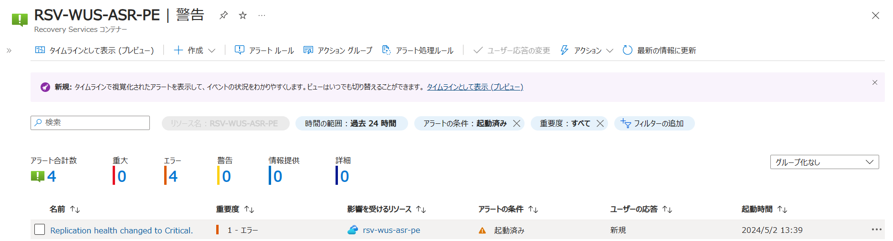

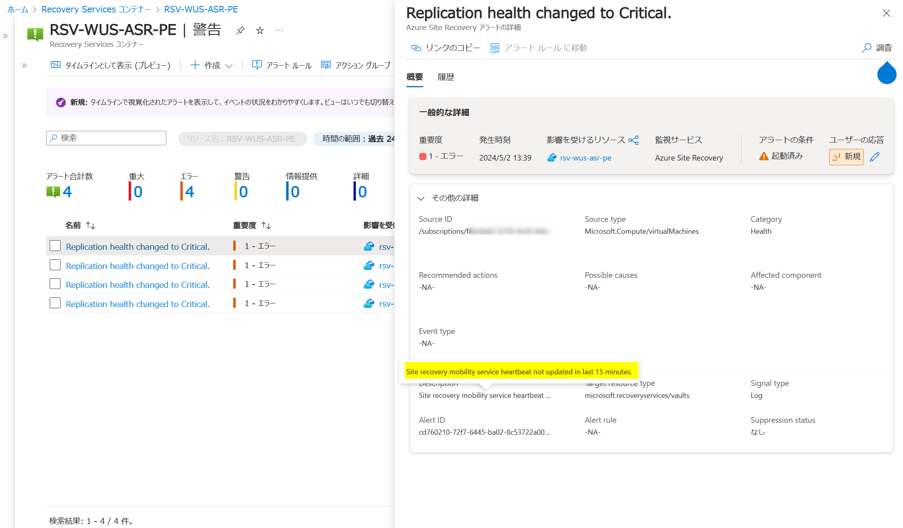

(メール例 : 組み込みの Azure Monitor アラート)
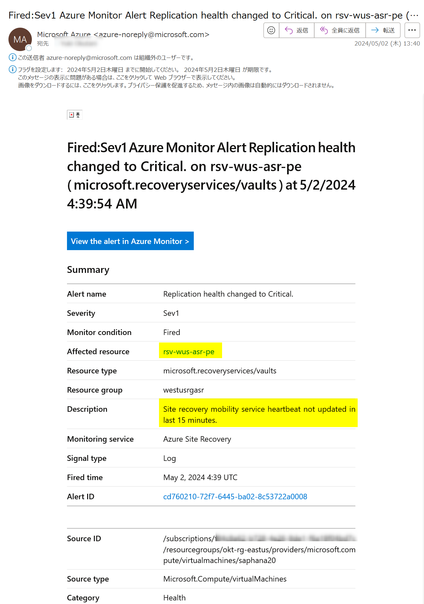

テスト終了後は、「vxagent」サービスを元に戻しておきます。
`systemctl start vxagent`

`systemctl status vxagent`
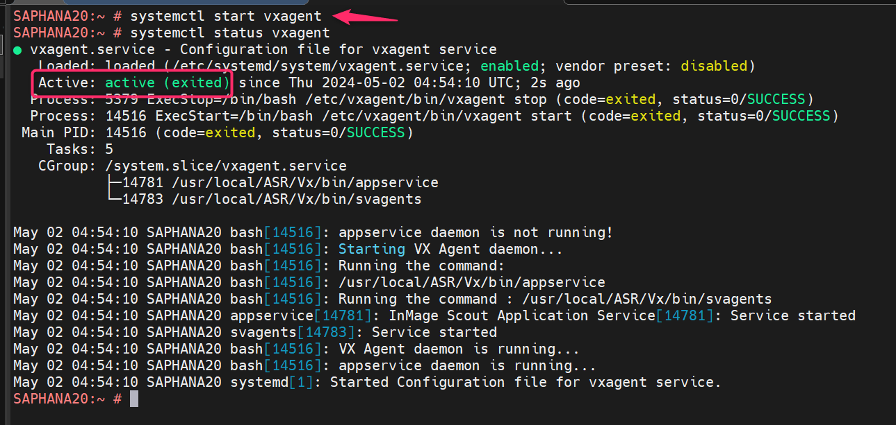

ASR を意図的に失敗させる方法の案内は、以上となります。