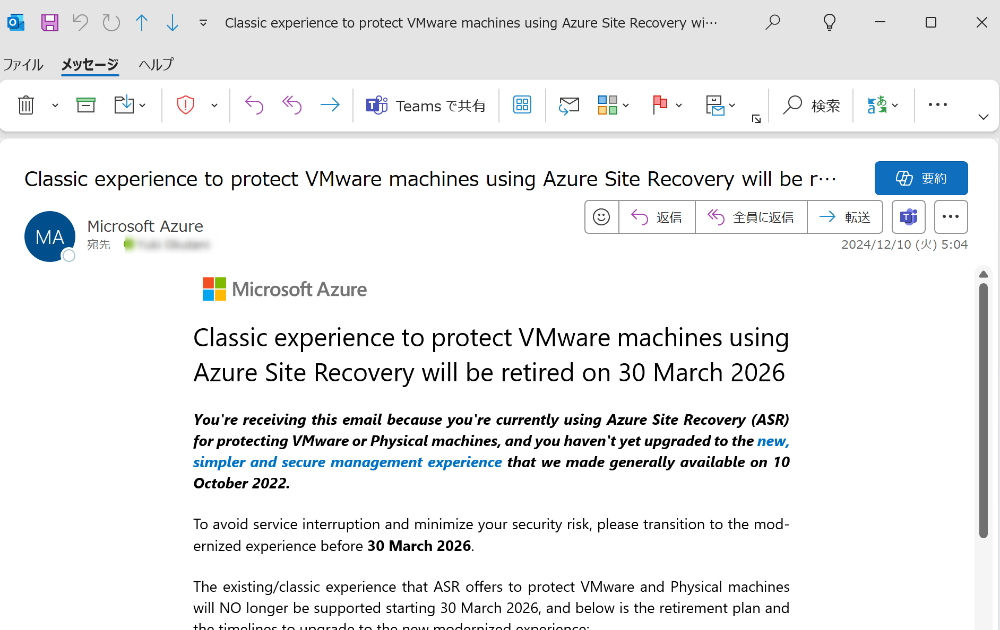

<!-- more -->
皆様こんにちは、Azure Site Recovery サポートです。
今回は「PT31-HR0」アラートなどで対象のユーザーへ通知している、
Azure Site Recovery (以下、ASR ) の「クラシック エクスペリエンス」から「モダン化 エクスペリエンス」へ移行する旨の通知について説明いたします。

**該当シナリオ**
- Azure Site Recovery | 物理マシン ⇒ Azure へのレプリケーション
- Azure Site Recovery | VMWare VM ⇒ Azure へのレプリケーション

## 目次
-----------------------------------------------------------
[1. このアラートが飛ぶ理由](#1)  
[2. ユーザー側で必要な作業](#2)  
[3. クラシック エクスペリエンスかどうかの見分け方](#3) 
-----------------------------------------------------------

##  1. このアラートが飛ぶ理由
一部のユーザーには、下図のような正常性の勧告やメール通知が届いていることと存じます。

メール件名：
Classic experience to protect VMware machines using Azure Site Recovery will be retired on 30 March 2026

このアラートが飛ぶ理由は、対象のサブスクリプション上にて「ASR クラシック エクスペリエンス構成」の Recovery Services コンテナーが存在しているためでございます。

ASR ではこれまで、下記公開ドキュメントで説明している「クラシック エクスペリエンス構成」による、物理マシン または VMWare VM のレプリケート構成が可能でした。

- (参考) VMware から Azure へのディザスター リカバリー アーキテクチャ - クラシック
  https://learn.microsoft.com/ja-jp/azure/site-recovery/vmware-azure-architecture

しかし、上記の「クラシック エクスペリエンス」は古い構成となりますので、今後は「モダン化 エクスペリエンス構成」にて、物理マシン または VMWare VM のレプリケートを構成いただく必要があります。
「クラシック エクスペリエンス」は 2026 年 3 月に廃止される予定です。
2026 年 3 月 30 日までに最新化されたエクスペリエンスへ移行しなかった場合、マシンのレプリケーションの健全性が失われ、「クラシック エクスペリエンス」に関わる機能のサポートも行われなくなります。

##  2. ユーザー側で必要な作業

「VMware や物理マシンの ASR レプリケーションを有効化していない」場合、対処は不要です。

「VMware や物理マシンの ASR レプリケーションを有効化しているが、モダン化 エクスペリエンス 構成である」場合、対処は不要です。

「VMware や物理マシンの ASR レプリケーションを有効化しており、クラシック エクスペリエンス 構成である」場合、対処が必要です。

下記公開ドキュメントに従って、クラシック エクスペリエンスからモダン化 エクスペリエンスへと移行ください。

- (参考) クラシックから、最新化された VMware ディザスター リカバリーに移行する
  https://learn.microsoft.com/ja-jp/azure/site-recovery/move-from-classic-to-modernized-vmware-disaster-recovery

- (参考) クラシックから最新化された VMware ディザスター リカバリーに移行する方法
  https://learn.microsoft.com/ja-jp/azure/site-recovery/how-to-move-from-classic-to-modernized-vmware-disaster-recovery

- (参考) Azure Site Recovery を使って VMware と物理マシンを保護するためのクラシック エクスペリエンスの非推奨
https://learn.microsoft.com/ja-jp/azure/site-recovery/vmware-physical-azure-classic-deprecation#what-changes-should-you-expect

##  3. クラシック エクスペリエンスかどうかの見分け方
Azure Portal にて Recovery Services コンテナーを開き > はじめに - Site Recovery > 「VMware マシンを Azure に」 の下にある 1. の末尾に `(従来)` が、  
付与されている場合は、**クラシック エクスペリエンス** となります。  
付与されて**いない**場合は、**モダン化 エクスペリエンス** となります。

本ブログ記事のご案内は以上です。