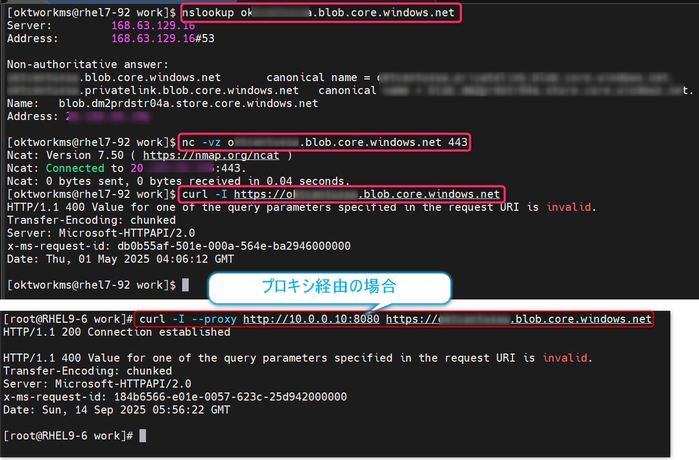

<!-- more -->
皆様こんにちは。Azure Site Recovery サポートです。
今回は Azure Site Recovery (以下、ASR ) にて「レプリケーションの有効化 が失敗する」「レプリケートが失敗している」といった場合に調査をするにあたり、ネットワーク観点で提供いただきたい情報をお伝えいたします。
ネットワーク観点以外で、サポートにて調査時に必要なログは下記をご覧ください
- ASR の障害調査に必要な情報
  https://jpabrs-scem.github.io/blog/AzureSiteRecovery/RequestForInvestigating_ASR/

**該当シナリオ**
1. A2A : Azure Site Recovery 機能を利用して、「Azure 仮想マシン」をレプリケート構成するシナリオ (Azure to Azure)
   - Azure から Azure へのディザスター リカバリー アーキテクチャ
     https://learn.microsoft.com/ja-jp/azure/site-recovery/azure-to-azure-architecture
1. H2A : Azure Site Recovery 機能を利用して、「Hyper-V ゲスト マシン」をレプリケート構成するシナリオ (Hyper-V to Azure)
   - Hyper-V から Azure へのディザスター リカバリー アーキテクチャ
 　  https://learn.microsoft.com/ja-jp/azure/site-recovery/hyper-v-azure-architecture

※　本ブログ記事は、「パブリック エンドポイント経由で ASR 構成する」場合の疎通確認スクリプトです。
　　プライベート エンドポイント経由で ASR 構成している場合のブログ記事ではありません。
　　プライベート エンドポイント構成の場合、ユーザーの環境毎に作成されているプライベート FQDN へ接続確立できているかどうかを、ユーザー側にて確認いただく必要があります。

## 目次
-----------------------------------------------------------
[1. Azure Site Recovery の A2A・H2A シナリオにおける通信要件](#1)
[2. Windows OS における ASR 疎通確認スクリプト](#2)
[3. Linux OS における ASR 疎通確認スクリプト](#3)
[4. 疎通確認スクリプトの構成](#4)
[4-1. Windows OS 向けの疎通確認スクリプト内の構成](#4-1)
[4-2. Linux OS 向けの疎通確認スクリプト内の構成](#4-2)
[5. 手動でキャッシュ用ストレージ アカウントへの疎通を確認する方法](#5)
[5-1. コマンドを使った疎通確認 - 手順](#5-1)
[5-2. Azure Storage Explorer を使った確認 - 手順](#5-2)
-----------------------------------------------------------

## 1. Azure Site Recovery の A2A・H2A シナリオにおける通信要件
Azure 仮想マシンのレプリケートを構成したい場合には、レプリケート希望の Azure 仮想マシン上で、下記の通信要件を満たしている必要があります。

- A2A 接続の要件 (パブリック エンドポイント経由でレプリケート構成する場合)
  https://learn.microsoft.com/ja-jp/azure/site-recovery/azure-to-azure-architecture#connectivity-requirements

- H2A 接続の要件 (パブリック エンドポイント経由でレプリケート構成する場合)
  https://learn.microsoft.com/ja-jp/azure/site-recovery/hyper-v-azure-architecture#set-up-outbound-network-connectivity

上図は、 A2A の通信要件ドキュメント (パブリック エンドポイント経由) の画像です。
黄色罫線箇所のアドレスは、「A2A」「H2A」どちらのシナリオであっても同様に必要となる通信要件です。
「Service Bus」は、「レプリケート処理」自体には必要はありませんが、Azure 仮想マシン上でのレプリケート状態などを、Azure へと送信し、Azure ポータル画面の「レプリケート ヘルス」欄にて正しいレプリケート状態を確認するために必要な通信先となります。
レプリケート希望の Azure 仮想マシンが ADE 暗号化済なのであれば、「Key Vault」への通信確立も必要となります。
A2A シナリオにおいて、Azure 仮想マシンのレプリケートを構成する場合、Azure 仮想マシン上に「モビリティ サービス エージェント」がインストールされ、機能することとなりますが、このモビリティ サービス エージェントを自動的に更新したい場合には「Azure Automation」への接続も必要となります。

## 2. Windows OS における ASR 疎通確認スクリプト
※　本疎通確認スクリプトは、あくまで「パブリック エンドポイント経由での ASR 利用」を想定とした確認スクリプトです。

【スクリプト実行手順】
1. 下記 リンク先から疎通確認スクリプトをダウンロード・展開ください
   [ASRNWCheck.zip](./RequestForInvestigatingNWASR/ASRNWCheck.zip)
   ※ ファイルの解凍パスワードは **“SiteRecovery”** となります。
1. マシン上にて、管理者特権の PowerShell コンソール を立ち上げ、**Check_ASR_NW_Windows_A2A_H2A_ver1.0.ps1** を実行ください。
   (スクリプト実行対象マシン)
   - A2A (Azure to Azure) シナリオの場合：レプリケート希望の Azure 仮想マシン上
   - H2A (Hyper-V to Azure) シナリオの場合：対象の Hyper-V ホストマシン上

   (実行例 1)
   `.\Check_ASR_NW_Windows_A2A_H2A_ver1.0.ps1 <キャッシュ用ストレージ アカウントとして設定しているストレージ アカウント名>`
   (実行例 2)
   `.\Check_ASR_NW_Windows_A2A_H2A_ver1.0.ps1`
   ※　引数にキャッシュ用ストレージ アカウント名を渡さない場合、キャッシュ用ストレージ アカウントへの通信確認は行われません。
   (実行画面例 1)
   

   (実行画面例 2)
   

   ※　スクリプト実施時に実行ポリシーの制限によりスクリプトが実行できない場合は、下記コマンドを実行して実行ポリシーを変更後、再度スクリプト実効をお試しください。
   `Set-ExecutionPolicy Unrestricted`
1. “Script Completed” が出力されれば、スクリプトは終了です。
   ※　スクリプト実行完了までには、環境によっては 20 分ほど要する場合がございます。20 分経っても完了しない場合は、control + c を押下して強制終了してください。
   
1. スクリプト実行が完了すると、スクリプトと同じフォルダ内に以下のようなログファイルが出力されますので、弊社までご提供ください。
   ログファイル名: ASR_Check_NW_yyyymmdd_hhmmss.log
   
   ※ control + c にて強制終了した場合においても該当のログファイルが出力されますので、弊社までご提供ください。

## 3. Linux OS における ASR 疎通確認スクリプト
※　本疎通確認スクリプトは、あくまで「パブリック エンドポイント経由での ASR 利用」を想定とした確認スクリプトです。

【スクリプト実行手順】
1. 下記 リンク先から疎通確認スクリプトをダウンロード・展開ください
   [ASRNWCheck.zip](./RequestForInvestigatingNWASR/ASRNWCheck.zip)
   ※ ファイルの解凍パスワードは **“SiteRecovery”** となります。
1. レプリケート希望の Azure 仮想マシン (Linux OS) マシン上にて、**Check_ASR_NW_Linux_A2A_ver1.0.sh** を配置します。
   必要に応じて chmod コマンドなどを用いてパーミッションを変更してください。
   `chmod 777 Check_ASR_NW_Linux_A2A_ver1.0.sh` 
1. スクリプトを実行ください。
   (実行例 1)
  `./Check_ASR_NW_Linux_A2A_ver1.0.sh -s <キャッシュ用ストレージ アカウントとして設定しているストレージ アカウント名>`
   (実行例 2)
   `Check_ASR_NW_Linux_A2A_ver1.0.sh`
   ※　引数にキャッシュ用ストレージ アカウント名を渡さない場合、キャッシュ用ストレージ アカウントへの通信確認は行われません。
   (実行画面例)
   

1. “Script Completed” が出力されれば、スクリプトは終了です。
   ※　スクリプト実行完了までには、環境によっては 20 分ほど要する場合がございます。20 分経っても完了しない場合は、control + c を押下して強制終了してください。
1. スクリプト実行が完了すると、スクリプトと同じフォルダ内に以下のようなログファイルが出力されますので、弊社までご提供ください。
   ログファイル名: CheckNWResult_<ホスト名>_yyyymmddhhmm.log
   
   ※ control + c にて強制終了した場合においても該当のログファイルが出力されますので、弊社までご提供ください。

## 4. 疎通確認スクリプトの構成
### 4-1. Windows OS 向けの疎通確認スクリプト内の構成
Windows OS 向けの疎通確認スクリプト (Check_ASR_NW_Windows_A2A_H2A_ver1.0.ps1) では、下記を実施しています。

(1) 「HOSTNAME.EXE」「ipconfig.exe」実行によるマシン情報の出力
(2) プロキシ設定の確認
(3) Azure Site Recovery サービス (hypervrecoverymanager.windowsazure.com) への「tnc」「Invoke-webRequest」コマンド実行
(4) (ストレージ アカウントを引数に渡している場合) Azure ストレージ アカウント (XXX.blob.core.windows.net) への「tnc」「Invoke-webRequest」コマンド実行
(5) Microsoft Entra ID (login.microsoftonline.com) への「tnc」「Invoke-webRequest」コマンド実行
(6) TLS 設定 情報の出力

### 4-2. Linux OS 向けの疎通確認スクリプト内の構成
Linux OS 向けの疎通確認スクリプト (Check_ASR_NW_Linux_A2A_ver1.0.sh) では、下記を実施しています。

(1) 「ip a」「hostnamectl」コマンドによるマシン情報の出力
(2) プロキシ設定の確認
(3) Microsoft Entra ID (login.microsoftonline.com) への「nslookup」「nc」「curl」コマンド結果
(4) Azure Site Recovery サービス (hypervrecoverymanager.windowsazure.com) への「nslookup」「nc」「curl」コマンド結果
(5) (ストレージ アカウントを引数に渡している場合) Azure ストレージ アカウント (XXX.blob.core.windows.net) への「nslookup」「nc」「curl」コマンド結果

## 5. 手動でキャッシュ用ストレージ アカウントへの疎通を確認する方法
手動でストレージ アカウントへの接続を確認する方法を紹介します。

【確認オプション】
- (オプション 1 ) コマンドを使った疎通確認
- (オプション 2 ) Azure Storage Explorer を使って、対象マシンから、適当なファイルをストレージ アカウントの BLOB コンテナーへとアップロードまでできるかを確認

※ すでに「レプリケーションの有効化」作業を実施済の場合、「どのストレージ アカウントをキャッシュ用として設定したのか」は、Azure ポータル画面 > 対象の Recovery Services コンテナー > レプリケートされたアイテム > [プロパティ]画面より確認可能です。

### 5-1. コマンドを使った疎通確認 - 手順
OS 別に、下記コマンドを全て実行ください。
弊社サポートへのお問い合わせを希望される場合は、「実行コマンド」と「実行結果」が分かる内容をテキストファイル形式にて、弊社までご提供ください。

【Windows OS のマシンから確認する場合 - PowerShell にて確認】
`nslookup <ストレージ アカウント名>.blob.core.windows.net`
`tnc -port 443 <ストレージ アカウント名>.blob.core.windows.net`
`Invoke-WebRequest https://<ストレージ アカウント名>.blob.core.windows.net`

(※)プロキシを経由して、キャッシュ用ストレージ アカウントとの通信を行いたい場合は、追加で下記コマンドを実行ください。
`Invoke-WebRequest https://<ストレージ アカウント名>.blob.core.windows.net -Proxy http://<プロキシ サーバーの IP アドレス>:<プロキシ ポート>`

(実行結果例)

【Linux OS のマシンから確認する場合】
`nslookup <ストレージ アカウント名>.blob.core.windows.net`
`nc -vz <ストレージ アカウント名>.blob.core.windows.net 443`
`curl -I https://<ストレージ アカウント名>.blob.core.windows.net`

(※)プロキシを経由して、キャッシュ用ストレージ アカウントとの通信を行いたい場合は、追加で下記コマンドを実行ください。
`curl -I --proxy http://<プロキシ サーバーの IP アドレス>:<プロキシ ポート> https://<ストレージ アカウント名>.blob.core.windows.net`

(実行結果例)

### 5-2. Azure Storage Explorer を使った確認 - 手順
1. 対象マシン上で、次の URL から Azure Storage Explorer をインストールします。
   https://azure.microsoft.com/ja-jp/products/storage/storage-explorer/#overview
1. Azure ポータル画面 > ストレージ アカウント > [セキュリティとネットワーク] > [アクセス キー] > [ストレージ アカウント名] と [key] を確認しておきます。
   
1. 対象マシン上で、インストールした Azure Storage Explorer を使って、接続テストを行います。
   Azure Storage Explorer を起動し、Connect to Azure resources を選択します。
   
1. Storage account or service を選択します。
   
1. Account name and keyを選択し、Next をクリックします。
   
1. Account name に、手順「2」で確認した [ストレージ アカウント名] を、Account key に [key] を入力し、Next クリックします。
   
1. 内容を確認し、Connect をクリックします。
   
1. Explorer より、接続したストレージ アカウントの Blob を確認します。
   (Blob が未作成の場合) 任意の名前で Blob コンテナーを作成ください。
   
1. アップロードテスト用に 4 MB のファイルを生成します。PowerShell で、任意のディレクトリ上で次のコマンドを実行して下さい。
   `fsutil file createnew dummy4MB.dat 4194304`
   
   
1. 生成したファイルをストレージ アカウントの Blob コンテナー 上にアップロードします。
   [Upload] > [Upload Files...] をクリックし、ファイルのアップロードを行います。
   
1. 各コンテナーへのアップロードが正常終了することを確認します。
   
2. BLOB コンテナーへのアップロードが正常に行えることを確認した後は、テスト目的で任意に作成した BLOB コンテナーとファイルは削除ください。

ご案内は以上となります。