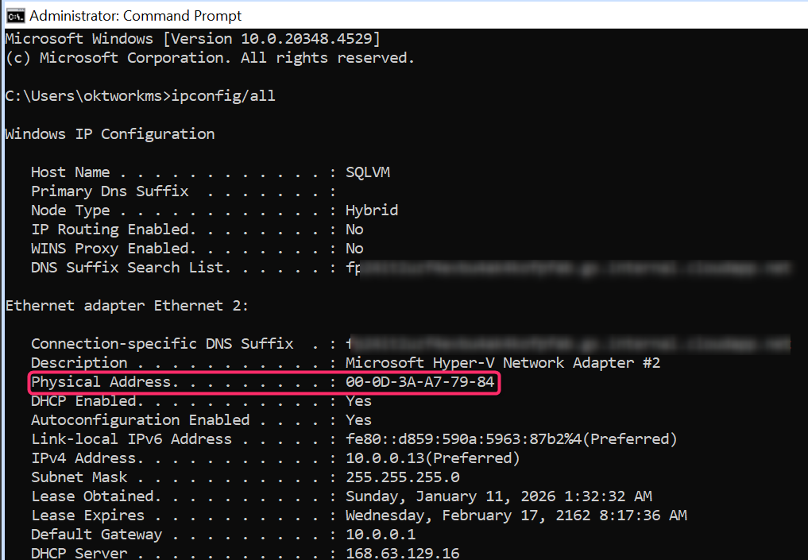

<!-- more -->
みなさんこんにちは、Azure Site Recovery サポートです。

今回は Azure Site Recovery (もしくは Azure Migrate) を利用して、マシンを Azure VM としてフェールオーバーした際に、マシン上で変更される情報と、そのまま変わらず引き継がれる情報を説明します。

## 目次
-----------------------------------------------------------
[1. フェールオーバー前後で変更される情報](#1)
[2. IP アドレスについて](#2)
[3. UUID (GUID) について](#3)
[4. MAC アドレスについて](#4)
[5. SID について](#5)
[6. ホスト名、Azure VM 名について](#6)
-----------------------------------------------------------

##  1. フェールオーバー前後で変更される情報

- オンプレミス環境上のマシン
- VMWare VM 上のマシン
- Azure VM

上記いずれかを、Azure VM としてフェールオーバーした際に、Azure VM 上で変わるものと、変わらずにそのままソース マシン上の情報を引き継ぐものをまとめました。

- **フェールオーバー前後で変わらない情報**
  プライベート IP アドレス
  一時ディスク以外の UUID (GUID)
  SID
  ホスト名
  Azure VM 名

- **フェールオーバー済 Azure VM 上で変わる情報**
  パブリック IP アドレス
  MAC アドレス
  一時ディスクの UUID (GUID)

##  2. IP アドレスについて
- パブリック IPアドレス 
  フェールオーバー元となる、レプリケート対象のソース マシンと比べて、フェールオーバーされる Azure VM 上のパブリック IPアドレスは変更されます。

- プライベート IPアドレス
  ソース マシンと同じアドレスをフェールオーバー VM 上でも維持することが可能です。
  ただし、フェールオーバー先の Azure Vnet に同じ IP アドレス空間のサブネットを用意いただく必要があります。

なお、フェールオーバーされた Azure VM が、オンプレミスのソース マシンと同じ IP アドレス/サブネットを使用する場合は、アドレスが重複しているため、サイト間 VPN 接続または ExpressRoute を使用して、それらを接続することはできませんので、ご注意ください。

フェールオーバー後も、同一のプライベート IP アドレスを設定する手順は、以下公開情報をご参照ください。

- (参考) 内部アドレスの割り当て
  https://learn.microsoft.com/ja-jp/azure/site-recovery/concepts-on-premises-to-azure-networking#assign-an-internal-address

- (参考) Azure Site Recovery | Azure to Azure | サポート マトリックス | IP アドレス
  https://learn.microsoft.com/ja-jp/azure/site-recovery/azure-to-azure-support-matrix#replicated-machines-networking

- (参考) フェールオーバー時に IP アドレスを保持する
  https://learn.microsoft.com/ja-jp/azure/site-recovery/site-recovery-retain-ip-azure-vm-failover

##  3. UUID (GUID) について
Linux OS / Windows OS どちらの環境においても、フェールオーバー前後でディスク・パーティションの UUID (GUID) は変わりません。
しかし、Azure VM にもともとアタッチされている「一時ディスク」については、フェールオーバーすると UUID (GUID) は変化します。
なお、Azure Site Recovery では Azure VM 上の一時ディスクに対しては、レプリケート対象ではなく、非サポートとなっております。
このため、レプリケートを希望する重要なデータを Azure VM の一時ディスク上には保管しないでください。

- (参考) Azure Site Recovery | Azure to Azure | サポート マトリックス | 一時ディスク
  https://learn.microsoft.com/ja-jp/azure/site-recovery/azure-to-azure-support-matrix#replicated-machines-storage
  

> [!TIP]
> Linux OS (RHEL) の場合、RHEL では、/dev/disk/by-uuid 上で UUID / GUID を確認可能です。 
> Azure VM (Linux OS) の一時ディスクは、通常 /dev/sdb にマウントされています。
>  
> Windows OS の場合、mountvol コマンド使って UUID / GUID を確認可能です。 
> Azure VM (Windows OS) の一時ディスクは、既定で D: となります。

##  4. MAC アドレスについて
Azure VM として、フェールオーバー VM が作成されるたびに、新しい Azure NIC が作成・付与されます。
この NIC の情報には MAC アドレスも含まれているため、MAC アドレスも変わることとなります。

Windows OS の場合、ipconfig/all コマンドにて MAC アドレスを確認ができます。

(例) 

##  5. SID について
Azure Site Recovery の仕様上、フェールオーバー前後の SID は同様となります。
予期せぬ問題が発生しないよう、Azure Site Recovery (Azure Migrate)  観点では、下記を推奨しています。

- ソース マシンをシャットダウンした状態で、フェールオーバーすること
- ソース マシンとフェールオーバー Azure VM が、それぞれ通信できないよう、ネットワークが分離された Vnet 上へまず「テスト フェールオーバー」して、動作確認すること

- (参考) テスト フェールオーバー用のネットワークの作成
  https://learn.microsoft.com/ja-jp/azure/site-recovery/site-recovery-test-failover-to-azure#create-a-network-for-test-failover

- (参考) Active Directory と DNS のディザスター リカバリーを設定する | テスト フェールオーバーの考慮事項
  https://learn.microsoft.com/ja-jp/azure/site-recovery/site-recovery-active-directory#test-failover-considerations

なお、sysprep を利用しない状態で、同じ Active Directory ネットワーク内で SID が重複するマシンが同時に起動している状態は、Windows OS としてはサポートされない構成となります。

## 6. ホスト名、Azure VM 名について

ソース マシンと同じホスト名の Azure VM がフェールオーバー VM として新規作成されます。

- (参考) Azure VM のホスト名を表示する
  https://learn.microsoft.com/ja-jp/azure/virtual-network/virtual-networks-viewing-and-modifying-hostnames#view-hostnames

※ 「Azure VM 名」と「ホスト名」は異なりますので、混同しないようにご注意ください。

Azure VM 名は、レプリケートを構成する際に、ソース マシンと同名にすることも、異なる名前にすることも、どちらも可能です。

本記事の内容は以上となります。