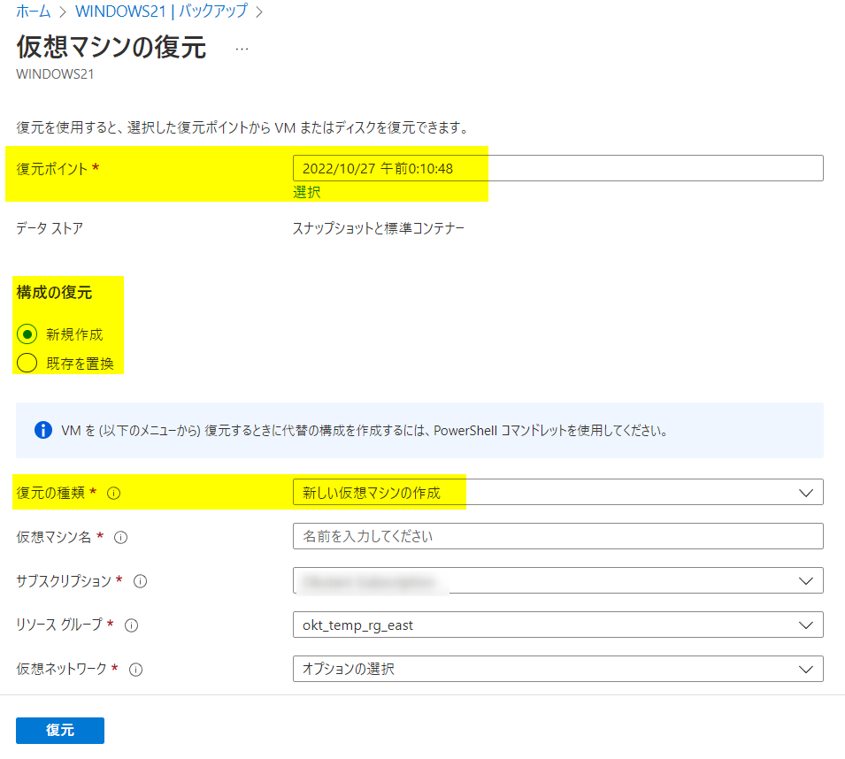

<!-- more -->
みなさんこんにちは、Azure Backup サポートです。
今回は、Active Directory ( 以下、AD ) のドメインに参加している Azure 仮想マシンを、Azure VM Backup にて保護する場合に、よくお問い合わせいただく内容についてご案内いたします。

#### 前提
Azure VM Backupにて保護することを前提とすると、「ドメインに参加している Azure 仮想マシンを、Azure VM Backup にてバックアップ・リストアする場合の考慮事項」というのは特にございません。
ただし、リストア (=復元) 後は Active Directory の観点で、環境に合わせた考慮事項が発生いたします。
Windows OS 上の作業詳細についてご不明点がございます場合は、恐縮ながら Azure Backup チームではなく、 Active Directory を取り扱う部署にて対応いたしております。
Active Directory 観点でのサポートについては、お客様の契約次第ではオンプレミス チームでの有償対応が必要となることがございます。
また、お客様のご契約が Azure 製品のサポート契約のみの場合は、オンプレミス範囲のサポート契約がないために、詳細なサポート対応・調査が行えない可能性がございます。
お客様にてご契約内容をご確認の上で、「復元」ジョブ完了後の Active Directory 観点の考慮点・作業詳細については、Windows OS - Active Directory 向けへお問い合わせを起票いただきますよう、よろしくお願い申し上げます。

## 目次
-----------------------------------------------------------
[Q1. ドメインに参加している Azure 仮想マシンを、Azure VM Backup にてバックアップ・リストアする場合の考慮事項はありますか？](#Q1)
[Q2. 「復元」ジョブ完了後は、ドメインの再参加は必要ですか？](#Q2)
[Q3. ドメインに参加している Azure 仮想マシンを、Azure VM Backup にてバックアップ・リストアする場合、「復元」後は ドメイン ID は変わってしまいますか？](#Q3)
[Q4. ドメイン コントローラー ( = DC ) 自体の Azure VM Backup におけるバックアップ・復元について詳細を教えてください](#Q4)
[Q5. ドメイン内のひとつの ドメイン コントローラーを復元する場合、何らかの考慮が必要になりますか？](#Q5)
[Q6. ドメイン内のすべての ドメイン コントローラーを復元する場合、何らかの考慮が必要になりますか？](#Q6)
[Q7. Azure AD Connect (=AADC) をインストールして使用している Azure 仮想マシンがあります。AADC の復旧手順を教えてください。](#Q7)
-----------------------------------------------------------

## Q1. ドメインに参加している Azure 仮想マシンを、Azure VM Backup にてバックアップ・リストアする場合の考慮事項はありますか？
#### 「構成の復元：新規作成」「構成の復元：既存を置換」など、どの復元オプションで復元すべきですか？
**A1** Azure VM Backupにて保護することを前提とすると、「バックアップ取得する際」「復元時」について、Azure Backup 観点では特に注意点、考慮事項はございません。
復元オプションには以下いずれかを選択いただいて構いませんので、お客様のご要件に従って決定ください。
（復元オプション）
・「構成の復元：新規作成」「復元の種類：新しい仮想マシンの作成」
・「構成の復元：新規作成」「復元の種類：ディスクの復元」
・「構成の復元：既存を置換」「復元の種類：ディスクの置換」

・Azure portal で Azure VM データを復元する方法
　https://learn.microsoft.com/ja-jp/azure/backup/backup-azure-arm-restore-vms#restore-vms-with-special-configurations

ただし、〈前提〉に記載の通り、「復元」ジョブ完了後の Windows OS 上での作業詳細や考慮事項については、Azure サポートではなく、Windows OS - Active Directory 向けへお問い合わせを起票いただきますよう、よろしくお願い申し上げます。

##### 「復元の種類：新しい仮想マシンの作成」にて復元する場合の考慮点
この場合、復元される Azure 仮想マシンのホスト名や、SID識別子は復元もとと同一となります。
SID 識別子やユーザ固有の情報が重複する為、同一のネットワーク上に「復元の種類：新しい仮想マシンの作成」での復元を行った場合、なんらかの問題が起こる可能性、懸念が考えられます。
そのため、復元もとの Azure 仮想マシンが破損などにより起動できない状態などでの復元シナリオでは、重複トラブルは避けられますが、それ以外の目的で復元する場合は、この状態を避けるため、通常は一般化の上利用いただく必要がございます。

一般化に関しては下記ブログ記事をご覧のうえ、下記の詳細については、新規サービスリクエストを起票の上、Azure VM 担当部署までご相談いただくようお願いいたします。
・VM 複製方法について part.1/3 2 つの方法の紹介
　https://jpaztech.github.io/blog/vm/vm-replica-1/

また、「復元の種類：新しい仮想マシンの作成」にて復元した場合は、デフォルトで NIC が新たに作成される点に関するブログ記事を公開しておりますので、下記ご参考になれば幸いです。
・Azure VM のリストアの際 NIC の設定が消えてしまう | Japan CSS ABRS & SCEM Support Blog (jpabrs-scem.github.io)
　https://jpabrs-scem.github.io/blog/AzureVMBackup/VMRestoring_NIC_Configuration/

##### 「復元の種類：新しい仮想マシンの作成」かつ、復元した Azure 仮想マシンはネットワーク的に元の環境と疎通がとれる場合
「復元」指示時に、Azure 仮想マシン名を復元もと とは異なる名前にしていても、ホスト名・SID は復元もと と同一ですので、既存ドメインのドメインアカウントを有した状態で、ドメイン上に戻されることとなります。
仮に復元時、復元もとの Azure 仮想マシンも「実行中」の状態で、「復元」してしまうと、ドメイン上に戻される＆同一のホスト/ SID 名のマシンがドメインネットワーク内に 2 つ存在することとなるため、予期せぬトラブルを招く恐れがあるかと存じます。
同一のドメインネットワーク上に「復元」を希望される場合は、一度 ネットワーク 的に分離された環境でリストアしていただき、一般化  ( AD 観点では少なくともホスト名の変更 ) を した上で元のネットワークに参加させる、もとのVM を停止した状態にするなどの方法が考えられます。

##### 「復元の種類：新しい仮想マシンの作成」にて復元、かつ、復元した Azure 仮想マシンはネットワーク的に元の環境と疎通ができない場合
既存ドメインのドメインアカウントを有した状態にて復元されますが、ネットワークが異なることによってドメイン コントローラーとの疎通ができないため、同じドメイン上には戻されません。

##### 「復元の種類：ディスクの置換」の場合
IP アドレスや NSG の設定は、「復元」ジョブ指示前と同じものを利用できます。
また、可用性セットを設定していた場合も、再び可用性セットの構成を利用することが可能です。

## Q2. 「復元」ジョブ完了後は、ドメインの再参加は必要ですか？
**A2**  下記ドキュメントの通り、復元によってセキュア チャネルが破損する可能性もございますので、基本的には再度ドメイン参加を実施ください。
・ドメインにログオンできない ～ セキュア チャネルの破損 ～ | Microsoft Docs
　https://learn.microsoft.com/en-us/archive/blogs/jpntsblog/256

## Q3. ドメインに参加している Azure 仮想マシンを、Azure VM Backup にてバックアップ・リストアする場合、「復元」後は ドメイン ID は変わってしまいますか？
**A3** 「復元」を指示する際に、ユーザーにて選択した「復元ポイント」時点のドメイン ID にて復元されます。

## Q4. ドメイン コントローラー ( = DC ) 自体の Azure VM Backup におけるバックアップ・復元について詳細を教えてください
**A4** 詳細は下記公開ドキュメントに取りまとめていますので、こちらをご参照ください。
・Active Directory ドメイン コントローラーのバックアップおよび復元
　https://learn.microsoft.com/ja-jp/azure/backup/active-directory-backup-restore

## Q5. ドメイン内のひとつの ドメイン コントローラーを復元する場合、何らかの考慮が必要になりますか？
**A5** ドメイン内に生存している DC が存在している場合、ひとつの DC を復元する方法に配慮は不要です。
例えば同一ドメイン内に DC が 2 台存在する構成の場合には、片方の DC だけ障害が発生する分には Azure Portal からの復元を実施できます。

## Q6. ドメイン内のすべての ドメイン コントローラーを復元する場合、何らかの考慮が必要になりますか？
**A6** 考慮が必要です。
下記は必要な作業として記載しておりますが、その他に必要な作業は、お客様の環境によって異なってまいりますので、お手数をおかけしますが Azure サポートではなく、Windows OS - Active Directory 向けへお問い合わせを起票いただきますよう、よろしくお願い申し上げます。
===
すべての DC を復元する場合、グループ ポリシー オブジェクトに関する情報が格納されている SYSVOL 共有の複製において、SYSVOL 共有の　“親” を定義する必要がございます。
生存した DC が存在する場合は、生存した DC が自動的に "親" となりますが、すべての DC を復元した場合は、すべての DC が "子" として復元されるため、明示的に "親" を定義する作業が必要になります。
簡単ではございますが、手順を作成いたしましたので、ご案内させていただきます。

##### 留意事項
最初の DC を Azure VM Backup から復元した後に、SYSVOL を複製しているオブジェクトを
編集することによって、SYSVOL のマスターを定義する必要があります。
なお、SYSVOL 複製方式は、一般的である DFSR を使用していることを前提とします。
 
##### 手順
1) 1 台目のドメイン コントローラーをバックアップから復元します。
2) 1 台目のドメイン コントローラー上で DFSR の Authoritative Restore を実施します。
3) 2 台目以降のドメイン コントローラーをバックアップから復元します。
ここで、上記の手順 2) の DFSR の Authoritative Restore に関しては、具体的に下記のような手順を実施します。

##### DFSR の Authoritative Restore
1. 対象のドメイン コントローラーに、管理者権限を持つユーザーでログオンします。
2. [ファイル名を指定して実行] から dsa.msc を実行します。
3. [表示] メニューの [コンテナーとしてのユーザー、連絡先、グループ、コンピューター] および [拡張機能] をオンにします。
4. 左ペインのツリーを [Active Directory ユーザーとコンピューター] - [<ドメイン名>] - [Domain Controllers] – [<リストアを実施したドメイン コントローラー>] - [DFSR-LocalSettings] - [Domain System Volume] の順に展開します。
5. 右ペインの [SYSVOL Subscriptions] を右クリックし、[プロパティ] をクリックします。
6. [属性エディター] タブの [属性] 列が [msDFSR-Options] となっている行をダブルクリックします。
7. [値] に 1 と入力し、[OK] をクリックします。
8. [OK] をクリックします。
9. [管理者として実行] からコマンド プロンプトを起動します。
10. 下記のコマンドを実行し、DFS Replication サービスを再起動します。
net stop dfsr && net start dfsr
 
・AD フォレストの回復-DFSR によってレプリケートされた SYSVOL の権限のある同期を実行する
　https://learn.microsoft.com/ja-jp/windows-server/identity/ad-ds/manage/forest-recovery-guide/ad-forest-recovery-authoritative-recovery-sysvol

## Q7. Azure AD Connect (=AADC) をインストールして使用している Azure 仮想マシンがあります。AADC の復旧手順を教えてください。
**A7** AADC に対しては、「Azure VM Backup」機能を利用したバックアップ・リストアではなく、AADC における Export/Import での再構築が必要となります。
AADC に対するバックアップ運用については、下記をご参照ください。

・Azure AD Connect 設定の Export / Import | Japan Azure Identity Support Blog (jpazureid.github.io)
　https://jpazureid.github.io/blog/azure-active-directory-connect/aadc-import-export-config/

なお、AADC に対するバックアップ/復旧手順について詳細を確認なされたい場合は、Azure Identity 宛へお問い合わせを起票いただきますよう、よろしくお願い申し上げます。
（補足）
Azure AD Connect をドメイン コントローラー上にインストールすることは推奨しておりません。
 
・Azure AD Connect インストール前の確認事項 | Japan Azure Identity Support Blog (jpazureid.github.io)
　https://jpazureid.github.io/blog/azure-active-directory-connect/checklist-before-installing-aad-connect/#Q-amp-A
　“Q. Azure AD Connect をドメイン コントローラー上にインストールして問題ないか ?
　  A. 弊社としては推奨していません。”

AD 関連の Azure VM Backup について、よくお問い合わせいただく内容の案内としては、以上となります。