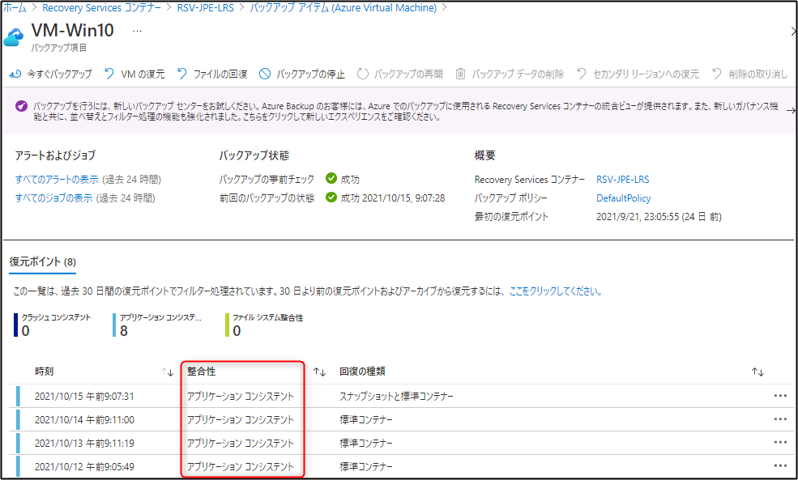
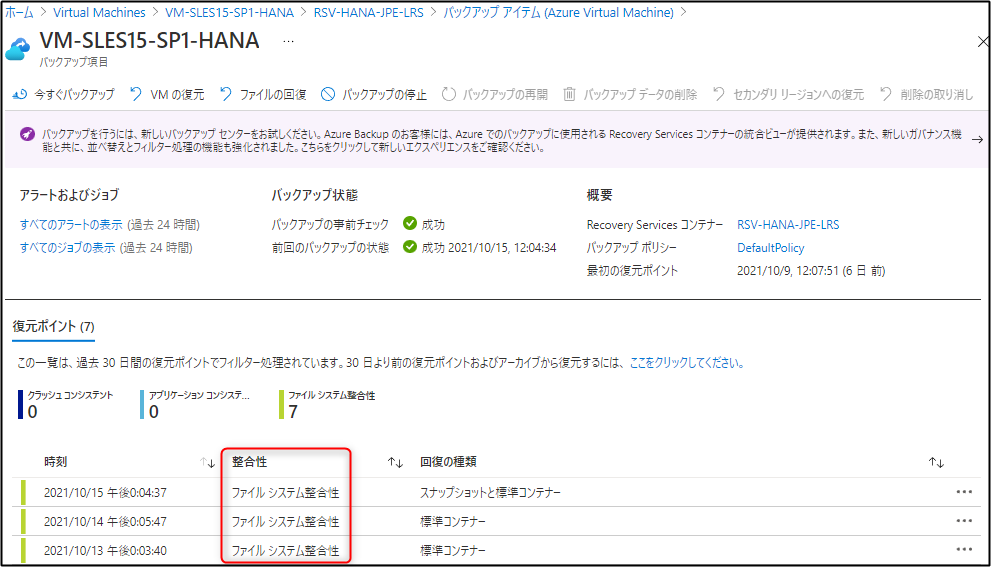
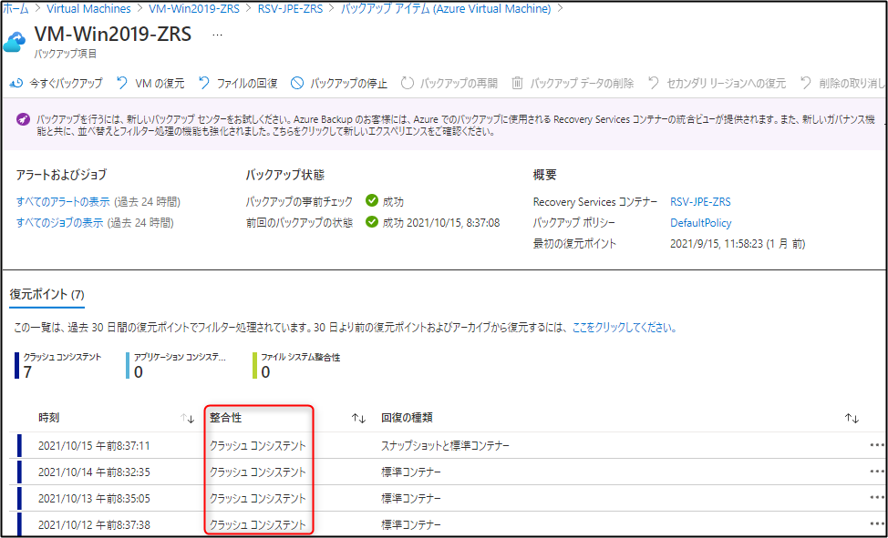

<!-- more -->
####  Azure VM Backup では オフライン バックアップができるのか
皆様こんにちは。Azure Backup サポートの山本です。
今回はお問い合わせをいただくことが多い、Azure VM Backup でオフライン バックアップができるのかというご要望について解説します。
こちらまず、結論から申し上げますと**可能**でございます。

### オンラインバックアップについて
まず、オンライン バックアップの場合 、Azure VM Backup は Windows VM の場合も Linux VM の場合も、それぞれのエージェント (およびバックアップ拡張機能) と通信・連携し、スナップショットを取得しています。
その際の整合性は通常 Windows OS の場合は VSS (ボリューム シャドウ コピー サービス) と連携しアプリケーション整合性となり、Linux VM の場合は通常ファイルシステム整合性 (スクリプトを構成している場合はアプリケーション整合性) となります。

・Azure VM バックアップの概要 - スナップショットの整合性
https://docs.microsoft.com/ja-jp/azure/backup/backup-azure-vms-introduction#snapshot-consistency
・Azure Linux VM のアプリケーション整合性バックアップ
https://docs.microsoft.com/ja-jp/azure/backup/backup-azure-linux-app-consistent

### オフラインバックアップについて
次に、オフライン バックアップの場合、VM の電源が落ちているのでエージェントは動いていないため、VM との連携をせずにスナップショットを取得します。(VM 内部と連携しません。)
その際の整合性は Windows VM / Linux VM を問わずクラッシュ整合性となります。

### 留意点
上記のとおり、 Azure VM の電源はオン / オフ どちらでも Azure VM Backup を取得することが可能です。
留意点としましては、バックアップ実行中 (正確にはスナップショット取得中) には電源状態の変更を行わないようにお願いします。
Azure VM Backup が失敗する可能性がございます。

### 参考情報
・Azure VM バックアップの概要 - スナップショットの整合性
https://docs.microsoft.com/ja-jp/azure/backup/backup-azure-vms-introduction#snapshot-consistency
・Azure Linux VM のアプリケーション整合性バックアップ
https://docs.microsoft.com/ja-jp/azure/backup/backup-azure-linux-app-consistent
