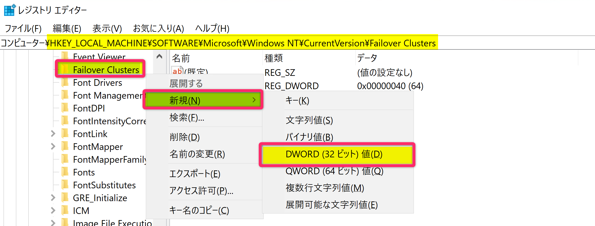

title: Azure VM Backup における CSV のサポートについて
date: 2024-09-04 00:00:00
tags:
  - Azure VM Backup
  - how to
disableDisclaimer: false
---

<!-- more -->
こんにちは、Azure Backup サポートです。  
今回は、Azure VM Backup での、クラスターの共有ボリューム (Cluster Shared Volume : CSV) を利用している VM のサポート状況、および Azure Backup でのバックアップ方法についてご案内いたします。  

## 目次  
-----------------------------------------------------------
[1. CSV のサポートについて](#1)  
[2. WSFC を利用している場合について](#2)  
[3. CSV の利用有無 および CSV ライターの動作状況を確認する方法](#3)  
[4. CSV ライターを無効化する方法](#4)
[5. CSV を利用している場合の Azure Backup について](#5)  
-----------------------------------------------------------

## <a id="1"></a> 1. CSV のサポートについて  
Azure VM Backup では、CSV を利用している VM のバックアップはサポートされていません。  
CSV を利用している VM で Azure VM Backup が実行されると、CSV ライターが失敗し、バックアップ データの整合性が **「ファイル システム整合性」** となる可能性がございます。  

> [!NOTE]  
> Windows OS の Azure VM Backup では、Windows ボリューム シャドウ コピー サービス (VSS) と連携し、スナップショットを取得します。  
> すべての VSS ライターが正常に動作した場合には、取得されるバックアップ データの整合性は「アプリケーション整合性」となります。  
> 詳細につきましては、下記ブログ記事をご確認ください。  
> ・ Azure VM Backupにおける整合性について | Japan CSS ABRS Support Blog !!  
> 　 https://jpabrs-scem.github.io/blog/AzureVMBackup/Consistencies/  

・ VM ストレージのサポート / Azure VM バックアップのサポート マトリックス - Azure Backup | Microsoft Learn  
　 https://learn.microsoft.com/ja-jp/azure/backup/backup-support-matrix-iaas#vm-storage-support  
　 抜粋 :  
  > 共有ストレージ :  
  > クラスターの共有ボリューム (CSV) またはスケールアウト ファイル サーバーを使用した VM のバックアップはサポートされていません。  
  > バックアップ中に CSV ライターが失敗する可能性があります。  
  > また、復元時に CSV ボリュームを含むディスクが起動しない可能性があります。  

### <a id="1.1"></a> (補足)  
CSV を利用している、もしくは CSV ライターが有効である状態で VM バックアップを実行すると、イベント ログに下記警告レベルのログが記録されます。  

- アプリケーション ログ  
  > ログの名前: Application  
  > ソース: VSS  
  > 日付: yyyy/mm/dd HH:mm:ss  
  > イベント ID: 8229  
  > タスクのカテゴリ: なし  
  > レベル: 警告  
  > キーワード: クラシック  
  > ユーザー: N/A  
  > コンピューター: <コンピューター名>  
  > 説明:  
  > エラー 0x00000000, The operation completed successfully.  
  >  により、VSS ライターはイベントを拒否しました。イベントの処理中に VSS ライターがライター コンポーネントに加えた変更は、要求側では利用できません。 VSS ライターをホストしているアプリケーションからの関連イベントについては、イベント ログを参照してください。  
  > 
  > Operation:  
  >    PrepareForSnapshot Event  
  > 
  > Context:  
  >    Execution Context: Writer  
  >    Writer Class Id: {1072ae1c-e5a7-4ea1-9e4a-6f7964656570}  
  >    Writer Name: Cluster Shared Volume VSS Writer  
  >    Writer Instance ID: {a2c1fb45-4c7e-43dc-b4e1-6f4660f40ce4}  
  >    Command Line: C:\Windows\Cluster\clussvc.exe -s  
  >    Process ID: 4004</Data>  
    
- システム ログ  
  > ログの名前: System  
  > ソース: Microsoft-Windows-FailoverClustering  
  > 日付: yyyy/mm/dd HH:mm:ss   
  > イベント ID: 1544  
  > タスクのカテゴリ: Cluster Backup/Restore  
  > レベル: 警告  
  > キーワード:  
  > ユーザー: SYSTEM  
  > コンピューター: <コンピューター名>  
  > 説明:  
  > クラスター構成データのバックアップ操作が取り消されました。クラスターのボリューム シャドウ コピー サービス (VSS) ライターが中止要求を受信しました。  
    


## <a id="2"></a> 2. WSFC を利用している場合について  
Windows Server フェールオーバー クラスター (Windows Server Failover Cluster : WSFC) を構成している場合には、**クラスターをセットアップした段階で CSV ライターがインストール**されます。  
そのため、**CSV を利用していない場合でも**、WSFC を構成している VM で Azure VM Backup が実行されると、CSV ライターが失敗し、バックアップ データの整合性が 「ファイル システム整合性」 となる可能性がございます。  

WSFC を構成しており CSV を利用している場合には、Azure VM Backup はサポート対象外となり、Azure VM Backup 以外のバックアップを構成いただく必要がございますが、  
WSFC を構成しているが CSV を利用していない場合には、**CSV ライターを無効化することで**、Azure VM Backup で 「アプリケーション整合性」 のバックアップ データが取得可能となります。  

従って、まずは [3. CSV の利用有無 および CSV ライターの動作状況を確認する方法](#3) にて、CSV の利用有無 と CSV ライターの動作状況をご確認ください。  


## <a id="3"></a> 3. CSV の利用有無 および CSV ライターの動作状況を確認する方法  
[CSV の利用有無を確認する方法](#3.1)、および [CSV ライターの動作状況を確認する方法](#3.2) について、以下のとおりご案内いたします。  

下記の確認方法にて、CSV の利用有無 と CSV ライターの動作状況を確認し、
CSV の利用が確認できた場合には、[5. CSV を利用している場合の Azure Backup について](#5) を、
CSV は利用していないが CSV ライターが有効な状態であった場合には、[4. CSV ライターを無効化する方法](#4) をご確認ください。  

> [!TIP]  
> CSV を利用していない、且つ CSV ライターも無効な状態である場合には、追加の作業を行うことなく、Azure VM Backup を構成することが可能でございます。  

### <a id="3.1"></a> 3.1 CSV の利用有無を確認する方法  
CSV の利用有無を確認するには、管理者として実行した PowerShell コンソールで、下記コマンドを実行してください。  
コマンド実行結果に、CSV の情報が出力された場合には、コマンドを実行しているマシン (WSFC) で CSV が利用されていると判断可能です。  

CSV を利用している場合には、[5. CSV を利用している場合の Azure Backup について](#5) をご確認ください。  
CSV を利用していない場合には、[3.2 CSV ライターの動作状況を確認する方法](#3.2) をご確認ください。  

**コマンド**  
```PowerShell  
Get-ClusterSharedVolume
```  

**実行結果例**  
- CSV を利用している場合  
    
- CSV を利用していない場合  
    


### <a id="3.2"></a> 3.2 CSV ライターの動作状況を確認する方法  
CSV ライターの動作状況を確認するには、管理者として実行した PowerShell コンソールで、下記コマンドを実行してください。  
コマンド実行結果に、``Cluster Shared Volume VSS Writer`` という名前の VSS ライターが含まれていた場合には、コマンドを実行しているマシンに CSV ライターがインストールされており、有効な状態であると判断可能です。  

CSV は利用していないが、CSV ライターが有効な状態であった場合には、[4. CSV ライターを無効化する方法](#4) をご確認ください。  
CSV は利用しておらず、CSV ライターも無効な状態であった場合には、追加の作業を行うことなく、Azure VM Backup を構成することが可能でございます。  
(CSV の利用有無が未確認の場合には、[3.1 CSV の利用有無を確認する方法](#3.1) をご確認ください。)  

**コマンド**  
```PowerShell  
vssadmin list writers
```  

**実行結果例**  
  


## <a id="4"></a> 4. CSV ライターを無効化する方法  
CSV ライターを無効化する手順を、以下のとおりご案内いたします。  
WSFC を構成しているが CSV を利用していない場合には、この手順に従い、CSV ライターを無効化することで、Azure VM Backup で 「アプリケーション整合性」 のバックアップ データが取得可能となります。  

> [!WARNING]  
> **CSV を利用していないことを、事前にご確認いただいたうえで**、CSV ライターを無効化してください。  
> CSV の利用有無を確認する方法につきましては、[こちら](#3.1) をご確認ください。  

### <a id="4.1"></a> 4.1 CSV ライターの無効化手順  
- 0. 各クラスター ノードそれぞれで下記手順を実施します  
- 1. 「ファイル名を指定して実行」 に ``regedit`` と入力して実行し、 レジストリ エディターを起動します  
      

- 2. 下記のキーを右クリックし、「アクセス許可」 を選択して、「Failover Clusters のアクセス許可」 の画面を開きます  
    ```text  
    HKEY_LOCAL_MACHINE\SOFTWARE\Microsoft\Windows NT\CurrentVersion\Failover Clusters
    ```  
      

- 3. 「詳細設定」 を押下し、「Failover Clusters のセキュリティの詳細設定」 の画面を開きます  
      

- 4. 「所有者」 の隣の 「変更」 を選択し、「選択するオブジェクトを入力してください」 に ``管理者アカウント (下記の例では、azureadmin)`` を入力して、「名前の確認」 > 「OK」 を選択します  
  ※ 「場所の指定」には、サーバーが参加しているドメインが選択されている状態で問題ございません  
      
      

- 5. 「所有者」 が 管理者アカウント (下記の例では、azureadmin) に変更されたことを確認し、「OK」 を押下して、「Failover Clusters のセキュリティの詳細設定」 の画面を閉じます  
      

- 6. 手順 2 で開いた 「Failover Clusters のアクセス許可」 画面に戻り、管理者アカウント または Administrators のフル コントロールにチェックを入れ、「OK」 を選択して画面を閉じます  
      

- 7. 手順 1 で起動したレジストリ エディターで Failover Clusters のキーを右クリックし、「新規」 > 「DWORD (32 ビット) 値」 を選択して、下記のレジストリを作成します  
  ```text  
  キー : HKEY_LOCAL_MACHINE\SOFTWARE\Microsoft\Windows NT\CurrentVersion\Failover Clusters
  名前 : EnableCsvVssWriter
  種類 : REG_DWORD
  データ : 0
  ```  
      
      

- 8. OS の再起動を実施します  

以上で CSV ライターの無効化作業は完了です。  

### <a id="4.2"></a> 4.2 CSV ライターの無効化を元に戻す方法  
[4.1 CSV ライターの無効化手順](#4.1) で行った設定を元に戻す手順を、以下のとおりご案内いたします。  
この手順を実施することで、無効化した CSV ライターを再度有効化することが可能となります。  

- 0. 各クラスター ノードそれぞれで下記手順を実施します  
- 1. 「ファイル名を指定して実行」 に ``regedit`` と入力して実行し、 レジストリ エディターを起動します  
      

- 2. 下記のキーを表示し、レジストリ 「EnableCsvVssWriter」 を右クリックし、「削除」を選択します  
    ```text  
    HKEY_LOCAL_MACHINE\SOFTWARE\Microsoft\Windows NT\CurrentVersion\Failover Clusters
    ```  
      
    - 「一部のレジストリ値を削除するとシステムが不安定になる場合があります。この値を完全に削除しますか？」というメッセージを含むポップアップが表示されますが、「はい」を選択してください  
        

- 3. 下記のキーを右クリックし、「アクセス許可」 を選択して、「Failover Clusters のアクセス許可」 の画面を開きます  
    ```text  
    HKEY_LOCAL_MACHINE\SOFTWARE\Microsoft\Windows NT\CurrentVersion\Failover Clusters
    ```  
      

- 4. 「Failover Clusters のアクセス許可」 画面で 管理者アカウント または Administrators のフル コントロールのチェックを外し、「適用」 を選択します  
      

- 5. 「Failover Clusters のアクセス許可」 画面で 「詳細設定」 を押下し、「Failover Clusters のセキュリティの詳細設定」 の画面を開きます  
      

- 6. 「所有者」 の隣の 「変更」 を選択し、「選択するオブジェクトを入力してください」 に  
  ``NT Service\TrustedInstaller`` と入力して、「名前の確認」 > 「OK」 を選択します  
  ※ 「場所の指定」には、ローカル マシン名を指定してください  
      
      

- 7. 「所有者」 が TrustedInstaller アカウントに変更されたことを確認し、「OK」 を押下して、「Failover Clusters のセキュリティの詳細設定」 および 「Failover Clusters のアクセス許可」 の画面を閉じます  
      

以上で CSV ライターの無効化の戻し作業は完了です。  


## <a id="5"></a> 5. CSV を利用している場合の Azure Backup について  
> [!IMPORTANT]  
> 前提として、CSV は Azure 共有ディスクを利用して構成していることを想定しております。  
> 共有ディスクを利用していない場合には、下記方法は適用されない可能性がございますので、予めご了承ください。  

CSV を利用している VM で Azure Backup を構成する一例といたしましては、CSV として利用している共有ディスクを含め、VM にアタッチされているすべてのディスクに Azure Disk Backup を構成する方法がございます。  
もし、Azure Disk Backup を利用する場合には、すべてのディスクに対して同じ静止点でバックアップを取得するために、下記の点を考慮してバックアップを構成してください。  
- ディスクそれぞれで構成する Azure Disk Backup は、同じバックアップ スケジュールを設定する  
- Azure Disk Backup が動作する前に VM を事前に停止する  
  (※ 恐縮ながら、Azure Disk Backup では、バックアップ前後に VM を起動 / 停止させるような機能はございません。)  

尚、Azure Disk バックアップの詳細につきましては、下記ドキュメントをご確認ください。  
・ Azure ディスク バックアップの概要 - Azure Backup | Microsoft Learn  
　 https://learn.microsoft.com/ja-jp/azure/backup/disk-backup-overview  
　 抜粋 :  
  > Azure ディスク バックアップ ソリューションは、次のようなシナリオで役立ちます。  
  > クラスター シナリオで実行されているアプリ: Windows Server フェールオーバー クラスターと Linux クラスターの両方で共有ディスクへの書き込みが行われている。  