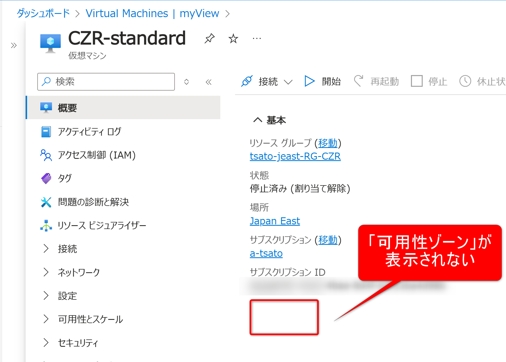
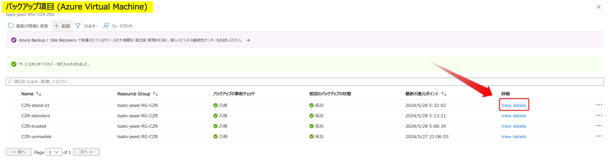
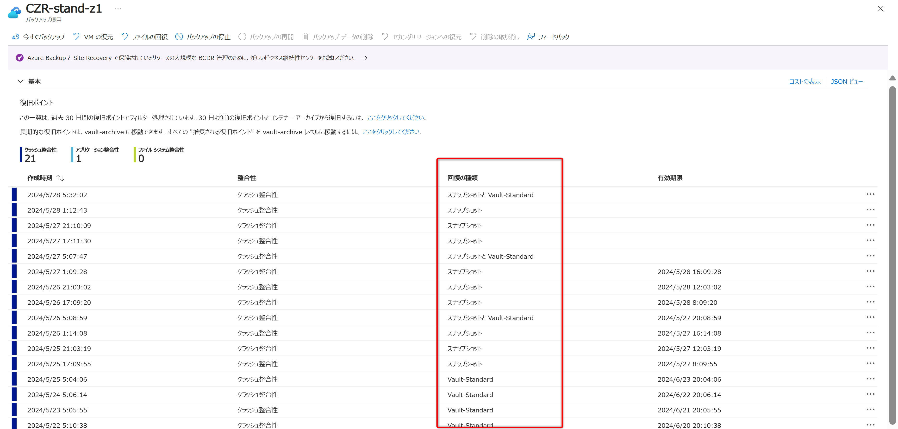

<!-- more -->
こんにちは、Azure Backup サポートです。  
今回は Azure Backup での異なる可用性ゾーンへの復元 ( = クロス ゾーン リストア / CZR ) についてご紹介します。
今回ご紹介する内容は、それぞれの公開情報に掲載されておりますが、一つのページに集約されておりません。  
よくお問い合わせいただく内容ですので、本記事では情報を集約化してお伝えします。

## 目次
-----------------------------------------------------------
[1. CZR を行うための各条件](#1)  
  [1-1. Azure VM の条件](#1-1)  
  [1-2. Recovery Services コンテナーの条件](#1-2)  
  [1-3. 利用できる復元オプション](#1-3)  
[2. 参考情報](#2)
-----------------------------------------------------------

## 1. CZR を行うための各条件
CZR を利用することで、Azure VM バックアップによって保護されている VM またはディスクを、復旧ポイントから別のゾーンに復元することができます。  
CZR を利用するために Recovery Services コンテナーおよび Azure VM バックアップにより保護されている VM が満たすべき条件を下記にまとめました。  

### 1-1. Azure VM の条件
CZR を行うためには、Azure VM バックアップにより保護されている VM が次の条件を満たす必要があります。
* マネージド VM であること
* クロス リージョン リストア (CRR) を行う場合、ゾーン固定 VM であること
* [暗号化された Azure VM](https://learn.microsoft.com/ja-jp/azure/backup/backup-azure-vms-introduction#encryption-of-azure-vm-backups) ではないこと
  
#### Azure VM が特定の可用性ゾーンに固定されているかどうかを確認する方法
ご参考までに、Azure VM が可用性ゾーンに固定されているかどうかの、Azure ポータル画面での確認方法を説明いたします。  
VMの概要欄に「可用性ゾーン xxx」 と表示されていれば、表示されているゾーンに固定されており、「可用性ゾーン xxx」 といった表示がない場合はゾーン固定されていないと判断できます。  
たとえば、下記画像の VM 「CZR-stand-z1」は可用性ゾーン「ゾーン1」に固定されている状態です。  

一方で下記画像の VM 「CZR-standard」はどのゾーンにも固定されていない状態となります。  
(この場合は可用性ゾーンは空欄になります。)  

### 1-2. Recovery Services コンテナーの条件
CZR は以下の条件を満たす Recovery Services コンテナーで行うことができます。  
* Recovery Services コンテナーのストレージ レプリケーションの種類が「ゾーン冗長」、または「geo 冗長」かつ [CRR](https://learn.microsoft.com/ja-jp/azure/backup/backup-create-recovery-services-vault#set-cross-region-restore) が有効になっていること  
* ただし、ストレージ レプリケーションの種類が「geo 冗長」かつ CRR が有効の場合は、[セカンダリ リージョンへの復元](https://learn.microsoft.com/ja-jp/azure/backup/backup-azure-arm-restore-vms#restore-in-secondary-region)を行う際にのみゾーン指定して復元可能  
  ※ [1-1. Azure VM の条件](#1-1) で説明の通り、ゾーン固定 VM である必要有  
  ※ プライマリ リージョンへは CRR を有効化していてもゾーン指定して復元することは不可能  
* 復旧ポイントの「回復の種類」が「Vault-Standard」であること  
  「スナップショット」のみ、または「スナップショットと Vault-Standard」の場合はゾーン指定して復元することは不可能  

> [!TIP]
> CRR については下記の弊社ブログにて紹介しております。  
> ・ Azure VM Backup におけるクロス リージョン リストア (CRR) について | Japan CSS ABRS Support Blog !! (jpabrs-scem.github.io)  
> 　 https://jpabrs-scem.github.io/blog/AzureVMBackup/CRR/  
> ---
> セカンダリ リージョン (ペア リージョン) について、および可用性ゾーンをサポートしているリージョンについては下記ドキュメントをご覧ください。  
> ・ Azure のリージョン間レプリケーション | Microsoft Learn  
> 　 https://learn.microsoft.com/ja-jp/azure/reliability/cross-region-replication-azure#azure-paired-regions  
> ・ Availability Zones をサポートする Azure サービス | Microsoft Learn  
> 　 https://learn.microsoft.com/ja-jp/azure/reliability/availability-zones-service-support#azure-regions-with-availability-zone-support  

#### Azure Portal で Recovery Services コンテナー の「ストレージ レプリケーションの種類」を確認する方法
ご参考までに、「ストレージ レプリケーションの種類」が「ゾーン冗長」に設定している場合の Azure ポータル画面上の見え方を説明いたします。  
該当の Recovery Services コンテナー > 設定 - プロパティ > バックアップ構成 - 更新 ボタン から「ストレージ レプリケーションの種類」が確認できます。
たとえば、下記画像の Recovery Services コンテナーでは「ゾーン冗長」が設定されています。  
  

> [!TIP]
> Recovery Services コンテナーで既にバックアップを構成している場合は「ストレージ レプリケーションの種類」を変更することができません。  
> 「ストレージ レプリケーションの種類」の変更が必要な場合は下記ドキュメントをご参照ください。  
> ・ Recovery Services コンテナーを作成して構成する - Azure Backup | Microsoft Learn  
> 　 https://learn.microsoft.com/ja-jp/azure/backup/backup-create-recovery-services-vault#set-storage-redundancy

#### Azure Portal で 復旧ポイントの「回復の種類」を確認する方法
ご参考までに、復旧ポイントの「回復の種類」を Azure ポータル画面にて確認する方法を説明いたします。  

まずは該当の Recovery Services コンテナー > 保護されたアイテム - バックアップ アイテム > Azure Virtual Machine ボタンを選択します。  
  

続いて確認したい VM の行にて、詳細 - View details ボタンを選択します。  
 

すると選択した VM の復旧ポイント一覧が表示され、ここから「回復の種類」を確認できます。  
 

> [!TIP]
> 「スナップショット」「Vault-Standard」についての説明は下記ドキュメントをご参照ください。  
> ・ レベル | Azure Backup 用語集 - Azure Backup | Microsoft Learn  
> 　 https://learn.microsoft.com/ja-jp/azure/backup/azure-backup-glossary#tier

###  1-3. 利用できる復元オプション
CZR は次の復元を行う場合にのみ利用できます。
* VM の作成
* ディスクの復元

なお、[既存のディスクの置き換え](https://learn.microsoft.com/ja-jp/azure/backup/backup-azure-arm-restore-vms#replace-existing-disks) はサポートされていません。

#### VM の作成
復旧ポイントから VM の新規作成を行う際、前述の条件を満たしている場合に、復元先の可用性ゾーンを指定することができます。  
 

具体的な復元の手順は下記の公開情報をご覧ください。  
* VM の作成 | Azure Backup を使用して Azure portal を使用して VM を復元する - Azure Backup | Microsoft Learn  
https://learn.microsoft.com/ja-jp/azure/backup/backup-azure-arm-restore-vms#create-a-vm

#### ディスクの復元
復旧ポイントから ディスクの復元を行う際、前述の条件を満たしている場合に、復元先の可用性ゾーンを指定することができます。  
  

具体的な復元の手順は下記の公開情報をご覧ください。  
* ディスクを復元する | Azure Backup を使用して Azure portal を使用して VM を復元する - Azure Backup | Microsoft Learn
https://learn.microsoft.com/ja-jp/azure/backup/backup-azure-arm-restore-vms#restore-disks

## 2. 参考情報
* 復元オプション | Azure Backup を使用して Azure portal を使用して VM を復元する - Azure Backup | Microsoft Learn  
  https://learn.microsoft.com/ja-jp/azure/backup/backup-azure-arm-restore-vms#restore-options  
* VM の作成 | Azure Backup を使用して Azure portal を使用して VM を復元する - Azure Backup | Microsoft Learn  
  https://learn.microsoft.com/ja-jp/azure/backup/backup-azure-arm-restore-vms#create-a-vm  
* ディスクを復元する | Azure Backup を使用して Azure portal を使用して VM を復元する - Azure Backup | Microsoft Learn  
  https://learn.microsoft.com/ja-jp/azure/backup/backup-azure-arm-restore-vms#restore-disks  
* セカンダリ リージョンに復元する | Azure Backup を使用して Azure portal を使用して VM を復元する - Azure Backup | Microsoft Learn  
  https://learn.microsoft.com/ja-jp/azure/backup/backup-azure-arm-restore-vms#restore-in-secondary-region  
* サポートされる復元方法 | Azure VM バックアップのサポート マトリックス - Azure Backup | Microsoft Learn  
  https://learn.microsoft.com/ja-jp/azure/backup/backup-support-matrix-iaas#supported-restore-methods  
* FAQ-Azure VM をバックアップする - Azure Backup | Microsoft Learn  
  https://learn.microsoft.com/ja-jp/azure/backup/backup-azure-vm-backup-faq#azure-------------------------  
