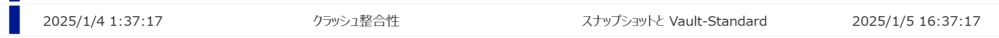

<!-- more -->
皆様こんにちは。Azure Backup サポートです。
今回は Azure VM Backup における整合性に関して具体例も踏まえつつご説明させていただきます。

まず、Azure VM Backup における整合性は下記の３種類ございます。
・アプリケーション整合性 (Application-consistent)

・ファイルシステム整合性 (File-system consistent)

・クラッシュ整合性 (Crash-consistent)

なお、公開情報は下記にございますのでまず一度ご一読ください。
その前提で説明させていただきます。

- (参考) Azure VM バックアップの概要 スナップショットの整合性
  https://learn.microsoft.com/ja-jp/azure/backup/backup-azure-vms-introduction#snapshot-consistency

## 目次
-----------------------------------------------------------
[1. アプリケーション整合性](#1)
[  1.1 VSS 観点での調査について](#1-1)
[  1.2  SQL Server のインストールされた Windows OS のバックアップについて](#1-2)
[   1.2.1  ご参考ページ](#1-2-1)
[  1.3  Oracle DB for Windows VM の Azure VM Backup について](#1-3)
[  1.4  事前事後スクリプトについて](#1-4)
[2. ファイルシステム整合性](#2)
[3. クラッシュ整合性](#3)

-----------------------------------------------------------

## 1. アプリケーション整合性
こちら Azure VM Backup における最も上位の整合性でございます。
Windows OS や事前事後スクリプトを設定した Linux OS でオンライン バックアップを取得した場合にアプリケーション整合性となります。
なお、Windows OS の場合は VSS (ボリューム シャドウ コピー サービス) との連携によりアプリケーション整合性を取得するのみであり、Linux OS のような事前事後スクリプトの準備はございません。また Windows / Linux いずれも OS の起動を保証します。

Azure Portal 上の表示では、Windows OS の場合は VSS (VSS ライター) が正常に稼働すればアプリケーション整合性となり、Linux VM の場合は事前事後スクリプトが正常に完了すればアプリケーション整合性となります。
つまり、VSS に対応していないアプリケーションをご利用の場合は該当アプリケーションに対する整合性はございませんが、Azure Portal (Azure Backup) では VSS ライターが提供されていない対象のアプリケーションを検知することが出来ないため Azure Portal 上の表示はアプリケーション整合性となります。

また、**ご利用のアプリケーション整合性が VSS に対応しているかは各アプリケーションの提供元ベンダーまでお問い合わせいただきますようお願いします。**

- (参考) VSS のしくみ
  https://learn.microsoft.com/ja-jp/windows-server/storage/file-server/volume-shadow-copy-service#how-volume-shadow-copy-service-work
  >Microsoft 以外の VSS ライターは、バックアップ中にデータの一貫性を保証する必要がある Windows 用の多くのアプリケーションに含まれています。

### 1.1 VSS 観点での調査について
まず、Azure Backup チームでは VSS 関連の障害調査に関しては VSS および 特定の VSS ライターに不調があるというところまでが調査可能です。
なぜ "VSS および 特定の VSS ライターに不調が起きたのか" に関する根本原因についてはお客様の契約次第ではオンプレミス チームでの有償対応が必要となることがございます。
また、お客様のご契約が Azure 製品のサポート契約のみの場合オンプレミス範囲のサポート契約がないため、詳細な調査を行えないことがございます。
また切り分けの結果、他社製品のアプリケーションの VSS ライターの不具合であった場合には弊社ではサポート出来かねますので、ご利用のアプリケーション提供ベンダーまでお問い合わせお願いします。

つぎに、それぞれについて下記の通りお伝えさせていただきます。

#### ・VSS の不調 (bad state)によりAzure VM Backupが失敗する
こちら根本原因の特定には VSS 観点での調査が必要となります。
 Azure Backup チームでは 根本原因の特定については可能な範囲での調査をさせていただきます。

ご参考にまでに、下記のようなエラーが出ることがございます。
>Error Code ：ExtensionFailedVssServiceInBadState
>Error Message ：Snapshot operation failed due to VSS (Volume Shadow Copy) service in bad state

>Error Code ：ExtensionFailedVssWriterInBadState
>Error Message ：Snapshot operation failed due to VSS Writers in bad state.

事象の改善方法としては下記 URL 記載の **VSS の再起動、および VM の再起動を行うことで改善することがほとんどでございます。**

- (参考) Azure 仮想マシンでのバックアップ エラーのトラブルシューティング - ExtensionFailedVssServiceInBadState - VSS (ボリューム シャドウ コピー) サービスが正しくない状態にあるため、スナップショット操作に失敗しました
  https://learn.microsoft.com/ja-jp/azure/backup/backup-azure-vms-troubleshoot#extensionfailedvssserviceinbadstate---snapshot-operation-failed-due-to-vss-volume-shadow-copy-service-in-bad-state

 VSS 観点で、なぜ VSS が bad state になったか、に関する根本原因の調査のためには下記 URL 先のログの採取をお願いします。
 **可能な限り "[A]"が望ましいですが、”[B]” の方法で採取いただいても、ある程度は調査が可能な場合がございます。**
- (参考) VSS エラーが発生している事象の調査 
  https://jpwinsup.github.io/mslog/storage/vss/vss-error/

#### ・VSS ライターのエラーにより警告付き完了となる / アプリケーション整合性ではなくファイルシステム整合性となって復旧ポイントが取得されている
こちら根本原因の特定には VSS および VSS ライター観点での調査が必要となります。
Azure Backup チームでは どうして VSS ライター が失敗したのか、に関する根本原因の特定については可能な範囲での調査をさせていただきます。
一次調査の結果、VSS ライターのエラーを出しているアプリケーションが 弊社 SQL Server 等弊社製品の場合は担当チーム (SQL Server 等) で対応が可能でございますが、お客様の契約次第では有償対応が必要となることがございます。
　一方、VSS ライターのエラーを出しているアプリケーションが他社製品の場合、ご利用のアプリケーション提供ベンダーまでお問い合わせいただくようお願い申し上げます。

改善策としては、下記の URL をご参考にして**VSS の再起動、および VM の再起動の対応いただければと存じます。**
- (参考) Azure 仮想マシンでのバックアップ エラーのトラブルシューティング - ExtensionFailedVssWriterInBadState - VSS ライターが正しくない状態にあるため、スナップショット操作に失敗しました
  https://learn.microsoft.com/ja-jp/azure/backup/backup-azure-vms-troubleshoot#extensionfailedvsswriterinbadstate---snapshot-operation-failed-because-vss-writers-were-in-a-bad-state

###　1.2  SQL Server のインストールされた Windows OS のバックアップについて
こちらよくいただくお問い合わせとして次の通りお伝えします。
>・SQL Server のインストールされた Windows OS をAzure VM Backup でバックアップすることは可能か、また何か考慮点があるか？
*ここで SQL Server とは Microsoft SQL Server を指します。

**こちら結論から申し上げますと、可能です。**
Microsoft SQL Server では SQL ライターがございますので、SQL データベースの整合性を保った VM 全体のバックアップを取得することが可能です。

考慮点としましては下記 URL をご覧ください。
- (参考) Azure VM バックアップの概要 - スナップショットの作成
  https://learn.microsoft.com/ja-jp/azure/backup/backup-azure-vms-introduction#snapshot-creation
  > 既定の Azure Backup では、VSS の完全バックアップが作成されます (アプリケーション レベルで整合性のあるバックアップを取得するため、バックアップ時に、SQL Server などのアプリケーションのログは切り捨てられます)。 Azure VM バックアップで SQL Server データベースを使用している場合は、(ログを保持するために) VSS コピー バックアップを作成するように設定を変更できます。

- (参考) Azure 仮想マシンでのバックアップ エラーのトラブルシューティング - VM スナップショットに関する問題のトラブルシューティング
  https://learn.microsoft.com/ja-jp/azure/backup/backup-azure-vms-troubleshoot#troubleshoot-vm-snapshot-issues
  > 既定では、VM バックアップによって Windows VM 上に VSS フル バックアップが作成されます。 SQL Server を実行していて SQL Server のバックアップを構成されている VM では、スナップショットの遅延が発生する可能性があります。 スナップショットの遅延が原因でバックアップが失敗する場合は、次のレジストリ キーを設定します。[HKEY_LOCAL_MACHINE\SOFTWARE\MICROSOFT\BCDRAGENT]
  "USEVSSCOPYBACKUP"="TRUE"

上記レジストリ設定にあたって OS 再起動は必要ございません。

#### 1.2.1 上記に関するご参考ページ 
- コピーのみのバックアップ - SQL Server
  https://learn.microsoft.com/ja-jp/sql/relational-databases/backup-restore/copy-only-backups-sql-server?view=sql-server-ver16
  > コピーのみのバックアップとは、定期的に実行される一連の SQL Server バックアップとは別の SQL Server バックアップです。 通常、バックアップを行うとデータベースが変更され、その後のバックアップの復元方法に影響します。 ただし、データベース全体のバックアップや復元の手順に影響を与えない特殊な目的で、バックアップを行うと役に立つ場合があります。 このため、コピーのみのバックアップが導入されました。

### 1.3  Oracle DB for Windows VM の Azure VM Backup について
よくお問い合わせをいただく例としましては Oracle DB が搭載された Windows OS に関してお問い合わせをいただくことがございます。
弊社では Windows OS 向けの Oracle DB すべてが VSS に対応しているかわかりかねますが、少なくとも実績はございます。
ご利用の Oracle DB が VSS に対応しているかが不明な場合は別途 Oracle 社にお問い合わせいただければと存じます。

*下記情報は弊社外のサイトでございますが、ご参考になれば幸いです。弊社情報ではございませんのでその点ご留意ください。

- Oracleがインストールされているシステムで Exit Code -311が発生する
  https://actiphyhelp.zendesk.com/hc/ja/articles/13451077456153-Oracle%E3%81%8C%E3%82%A4%E3%83%B3%E3%82%B9%E3%83%88%E3%83%BC%E3%83%AB%E3%81%95%E3%82%8C%E3%81%A6%E3%81%84%E3%82%8B%E3%82%B7%E3%82%B9%E3%83%86%E3%83%A0%E3%81%A7-Exit-Code-311%E3%81%8C%E7%99%BA%E7%94%9F%E3%81%99%E3%82%8B
 
- (Oracle社) VSSを使用したデータベースのバックアップおよびリカバリの目的
  ※Oracle DB すべてが VSS に対応しているかはわかりかねます
  https://docs.oracle.com/cd/F19136_01/ntqrf/purpose-of-database-backup-and-recovery-with-vss.html#GUID-6A44D80C-0427-4DB8-AD3C-BD5426AECC2B

### 1.4 事前事後スクリプトについて
Linux VM 事前事後スクリプトに関しましては、お客様自身で対象のアプリケーション (DBなど) の I/O を停止 / 再開する処理を記載いただく必要がございます。
そのため、対象のアプリケーションに対してそのようなコマンド制御ができない場合は、残念ながら事前事後スクリプトを用いることはできません。そのようなコマンド制御が可能かはアプリケーション提供ベンダーまでお問い合わせをいただきますようお願いします。

- (参考) Azure Backup を使用した Azure Linux VM のアプリケーション整合性バックアップ
  https://learn.microsoft.com/ja-jp/azure/backup/backup-azure-linux-app-consistent
- (参考) データベース整合性スナップショットのための拡張事前/事後スクリプト
  https://learn.microsoft.com/ja-jp/azure/backup/backup-azure-linux-database-consistent-enhanced-pre-post
- (参考) GitHub 上のサンプル事前事後スクリプト (Oracle や MySQLがございます。)
  https://github.com/Azure/azure-linux-extensions/tree/master/VMBackup/main/workloadPatch/DefaultScripts

## 2.ファイルシステム整合性
Windows OS のオンライン バックアップを取得した際に一部の VSS ライターが失敗した場合や Linux OS でオンライン バックアップを取得した場合 (または 事前事後スクリプトが失敗した場合) にファイルシステム整合性となります。
こちらは OS の起動を保証した整合性ですが、アプリケーション レベルでの整合性は担保されておりません。

## 3.クラッシュ整合性
スナップショット作成実行時のディスクのデータのみを保存します。
アプリケーション整合性やファイルシステム整合性とは異なり、OS 内部とは連携せずスナップショットを取得します。
そのため、オフライン状態の VM をバックアップした際にはクラッシュ整合性となります。
OS の起動を保証しない整合性ではございますが、**正常に電源が落とされた状態の VM であればメモリ上の情報や I/O の発生はなく、ディスクにしか情報はないため整合性の懸念は全くございません。**

- 参考ブログ Azure VM Backup では オフライン バックアップができるのか
  https://jpabrs-scem.github.io/blog/AzureVMBackup/Azure_VM_Offline_backup/

一方、Azure Disk Backup やマネージド ディスクのスナップショットなどは、起動中の VM にアタッチされているディスクのスナップショットを取得することが可能ですが、この際のオンライン状態でのスナップショットの整合性は Azure VM Backupとは異なり、クラッシュ整合性となります。
整合性は劣るものの、後述の通り DB のない VM であればクラッシュ整合性でも基本的には問題ございません。

- (参考) Azure ディスク バックアップの概要
  https://learn.microsoft.com/ja-jp/azure/backup/disk-backup-overview 
- (参考) 仮想ハード ディスクのスナップショットを作成する
  https://learn.microsoft.com/ja-jp/azure/virtual-machines/snapshot-copy-managed-disk?tabs=portal

クラッシュ整合性に関しましては次の公開情報にございますようなイメージをしていただけるとわかりやすいかと存じます。
 (Azure Site Recovery のドキュメントではございますが、考え方は同じです。)
- (参考) Azure Site Recovery に関する一般的な質問 - クラッシュ整合性復旧ポイントとは何ですか?
  https://learn.microsoft.com/ja-jp/azure/site-recovery/site-recovery-faq#---------------------
  >クラッシュ整合性復旧ポイントには、スナップショットの作成中にサーバーから電源コードが引き抜かれたときのディスク上のデータが含まれます。 クラッシュ整合性復旧ポイントには、スナップショットの作成時にメモリに入っていたものは一切含まれません。
  >現在、ほとんどのアプリケーションは、クラッシュ整合性のスナップショットから十分に復旧できます。 データベースのないオペレーティング システムや、ファイル サーバー、DHCP サーバー、プリント サーバーなどのアプリケーションの場合は、クラッシュ整合性復旧ポイントで十分です。

本記事の説明は以上です。