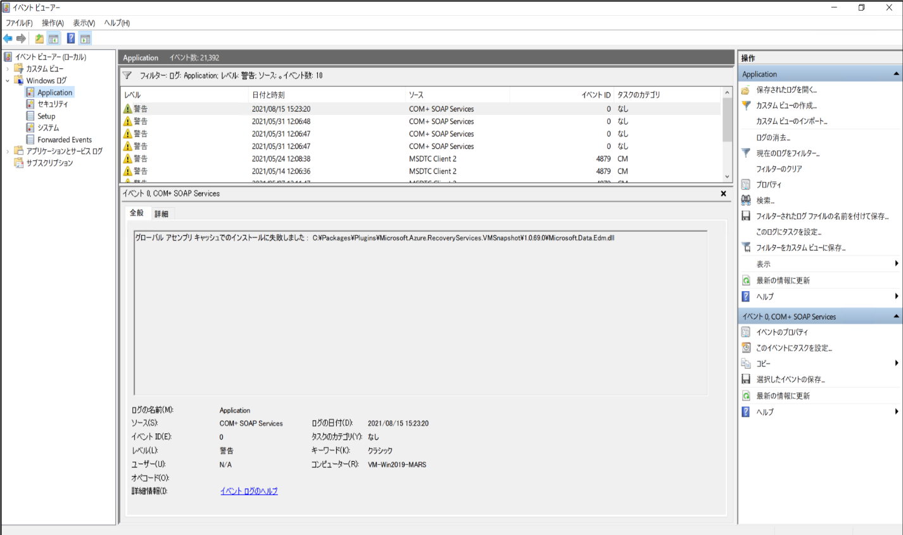

<!-- more -->
皆様こんにちは。Azure Backup サポートの柴田です。
今回はお問い合わせをいただくことが多い、 Windows VM の Azure VM バックアップ取得時に発現するイベントログについて解説させていただきます。

バックアップを取得した際に、**『グローバル アセンブリ キャッシュからのアセンブリの削除に失敗しました』**の警告が表示される。

こちらの警告は、グローバルアセンブリキャッシュ (GAC) からファイルの削除に失敗した際に出力されます。
※ グローバルアセンブリキャッシュとは
コンピュータ上の多数のアプリケーション間で共有するためにインストールされたアセンブリを格納するマシン全体のコード キャッシュ。

Azure Backup では、 Azure VM のバックアップを取得する際に、以下の2つのファイルを削除、インストールする場合があります。このメッセージが発現した際は、GAC 上からその削除、インストールに失敗しています。
・iaasvmazurestorage.dll
・iaasvmsnapshotmessage.dll

このエラーが出る要因として、以前のファイルが存在しない場合や、以前のファイルがロックされている場合が考えられます。しかしながらファイルの削除やインストールはリトライが行われリトライにより成功する場合も多くなっております。
従って、正常に Azure Backup によるバックアップが取得できている場合、GAC 上のファイルは正常に参照できている状態であり、無視可能なエラーメッセージです。

以下の画面のようなイベントログが発現します。
><イベントログ例 >
ソース : COM+ SOAP Services
EventID : 0
Message : グローバル アセンブリ キャッシュからのアセンブリの削除に失敗しました :  C:\Packages\Plugins\Microsoft.Azure.RecoveryServices.VMSnapshot\1.0.70.0\iaasvmsnapshotmessage.dll iaasvmsnapshotmessage,Version=3.0.0.0

このエラーメッセージが発現することを抑止する方法はありませんが、正常にバックアップが取得できていましたら、上記の通り無視可能なエラーメッセージです。