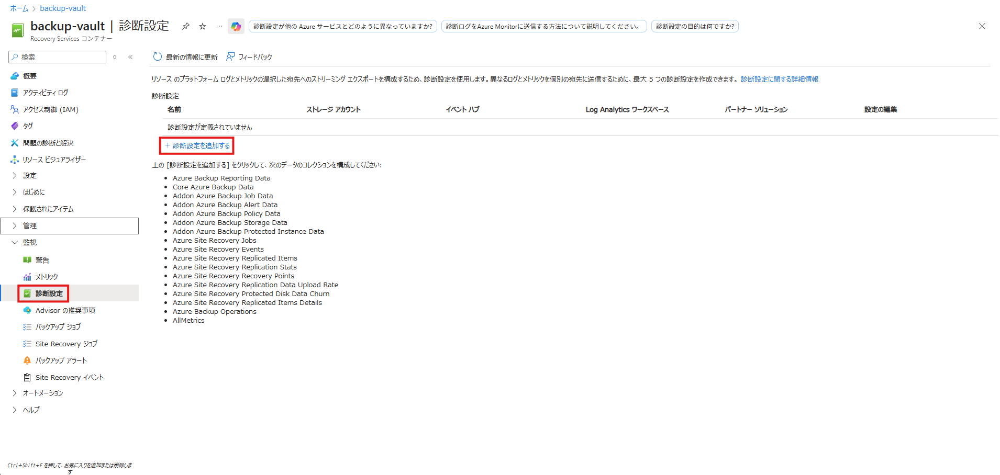

<!-- more -->
皆様こんにちは、Azure Backup サポート チームです。
今回は、**Azure VM Backup における VM ごとのバックアップ データ量の確認方法** についてご紹介します。

## 目次
-----------------------------------------------------------
[1. 概要](#1)
[2. バックアップ データの合計量を確認する方法](#2)
[3. VM ごと のバックアップ データ量を確認する方法](#3)
[3-1. 診断設定の構成方法](#3-1)
[3-2. バックアップ レポートでのデータ量の確認方法](#3-2)
[4. 現時点でできないこと](#4)
-----------------------------------------------------------

## 1. 概要
Azure VM Backup では、バックアップデータは**Recovery Services コンテナー**に保存されます。
このコンテナーで VM ごとのバックアップデータ量を確認するには、**バックアップ レポート**を利用する必要があります。ただし、このレポートを使用するためには、事前にお客様ご自身で**診断設定**を構成していただく必要があります。
本記事では、診断設定の構成方法から、VM ごとのバックアップデータ量を確認する手順までを、順を追ってわかりやすく解説します。

## 2. バックアップ データの合計量を確認する方法
まずは、**Recovery Services コンテナーに保存されている VM のバックアップ データの合計量**を確認する方法をご紹介します。

この確認には、特別な設定や追加作業は不要です。
Azure Portal で対象の **Recovery Services コンテナー**を開き、**［概要］** ページの **［バックアップ］** タブ下部に表示される情報から、**VM のバックアップ データの合計量**を簡単に確認できます。

## 3. VM ごとのバックアップ データ量を確認する方法
次に、**Recovery Services コンテナーに保存されている各 VM のバックアップ データ量**を確認する方法をご紹介します。

この確認には、**診断設定の構成**と、**バックアップ レポートの利用**が必要です。
以下の記事にて、順を追って設定から確認までの流れをご説明します。

### 3-1. 診断設定の構成方法
#### 1. Log Analytics ワークスペースの作成
まず、診断ログの送信先となる **Log Analytics ワークスペース**を作成します。

ワークスペース名は任意で構いません。

#### 2. Recovery Services コンテナーで診断設定を構成
次に、Recovery Services コンテナーの **［監視］** → **［診断設定］** を開き **［診断設定を追加する］** をクリックして構成を追加します。

構成時には、以下の 3 項目にチェックを入れてください
- **Core Azure Backup Data**
- **Addon Azure Backup Policy Data**
- **Addon Azure Backup Storage Data**

送信先には、先ほど作成した Log Analytics ワークスペースを選択します。
ターゲット テーブルの種類は**リソース固有**を選択してください。

Log Analytics をご利用いただく場合、Azure VM Backup の費用に加えて、**ログのインジェストおよびクエリに対して別途費用が発生します**。
Log Analytics の費用に関する詳細は、以下の公式ドキュメントをご参照ください。
・価格 - Azure Monitor | Microsoft Azure
　https://azure.microsoft.com/ja-jp/pricing/details/monitor/

### 3-2. バックアップ レポートでのデータ量の確認方法
Recovery Services コンテナーの **［管理］** → **［バックアップ レポート］** を開き **［作業の開始］** タブにて、先ほど作成した Log Analytics ワークスペースを選択してください。

次に **［バックアップ インスタンス］** タブを選択してください。

ページ下部にある **バックアップ インスタンスごとのストレージ** 欄にて、**VM ごとのバックアップ データ量**を確認することができます。

ただし、Recovery Services コンテナーにて診断設定を構成した直後にバックアップ レポートを確認いただいても、**レポートのデータがすぐに表示されない場合があります**。
これは、診断設定後の初回データ送信に時間がかかるためであり、以下の点にご留意ください。
> 診断を構成した後、最初のデータ プッシュが完了するまでに最大 24 時間かかることがあります。 Log Analytics ワークスペースへのデータの送信が開始された後、レポートのデータがすぐに表示されない場合があります。まだ終わっていない現在日のデータはレポートに表示されないためです。 詳細については、「バックアップ レポートで使用される規則」を参照してください。 Log Analytics にデータを送信するようにコンテナーを構成した 2 日後からレポートの表示を開始することをお勧めします。

そのため、**Log Analytics にデータ送信するようにコンテナーを構成した 2 日後からレポートの表示を開始することを推奨**いたします。

Azure Backup のレポート構成方法や、レポート表示までの時間に関する詳細は、以下の公式ドキュメントをご覧ください。
・Azure Backup のレポートを構成する - Azure Backup | Microsoft Learn
　https://learn.microsoft.com/ja-jp/azure/backup/configure-reports?tabs=recovery-services-vaults

## 4. 現時点でできないこと
上記にて VM ごとのバックアップ データ量の確認方法をご案内いたしました。
一方で、現時点 (2025年9月17日) では、 **VM ごとのバックアップ費用** を直接確認する方法は提供されておりません。
そのため、費用の算出につきましては、お客様ご自身で「Azure Backup の費用」に関する以下の公式サイトをご参照のうえ、VM ごとのバックアップ費用を計算いただく必要がございます。
・価格 – Azure Backup | Microsoft Azure
　https://azure.microsoft.com/ja-jp/pricing/details/backup/
