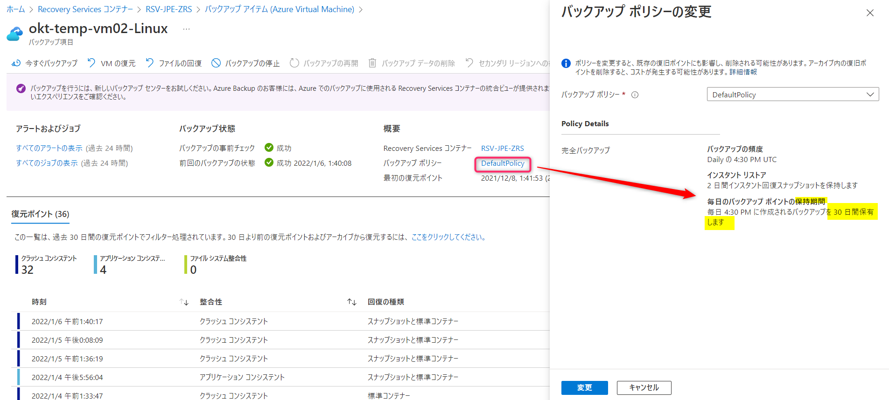
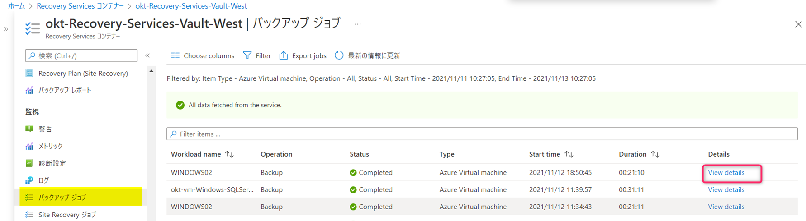
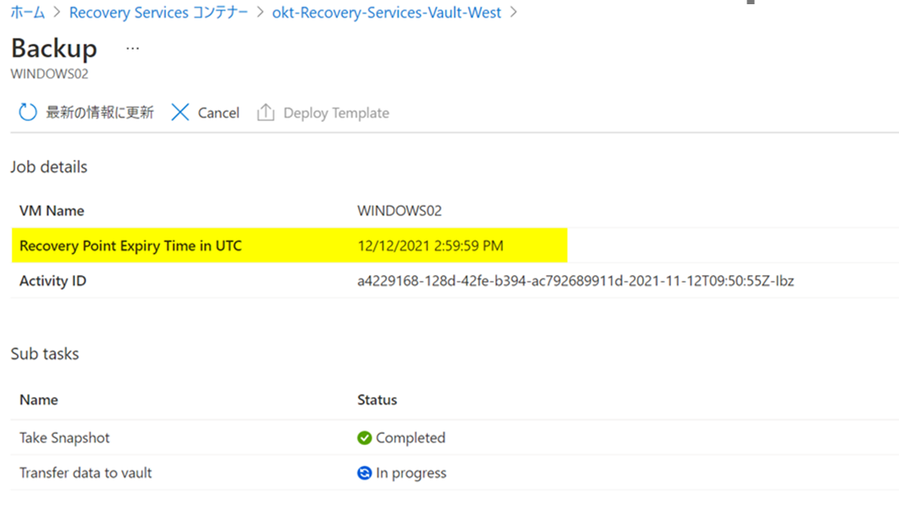
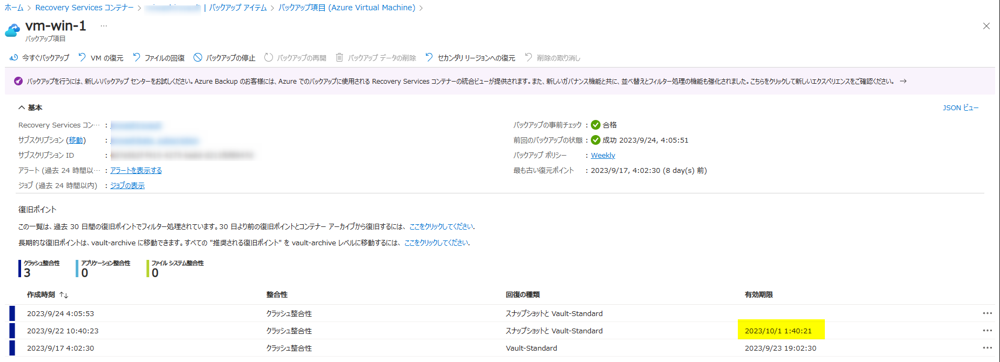
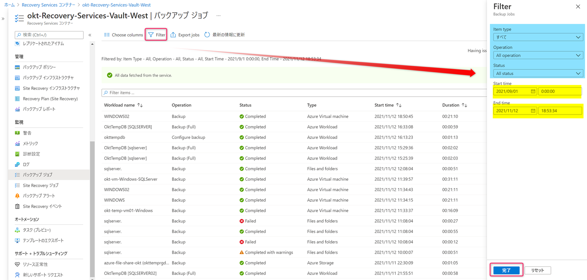
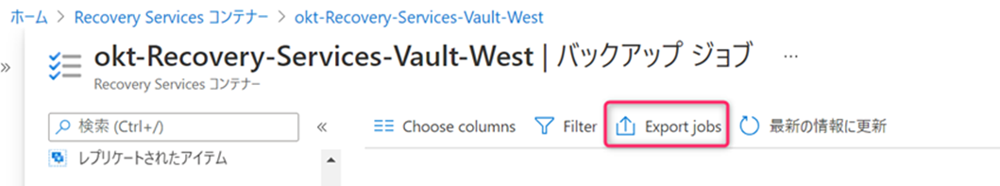
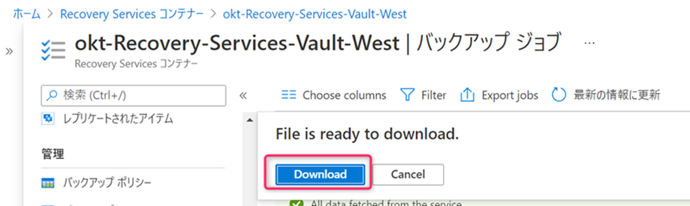
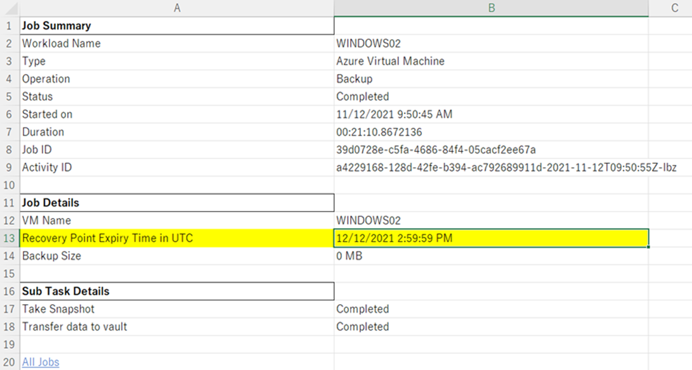

<!-- more -->
皆様こんにちは、Azure Backup サポートです。
今回は、**Azure VM Backup にて取得した復元ポイントの保持期限を確認する方法** について、ご案内いたします。

## 目次
-----------------------------------------------------------
[1. スケジュール バックアップにて取得した復元ポイントの保持期限を確認されたい場合](#1)
[2. 「今すぐバックアップ」にて取得した復元ポイントの保持期限を確認されたい場合](#2)
 [ 2-1. Azure ポータル画面から確認する](#2-1)
 [ 2-2. Azure ポータル画面より、定期的に csv へエクスポートする](#2-2)
-----------------------------------------------------------

## 1. スケジュール バックアップにて取得した復元ポイントの保持期限を確認されたい場合
スケジュール バックアップにて取得する復元ポイントは、バックアップ ポリシーにて設定した保持期限に従って保持されますので、設定しているバックアップ ポリシーを参照ください。

Recovery Services コンテナー ＞ バックアップ ポリシー にて確認可能です。
もしくは、下図のように Recovery Services コンテナー ＞ バックアップ アイテム ＞ Azure Virtual Machine ＞ 対象の仮想マシンを選択し、「バックアップ ポリシー」を確認可能です。

## 2. 「今すぐバックアップ」にて取得した復元ポイントの保持期限を確認されたい場合
### 2-1. Azure ポータル画面から確認する

以下のいずれかの方法で「今すぐバックアップ」にて取得した復元ポイントの保持期限の確認が可能です。

＜バックアップ ジョブから確認する場合＞

「今すぐバックアップ」にて取得した復元ポイントの保持期限は、Azure ポータル画面上の「バックアップ ジョブ」画面から確認可能です。
対象のRecovery Services コンテナー ＞ バックアップ ジョブ ＞ 「View details」をクリックいただき、「Recovery Point Expiry Time in UTC」欄をご確認ください。

・復旧ポイントの管理
https://docs.microsoft.com/ja-jp/azure/backup/manage-recovery-points#frequently-asked-question

なお、復元ポイントの保持期限情報を含めた、Azure ポータル画面上のバックアップ ジョブ情報の保持期間は、最大 6 か月間でございます。
（弊社検証環境にて確認したところ、現状 1 年以上前のバックアップ ジョブも確認はできましたが、仕様としては 6 か月間となっております）
そのため、6 か月以上前の バックアップ ジョブ履歴を保持し、オンデマンド バックアップにて取得したバックアップ ポイントの保持期限を確認されたい場合は[ csv へのエクスポート ](#2-2)をご検討ください。

＜バックアップ項目から確認する場合＞

「今すぐバックアップ」にて取得した復元ポイントの保持期限は、Azure ポータル画面上の「バックアップ項目」画面からも確認可能です。
対象のRecovery Services コンテナー ＞ バックアップ アイテム ＞ バックアップ対象の VM の「View details」をクリックいただき、バックアップ項目の「有効期限」欄をご確認ください。

なお、「有効期限」はUTC表記となります。
「有効期限」は、スナップショット層に保管されている復元ポイントについては、「インスタント回復スナップショットの保有期間」が表示される仕様となっております。

### 2-2.Azure ポータル画面より、定期的に csv へエクスポートする
対象の Recovery Services コンテナー ＞ バックアップ ジョブから、「Filter」にて任意の期間等を選択いただき、バックアップ ジョブが存在するうちに「Export jobs」を実施いただきますよう、お願いいたします。
 
 
 
 