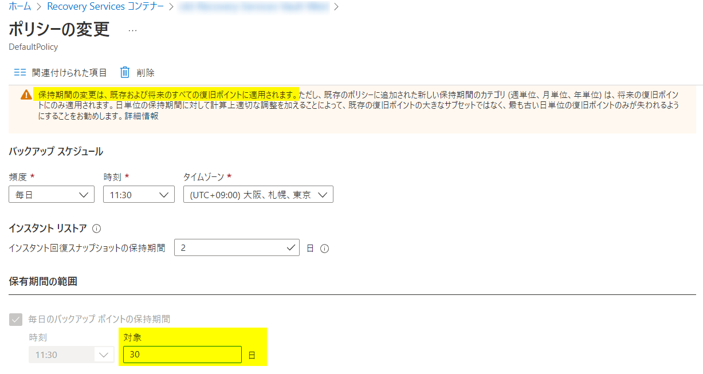
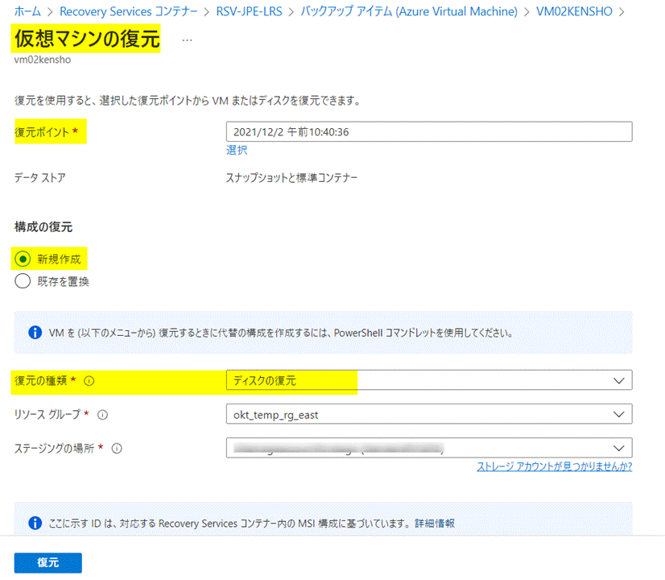

<!-- more -->
皆様こんにちは、Azure Backup サポートです。
今回は、 **Azure VM Backup として取得済の復元ポイントの保持期限を延長できるかという点** についてご案内いたします。

Azure VM Backup 関連のお問い合わせで、以下のようなお問い合わせを多くいただきます。
1. バックアップ ポリシーに従って取得済の復元ポイントの保持期間を延長することは可能か
2. バックアップ ポリシーに従って取得済の復元ポイントの中の、特定の復元ポイントのみの保持期間を延長して保持しておくことは可能か
3. 「今すぐバックアップ」にて取得済の復元ポイントの保持期間を延長して保持しておくことは可能か

結論から申し上げますと、***1. は可能でございますが、2. 3. については保持期間を延長して保持しておくことはかないません。***

・特定の復旧ポイントのリテンション期間を延長または減らす方法
https://docs.microsoft.com/ja-jp/azure/backup/backup-azure-vm-backup-faq#----------------------------
>抜粋:"この機能は、現時点ではサポートされていません。 [Azure Backup コミュニティ ポータル](https://feedback.azure.com/d365community/forum/153aa817-0725-ec11-b6e6-000d3a4f0858#)で、任意の機能に関する質問を投稿できます。"

バックアップポリシーにてスケジュールバックアップで取得した復元ポイントはポリシーによって管理されますが、「今すぐバックアップ」にて取得した復元ポイントはバックアップ時に設定した保持期限に従い管理されます。
即ち、***「今すぐバックアップ」の保持期限はバックアップポリシーの設定内容の影響を受けません。***(ただし、インスタントリストアの保持期限はバックアップポリシーに従います。)

また **Azure Backup では保持期限は最長 99 年となるため、無期限に保存するような設定はできません。**
ただし「バックアップの停止」時に「バックアップ データの保持」を選択した場合は、「バックアップの再開」または「バックアップ データの削除」を行うまで、取得済みの復旧ポイントは無期限に保存されます。
このとき「バックアップの再開」を行うと、バックアップ ポリシーに設定した保持期限に従って、保持期限が過ぎた復旧ポイントが削除されます。

代替案含め、下記にてご説明いたします。

## 目次
-----------------------------------------------------------
[1. バックアップ ポリシーに従って取得済の復元ポイントの保持期間を延長することは可能か](#1)
[2. バックアップ ポリシーに従って取得済の復元ポイントの中の、特定の復元ポイントのみの保持期間を延長して保持しておくことは可能か](#2)
[3.「今すぐバックアップ」にて取得済の復元ポイントの保持期間を延長して保持しておくことは可能か](#3)
[4. Azure VM Backup の取得済復旧ポイントの保持期限を伸ばす代替案](#4)
[5. 参考](#5)

## 1. バックアップ ポリシーに従って取得済の復元ポイントの保持期間を延長することは可能か
対象の仮想マシンに適用しているバックアップ ポリシー内の保持期間を変更することで、これまで取得済の復元ポイントに対しても保持期間を延長することが可能でございます。
例えば、週次 (日次) にて取得する復元ポイント（バックアップ ポイント）に対する保持期間の変更は、すでに週次 (日次) にて取得した復元ポイントに対しても変更が適用されます。

下記の弊社公開情報をご覧ください。
・Azure Backup - よく寄せられる質問 - バックアップ ポリシーを変更した場合どうなりますか。
https://docs.microsoft.com/ja-jp/azure/backup/backup-azure-backup-faq#--------------------------

・アーキテクチャの概要 -  復旧ポイントに対するポリシーの変更の影響
　https://docs.microsoft.com/ja-jp/azure/backup/backup-architecture#impact-of-policy-change-on-recovery-points

## 2. バックアップ ポリシーに従って取得済の復元ポイントの中の、特定の復元ポイントのみの保持期間を延長して保持しておくことは可能か
## 3. 「今すぐバックアップ」にて取得済の復元ポイントの保持期間を延長して保持しておくことは可能か
バックアップ ポリシー上で「保持期間」を変更した場合、これまで取得してきたすべての復元ポイントに対して、ポリシーの変更が適用されます。
残念ながら、これまで取得してきた復元ポイントのうち、「ある特定の復元ポイントのみ」の保持期間を延長して保持しておく、ということはかないません。

また、「今すぐバックアップ」（オンデマンド バックアップ）にて取得した復元ポイントの保持期間も延長することはかないません。(「今すぐバックアップ」の保持期限はバックアップポリシーの設定内容の影響を受けないため)
上記 2. 3. をご所望の場合は、下記代替案の通り、対象の復元ポイントからディスクとして復元しておき、ご利用者様にてディスクを保持していただくことをお勧めします。

## 4. Azure VM Backup の取得済復旧ポイントの保持期限を伸ばす代替案
対象の仮想マシン ＞ 「VM の復元」をクリック ＞ 「復元ポイント」にて、保持しておきたい特定の復元ポイントを選択します。
「構成の復元：新規作成」「復元の種類：ディスクの復元」を選択のうえ、「復元」をクリックします。
**復元されたディスクは、ご利用者様にてディスクを削除しない限り、保持され続けます。**

復元されたからディスクを既存の VM にアタッチすることや、既存の VM とディスクをスワップすること、および、復元されたディスクを使って新規 VM を作成することが可能です。

 ## 参考
・Azure VM Backupでリストアされるディスク名に関して
https://jpabrs-scem.github.io/blog/AzureVMBackup/About_Restored_Disk/
・Azure VM Backup にて取得した復元ポイントの保持期限を確認する方法
https://jpabrs-scem.github.io/blog/AzureVMBackup/HowToCheckRetentionPeriodForVMBackup/
・バックアップ ポリシーに設定されている保有期間が過ぎても、スナップショットが存在するのはなぜですか。
https://docs.microsoft.com/ja-jp/azure/backup/backup-instant-restore-capability#why-does-my-snapshot-still-exist-even-after-the-set-retention-period-in-backup-policy
・自分の保有ポリシーよりも多くのスナップショットが表示されるのはなぜですか。
https://docs.microsoft.com/ja-jp/azure/backup/backup-instant-restore-capability#why-do-i-see-more-snapshots-than-my-retention-policy