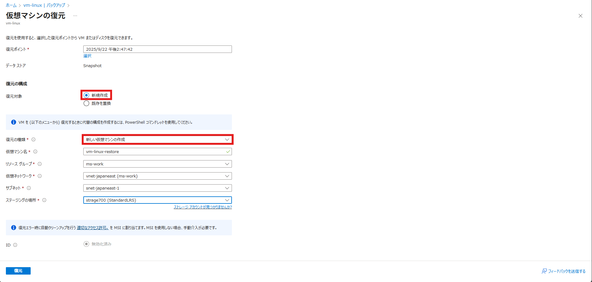
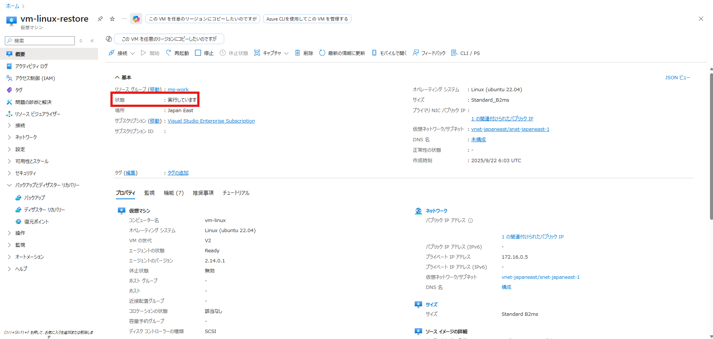
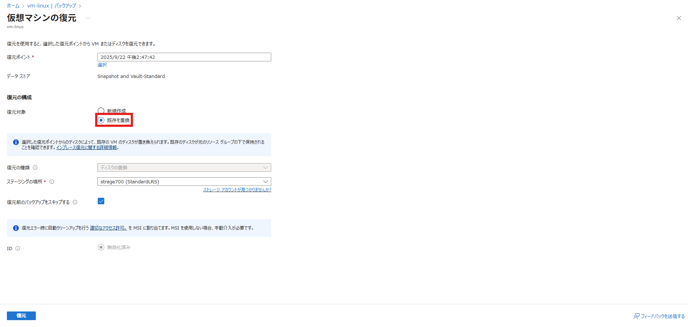
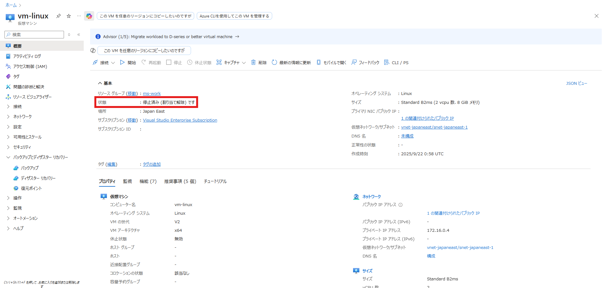

<!-- more -->
皆様こんにちは、Azure Backup サポート チームです。
今回は、**Azure VM Backup において、停止状態で VM を復元する方法** についてご紹介します。

## 目次
-----------------------------------------------------------
[1. 概要](#1)
[2. VM を「新しい仮想マシンの作成」オプションで復元した際の挙動](#2)
[3. ](#3)
[3-1. 診断設定の構成方法](#3-1)
[3-2. バックアップ レポートでのデータ量の確認方法](#3-2)
[4. 現時点でできないこと](#4)
-----------------------------------------------------------

## 1. 概要
Azure VM Backup では、復元時に「新しい仮想マシンの作成」オプションを選択すると、復元された VM は自動的に実行状態になります。
しかし、「復元後の VM は停止状態にしたい」というニーズもあると思います。

本記事では、**VM を停止状態で復元する方法**をご紹介します。

## 2. VM を「新しい仮想マシンの作成」オプションで復元した際の挙動
**「新しい仮想マシンの作成」オプション**を選択して VM を復元した場合の挙動を確認します。

この方法では、新しい VM を作成できますが、VM は実行状態で復元されます。

### 3. VM を停止状態で復元する方法
VM を停止状態で復元するために、以下の 2 つの方法が挙げられます。
1. 既存の置換オプションを利用する
1. 別ネットワークに新規 VM として復元し、停止後に同じネットワークに移動する

それぞれの方法について、以下のブログでご説明いたします。
次に、**「既存を置換」オプション**を選択して VM を復元した場合の挙動を確認します。

ただし、「既存を置換」オプションを利用する場合、VM は停止されている必要がございます。

この方法で復元すると、VM は停止状態となるが、VM を新しく作成するのではなく、既存のVM を置き換える形での復元となります。

Azure VM のデータを復元する方法の詳細につきましては、以下の公式ドキュメントをご確認ください。
・Azure Backup を使用して Azure portal を使用して VM を復元する - Azure Backup | Microsoft Learn
　https://learn.microsoft.com/ja-jp/azure/backup/backup-azure-arm-restore-vms
ただし、上記公式ドキュメントのいずれの方法においても、**新しい VM を作成しつつ、停止状態で復元**することはかないません。

