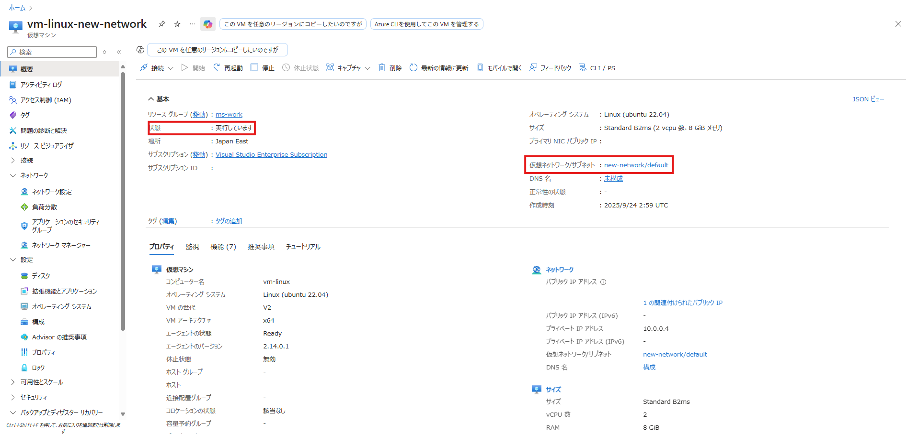

<!-- more -->
皆様こんにちは、Azure Backup サポート チームです。
今回は、**Azure VM Backup において、停止状態で VM を復元する方法** についてご紹介します。

## 目次
-----------------------------------------------------------
[1. 概要](#1)
[2. 「新しい仮想マシンの作成」で復元した際の挙動](#2)
[3. 停止状態で復元したい場合の代替策](#3)
[3-1. 「既存の置換」オプションを利用する](#3-1)
[3-2. 別ネットワークへ新規作成して影響を隔離する](#3-2)
-----------------------------------------------------------

## 1. 概要
Azure VM Backup では、復元時に「新しい仮想マシンの作成」オプションを選択すると、復元された VM は自動的に実行状態になります。
一方で、「復元後の VM は停止状態にしたい」というご要望をいただくことがあります。

結論から申し上げますと、**元の VM に影響を与えることなく、同一仮想ネットワーク上に、停止状態で新規 VM を復元することはかないません**。

本記事では、「VM を停止状態で復元する方法」の 2 つの代替案をご紹介します。

## 2. 「新しい仮想マシンの作成」で復元した際の挙動
はじめに、**「新しい仮想マシンの作成」オプション**を選択して VM を復元した場合の挙動を確認します。

この方法では、新しい VM を作成できますが、VM は実行状態で復元されます。

復元完了後に手動で停止することは可能ですが、「停止状態で復元する」ことは現時点 (2025 年 9 月 25 日現在) でかないません。

## 3. 停止状態で復元したい場合の代替策
「VM を停止状態で復元したい場合」の 2 つの代替案をご紹介します。
1. 「既存の置換」オプションを利用する
1. 別ネットワークへ新規作成して影響を隔離する

### 3-1. 「既存の置換」オプションを利用する
一つ目は、**「既存を置換」オプション**を選択して VM を復元する方法です。

ただし、「既存を置換」オプションを利用する場合、**VM は停止されている**必要がございます。

この方法で復元すると、復元元の VM は上書きされますが、VM は停止状態で復元することができます。

### 3-2. 別ネットワークへ新規作成して影響を隔離する
二つ目は、**別ネットワークに**新規 VM として復元する方法です。
「VM を復元してバックアップ データを確かめたいが、本番環境に復元し、本番環境に影響が出るのを避けたい」といったニーズの場合、この代替案を推奨いたします。

まず、「仮想ネットワーク」 → 「作成」より、新しく仮想ネットワークを作成してください。

次に、VM の復元において、新しく作成した仮想ネットワークを選択したうえで、新規 VM の作成をしてください。

この方法で復元すると、作られる VM は実行状態となりますが、別の仮想ネットワークに作成されます。
そのため、本番環境に極力影響を与えることなく、バックアップ データをご確認いただけます。

Azure VM のデータを復元する方法の詳細につきましては、以下の公式ドキュメントをご確認ください。
・Azure Backup を使用して Azure portal を使用して VM を復元する - Azure Backup | Microsoft Learn
　https://learn.microsoft.com/ja-jp/azure/backup/backup-azure-arm-restore-vms
