<!-- more -->
皆様こんにちは、Azure Backup サポートです。
今回は、「VMSnapshot」拡張機能のアンインストール手順 (Windows OS の場合) についてご案内いたします。

「VMSnapshot」拡張機能は、Azure VM Backup (Azure 仮想マシンをまるごとバックアップする機能) において、対象の Azure 仮想マシン上にインストールされる拡張機能です。
Azure VM Backup にて何らかのエラーが発生した場合、トラブルシューティングの一環として本記事の記載に従って「VMSnapshot」拡張機能を一度マシンからアンインストールしていただき、再度バックアップを実行させることで、エラーが解消されるかを依頼する場合がございます。

・(参考) Azure VM バックアップについて - Azure Backup | Microsoft Learn
　https://learn.microsoft.com/ja-jp/azure/backup/backup-azure-vms-introduction#backup-process
　"Windows VM の場合、VMSnapshot 拡張機能がインストールされます。
　 Linux VM の場合、VMSnapshotLinux 拡張機能がインストールされます。"

・(参考) Azure Backup 用の VM スナップショットの Windows 拡張機能 - Azure Virtual Machines | Microsoft Learn
　https://learn.microsoft.com/ja-jp/azure/virtual-machines/extensions/vmsnapshot-windows

なお、下記公開ドキュメント上では、Azure ポータル画面 > Azure 仮想マシン > [拡張機能とアプリケーション] 画面から、アンインストールすることができるという説明を記載しておりますが
これは **アンマネージド ディスクから作成している Azure 仮想マシンの場合のみ** となります。
マネージド ディスク の Azure 仮想マシンの場合は、本記事に従って 「VMSnapshot」拡張機能のアンインストールをお試しください。

・(参考) ExtensionStuckInDeletionState - 拡張機能の状態がバックアップ操作に対応していません
　https://learn.microsoft.com/ja-jp/azure/backup/backup-azure-vms-troubleshoot#extensionstuckindeletionstate---extension-state-is-not-supportive-to-the-backup-operation
　"バックアップ拡張機能 [VmSnapshot] または [VmSnapshotLinux] を選択し、 [アンインストール] を選択します。"

(画面例 : マネージド ディスク の Azure 仮想マシンの場合は、[拡張機能とアプリケーション] 画面上には「VMSnapshot」拡張機能は表示されません)
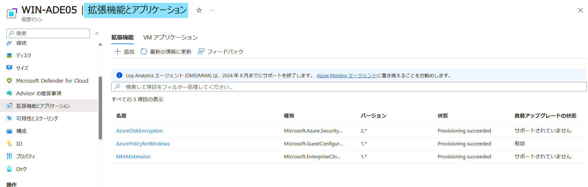

### 「VMSnapshot」拡張機能のアンインストール手順 (Windows)
1. PowerShell にて該当の Azure アカウントにログインし、下記コマンドを実行し、該当の Azure 仮想マシン上から「VMSnapshot」拡張機能をアンインストールしてください。  
     (実行コマンド)  
      ``Remove-AzVMExtension -ResourceGroupName "<Azure 仮想マシンのリソース グループ>" -VMName "<Azure 仮想マシン名>" -Name "VMSnapshot"​``
      
   上記コマンド実行後、「Y」を入力してアンインストールを指示します。
   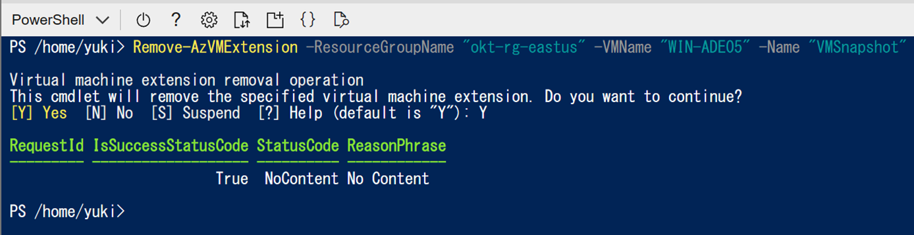

   ・(参考) Remove-AzVMExtension (Az.Compute) | Microsoft Learn
    https://learn.microsoft.com/ja-jp/powershell/module/az.compute/remove-azvmextension?view=azps-11.0.0

1. 該当の Azure 仮想マシン にサインインし、Windows + r を押下して ”ファイル名を指定して実行” を開き “services.msc” と入力して、サービスを開いてください。
   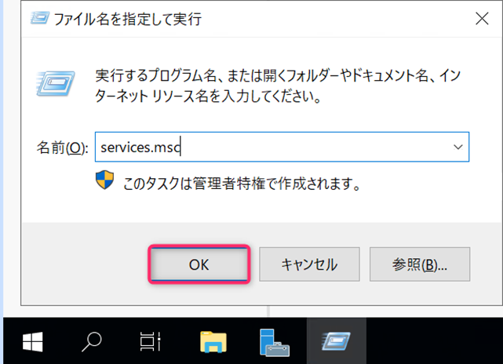

1. “Windows Azure Guest Agent” を右クリックし、停止をクリックして、サービスを停止してください。
   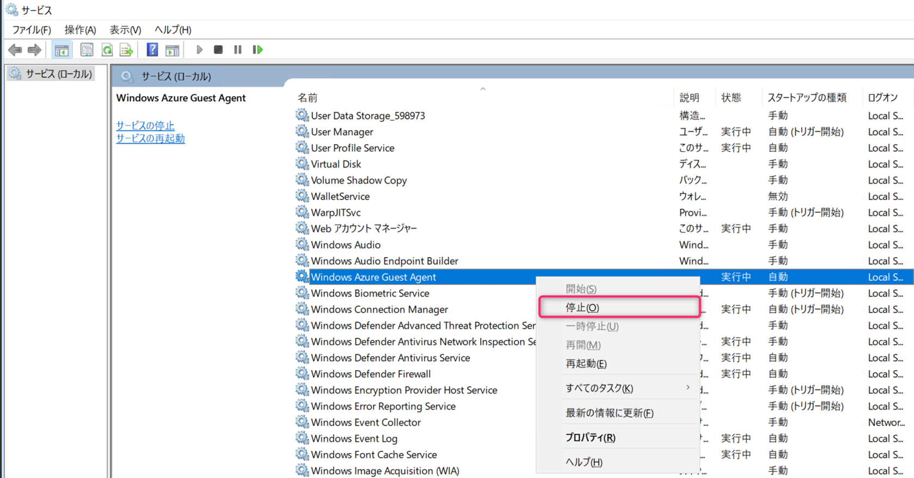

   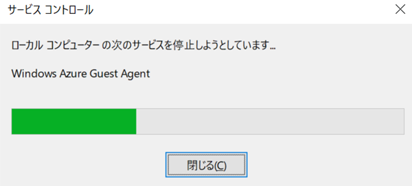

   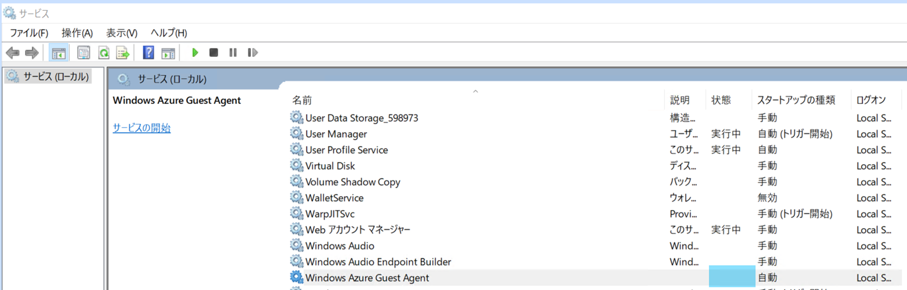

1. エクスプローラを開き、C:\Packages\Plugins に移動し、”Microsoft.Azure.RecoveryServices.VMSnapshot” フォルダーの名前を ”Microsoft.Azure.RecoveryServices.VMSnapshot_old” といったように変更してください。
   
   (補足) 
      ”Microsoft.Azure.RecoveryServices.VMSnapshot” フォルダーが、マシン上にインストールされている「VMSnapshot」拡張機能のファイル群です。
      「VMSnapshot」拡張機能が正常に再インストール完了すれば、こちらの名前を変更したフォルダーは削除いただいて構いません。

   (変更前)
   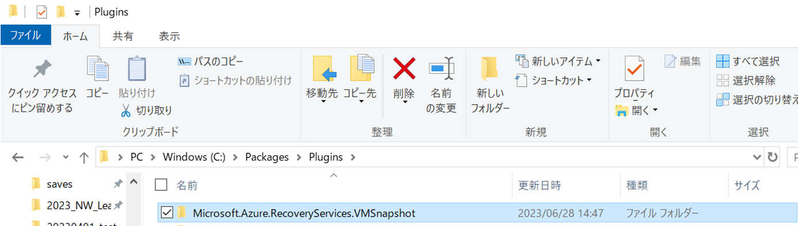

   (変更後)
   

2. Windows + r を押下して ”ファイル名を指定して実行” を開き “regedit” と入力して、レジストリエディターを開いてください。
   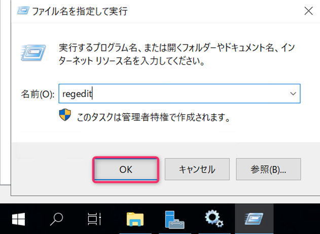

3. HKEY_LOCAL_MACHINE\Software\Microsoft\WindowsAzure に移動し、これを安全な場所にエクスポートしてください。
   
   (補足)
      レジストリ キーの値をあくまでバックアップ目的でエクスポート (退避) します。
     「VMSnapshot」拡張機能が正常に再インストール完了すれば、こちらのエクスポートしたファイルは削除いただいて構いません。

   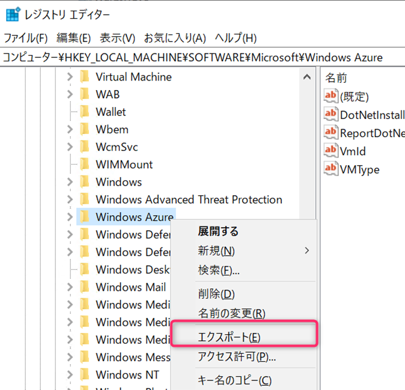

   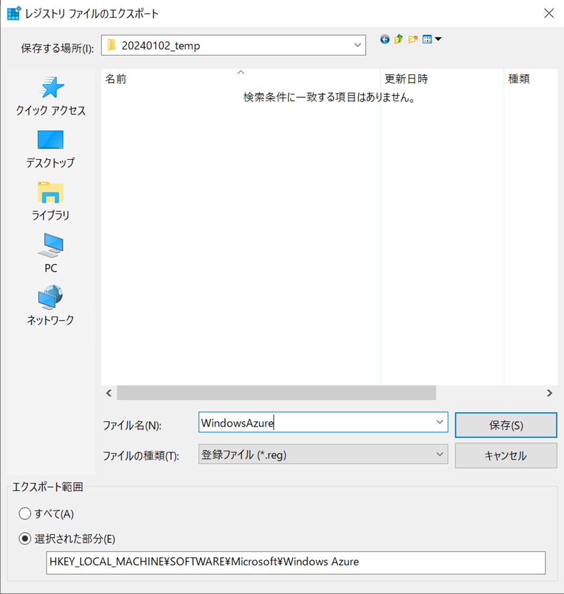

4. HKEY_LOCAL_MACHINE\Software\Microsoft\WindowsAzure\HandlerState に移動し、Microsoft.Azure.RecoveryServices.VMSnapshot_X.X.X.X を削除してください。
   (X.X.X.X は、マシン上の数字と読み替えてください)
   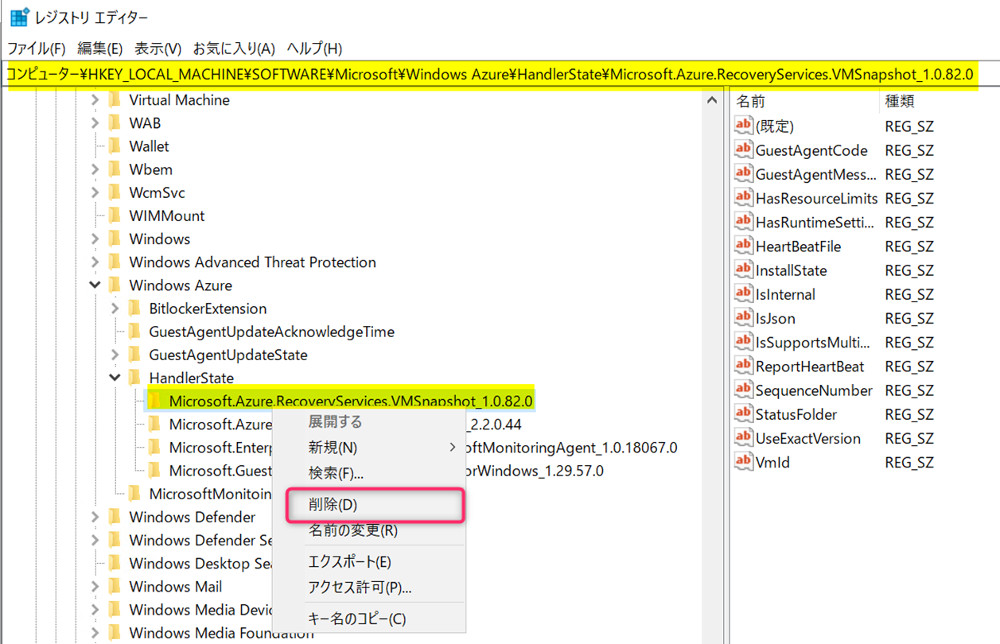

   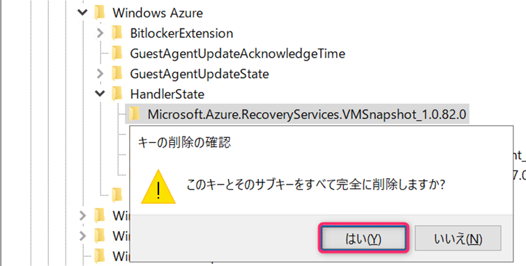

5. 管理者権限にてコマンドプロンプトを開き以下のコマンド (2 つ) を実行してください。
     (実行コマンド)  
      ``REG ADD "HKLM\SOFTWARE\Microsoft\BcdrAgent" /v IsProviderInstalled /t REG_SZ /d False /f​``
      ``REG ADD "HKLM\SOFTWARE\Microsoft\BcdrAgentPersistentKeys" /v IsCommonProviderInstalled /t REG_SZ /d False /f``

   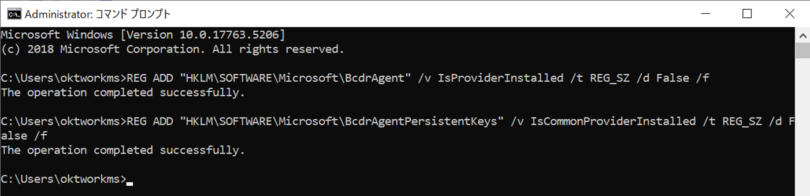

6. サービスより “Windows Azure Guest Agent” を右クリックし、開始をクリックして、サービスを開始してください。
   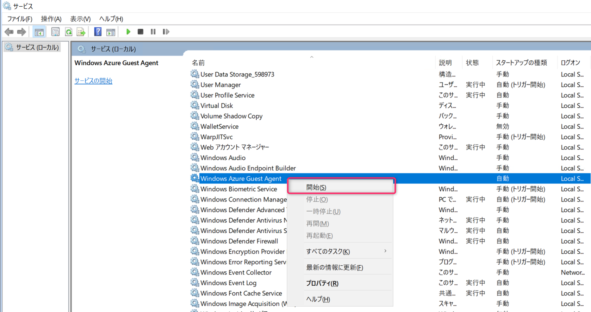

   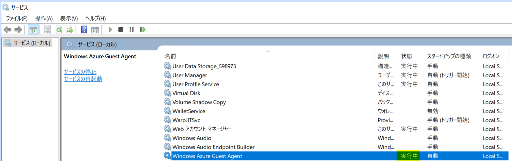

7. 次回の Azure VM Backup のスケジュール バックアップ、もしくは「今すぐバックアップ」より、バックアップをトリガーください。
   ・(参考) バックアップをすぐに実行する
    https://learn.microsoft.com/ja-jp/azure/backup/backup-azure-vms-first-look-arm#run-a-backup-immediately 

8. Azure VM Backup ジョブが正常に終了すること・「VMSnapshot」拡張機能のフォルダーが再配置されていることを確認ください。
   下図のように C:\Packages\Plugins 配下に ”Microsoft.Azure.RecoveryServices.VMSnapshot” フォルダーが再配置されていれば【「VMSnapshot」拡張機能を再インストールできた】と判断できます。

   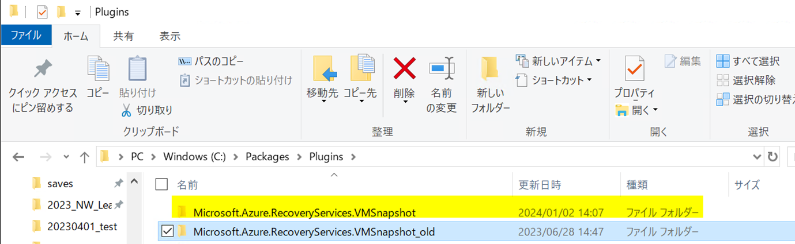

   「VMSnapshot」拡張機能を正常に再インストールした後は、下記 2 点のフォルダー・ファイルは削除いただいて構いません。
   ・”Microsoft.Azure.RecoveryServices.VMSnapshot_old” フォルダー
   ・エクスポートしていたレジストリ キーのファイル

「VMSnapshot」拡張機能のアンインストール手順 (Windows OS の場合) は以上となります。