<!-- more -->
皆様こんにちは。Azure Backup サポートの山本です。
今回はお問い合わせをいただくことが多い、 **"Azure VM Backup における Take Snapshot フェーズの確認方法"**  について解説させていただきます。
Azure VM Backup では  **Take Snapshot フェーズ が終わっていれば VM の再起動などを実施いただいても影響がなく、スナップショットからのリストアが可能 (インスタントリストア) が可能になる**ため、**Take Snapshot フェーズのステータス確認を確認したい、かかった時間を知りたい**、というお問い合わせをよくいただきます。

まず、はじめに前提知識として Azure VM Backup ではバックアップを取得する際に下記 2 つのサブタスクがございます。
1.Take Snapshot (スナップショットの取得)
2.Transfer data to vault (Recovery Services コンテナーへの転送)
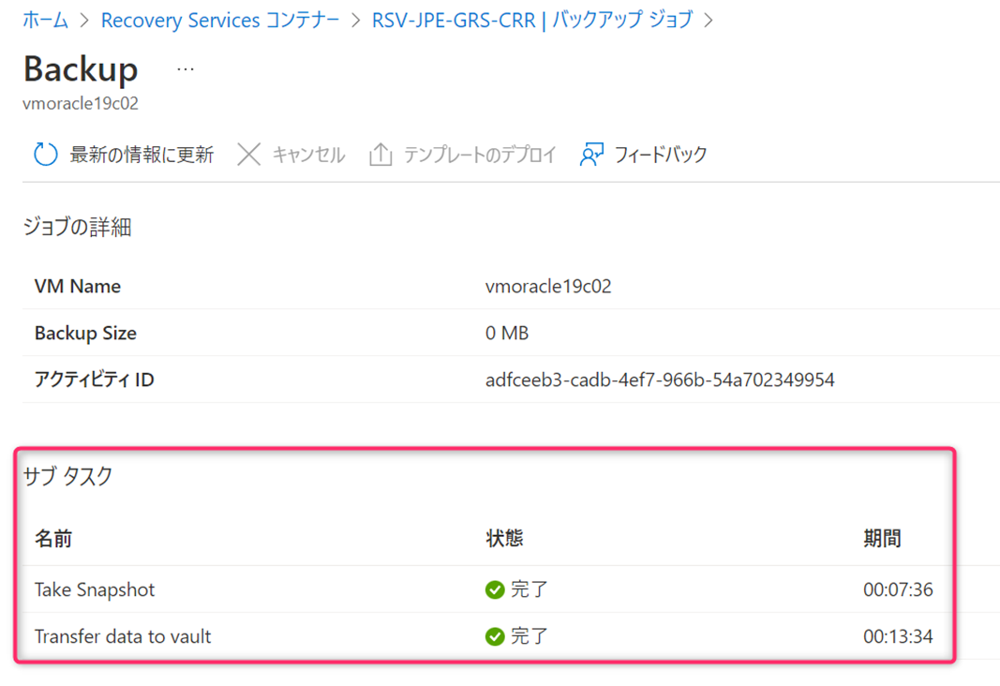

## 目次
-----------------------------------------------------------
[1. サブタスク (Take Snapshot フェーズ) 確認方法](#1)
 [ (注意)コマンド実行環境に関する注意](#1-notice)
 [1-1. Azure Portal を用いたサブタスク (Take Snapshot フェーズ) 確認方法](#1-1)
 [1-2. Azure CLI を用いたサブタスク (Take Snapshot フェーズ) 確認方法](#1-2)
 [1-3. Azure PowerShell を用いたサブタスク (Take Snapshot フェーズ) 確認方法](#1-3)
[2. サブタスク (Take Snapshot フェーズ) にかかった時間を確認する方法](#2)
 [ フィードバックご協力のお願い](#2-1)
-----------------------------------------------------------

## 1. サブタスク (Take Snapshot フェーズ) 確認方法
サブタスク確認方法は **Azure Portal で確認する方法**、および、 **Azure CLI や Azure PowerShell といった CLI を用いた方法**がございます。
今回弊社検証環境で確認結果も添えてお伝えさせていただきます。
また Recovery Services コンテナーのことを RSV と略して表記している部分がございます。

### コマンド実行環境に関する注意
本記事の実行環境は Azure CLI も Azure PowerShell もインターフェースを PowerShell を用いて今回実施しております。
そのため、bat ファイル (コマンドプロンプト) などで記述される際には call コマンドを付けていただく必要があるなど、ご利用のインターフェースに応じた対応、記述が必要となることがございます。

###  1-1. Azure Portal を用いたサブタスク (Take Snapshot フェーズ) 確認方法
[対象の Recovery Services コンテナー] → 左ペインの [バックアップ ジョブ] → 対象のバックアップ ジョブの [View details] → [サブ タスク] の手順で確認いただくことが可能です。
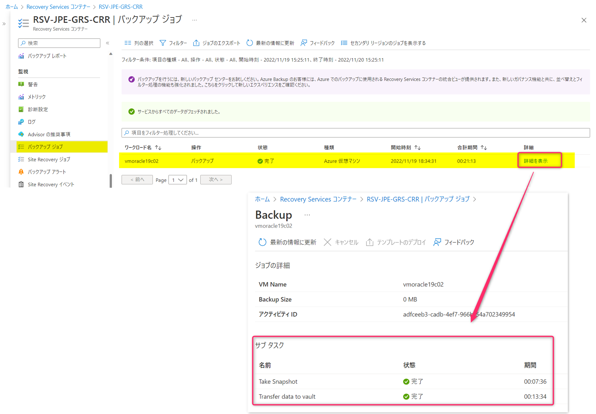

### 1-2. Azure CLI を用いたサブタスク (Take Snapshot フェーズ) 確認方法
- 検証環境情報
まず、はじめに今回の検証環境の情報です。
>VM名：VM-Win10
>リソースグループ：RG-alwaysONVM
>Recovery Services コンテナー：RSV-JPE-LRS
>リソースグループ：RG-NormalTest
>コマンド実行ターミナル：PowerShell

今回は Windows の PowerShell を用いて Azure CLI を実行します。
#### 0.事前準備
　 Azure へログインします。ログインしている環境であれば不要です。
  >コマンド：` ` `az login` ` `

#### 1.バックアップ ジョブのステータス確認 (.Name 値 の取得)
  >コマンド：` ` `az backup job list --resource-group < RSV リソースグループ名> --vault-name < RSV 名> --status InProgress -o table` ` `
  >コマンド例：` ` `az backup job list --resource-group RG-NormalTest --vault-name RSV-JPE-LRS --status InProgress -o table` ` `

上記コマンドを実行いただくと実行中のバックアップ ジョブの name 値が取得できます。
 出力結果を Azure VM Backup の実行中のバックアップ ジョブに限定する場合は下記のオプションを付けることで可能です。
  >コマンド： ` ` `--backup-management-type AzureIaasVM` ` ` 

　下記例 "name" : "2a8c96f8-c282-4f62-9286-fda08088047e"
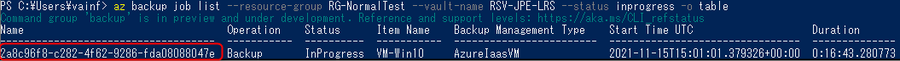

#### 2.サブタスク (Take Snapshot フェーズ) のステータス確認
name 値 を用いて下記のコマンドを実行することでサブタスクのステータスが確認できます。
下記例では Take Snapshot のステータスが Completed 、Transfer data to vault のステータスが InProgress 、となっており、スナップショットの取得が終わり、 Recovery Services コンテナーへの転送中であることが分かります。

>コマンド：` ` `az backup job show --name <name値> --resource-group  < RSV リソースグループ名> --vault-name  < RSV 名> --query properties.extendedInfo.tasksList -o table` ` `

>コマンド例 :` ` `az backup job show --name 2a8c96f8-c282-4f62-9286-fda08088047e --resource-group  RG-NormalTest --vault-name RSV-JPE-LRS --query properties.extendedInfo.tasksList -o table` ` `

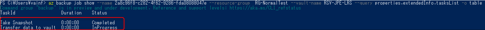

--query オプションを付けない場合は下記の部分から確認できます。
>コマンド：` ` `az backup job show --name < name 値> --resource-group  < RSV リソースグループ名> --vault-name  < RSV 名>` ` `
>コマンド例：` ` `az backup job show --name 2a8c96f8-c282-4f62-9286-fda08088047e --resource-group  RG-NormalTest --vault-name RSV-JPE-LRS` ` `

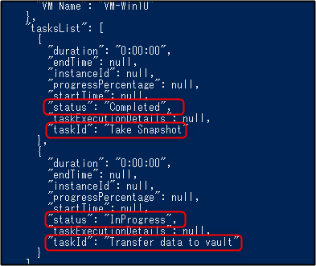

また、サブタスクのステータスだけを抜き出して確認したい場合は下記で可能です。
##### Take Snapshot
>コマンド：` ` `az backup job show --name <name値> --resource-group  < RSV リソースグループ名> --vault-name  < RSV 名> --query properties.extendedInfo..tasksList[0].status`` ` 

>コマンド例 :` ` `az backup job show --name 2a8c96f8-c282-4f62-9286-fda08088047e --resource-group  RG-NormalTest --vault-name RSV-JPE-LRS --query properties.extendedInfo.tasksList[0].status` ` `
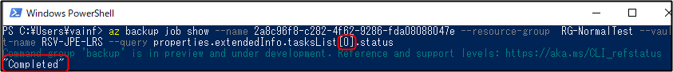
 
##### Transfer data to vault 
>コマンド：` ` `az backup job show --name <name値> --resource-group  < RSV リソースグループ名> --vault-name  < RSV 名> --query properties.extendedInfo..tasksList[1].status`` ` 

>コマンド例 :` ` `az backup job show --name 2a8c96f8-c282-4f62-9286-fda08088047e --resource-group  RG-NormalTest --vault-name RSV-JPE-LRS --query properties.extendedInfo.tasksList[1].status` ` `
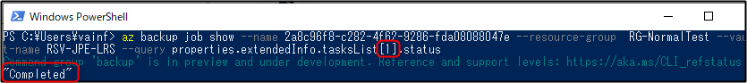

- 参考：
・Azure CLI を使用した Azure での仮想マシンのバックアップ - バックアップ ジョブを監視する
https://docs.microsoft.com/ja-jp/azure/backup/quick-backup-vm-cli#monitor-the-backup-job
・az backup job - az backup job list
https://docs.microsoft.com/ja-jp/cli/azure/backup/job?view=azure-cli-latest#az_backup_job_list
・JMESPath クエリを使用して Azure CLI コマンドの出力に対してクエリを実行する方法 - 辞書のプロパティを取得する(--query オプションに関する参考情報)
https://docs.microsoft.com/ja-jp/cli/azure/query-azure-cli#get-properties-in-a-dictionary
・配列内のプロパティを取得する
https://docs.microsoft.com/ja-jp/cli/azure/query-azure-cli?tabs=concepts%2Cpowershell#get-properties-in-an-array

### 1-3. Azure PowerShell を用いたサブタスク (Take Snapshot フェーズ) 確認方法
今回は Windows の PowerShell を用いて Azure PowerShell を実行します。

#### 0.事前準備
　 Azure へログインします。ログインしている環境であれば不要です。
  >コマンド：` ` `Connect-AzAccount` ` `　　

#### 1.定数を設定します。
>コマンド：` ` `$Vault = Get-AzRecoveryServicesVault -Name "< RSV 名>"` ` `
>コマンド例：` ` `$Vault = Get-AzRecoveryServicesVault -Name "RSV-JPE-LRS"` ` `

>コマンド：` ` `$VMName = "< VM 名>"` ` `
>コマンド例：` ` `$VMName = "VM-Win10"` ` `

#### 2.バックアップ ジョブのステータス確認　
下記コマンドを実行することで、指定した VM の実行中のバックアップ ジョブの一覧が確認できます。
下記例では1つしかないため、$Jobs[0] に実行中のバックアップ ジョブの情報が格納されます。
複数ある場合は直近に実行されたものから若い番号に格納されます。

>コマンド：
>` ` `$Jobs = (Get-AzRecoveryservicesBackupJob -Status "InProgress" -VaultId $Vault.id | ? {$_.WorkloadName -eq $vmName})` ` `
>` ` `$Jobs` ` `

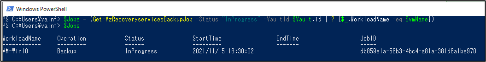

>コマンド：` ` `$Jobs[0]` ` `

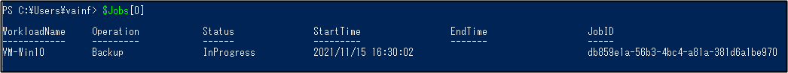

#### 3．実行中のバックアップ ジョブのサブタスクを取得・表示
下記コマンドを実行することでサブタスクのステータスが確認できます。
下記例では、Take Snapshot は Completed、Transfer data to vault は InProgress 、となっており、スナップショットの取得が終わり、 Recovery Services コンテナーへの転送中であることが分かります。

>コマンド：
>` ` `$SubTasks = Get-AzRecoveryServicesBackupJobDetail -Job $Jobs[0]  -VaultId $Vault.id` ` `
>` ` `$SubTasks.subtasks` ` `

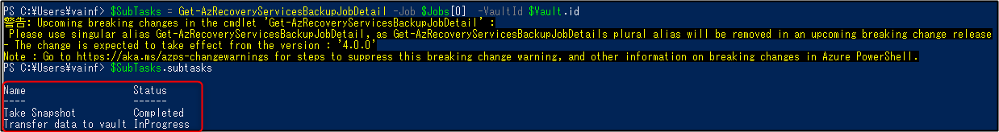

上記警告については、現在使用可能な ”Get-AzRecoveryServicesBackupJobDetail” のエイリアス ”Get-AzRecoveryServicesBackupJobDetails” が将来的に廃止されていることを示しますが、上記のコマンドであれば使用していないので無視していただいて構いません。

また下記コマンドを実行していただくことで警告を表示させないことが可能です。
>コマンド：` ` `Set-Item Env:\SuppressAzurePowerShellBreakingChangeWarnings "true"` ` `

上記のコマンドを実行したところ警告が出ていないことが分かります。

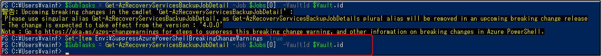

・How do I get rid of the warnings? (警告の非表示について)
https://github.com/Azure/azure-powershell/blob/main/documentation/breaking-changes/breaking-changes-messages-help.md#how-do-i-get-rid-of-the-warnings

#### 補足
なお、[2.バックアップ ジョブのステータス確認](#a) で下記のように　VM 名を指定しない場合、その他の実行中のバックアップ ジョブも表示されます。(実行中のその他の VM がある場合)
>コマンド：
>` ` `$Jobs = Get-AzRecoveryservicesBackupJob -Status "InProgress" -VaultId $Vault.id` ` `
>` ` `$Jobs` ` `

その際の $Jobs[0]、$Jobs[1] の値は次のようになります。
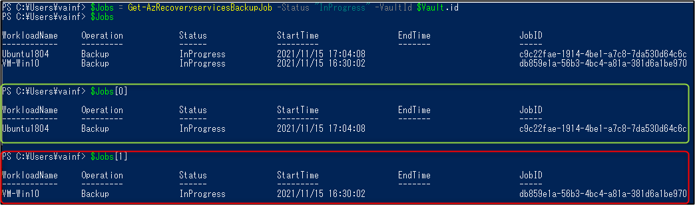

- 参考：
・APowerShell を使用して Azure VM をバックアップおよび復元する - バックアップ ジョブの監視
https://docs.microsoft.com/ja-jp/azure/backup/backup-azure-vms-automation#monitoring-a-backup-job
・Get-AzRecoveryServicesBackupJob
https://docs.microsoft.com/ja-jp/powershell/module/az.recoveryservices/get-azrecoveryservicesbackupjob?view=azps-6.6.0

## 2. サブタスク (Take Snapshot フェーズ) にかかった時間を確認する方法 
2022/11 月現在、Azure Portal 上より、各フェーズの所要時間を確認可能でございます。
もしくは、お問い合わせいただくことで弊社にてお客様環境の実績値をお調べしお伝えすることが可能です。
その際には下記情報を添えてお問い合わせいただきますようお願いいたします。
　・サブスクリプション ID 
　・VM 名およびそのリソースグループ名
　・Recovery Services コンテナー 名およびそのリソースグループ名
