<!-- more -->
皆様こんにちは、Azure Backup サポートです。
アラートのテスト等のため "Azure VM Backup を失敗させたい" というお問い合わせをよくいただきます。
今回は、**Azure VM Backup を意図的に失敗させる方法**について、ご案内いたします。

(その他ブログで公開している Azure Backup の失敗方法)
・Azure VM Backup のデータ転送フェーズを意図的に失敗させる方法
　https://jpabrs-scem.github.io/blog/AzureVMBackup/How_to_fail_ttv/

・MARS バックアップ を意図的に失敗させる方法
　https://jpabrs-scem.github.io/blog/MARSBackup/How_to_fail_MARS_backup/

・Azure Files Backup を意図的に失敗させる方法
　https://jpabrs-scem.github.io/blog/AzureFilesBackup/How_to_fail_AFS_backup/

## 目次
-----------------------------------------------------------
[1. Azure Guest Agent を停止して意図的にAzure VM Backup エラーを発生させる仕組み](#1)
  [1-1. 実施時の注意事項](#1-1)
[2. Azure Guest Agent を停止してバックアップを故意に失敗させる方法 (手順概略) ](#2)
[3. バックアップを故意に失敗させる方法 (Windows VM の場合)](#3)
  [【補足】 Windows Firewall を用いた方法](#3-1)
[4. バックアップを故意に失敗させる方法 (Linux VM の場合)](#4)
[5. バックアップを故意に失敗させる方法 (共有ディスクをアタッチする)](#5)
-----------------------------------------------------------

## 1. Azure Guest Agent を停止して意図的にAzure VM Backup エラーを発生させる仕組み 
VM 内の Windows Azure Guest Agent (VM agent) が停止させ、Azure 側の Recovery Services コンテナー (Azure Backup service) との通信ができない状態を作ります。
この状態で Backup 取得をしようとすると、VM agent と通信できないためにエラー (Error Code ”UserErrorGuestAgentStatusUnavailable”) が発生し、Backup が失敗となります。

*VM 電源状態 がオンライン状態でなければこの方法は使えません。オフライン状態では成功してしまいます。そのため、必ずオンライン (電源起動) 状態でご実施ください。
下記ご参考になれば幸いです。
・Azure VM Backup では オフライン バックアップができるのか
https://jpabrs-scem.github.io/blog/AzureVMBackup/Azure_VM_Offline_backup/

> [!WARNING]
> VM agent を停止させる方法は標準 (Standard) ポリシーでバックアップ保護されている VM のみ有効となります。
> もし拡張 (Enhanced) ポリシーで保護されている VM で意図的に VM バックアップを失敗させる場合は [5. バックアップを故意に失敗させる方法 (共有ディスクをアタッチする)](#5)をご参照ください。

### 1.1 実施時の注意事項 

当記事にて説明しております「バックアップを意図的に失敗させる方法」について、以下の注意点がございます。  
必ずご一読いただき、リスクを十分にご理解いただいた上で、お客様ご自身の責任において実施いただきますようお願い申し上げます。  
また、万が一問題が発生した場合に備え、事前に VM のバックアップを取得していただくことをお勧めいたします。  
- Azure Guest Agent を停止してバックアップを故意的に失敗させる方法について
  > Azure VM Guest Agent を手動停止することで、Azuer Backup 以外の 拡張機能や Agent に期せぬ問題を発生させる可能性あります。  
  > どのような問題が発生するかについてはサポートが叶わず、あくまで本手順は一時的な対処であり  
  > ご利用者様自身にて問題が発生した場合には対処いただく必要がある点ご容赦ください。
- ファイアウォールを用いて 168.63.129.16 をブロックしてバックアップを故意的に失敗させる方法について
  > 168.63.129.16 は Azuer の複数の機能 ( Azure DNS, DHCP や Agent の通信先 ) など複数の役割を担っているため、  
  > ファイアウォールにて当該通信先をブロックした状態で動作させると予期せぬ問題を起こす可能性がございます。  
  > どのような問題が発生するかについてはサポートが叶わず、あくまで本手順は一時的な対処であり  
  > 問題が発生した場合にはシリアルコンソールから以下コマンドでファイアウォールで拒否したルールの削除などをご実施ください。

## 2. Azure Guest Agent を停止してバックアップを故意に失敗させる方法 (手順概略) 
・「バックアップを故意に失敗させる方法 (Windows VM の場合) 」
>	1.Backup 対象の VM にリモート ログイン
>	2.Services 内で "RdAgent" と "Windows Azure Guest Agent" の停止、スタートアップの無効化
>	3.Backup を実施し、エラーの確認
>	4.Agent の再度起動

・「バックアップを故意に失敗させる方法 (Linux VM の場合) 」
>	1.Backup 対象の VM に SSH 接続
>	2.Agent の停止、および自動起動停止
>	3.Agent の Service を停止
>	　（Ubuntu の場合）` ` `sudo systemctl stop walinuxagent ` ` `
>	　（Ubuntu 以外の場合）` ` `sudo systemctl stop waagent` ` `
>	4.自動起動を停止
>	　（Ubuntu の場合）` ` `sudo systemctl disable walinuxagent ` ` `
>	　（Ubuntu 以外の場合）` ` `sudo systemctl disable waagent` ` `
>	5.Backup を実行し、エラーの確認
>	・Agent の再起動
>	（Ubuntu の場合）
>	　　` ` `sudo systemctl start walinuxagent ` ` `
>		　　` ` `sudo systemctl enable walinuxagent ` ` `
>		　　` ` `systemctl status walinuxagent ` ` `
>		（Ubuntu 以外の場合）
>		　　` ` `sudo systemctl start waagent` ` `
>		　　` ` `sudo systemctl enable waagent` ` `
>	　  　` ` `systemctl status waagent` ` `

## 3. バックアップを故意に失敗させる方法 (Windows VM の場合)  (所要時間 : 2時間～6時間)
### 3.1. 環境
本項目では以下の環境で検証を実施しております。
VM名 : vm-BackupFailTest-win2016
OS : Windows (Windows Server 2016 Datacenter) Version 1607
Recovery Service コンテナー名 : vault-BackupFailTest
VM 電源状態 : オンライン (起動状態)

### 3.2.手順概略 
"サービス" から プロセス "RdAgent"、"Windows Azure Guest Agent" を停止し、スタートアップを無効化しバックアップを実行します。
バックアップが失敗したらそれぞれをもとに戻します。
> 1. Backup 対象の VM にリモート ログイン
> 2. Services 内で "RbAgent" と "Windows Azure Guest Agent" の停止、スタートアップを無効化
> 3. Portal にて Backup を実施し、エラーの確認
> 4. Agent の再起動

### 3.3.詳細手順
Backup 対象の VM : Azure portal上で作成した、Backup 対象の VM
Backup 対象の VM にリモートログインし、Services を開き、下記 2 つのサービスに対し設定を行います。

#### RdAgent
最初に "RdAgent" を停止、スタートアップ無効にします。
・Sercives 一覧の画面で "RdAgent" を右クリック → "Properties" を選択します。
・Startup type で "Disabled" を選択 → Service status で Stop を選択 → Service 停止プロセスが完了した後、"OK" を選択します。
・Services 一覧の画面にて、 RbAgent の Status の Running が消えており、Startup Type が Disabled 場合、 RbAgent の停止が完了となります。

#### Windows Azure Guest Agent
次に "Windows Azure Guest Agent" を停止、スタートアップ無効にします。
・Sercives 一覧の画面で "Windows Azure Guest Agent" を右クリック → "Properties" を選択します。
・Startup type で "Disabled" を選択 → Service status で Stop を選択 → Service 停止プロセスが完了した後、 "OK" を選択します。
・Services 一覧の画面にて、 Windows Azure Guest Agent の Status の Running が消えており、Startup Type が Disabled 場合、 Windows Azure Guest Agent の停止が完了となります。

以上で、VM 側の設定は完了となります。

#### Backup を実施し、エラーの確認
・Azure portal を開いていただき、VM のページに移動 → "バックアップ" を選択 → "今すぐパックアップ" を選択。
この操作により、バックアップが開始されます。
・ 次に Backup の状態を確認します。
　Recovery Services コンテナーのページへ移動 → "バックアップ ジョブ" を選択後、最新の Backup の "View details" を選択します。
このページで Backup の状態を確認することができます。 
結果が表示されるまで数時間掛かりますので、 定期的に (1 時間おきなど) 更新して確認することをお勧めいたします。

・Take Snapshot の Status が Failed 、Error Code **”UserErrorGuestAgentStatusUnavailable”** となり、失敗し完了となります。本環境では 5 時間 25 分かかりました。　

#### Agentの再起動
・エラーの発生確認完了後は、 VM に再度ログインして頂き、各 Agent の Service properties 画面で、Start up type を **"Automatic"** に、Service Status で **"Start"** を選択し、 Agent を再度起動させてください。

## 【補足】 Windows Firewall を用いた方法 
なお、Windows 内部 のローカルファイアウォールから 宛先 168.63.129.16 宛の通信をブロックしていただくことでも同様にエラーを発生させることが可能です。

>リモートアドレス (宛先 IP) :  168.63.129.16 
>操作 : ブロック
>上記以外はすべて 任意 

Windows Server　2016 をご利用の場合は虫眼鏡窓から "Firewall" と検索いただくことで設定可能です。
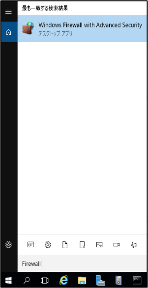

下記例ではすでに、"Block 168.63.129.16" という規則を作成した後の画面ショットです。
設定内容は上述の通りでございます。送信の規則 → 新しい規則 から設定ください。
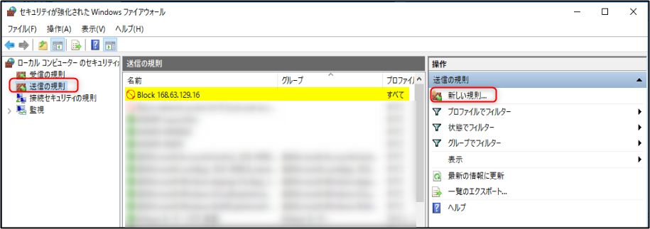

なお、 168.63.129.16 への通信は特殊な通信のため、NSG では制御することができません。
下記ご参考にしてくだされば幸いです。
・1. Azure VM Backup の 通信要件について - Azure VM Backup の通信要件や処理の流れについて
https://jpabrs-scem.github.io/blog/AzureVMBackup/NWRequirementAndProcess/#1

## 4．バックアップを故意に失敗させる方法 (Linux VM の場合) (所要時間 : 2時間～6時間) 
### 4.1. 環境
本項目では以下の環境で検証を実施しております。
#### OS
> VM名 : vm-BackupFailTest-linux-suse / OS : Linux (sles 15.2)
> VM 名 : vm-BackupFailTest-linux-rhel / OS : Linux (redhat 8.2)
> VM 名 : vm-BackupFailTest-linux-ubuntu /OS : Linux (ubuntu 20.04)
> VM 名 : vm-BackupFailTest-linux-centos / OS : Linux (centos 7.9.2009)

####  Recovery Services コンテナー
> Recovery Service コンテナー名 : vault-BackupFailTest

### 4.2. 手順概略 
下記コマンドを実行しagent プロセスを停止しバックアップを失敗させます。
失敗したのを確認したのち、Agent の再起動を行います。

#### Agent の停止
> Backup 対象の VM に SSH 接続します。

> ・以下のコマンドで、 Agent の Service を停止します。
> （Ubuntu の場合）sudo systemctl stop walinuxagent 
> （Ubuntu 以外の場合）sudo systemctl stop waagent

> ・以下のコマンドで、自動起動を停止します。
> （Ubuntu の場合）sudo systemctl disable walinuxagent 
> （Ubuntu 以外の場合）sudo systemctl disable waagent

#### Agent の再起動
バックアップ エラーの検証後は、以下コマンドで waagent を再開します。
> （Ubuntu の場合）
> 	sudo systemctl start walinuxagent 
> 	sudo systemctl enable walinuxagent 
> 	systemctl status walinuxagent 
> （Ubuntu 以外の場合）
> 	sudo systemctl start waagent
> 	sudo systemctl enable waagent
> 	systemctl status waagent

### 4.3. 詳細手順
Linux の場合、 OS により Agent のプロセス名が異なります。
#### Agent プロセス名
Ubuntu の場合
> walinuxagent.service

Suse & RHEL & CentOS の場合
> waagent.service

下記の手順で agentのプロセスを停止し、バックアップを失敗させます。
#### Agent の停止
・Backup 対象の VM に SSH 接続します。

> ・以下のコマンドで、 Agent の Service を停止します。
> （Ubuntu の場合）sudo systemctl stop walinuxagent 
> （Ubuntu 以外の場合）sudo systemctl stop waagent

> ・以下のコマンドで、自動起動を停止します。
> （Ubuntu の場合）sudo systemctl disable walinuxagent 
> （Ubuntu 以外の場合）sudo systemctl disable waagent

> ・以下のコマンドで、 Agent の Service の状態を確認できます。
> （Ubuntu の場合）systemctl status walinuxagent 
> （Ubuntu 以外の場合）systemctl status waagent

#### Ubuntu 環境の実行例

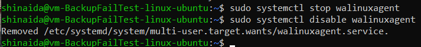

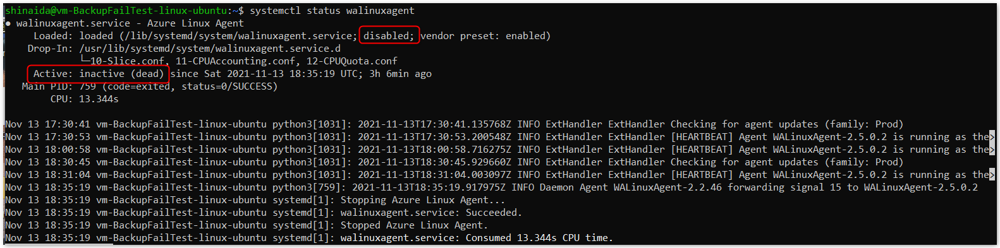
RHEL 環境の実行例
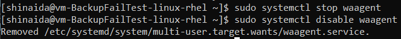

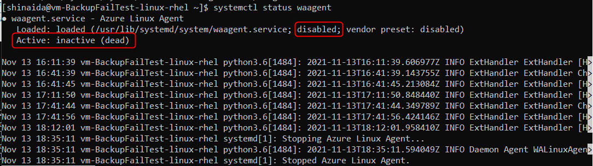

#### バックアップの実行 & 失敗確認
バックアップを実行し、バックアップ ジョブ が失敗したことを確認します。 
*バックアップの実行から失敗まで数時間かかる場合がございます。
Status が Failed 、Error Code **”UserErrorGuestAgentStatusUnavailable”** となり、失敗し完了となります。本環境では 4 時間 20 分かかりました。　

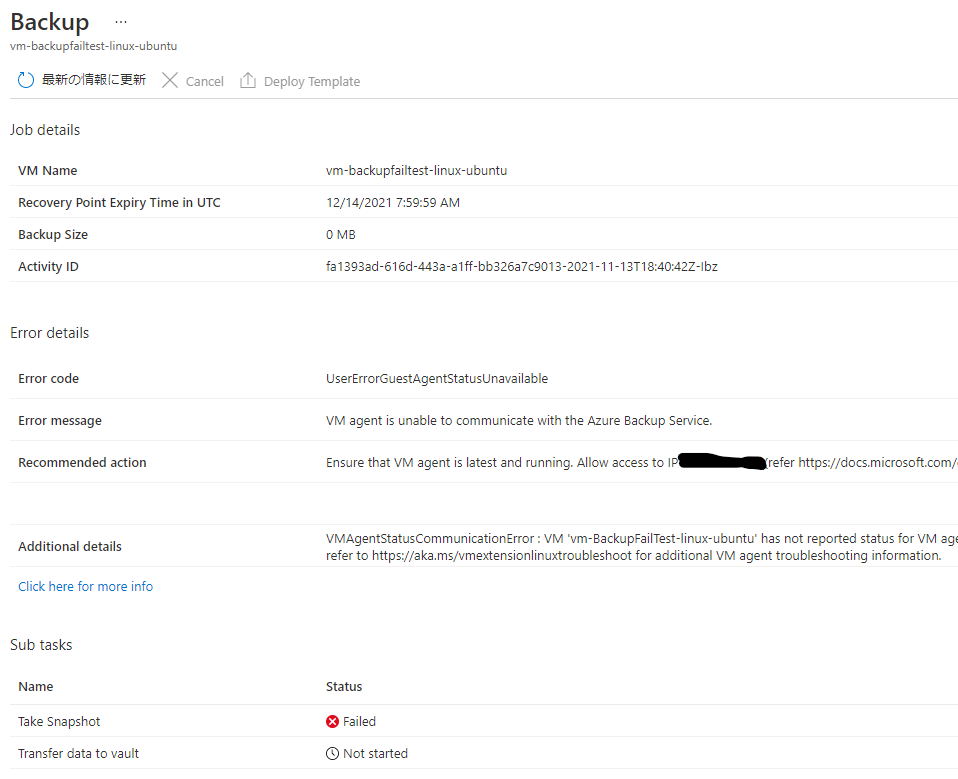

#### Agent の再起動
バックアップ エラーの検証後は、以下コマンドで waagent を再開します。
>（Ubuntu の場合）
>	sudo systemctl start walinuxagent 
>	sudo systemctl enable walinuxagent 
>	systemctl status walinuxagent 
（Ubuntu 以外の場合）
>	sudo systemctl start waagent
>	sudo systemctl enable waagent
>	systemctl status waagent

#### Ubuntu 環境の実行例　
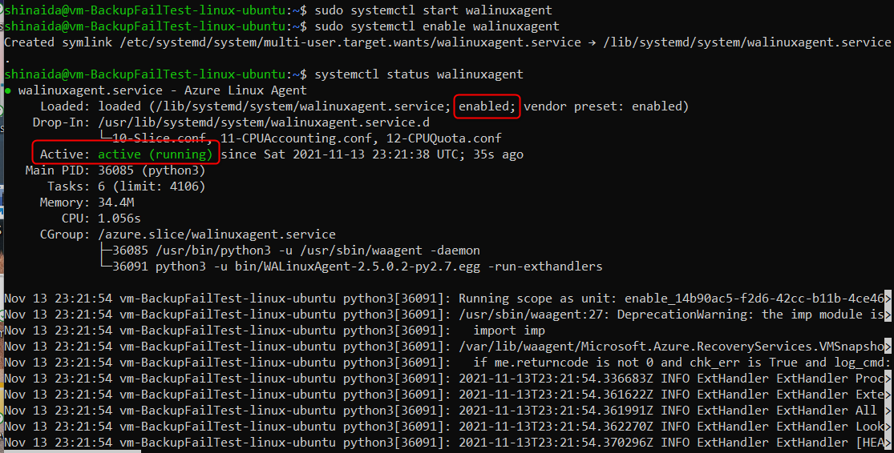

#### RHEL 環境の実行例　
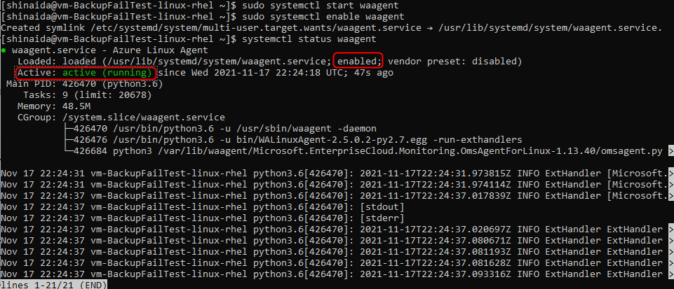

## 5. バックアップを故意に失敗させる方法 (共有ディスクをアタッチする)
Guest Agent を手動で停止させる方法以外に「共有ディスクを一時的にアタッチしてバックアップ ジョブを失敗させる」方法もご紹介します。
こちらはバックアップ ジョブ開始直後 ～ 30 分程度で「UserErrorSharedDiskBackupNotSupported」エラーで失敗する見込みです。

### 5.1.詳細手順
バックアップ 対象の VM に、Azure ポータル画面上で一時的に共有ディスクを追加アタッチします。
・Azure マネージド ディスクに対して共有ディスクを有効にする - Azure Virtual Machines | Microsoft Learn
　https://learn.microsoft.com/ja-jp/azure/virtual-machines/disks-shared-enable?tabs=azure-portal

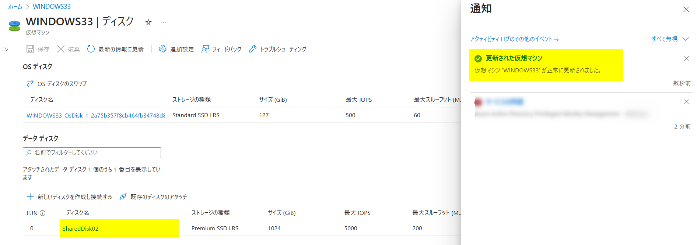

(「SharedDisk02」は、共有ディスクリソースになっています)
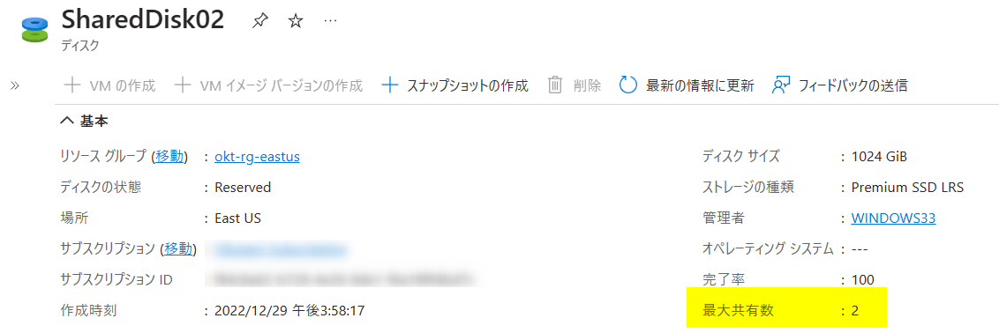

「今すぐバックアップ」をトリガーします。
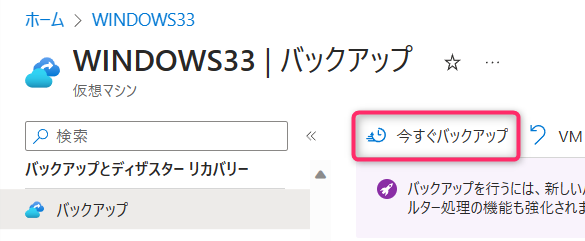

バックアップ ジョブ開始直後 ～ 30 分程度でバックアップ ジョブが「UserErrorSharedDiskBackupNotSupported」エラーにて失敗する見込みです。
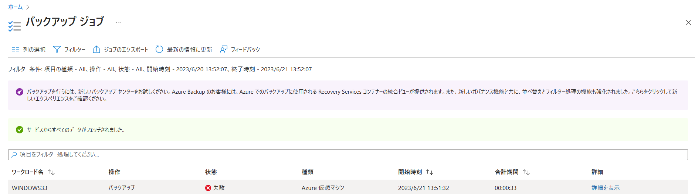

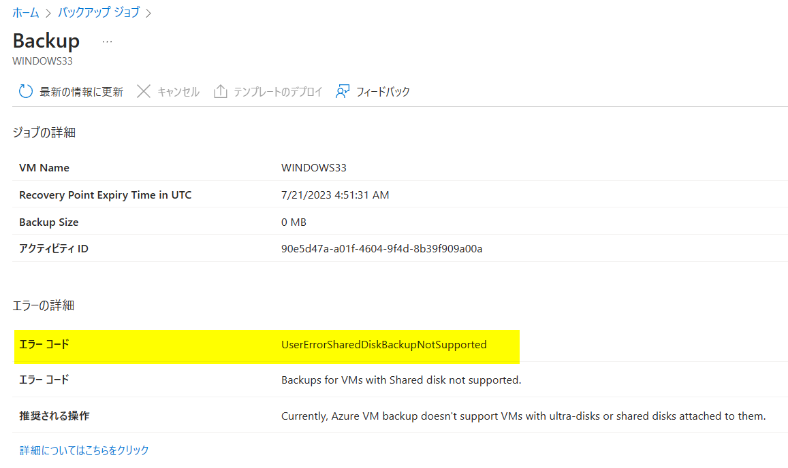

バックアップ ジョブ エラーを確認した後は、一時的にアタッチしていた共有ディスクをデタッチします。

Azure VM Backup を意図的に失敗させる方法について、ご案内は以上となります。