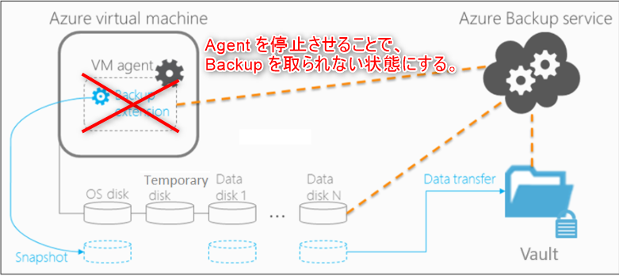
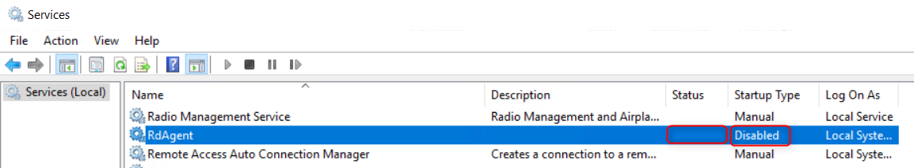
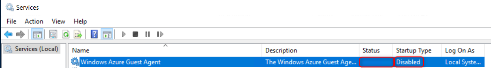
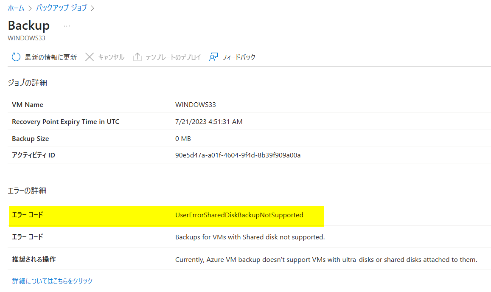

<!-- more -->
皆様こんにちは、Azure Backup サポートです。
アラートのテスト等のため "Azure VM Backup を失敗させたい" というお問い合わせをよくいただきます。
今回は、**Azure VM Backup を意図的に失敗させる方法**について、ご案内いたします。

(その他ブログで公開している Azure Backup の失敗方法)
・Azure VM Backup のデータ転送フェーズを意図的に失敗させる方法
　https://jpabrs-scem.github.io/blog/AzureVMBackup/How_to_fail_ttv/

・MARS バックアップ を意図的に失敗させる方法
　https://jpabrs-scem.github.io/blog/MARSBackup/How_to_fail_MARS_backup/

・Azure Files Backup を意図的に失敗させる方法
　https://jpabrs-scem.github.io/blog/AzureFilesBackup/How_to_fail_AFS_backup/

## 1. バックアップを故意に失敗させる方法 (共有ディスクをアタッチする)
「共有ディスクを一時的にアタッチしてバックアップ ジョブを失敗させる」 方法をご紹介します。  
Azure VM Backup において、共有ディスクのバックアップはサポートされていません。  
この仕様を利用して、共有ディスクを対象の VM にアタッチすることでバックアップの失敗を意図的に発生させることが可能です。  
この方法では、バックアップ ジョブ開始直後 ～ 30 分程度で 「UserErrorSharedDiskBackupNotSupported」 エラーで失敗する見込みです。

・VM ストレージのサポート | Azure VM バックアップのサポート マトリックス - Azure Backup | Microsoft Learn  
　https://learn.microsoft.com/ja-jp/azure/backup/backup-support-matrix-iaas#vm-storage-support

### 1.1.詳細手順
バックアップ 対象の VM に、Azure ポータル画面上で一時的に共有ディスクを追加アタッチします。
・Azure マネージド ディスクに対して共有ディスクを有効にする - Azure Virtual Machines | Microsoft Learn
　https://learn.microsoft.com/ja-jp/azure/virtual-machines/disks-shared-enable?tabs=azure-portal

(「SharedDisk02」は、共有ディスクリソースになっています)

「今すぐバックアップ」をトリガーします。

バックアップ ジョブ開始直後 ～ 30 分程度でバックアップ ジョブが「UserErrorSharedDiskBackupNotSupported」エラーにて失敗する見込みです。

バックアップ ジョブ エラーを確認した後は、一時的にアタッチしていた共有ディスクをデタッチします。

Azure VM Backup を意図的に失敗させる方法について、ご案内は以上となります。