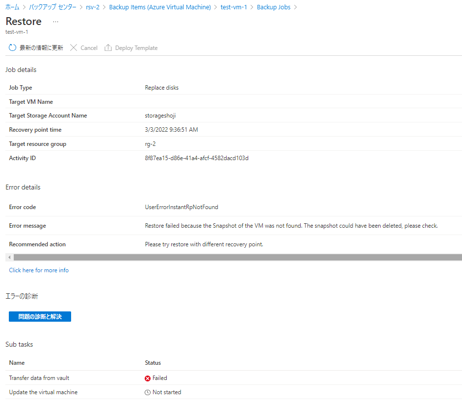
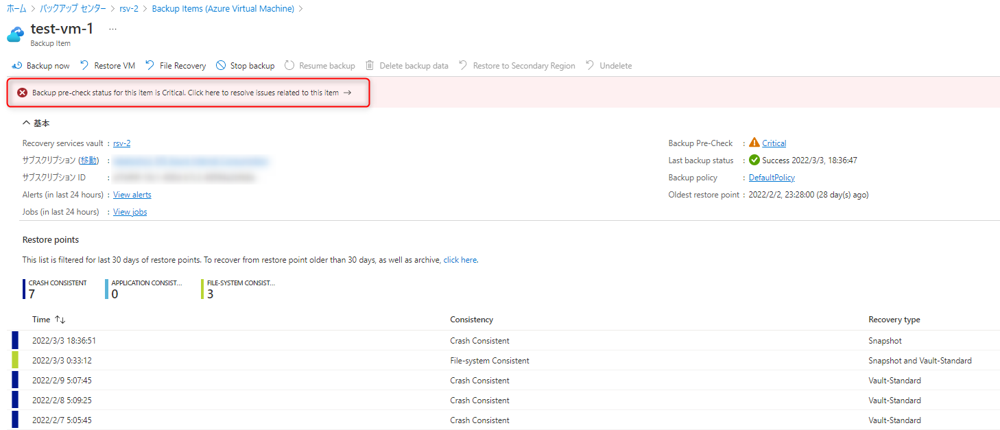
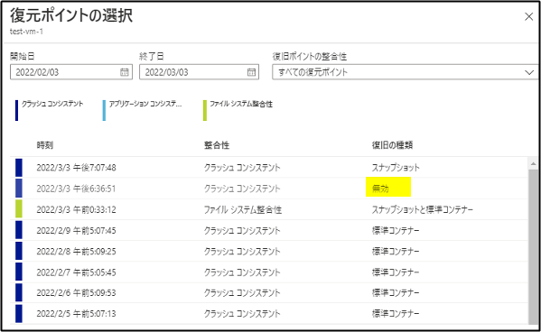
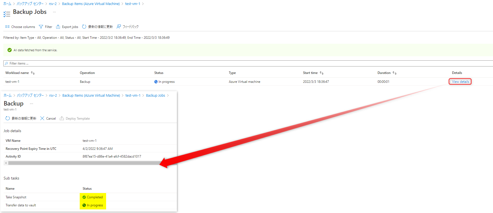
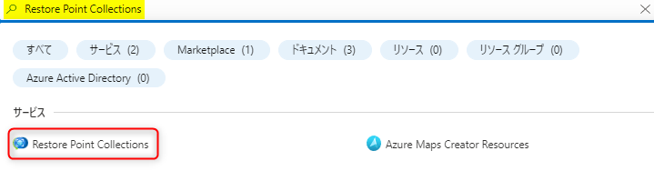
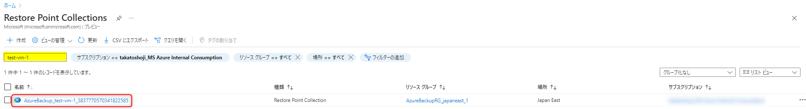
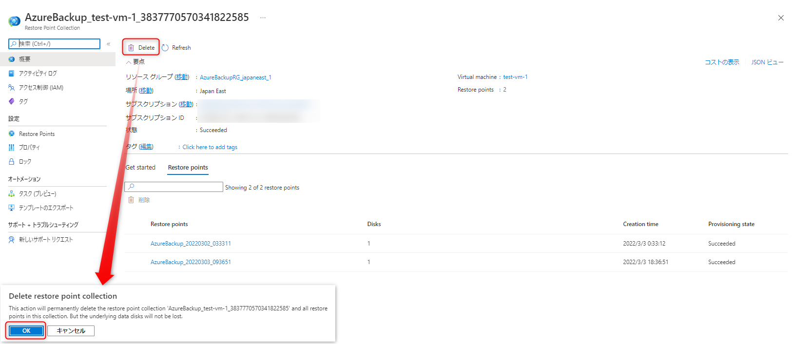
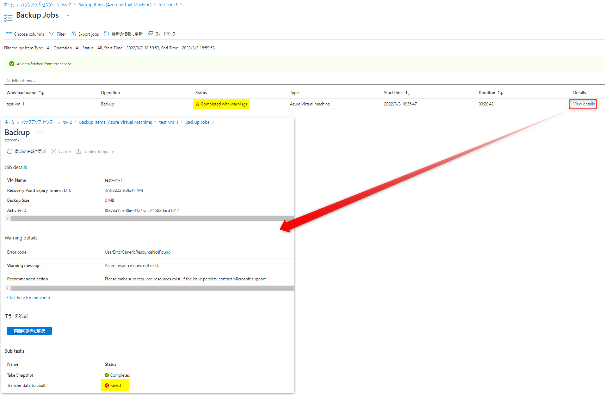

<!-- more -->
皆様こんにちは、Azure Backup サポートの 荘司 です。
今回は、**Azure VM Backup における転送フェーズを意図的に失敗させる方法**について、ご案内いたします。
*転送フェーズとは Transfer data to vault フェーズを指します。
詳細については幣ブログの関連のページをご覧ください
・Transfer data to vault フェーズ - Azure VM Backup の通信要件や処理の流れについて
https://jpabrs-scem.github.io/blog/AzureVMBackup/NWRequirementAndProcess/#2-2

また下記幣ブログの記事では Take Snapshot フェーズを失敗させる方法をご案内しております。
・Azure VM Backup を意図的に失敗させる方法
https://jpabrs-scem.github.io/blog/AzureVMBackup/How_to_fail_VM_backup/

## 目次
-----------------------------------------------------------
[1. Transfer data to vault を失敗させる方法概略](#1)
[2. Transfer data to vault を失敗させる方法の注意点](#2)
[3. Transfer data to vault を失敗させる手順](#3)
-----------------------------------------------------------

## 1. Transfer data to vault を失敗させる方法概略
Azure VM Backup を実行し、Take Snapshot 完了後に該当の Azure VM のリストアポイントコレクション (ローカルスナップショットのメタデータ) を削除します。
そうすることで Transfer data to vault が失敗し、バックアップストレージ(標準コンテナー/ Recovery Services コンテナー)への転送が失敗します。

## 2. Transfer data to vault を失敗させる方法の注意点
1. この方法ではリストアポイントコレクションを削除するため、リストアポイントコレクションを削除する前に取得された復元ポイントおよび該当のバックアップ ジョブで作成された復元ポイントではインスタントリストアが出来なくなります。
つまり、回復の種類が "スナップショット" のものは下記のように ***"UserErrorInstantRpNotFound" と復元するためのリソースがない旨のエラーメッセージがでて復元ができなくなります***。
"スナップショットと標準コンテナー" のものは バックアップストレージ からの復元が可能です。

2. この方法を実施したあと下記のようなエラーが発生しますが、再度バックアップを実行することにより解消されます。

その場合、復元した際に **"UserErrorInstantRpNotFound"** となっていた復元ポイントは **無効/Invalid** と表示されます。

## 3. Transfer data to vault を失敗させる手順
1. 失敗させたい VM にて今すぐバックアップを実行します。

2. バックアップ ジョブより該当のジョブの詳細を開き、サブタスクが以下の状態となっていることを確認します。(この状態になるのに通常 5 ~ 10 分程度かかります)
　・Take Snapshot：Completed
　・Transfer data to vault：In progress

3. ポータルのホーム画面にて "Restore Point Celloctions" と検索し、サービス欄に出てきた Restore Point Celloctions をクリックします。

4. 検索欄に該当の VM 名を入力し、出てきた RestorePoint Collection をクリックします。
　RestorePoint Collection は "AzureBackup_<VM 名>_xxxxxxxxxxxxx" といった命名規則にて存在しております。

5. Delete をクリックし、出現したメッセージの OK をクリックして RestorePoint Collection を削除します。

6. バックアップ ジョブが完了するのを待ちます。(状況によって数十分から数時間要する場合があります)

7. 時間が経過すると、以下のように Transfer data to vault プロセスが失敗したことを確認できます。

