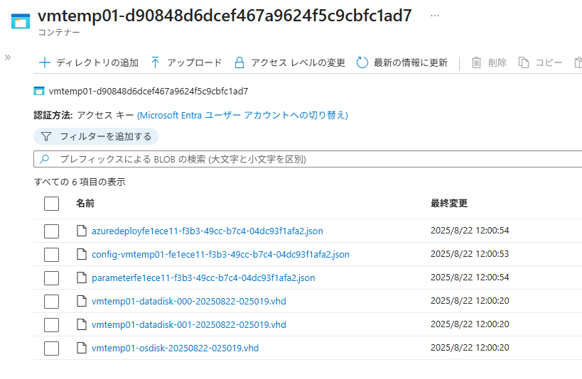

<!-- more -->
こんにちは、Azure Backup サポートです。
今回は、Azure VM Backup でリストアする際にステージングの場所として利用するストレージ アカウントについて、下記のとおりお伝えします。

## 目次
-----------------------------------------------------------
[1. 公開情報 (Docs)](#1)
[2. 利用できるストレージ アカウント](#2)
[3. リストアされた後にストレージ アカウントに残るファイルについて](#3)
[4. 参考画面ショット](#4)
-----------------------------------------------------------

### 1. 公開情報 (Docs)
まず最初に、本件に関する Docs は下記でございます。

・ ストレージ アカウント - Azure portal で Azure VM データを復元する方法
　 https://learn.microsoft.com/ja-jp/azure/backup/backup-azure-arm-restore-vms#storage-accounts

> 抜粋:"Vault-Standard 復元ポイントからマネージド VM のディスクを復元するときに、マネージド ディスクと Azure Resource Manager (ARM) テンプレートが、ステージング場所にあるディスクの VHD ファイルと共に復元されます。 インスタント復元ポイントからディスクを復元する場合、マネージド ディスクと ARM テンプレートのみが復元されます。"

> 抜粋:リージョン間復元では、 ステージング場所 (ストレージ アカウントの場所) は、Recovery Services コンテナーが セカンダリ リージョンとして扱うリージョンに存在する必要があります。 たとえば、Recovery Services コンテナーは米国東部 2 リージョンにあります (geo 冗長性とリージョン間復元が有効になっています)。 これは、セカンダリ リージョンは米国中部であることを意味します。 そのため、VM のリージョン間復元を行なうには、米国中部でストレージ アカウントを作成する必要があります。
[すべての地域の Azure リージョン間レプリケーションのペアリングに関する記事](https://learn.microsoft.com/ja-jp/azure/availability-zones/cross-region-replication-azure)をご覧ください。

### 2. 利用できるストレージ アカウント
選択できるストレージ アカウントは下記の条件を満たすものです。
・ リストア先 (=ターゲット) のサブスクリプション内およびコンテナーと同じリージョンにある
・ LRS / ZRS / GRS の冗長性
・ Premium Storage アカウントではない
・ (ストレージアカウントのネットワーク設定でパブリックアクセスが制限されている場合) 例外の "信頼されたサービスの一覧にある Azure サービスがこのストレージ アカウントにアクセスすることを許可します" をチェックしている
・ 階層型名前空間 (HierarchicalNamespace) が有効化されていない

### 3.リストアされた後にストレージ アカウントに残るファイルについて
マネージド ディスクの Azure VM の復元が完了しますと対象のストレージ アカウントの中に下記のファイルが残ります。
下記のとおり、ストレージ アカウントにファイルが残るかおよび、どのファイルが残るかはリストア シナリオによって異なります。

| # | リストアシナリオ | ステージングのストレージ アカウントに残るファイル |
| :--- | :--- |:--- |
||**Recovery Services コンテナー (vault-standrd) 層からのリストア**||
| 1 |新規 VM 作成| 無し |
| 2 | ディスクの復元| VHD ファイルと json ファイル |
| 3 | 既存の置換え| VHD ファイル |
||**スナップショット 層からのリストア (インスタントリストア)**||
| 4 |新規 VM 作成| 無し |
| 5 | ディスクの復元|  json ファイル |
| 6 |既存の置換え| 無し |
||**クロスリージョン リストア**||
| 7 | 新規 VM 作成| 無し |
| 8 |ディスクの復元|  VHD ファイルと json ファイル |

> [!NOTE]
> 復元が正常に成功していることが確認でき次第、これらのファイルは削除いただいて問題ございません。
> しかしながら、これらのファイルが自動で削除されることはございませんので、お手数ですがファイルが不要の場合手動での削除をお願いいたします。
> また、ステージングの場所として使用したストレージ アカウントについても、復元が完了しましたら削除いただいて問題ございません。

### 4.参考画面ショット
 VM 名：vm-temp-01 という Azure VM (OS ディスク 1 つ、データディスク 2 つ) を (2) のディスクの復元にてリストアしたあとのストレージ アカウントです。
 

 

> コンテナー名：
> vmtemp01-d90848d6dcef467a9624f5c9cbfc1ad7
> 上記の通り、Azure VM 名にランダムな文字列のコンテナー名のコンテナーが作成されます。

> VHD：
> vmtemp01-osdisk-20250822-025019.vhd
> vmtemp01-datadisk-001-20250822-025019.vhd
> vvmtemp01-datadisk-000-20250822-025019.vhd
> 上記の通り、Azure VM 名にディスク種別および LUN 番号リストア日時 (UTC表記) が付加された vhd ファイルが作成されます。

> json：
> azuredeployfe1ece11-f3b3-49cc-b7c4-04dc93f1afa2.json
> config-vmtemp01-fe1ece11-f3b3-49cc-b7c4-04dc93f1afa2.json
> parameterfe1ece11-f3b3-49cc-b7c4-04dc93f1afa2.json
> 上記の通り、
> 「azuredeploy<リストア ジョブで使用されるJob ID>」
> 「config-<VM 名>-<リストア ジョブで使用されるJob ID>」
> 「parameter<リストア ジョブで使用されるJob ID>」の名前から始まるファイルが 3 つ作成されます。

「Job ID」は、コマンドからの確認や、Recovery Services コンテナー > バックアップ ジョブ > 「ジョブのエクスポート」より確認ができます。

・ジョブをエクスポートする
　https://learn.microsoft.com/ja-jp/azure/backup/backup-azure-manage-windows-server#export-jobs
