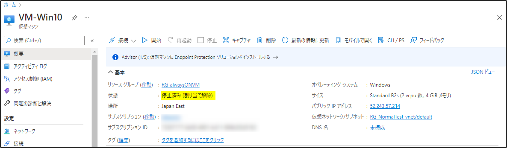
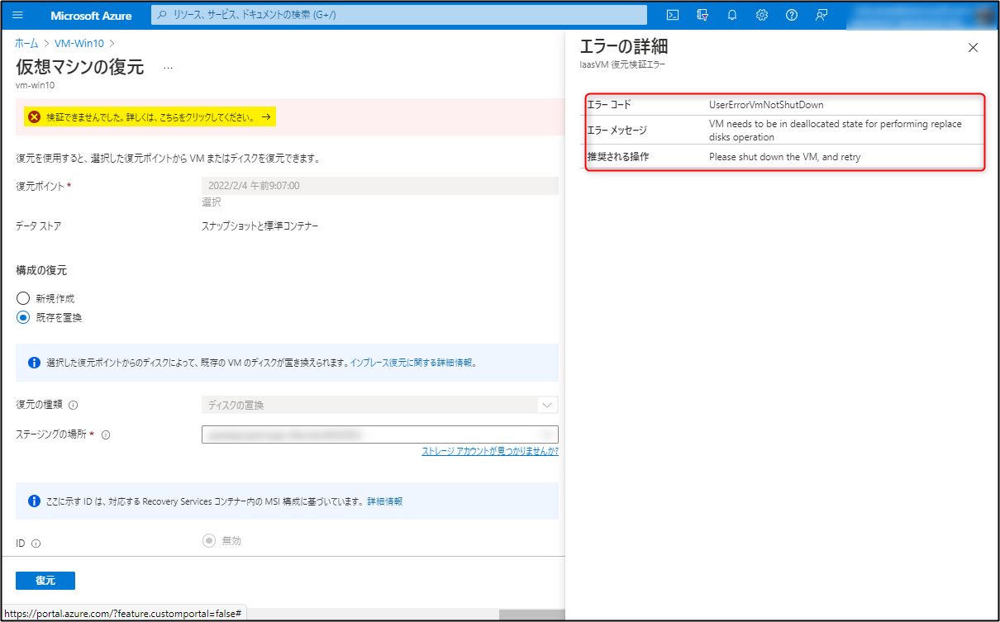
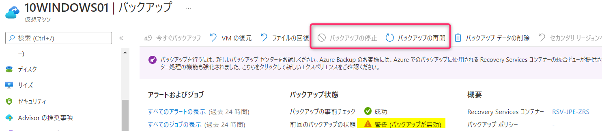
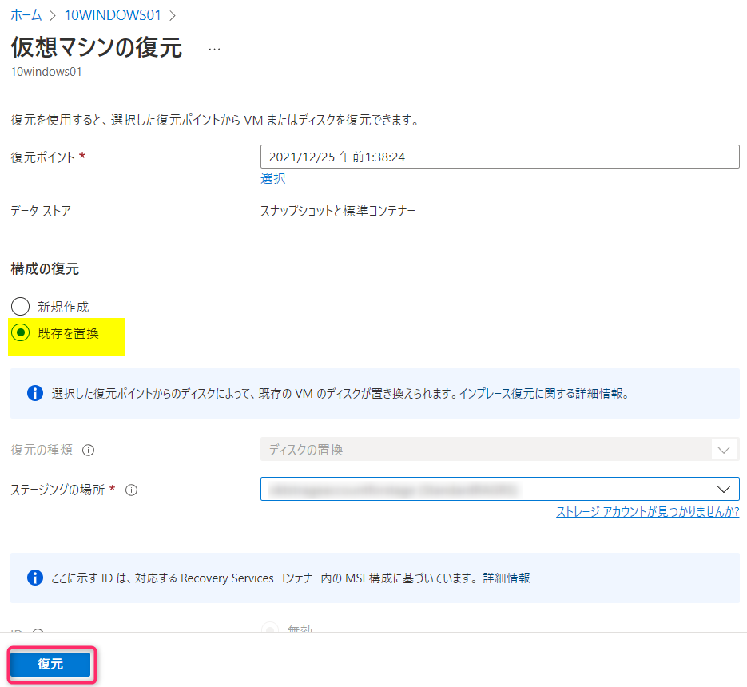
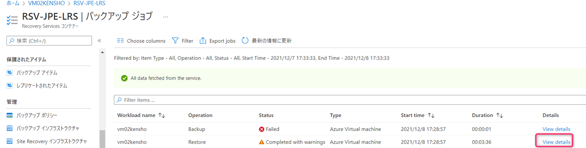
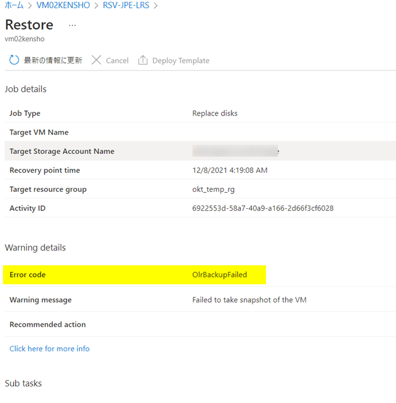
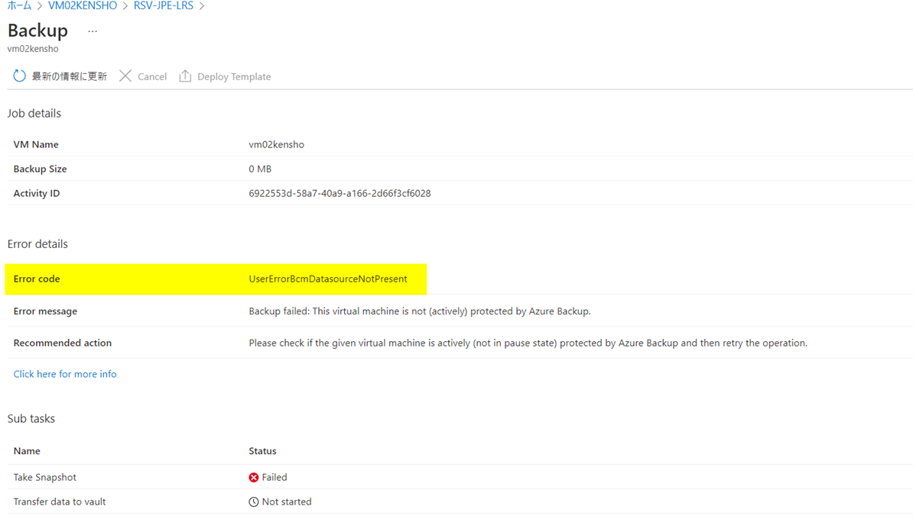
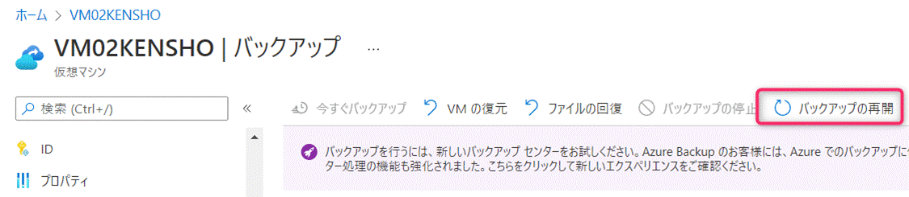
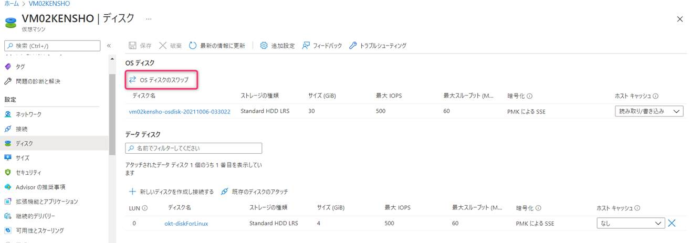

<!-- more -->
皆様こんにちは、Azure Backup サポートの山本です。
今回は、Azure VM Backup にて、対象の仮想マシンを **「VM の復元」-「構成の復元：既存を置換」にて「復元」を実行すると、「OlrBackupFailed」エラーが発生する**場合の原因と対処法についてご案内します。

上記「OlrBackupFailed」エラーが発生した場合、考えられる要因として、対象の仮想マシンに対して「バックアップの停止」を行っていることが考えられます。
（対象の仮想マシンに対して「バックアップの停止」を行っていない、後述のシナリオに合致しない等あれば、弊社までお問い合わせ願います。）

## 目次
-----------------------------------------------------------
[0.【前提】対象の VM の電源は停止しておく必要がございます](#0)
[1. 該当シナリオ](#1)
[2. 原因](#2)
[3. 「構成の復元：既存を置換」として復元したい場合の回避策](#3)
-----------------------------------------------------------

### 【前提】対象の VM は停止してください。
既存を置換 にて復元する場合、ディスクのリストア後、対象 VM に対してディスクのスワップが実施されるため、対象の VM の電源は停止しておく必要がございます。
作業実施前にの画面ショットのように ”停止済み(割り当て解除)” であることを確認してください。

VM を起動したまま実施した場合、下記のような Error Message、および 画面となり失敗します。(リストアのトリガー自体ができません。)
その場合は、上記の画面ショットの状態になるように VM の電源 を停止してください。
> エラー コード	UserErrorVmNotShutDown
>エラー メッセージ	VM needs to be in deallocated state for performing replace disks operation
>推奨される操作	Please shut down the VM, and retry

## 1. 該当シナリオ
１） 「VM の復元」を実行したい仮想マシンに対して、「バックアップの停止」を実施済である
（下図のように、「バックアップの停止」ボタンが非活性、「バックアップの再開」ボタンが活性、「前回のバックアップの状態：警告（バックアップが無効）」と表示されている状態となります）

２）上記「バックアップの停止」を実施済の状態で、「VM の復元」をクリックし、「構成の復元：既存を置換」を選択している状態で「復元」を実行する

３）「バックアップ ジョブ」画面にて、以下の状態で処理が終了する。
「Operation : Restore」・・・「StatusCompleted with warnings」「Error Code : OlrBackupFailed」
「Operation : Backup」・・・「Status : Failed」「Error Code : UserErrorBcmDatasourceNotPresent」

（「Operation : Restore」側の詳細画面）

（「Operation : Backup」側の詳細画面）

上記のシナリオてに合致した場合、「復元」がエラーコード「OlrBackupFailed」となる理由は、仮想マシンに対して、「バックアップの停止」が行われているためである可能性が高いです。

## 2. 原因
「構成の復元：既存を置換」で「復元」を実行した場合、復元の流れとして、復元ポイントからディスクが復元された後、「復元されたディスクに置換する前の仮想マシンの状態」に対するバックアップ（※）が実施されます。
「復元されたディスクに置換する前の仮想マシンの状態」に対するバックアップ（※）が成功した場合、復元されたディスクとの置換作業が実施されます。
「バックアップの停止」中の場合は、（※）のバックアップ処理が行えず「Status：Failed」となり、復元ジョブもエラーコード「OlrBackupFailed」となります。
仮想マシンに対するディスクの置換は行われず、指定した復元ポイント時点のディスクが復元され、Azure ポータル画面の「ディスク」一覧にて確認可能となります。
 
## 3. 「構成の復元：既存を置換」として復元したい場合の回避策
下記の 2 種類の方法が考えられます。
１．対象の仮想マシンに対して、「バックアップの再開」をクリックし、バックアップを有効にした状態で、再度「VM の復元」-「構成の復元：既存を置換」を実施する。
これにより、復元時に自動トリガーされるバックアップ ジョブ（※）も正常に実施され、復元ジョブも成功します。

２．対象の仮想マシンに対して、「バックアップの停止」を実施済の状態のまま、「VM の復元」-「構成の復元：既存を置換」を実施する。
この場合、前述の通り「Operation : Restore」「StatusCompleted with warnings」となりますが、ディスクとしては復元されます。
ディスクとして復元後、対象の仮想マシンを「停止済み (割り当て解除)」としている状態で、仮想マシンにアタッチされているディスクと、復元したディスクを手動でスワップすることで、復元ポイント時点の仮想マシンの状態に戻すことが可能です。

Azure Portal ＞  対象の仮想マシン ＞ 左ペインのディスク ＞ 「OSディスクのスワップ」にて復元されたディスクと現在のディスクをスワップします。

「既存を置換」にて「復元」を実行すると、「OlrBackupFailed」エラーが発生するという場合の対処法について、ご案内は以上となります。