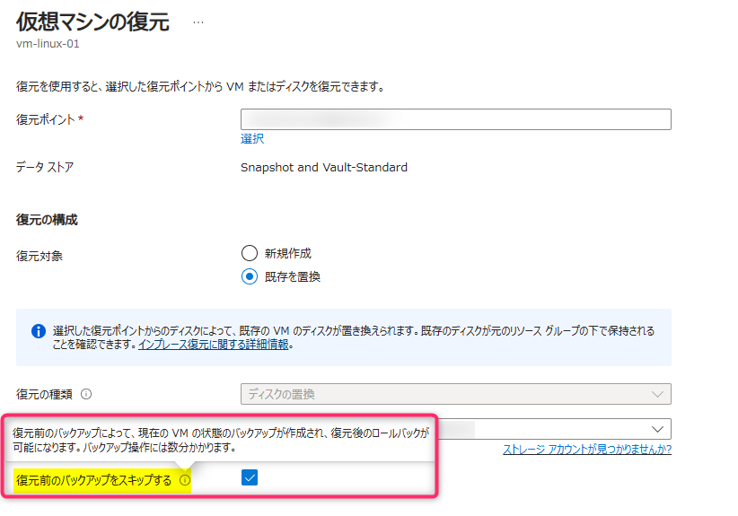

<!-- more -->
皆様こんにちは。Azure Backup サポートです。
今回は、Azure VM Backup で　[既存を置換] を用いる場合にいただくご質問について下記の通りご案内いたします。

## 目次
-----------------------------------------------------------
[1. [既存を置換]の際、元のディスクはどうなるのか](#1)
[2. [既存を置換]の際、 バックアップが走る件について](#2)
[2.1. バックアップを走らせない方法 1](#2-1)
[2.2. バックアップを走らせない方法 2](#2-2)
-----------------------------------------------------------

##  1. [既存を置換]の際、元のディスクはどうなるのか

結論から申し上げますと削除されずに残ります。
Azure VM Backup のリストアの [既存を置換] はバックアップ データよりディスクを復元し、 Azure VM のディスクを置き換えるまでを行います。
そのため、元の古いディスクは削除されずにディスク リソースとして残り続けます (課金も行われます)。そのため、不要な場合は手動で削除いただく必要がございます。

なお、リストアによって復元されるディスクの命名規則に関しては下記をご覧ください。
・Azure VM Backupでリストアされるディスク名に関して
https://jpabrs-scem.github.io/blog/AzureVMBackup/About_Restored_Disk/
 
下記公開情報にも記載されております。
・既存のものを置き換える - 復元オプション- Azure portal で Azure VM データを復元する方法
https://learn.microsoft.com/ja-jp/azure/backup/backup-azure-arm-restore-vms

>ディスクの交換操作の後、元のディスクはリソース グループに保持されます。 元のディスクが必要ない場合は、それを手動で削除することを選択できます。

##  2. [既存を置換]の際、 バックアップが走る件について
現在の仕様として [既存を置換] のリストアを行う際には、ディスクを置き換える前の状態のバックアップを取得するために、リストアジョブと並行してバックアップ ジョブが自動で実施されます。

このバックアップ ジョブは、復元時のオプション ``[復元前のバックアップをスキップする]`` を有効化することで、スキップすることが可能でございます。
詳細につきましては、[2.1. バックアップを走らせない方法 1](#2-1) にてご案内いたします。

なお、バックアップを無効にしている、且つ復元時のオプション ``[復元前のバックアップをスキップする]`` を無効化していた場合には、バックアップ ジョブが失敗 (※) いたしますのであらかじめご注意ください。
(※) : バックアップ ジョブは失敗いたしますが、[既存を置換] のリストアは成功いたします。  

###  2.1. バックアップを走らせない方法 1
[既存を置換] のリストア時のオプション ``[復元前のバックアップをスキップする]`` のチェックを有効化することで、リストア ジョブと並行して動作するバックアップ ジョブがスキップされます。  

例)

###  2.2. バックアップを走らせない方法 2
そのほか、[既存を置換] のリストア時の自動で走るバックアップ ジョブを走らせたくない場合は [既存を置換] ではなく、[ディスクの復元] を実施いただき、復元したディスクを手動で Azure VM に対してスワップしていただくことが可能です。

Azure Portal ＞ 対象の仮想マシン ＞ 左ペインのディスク からディスクのスワップ、デタッチ＆アタッチ が可能です。
※　本作業を行った場合も、元々アタッチされていた OS ディスク・ データ ディスクはディスク リソースとして残り続けます。
　　ディスクのスワップ・デタッチ＆アタッチ後、元々アタッチされていた OS ディスク・ データ ディスクに対しては、お客様にて不要であれば削除いただけます。